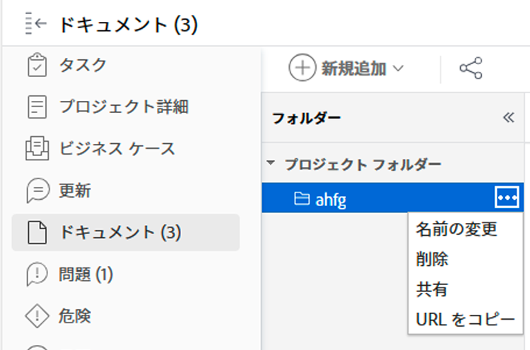

# ドキュメントフォルダーへのリンクをコピーして共有する

以下の [!DNL Workfront] オブジェクトのいずれかに含まれる任意のドキュメントフォルダーへの直接リンクをコピーできます：[!UICONTROL プログラム]、[!UICONTROL ポートフォリオ]、[!UICONTROL プロジェクト]、[!UICONTROL タスク]、[!UICONTROL イシュー]。[!UICONTROL ドキュメント]エリアに含まれるどのフォルダーへのリンクも、メインメニューからはコピーできません。これらのフォルダーはユーザープロファイルに直接リンクされており、他のユーザーと共有できないためです。

>[!NOTE]
>
>この機能は、新しいドキュメント エリアでは使用できません。 
>組織でエンタープライズストレージを使用している場合、Workfrontでドキュメントにアクセスすると、新しいドキュメント領域が表示されます。 エンタープライズストレージについて詳しくは、[Adobe エンタープライズストレージの概要](/help/quicksilver/review-and-approve-work/esm-overview.md)を参照してください。

## アクセス要件

+++ 展開すると、この記事の機能のアクセス要件が表示されます。

<table style="table-layout:auto"> 
 <col> 
 <col> 
 <tbody> 
  <tr> 
   <td role="rowheader">Adobe Workfront パッケージ</td> 
   <td> 
任意
 </td> 
  </tr> 
  <tr> 
   <td role="rowheader">Adobe Workfront プラン</td> 
   <td> 
   
標準

   
Work またはそれ以上
 </td> 
  </tr> 
  <tr> 
   <td role="rowheader">アクセスレベル設定</td> 
   <td> 
ドキュメントへのアクセスを表示
 </td> 
  </tr> 
  <tr> 
 </tbody> 
</table>

この表の情報について詳しくは、[Workfront ドキュメントのアクセス要件](/help/quicksilver/administration-and-setup/add-users/access-levels-and-object-permissions/access-level-requirements-in-documentation.md)を参照してください。

+++

## ドキュメントフォルダーへのリンクをコピーして共有する

ドキュメントフォルダーへのリンクをコピーするには、以下のように行います。

1. ドキュメントフォルダーを含む [!DNL Workfront] オブジェクトに移動します。
1. **[!UICONTROL その他]**&#x200B;メニュー、「**[!UICONTROL URL をコピー]**」の順に選択します。このリンクを共有すると、フォルダーに迅速にアクセスできます。フォルダーを表示するには、少なくともオブジェクトへの表示アクセス権が必要です。
   
