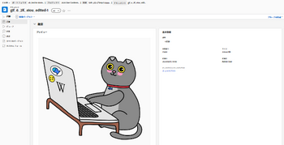

# ドキュメントの詳細の概要

ドキュメントの詳細ページでは、Adobe Workfront オブジェクトに添付されたドキュメントのプロパティを表示、通信、管理できます。

## ドキュメントの詳細ページを開きます。

1. Adobe Workfront の右上隅で&#x200B;**メインメニュー**&#x200B;アイコン  をクリックし、「**ドキュメント**」をクリックします。

1. ドキュメントにポインタを合わせ、「**ドキュメントの詳細**」をクリックします。

   

## ドキュメントとプルーフに対して基本的なアクションを実行

ドキュメントの詳細ページから、ドキュメントとプルーフの両方に対して次のアクションを実行できます。

* シンプルまたは高度なプルーフを作成
* 新しいバージョンを作成
* 承認決定する
* ドキュメントをプレビュー
* ドキュメントの説明を編集
* ドキュメントをチェックイン／チェックアウト

さらに、ドキュメント名の横にあるその他アイコン  を使用して、次のアクションを実行できます。

* 共有
* 移動
* 削除
* ダウンロード
* 送信

## プルーフ固有のアクションを実行

プルーフワークフローを使用している場合は、ドキュメントの詳細ページから次のアクションを実行できます。

* 送信済み、開封済み、コメント、決定（SOCD）の詳細を表示
* プルーフを開く
* 印刷の概要を開く
* プルーフをロック／ロック解除
* プルーフカスタムフィールドを編集

  Workfront Proof でプルーフカスタムフィールドを設定する必要があります。詳しくは、[Workfront Proof でのカスタムフィールドの作成と管理](../../workfront-proof/wp-acct-admin/account-settings/create-and-manage-custom-fields.md)を参照してください。
