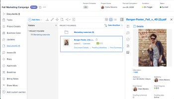

# ドキュメントエリア

ドキュメントエリアでは、Adobe Workfront にアップロードされたドキュメントのメタデータを整理、管理、表示できます。プルーフ決定もl確認できます。

Workfrontには現在、従来のドキュメント領域と新しいドキュメント領域の2つのバージョンがあります。 組織で使用するバージョンは、組織が従来のWorkfront ストレージを使用しているか、エンタープライズストレージを使用しているかによって異なります。 これらのストレージタイプについて詳しくは、[Adobe エンタープライズストレージの概要](/help/quicksilver/review-and-approve-work/esm-overview.md)を参照してください。

## レガシードキュメント領域

ドキュメントエリアには 2 つのタイプがあります。特徴と機能は両方とも同じです。

* **プログラム、ポートフォリオ、プロジェクト、タスク、またはイシューの「ドキュメント」エリア：**&#x200B;特定のプロジェクト、タスク、またはイシューに対してアクセスできるすべてのドキュメントを一覧表示します。 この領域にアクセスするには、プロジェクト、タスク、イシューを表示しながら、左側のパネルで「**ドキュメント** 」をクリックします。

* **グローバルドキュメントエリア：** Workfront でアクセスできるすべてのドキュメントをリストします。この領域にアクセスするには、メインメニュー&#x200B;**メインメニューアイコン**&#x200B;の をクリックします。

Workfront へのドキュメントのアップロードについては、[ファイルシステムから Adobe Workfront にドキュメントを追加](../../documents/adding-documents-to-workfront/add-documents-from-file-system.md)を参照してください。

「文書」領域には、次の項目の数が記録されます。

* Workfront フォルダー
* ファイルシステムからアップロードされたファイル
* 統合からWorkfrontに追加されたファイル
* リンクされたExperience Manager Assets

### 概要パネル

ドキュメント領域でドキュメントを選択すると、右側の概要を使用して、ドキュメントの詳細の表示、ドキュメントの更新と承認の管理、ドキュメントのバージョンの表示、ドキュメントのカスタム Formsの追加と編集を行うことができます。

ドキュメントにプルーフが設定されている場合、「詳細」セクションにはプルーフ期限や現在のプルーフの進行状況などの情報が含まれます。

ドキュメントに関するすべての情報が必要な場合は、「詳細」見出しをクリックして、完全なドキュメントの詳細エリアに移動できます。

概要について詳しくは、[ドキュメントの概要](../../documents/managing-documents/summary-for-documents.md)を参照してください。

### プルーフ決定

プルーフ決定が行われると、その決定がドキュメントリストに表示されます。

### フォルダー

ドキュメントがアップロードされるプロジェクト、タスク、またはイシューで、ドキュメントを整理するためのフォルダーを設定できます。詳しくは、[ドキュメントフォルダーを作成](../../documents/organizing-documents/create-documents-folder.md)を参照してください。

グローバルドキュメントエリアでは、2 種類のフォルダーを設定して、アクセスできるドキュメントを整理できます。

* **スマートフォルダー：**&#x200B;確認するドキュメントのみを表示します。詳しくは、[スマート フォルダーの作成と管理](../../documents/organizing-documents/create-manage-smart-folders.md)を参照してください。

* **マイフォルダー：** ドキュメントを希望する方法で整理します。詳しくは、[ドキュメントフォルダーを作成する](../../documents/organizing-documents/create-documents-folder.md)を参照してください。

### 展開されたドキュメントの詳細

ドキュメントの詳細ページには、右側の「概要」にあるドキュメントの詳細のより完全なバージョンが表示されます。

## 新規ドキュメント領域

>[!NOTE]
>
>新しいドキュメント領域エクスペリエンスでは、グローバルドキュメント領域は使用できません。 プログラム、ポートフォリオ、プロジェクト、タスク、イシューからのみドキュメントにアクセスできます。

### 概要パネルの使用

ドキュメント領域でドキュメントを選択すると、右側の概要パネルを使用して、ドキュメントに関する詳細の表示、添付されたカスタムフォームの追加と編集、承認ワークフローの作成と管理、ドキュメントのバージョンの表示などを行うことができます。

#### Frame.ioでのレビューと承認

Frame.io ビューアを使用して、新しいドキュメント領域でドキュメントを確認および承認できます。

詳しくは、[統合レビューと承認の概要](/help/quicksilver/review-and-approve-work/get-started-with-unified-approvals.md)を参照してください。

#### バージョンの管理

新しいバージョンのドキュメントは、新しいドキュメント領域にアップロードできます。 新しいバージョンをアップロードすると、以前のバージョンは保持され、概要パネルからアクセスできます。 バージョンには、アップロードの日時に自動的に名前が付けられますが、必要に応じて名前を変更できます。

また、特定のバージョンのドキュメントに対して、新しい承認ワークフローを開始することもできます。

#### ドキュメント履歴を表示

ドキュメントの履歴は、新規ドキュメント領域で表示できます。 履歴には、次の種類の情報が含まれます。

* ドキュメントがアップロードされたとき
* 新しいバージョンがアップロードされたとき
* ドキュメントの承認ワークフローが開始されたとき
* その他

### ドキュメント権限のシステムレベルのフォルダー

最初のドキュメントがタスクまたはイシューにアップロードされると、Workfrontは自動的にシステムレベルのフォルダーを作成します。 これらのフォルダーは、タスクまたはイシューから権限を継承し、プロジェクトレベルのドキュメント領域に表示されます。 そのタスクまたはイシューにアップロードされたすべてのドキュメントは、そのフォルダーに保存され、そこから権限を継承します。 これは、新しいドキュメント領域のドキュメントに対する権限を管理する主な方法です。 詳しくは、[Adobe エンタープライズ ストレージ モデルのオブジェクト権限とアクセス レベルの概要](/help/quicksilver/review-and-approve-work/esm-access-permissions.md#how-document-permissions-work)を参照してください。