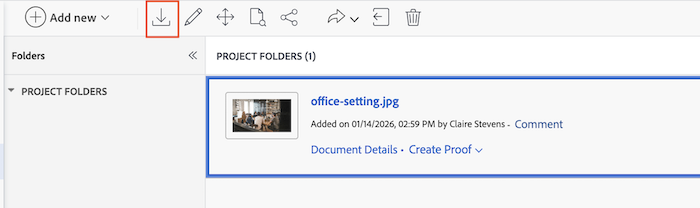
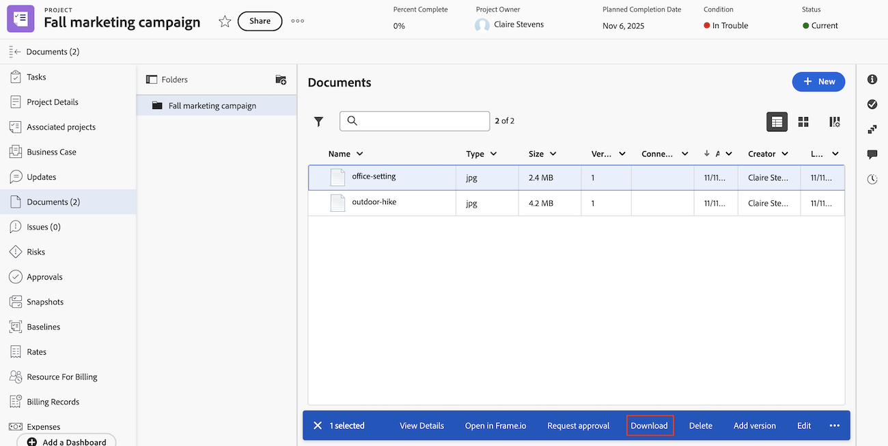

# ドキュメントのダウンロード

ドキュメントは、Adobe Workfront から個別または一括でダウンロードできます。ドキュメントは、Workfront のドキュメントを含むどのエリアからでもダウンロードできます。 

## アクセス要件

+++ 展開すると、この記事の機能のアクセス要件が表示されます。

<table style="table-layout:auto"> 
 <col> 
 <col> 
 <tbody> 
  <tr> 
   <td role="rowheader">Adobe Workfront パッケージ</td> 
   <td> 
任意
 </td> 
  </tr> 
  <tr> 
   <td role="rowheader">Adobe Workfront プラン</td> 
   <td> 
   
コントリビューター以上

   
レビュー以上
 </td> 
  </tr> 
  <tr> 
   <td role="rowheader">アクセスレベル設定</td> 
   <td> 
ドキュメントへのアクセスを編集
 </td> 
  </tr> 
  <tr data-mc-conditions=""> 
   <td role="rowheader">オブジェクト権限</td> 
   <td> 
ドキュメントを含むオブジェクトへのアクセスを表示
 </td> 
  </tr> 
 </tbody> 
</table>

この表の情報について詳しくは、[Workfront ドキュメントのアクセス要件](/help/quicksilver/administration-and-setup/add-users/access-levels-and-object-permissions/access-level-requirements-in-documentation.md)を参照してください。

+++

## 従来のドキュメント領域でのドキュメントのダウンロード

組織が従来のWorkfront ストレージを使用している場合、Workfrontでドキュメントにアクセスすると、従来のドキュメント領域が表示されます。 従来のWorkfront ストレージについて詳しくは、[ 従来のWorkfront ストレージとAdobe エンタープライズストレージの違い ](/help/quicksilver/review-and-approve-work/esm-overview.md) を参照してください。

### 従来のドキュメント領域での個々のドキュメントのダウンロード

1. ドキュメントを含むプロジェクト、タスクまたはイシューに移動し、「**ドキュメント**」を選択します。
1. 必要なドキュメントを見つけます。

1. **選択したダウンロード** アイコン  をクリックします。

### 従来のドキュメント領域での複数ドキュメントの同時ダウンロード

複数のドキュメントを同時にダウンロードできます。

1. ダウンロードするドキュメントを含む「ドキュメント」エリアに移動します。
1. （オプション）ダウンロードする個々のドキュメントをドキュメントのリストから選択します。

   >[!NOTE]
   >
   >Box、Dropbox、Google Drive などから Workfront にリンクされたドキュメントを一括でダウンロードすることはできません。

1. （オプション）ダウンロードするドキュメントを含むフォルダーをフォルダーのリストから選択します。
1. 「選択したダウンロード」アイコン  をクリックします。

   フォルダーは .zip ファイルとしてダウンロードされ、最大 4GB に制限されます。

## 新しいドキュメント エリアでのドキュメントのダウンロード

エンタープライズストレージを使用している場合、Workfrontでドキュメントにアクセスすると、新しいドキュメント エリアが表示されます。 エンタープライズストレージについて詳しくは、[Adobe エンタープライズストレージの概要 ](/help/quicksilver/review-and-approve-work/esm-overview.md) を参照してください。

1. ドキュメントを含むプロジェクト、タスクまたはイシューに移動し、左パネルで **ドキュメント** を選択します。
1. 必要なドキュメントを見つけて、「**ダウンロード**」をクリックします。

