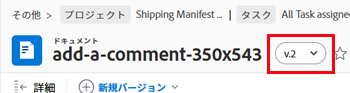
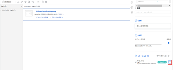

# ドキュメントバージョンの管理

Workfront では、複数のバージョンのドキュメントを管理できます。

## アクセス要件

以下が必要です。

<table style="table-layout:auto"> 
 <col> 
 <col> 
 <tbody> 
  <tr> 
   <td role="rowheader">Adobe Workfront プラン*</td> 
   <td> 
 任意
 </td> 
  </tr> 
  <tr> 
   <td role="rowheader">Adobe Workfront ライセンス*</td> 
   <td> 
リクエスト以上
 </td> 
  </tr> 
  <tr> 
   <td role="rowheader">アクセスレベル設定*</td> 
   <td> 
ドキュメントへのアクセスを表示
 
メモ：まだアクセス権がない場合は、アクセスレベルに追加の制限が設定されていないかどうか Workfront 管理者にお問い合わせください。Workfront 管理者がアクセスレベルを変更する方法について詳しくは、<a href="../../administration-and-setup/add-users/configure-and-grant-access/create-modify-access-levels.md" class="MCXref xref">カスタムアクセスレベルの作成または変更</a>を参照してください。
 </td> 
  </tr> 
  <tr> 
   <td role="rowheader">オブジェクト権限</td> 
   <td> 
ドキュメントに対する表示アクセス権
 
追加のアクセス権のリクエストについて詳しくは、<a href="../../workfront-basics/grant-and-request-access-to-objects/request-access.md" class="MCXref xref">オブジェクトへのアクセス権のリクエスト</a>を参照してください。
 </td> 
  </tr> 
 </tbody> 
</table>

&#42;保有するプラン、ライセンスタイプ、アクセス権を確認するには、Workfront 管理者に問い合わせてください。

## 前提条件

* この記事では、ドキュメントに複数のバージョンが含まれていることを前提としています。

  ドキュメントの新しいバージョンを Workfront にアップロードする方法について詳しくは、[新しいバージョンのドキュメントのアップロード](../../documents/managing-documents/upload-new-document-version.md)を参照してください。

## ドキュメントのすべてのバージョンのリストを表示

1. 「概要」で、「**すべてのバージョン**」セクションまでスクロールして表示します。ここで、ドキュメントのすべてのバージョンを表示できます。

## 以前のバージョンのドキュメントの詳細の表示と管理

1. ドキュメントの詳細ページの上部付近で、名前の横にあるドロップダウンメニューをクリックし、表示および管理するバージョンの名前をクリックします。

   

   バージョンの詳細の表示に加えて、バージョンの名前、メタデータ、プルーフ（ドキュメントプルーフの場合）などのバージョンを変更できます。

## 単一のドキュメントバージョンのダウンロード

1. 「概要」の「**バージョン**」で、バージョンの右側にある「その他」メニュー  をクリックし、表示されるドロップダウンリストで「**ダウンロード**」をクリックします。

   

## ドキュメントのすべてのバージョンをダウンロード

1. 「**ドキュメントの詳細**」をクリックし、次に左側のパネルで「**すべてのバージョン**」を選択します。

1. リストの最上部の「**すべてをダウンロード**」をクリックします。

## ドキュメントのバージョンを削除

ドキュメントのバージョンを誤ってアップロードした場合や、バージョンが不要になった場合は、バージョンを削除して元のドキュメントを維持できます。

>[!IMPORTANT]
>
>個別に削除したドキュメントのバージョンは復元できません。

ドキュメントのバージョンを削除する場合は、次の点に注意してください。

* 一度に削除できるバージョンは 1 つだけです。バージョンが削除されると、このアクションはドキュメントの「**更新**」に表示されます。
* バージョンを削除した後に新しいバージョンをアップロードすると、新しいバージョンには次の連番が振られます。例えば、1 つのドキュメントに 3 つのバージョンがあり、バージョン 3 を削除した場合、次にアップロードされるドキュメントはバージョン 4 になります。
* バージョンに対して行われたシステム更新やコメントは、バージョンが削除された後も Workfront で保持されます。

  <!--
  <li data-mc-conditions="QuicksilverOrClassic.Draft mode">Deleting a document version in Workfront does not delete the Proof version.&nbsp;</li>
  -->

ドキュメントのバージョンを削除するには：

1. ドキュメントを含むプロジェクト、タスクまたはイシューに移動し、「**ドキュメント**」を選択します。必要なドキュメントを見つけます。
1. 「概要」の「**バージョン**」エリアで、バージョンをクリックし、表示されるドロップダウンリストで「**削除**」をクリックします。「**削除**」オプションは、少なくとも 2 つのバージョンがある場合にのみ表示されます。

   ドキュメントが外部のソースにリンクされている場合、そのリンクは削除され、Workfront を介してドキュメントにアクセスできなくなります。

   
