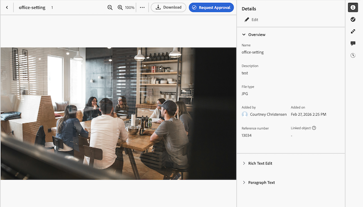

# ドキュメントの概要

<!--Audited: April, 2024-->

概要パネルを使用すると、ドキュメントのリストから重要な情報に直接アクセスして更新できます。

+++ 展開すると、この記事の機能のアクセス要件が表示されます。

## アクセス要件

この記事の手順を実行するには、次のアクセス権が必要です。

<table style="table-layout:auto"> 
 <col> 
 </col> 
 <col> 
 </col> 
 <tbody> 
  <tr> 
   <td role="rowheader">Adobe Workfront パッケージ</td> 
   <td> 
 任意
 </td> 
  </tr> 
  <tr> 
   <td role="rowheader">Adobe Workfront ライセンス</td> 
   <td> 
コントリビューター以上
 
   
リクエスト以上

   </td> 
  </tr> 
  <tr data-mc-conditions=""> 
   <td role="rowheader">アクセスレベル設定</td> 
   <td> 
ドキュメントへのアクセスを編集
  </td> 
  </tr> 
  <tr data-mc-conditions=""> 
   <td role="rowheader">オブジェクト権限</td> 
   <td> 
ドキュメントに関連付けられたオブジェクトへのアクセスの表示
 </td> 
  </tr> 
 </tbody> 
</table>

この表の情報について詳しくは、[Workfront ドキュメントのアクセス要件](/help/quicksilver/administration-and-setup/add-users/access-levels-and-object-permissions/access-level-requirements-in-documentation.md)を参照してください。

+++

## レガシードキュメントエクスペリエンスでのドキュメントの概要

組織が従来のWorkfront ストレージを使用している場合、Workfrontでドキュメントにアクセスすると、従来のドキュメント領域が表示されます。 従来のWorkfront ストレージについて詳しくは、[従来のWorkfront ストレージとAdobe エンタープライズ ストレージの違い](/help/quicksilver/review-and-approve-work/esm-overview.md)を参照してください。

### 従来のドキュメントエクスペリエンスで概要ビューを開きます

{{step1-to-documents}}

1. **ドキュメント** ページで、リスト内のドキュメントを選択します。

1. ページの右上隅にある「**概要を開く**」アイコン「」をクリックします。 **ドキュメントの概要** サイドパネルが開きます。

   

   概要を開いた後、手動で閉じるまで、このページで（他のドキュメントをクリックしても）開いたままになります。

### 詳細

「詳細」セクションでは、概要情報を表示したり、カスタムフォームを使用したりできます。セクションの上部にある「詳細」をクリックして、ドキュメントの詳細ページ全体に移動します。

* [概要](#overview)
* [カスタムフォーム](#custom-forms)

#### 概要 {#overview}

「概要」セクションを展開して、画像のサムネールを表示またはダウンロードし、プルーフを開き、基本的な説明を更新し、ドキュメントを確認します。

#### カスタムフォーム {#custom-forms}

「カスタムフォーム」セクションでは、ドキュメントに関連付けられたカスタムフォームを追加、編集、表示できます。カスタムフォームの名前を入力し、ドキュメントに追加します。詳しくは、[ドキュメントへのカスタムフォームの追加または編集](../../documents/managing-documents/add-custom-form-documents.md)を参照してください。

### 更新

「更新」セクションを使用して、ドキュメントまたはプルーフで行われた更新を表示します。 概要には、最初に作成された 2 つのコメントが表示されます。更新について詳しくは、 [プルーフに対するコメント](../../review-and-approve-work/proofing/reviewing-proofs-within-workfront/comment-on-a-proof/comment-on-proof.md)を参照してください。

### 承認

「承認」セクションでは、ドキュメントの承認をリクエストすることができます。また、承認についてのリマインドや承認の再送信、以前の決定のキャンセル、承認の削除を行うこともできます。ドキュメントの承認者は、概要を使用して意思決定を下すことができます。

プルーフの承認は、プルーフワークフローに追加する必要があります。承認について詳しくは、以下を参照してください。

* [作業の承認](../../review-and-approve-work/manage-approvals/approving-work.md)
* [ドキュメント承認のリクエスト](../../review-and-approve-work/manage-approvals/request-document-approvals.md)

### バージョン

「バージョン」セクションでは、特定のドキュメントに対して作成されたバージョンの数を確認できます。詳細アイコン をクリックして、次の操作を行います。

* プルーフを開きます。
* プルーフまたはドキュメントをダウンロードします。
* ブラウザーでサポートされているドキュメントをプレビューします。
* ドキュメントの詳細に移動します。
* プルーフまたはドキュメントを削除します。

## 新しい文書エクスペリエンスの文書の概要

組織でエンタープライズストレージを使用している場合、Workfrontでドキュメントにアクセスすると、新しいドキュメント領域が表示されます。 エンタープライズストレージについて詳しくは、[Adobe エンタープライズストレージの概要](/help/quicksilver/review-and-approve-work/esm-overview.md)を参照してください。

### 詳細

詳細セクションを使用して、概要の概要を表示したり、カスタムフォームを操作したりできます。

### 承認

「承認」セクションを使用して、承認ワークフローを作成します。 また、承認について参加者に通知したり、承認を削除したりすることもできます。 ドキュメント承認者は、Frame.io ビューアにアクセスするか、概要を使用して決定を下すことができます。

承認とFrame.ioについて詳しくは、「

* [レビューと承認の統合を始める](/help/quicksilver/review-and-approve-work/get-started-with-unified-approvals.md)
* [ ドキュメントのレビューまたは承認リクエストを作成](/help/quicksilver/review-and-approve-work/document-reviews-and-approvals/manage-document-approvals/create-a-document-approval.md)。

<!-- resubmit the approval and cancel the previous decision, or delete the approval. Document approvers can use the Summary to make a decision.-->

### バージョン

「バージョン」セクションでは、特定のドキュメントに対して作成されたバージョンの数を確認できます。詳細アイコンをクリックして、次の操作を行います。

* バージョン名の変更
* ドキュメントの詳細を表示
* 特定バージョンの承認を依頼
* Frame.io で開く
* バージョンをダウンロード
* バージョンを共有
* バージョンを削除

### 履歴

「履歴」セクションを使用して、ドキュメントに関連するすべてのアクティビティのリストを表示します。

