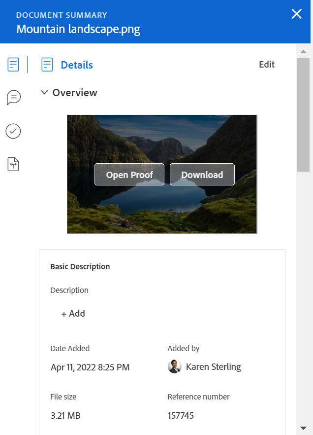

# ドキュメントの概要

「概要」では、ドキュメントリストから直接重要な情報を操作できます。

## アクセス要件

以下が必要です。

<table style="table-layout:auto"> 
 <col> 
 </col> 
 <col> 
 </col> 
 <tbody> 
  <tr> 
   <td role="rowheader">Adobe Workfront プラン*</td> 
   <td> 
 任意
 </td> 
  </tr> 
  <tr> 
   <td role="rowheader">Adobe Workfront ライセンス*</td> 
   <td> 
リクエスト以上
 </td> 
  </tr> 
  <tr data-mc-conditions=""> 
   <td role="rowheader">アクセスレベル設定*</td> 
   <td> 
ドキュメントへのアクセスを編集
 
メモ：まだアクセス権がない場合は、アクセスレベルに追加の制限が設定されていないかどうか Workfront 管理者にお問い合わせください。Workfront 管理者がアクセスレベルを変更する方法について詳しくは、<a href="../../administration-and-setup/add-users/configure-and-grant-access/create-modify-access-levels.md" class="MCXref xref">カスタムアクセスレベルの作成または変更</a>を参照してください。
 </td> 
  </tr> 
  <tr data-mc-conditions=""> 
   <td role="rowheader">オブジェクト権限</td> 
   <td> 
ドキュメントに関連付けられたオブジェクトへのアクセスの表示
 
追加のアクセス権のリクエストについて詳しくは、<a href="../../workfront-basics/grant-and-request-access-to-objects/request-access.md" class="MCXref xref">オブジェクトへのアクセス権のリクエスト</a>を参照してください。
 </td> 
  </tr> 
 </tbody> 
</table>

&#42;保有するプラン、ライセンスタイプ、アクセス権を確認するには、Workfront 管理者に問い合わせてください。

## 「概要」ビューを開く

1. 「**ドキュメント**」に移動し、リスト内の項目を選択します。
1. **概要を開くアイコン**  をクリックします。

   概要を開いた後に他のドキュメントをクリックしても、概要は手動で閉じるまで開いたままになります。

   

## 詳細

「詳細」セクションでは、概要情報を表示したり、カスタムフォームを使用したりできます。セクション上部の「**詳細**」をクリックし、完全な「ドキュメントの詳細」ページに移動します。

* [概要](#overview)
* [カスタムフォーム](#custom-forms)

### 概要 {#overview}

「概要」セクションを展開すると、画像のサムネールを表示またはダウンロードしたり、プルーフを開いたり、基本的な説明を更新したり、ドキュメントをチェックアウトしたりできます。

### カスタムフォーム {#custom-forms}

「カスタムフォーム」セクションでは、ドキュメントに関連付けられたカスタムフォームを追加、編集、表示できます。カスタムフォームの名前を入力し、ドキュメントに追加します。詳しくは、[ドキュメントへのカスタムフォームの追加または編集](../../documents/managing-documents/add-custom-form-documents.md)を参照してください。

## 更新

「更新」セクションでは、ドキュメントまたはプルーフで行われた更新を確認できます。概要には、最初に作成された 2 つのコメントが表示されます。更新について詳しくは、 [プルーフに対するコメント](../../review-and-approve-work/proofing/reviewing-proofs-within-workfront/comment-on-a-proof/comment-on-proof.md)を参照してください。

## 承認

「承認」セクションでは、ドキュメントの承認をリクエストすることができます。また、承認についてのリマインドや承認の再送信、以前の決定のキャンセル、承認の削除を行うこともできます。ドキュメントの承認者は、概要を使用して意思決定を下すことができます。

プルーフの承認は、プルーフワークフローに追加する必要があります。承認について詳しくは、以下を参照してください。

* [作業の承認](../../review-and-approve-work/manage-approvals/approving-work.md)
* [ドキュメント承認のリクエスト](../../review-and-approve-work/manage-approvals/request-document-approvals.md)

## バージョン

「バージョン」セクションでは、特定のドキュメントに対して作成されたバージョンの数を確認できます。**その他**&#x200B;メニューから、以下を行うことができます。

* プルーフを開く
* プルーフまたはドキュメントをダウンロードする
* ブラウザーでサポートされているドキュメントをプレビューする
* ドキュメントの詳細に移動する
* プルーフまたはドキュメントを削除する

