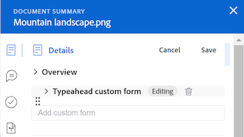
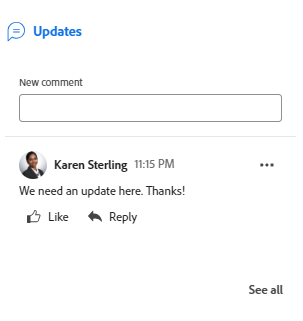
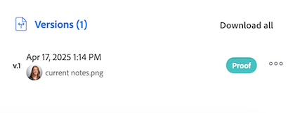

# ドキュメントの概要

<!--Audited: April, 2024-->

概要パネルを使用して、ドキュメントリストから直接重要な情報にアクセスし、更新できます。

+++ 展開すると、この記事の機能のアクセス要件が表示されます。

## アクセス要件

この記事の手順を実行するには、次のアクセス権が必要です。

<table style="table-layout:auto"> 
 <col> 
 </col> 
 <col> 
 </col> 
 <tbody> 
  <tr> 
   <td role="rowheader">Adobe Workfront パッケージ</td> 
   <td> 
 任意
 </td> 
  </tr> 
  <tr> 
   <td role="rowheader">Adobe Workfront ライセンス</td> 
   <td> 
投稿者以上
 
   
リクエスト以上

   </td> 
  </tr> 
  <tr data-mc-conditions=""> 
   <td role="rowheader">アクセスレベル設定</td> 
   <td> 
ドキュメントへのアクセスを編集
  </td> 
  </tr> 
  <tr data-mc-conditions=""> 
   <td role="rowheader">オブジェクト権限</td> 
   <td> 
ドキュメントに関連付けられたオブジェクトへのアクセスの表示
 </td> 
  </tr> 
 </tbody> 
</table>

この表の情報について詳しくは、[Workfront ドキュメントのアクセス要件](/help/quicksilver/administration-and-setup/add-users/access-levels-and-object-permissions/access-level-requirements-in-documentation.md)を参照してください。

+++

## 「概要」ビューを開く

{{step1-to-documents}}

1. **ドキュメント** ページで、リスト内のドキュメントを選択します。

1. ページの右上隅にある **概要を開く** アイコン  をクリックします。 **ドキュメントの概要** サイドパネルが開きます。

   

   概要を開いた後は、手動で閉じるまで、このページで開いたままになります（他のドキュメントをクリックした場合でも）。

## 詳細

「詳細」セクションでは、概要情報を表示したり、カスタムフォームを使用したりできます。セクションの上部にある「詳細」をクリックして、ドキュメントの詳細ページ全体に移動します。

* [概要](#overview)
* [カスタムフォーム](#custom-forms)

### 概要 {#overview}

「概要」セクションを展開すると、画像サムネールの表示やダウンロード、プルーフの開き、基本的な説明の更新、ドキュメントのチェックアウトなどを行うことができます。

### カスタムフォーム {#custom-forms}

「カスタムフォーム」セクションでは、ドキュメントに関連付けられたカスタムフォームを追加、編集、表示できます。カスタムフォームの名前を入力し、ドキュメントに追加します。詳しくは、[ドキュメントへのカスタムフォームの追加または編集](../../documents/managing-documents/add-custom-form-documents.md)を参照してください。

## アップデート

「更新」セクションを使用すると、ドキュメントまたはプルーフに対して行われた更新を表示できます。 概要には、最初に作成された 2 つのコメントが表示されます。更新について詳しくは、 [プルーフに対するコメント](../../review-and-approve-work/proofing/reviewing-proofs-within-workfront/comment-on-a-proof/comment-on-proof.md)を参照してください。

## 承認

「承認」セクションでは、ドキュメントの承認をリクエストすることができます。また、承認についてのリマインドや承認の再送信、以前の決定のキャンセル、承認の削除を行うこともできます。ドキュメントの承認者は、概要を使用して意思決定を下すことができます。

プルーフの承認は、プルーフワークフローに追加する必要があります。承認について詳しくは、以下を参照してください。

* [作業の承認](../../review-and-approve-work/manage-approvals/approving-work.md)
* [ドキュメント承認のリクエスト](../../review-and-approve-work/manage-approvals/request-document-approvals.md)

## バージョン

「バージョン」セクションでは、特定のドキュメントに対して作成されたバージョンの数を確認できます。その他アイコン  をクリックすると、次の操作を実行できます。

* プルーフを開きます。
* プルーフまたはドキュメントをダウンロードします。
* ブラウザーでサポートされているドキュメントをプレビューする。
* ドキュメントの詳細に移動します。
* プルーフまたはドキュメントの削除。

