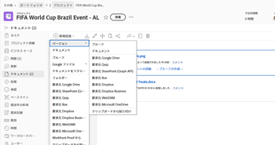

# ドキュメントの新しいバージョンをアップロードする

以前に Adobe Workfront にアップロードしたドキュメントの新しいバージョンを追加できます。

新しいバージョンのファイル名が以前のバージョンのファイル名と異なる場合、Workfront は新しいファイル名を持つドキュメントを表示します。

ドキュメントにプルーフが含まれていて、プルーフ済みドキュメントの新しいバージョンを作成する場合は、[ドキュメントのプルーフを作成](../../review-and-approve-work/proofing/creating-proofs-within-workfront/generate-proof-for-a-document.md)の記事で[ドキュメントをアップロードし、プルーフの新しいバージョンを作成](../../review-and-approve-work/proofing/creating-proofs-within-workfront/generate-proof-for-a-document.md#uploading-a-document-and-creating-a-new-version-of-a-proof)の節を参照してください。

外部アプリケーションから Workfront にリンクされた新しいバージョンのドキュメントを追加する方法について詳しくは、[外部アプリケーションからドキュメントをリンク](../../documents/adding-documents-to-workfront/link-documents-from-external-apps.md)の[リンクされたドキュメントの新しいバージョンを追加](../../documents/adding-documents-to-workfront/link-documents-from-external-apps.md#add)を参照してください。

## アクセス要件

以下が必要です。

<table style="table-layout:auto"> 
 <col> 
 </col> 
 <col> 
 </col> 
 <tbody> 
  <tr> 
   <td role="rowheader">Adobe Workfront プラン*</td> 
   <td> 
 任意
 </td> 
  </tr> 
  <tr> 
   <td role="rowheader">Adobe Workfront ライセンス*</td> 
   <td> 
リクエスト以上
 </td> 
  </tr> 
  <tr data-mc-conditions=""> 
   <td role="rowheader">アクセスレベル設定*</td> 
   <td> 
ドキュメントへのアクセスを編集
 
メモ：まだアクセス権がない場合は、アクセスレベルに追加の制限が設定されていないかどうか Workfront 管理者にお問い合わせください。Workfront 管理者がアクセスレベルを変更する方法について詳しくは、<a href="../../administration-and-setup/add-users/configure-and-grant-access/create-modify-access-levels.md" class="MCXref xref">カスタムアクセスレベルの作成または変更</a>を参照してください。
 </td> 
  </tr> 
  <tr data-mc-conditions=""> 
   <td role="rowheader">オブジェクト権限</td> 
   <td> 
ドキュメントに関連付けられたオブジェクトへの編集アクセス権
 
追加のアクセス権のリクエストについて詳しくは、<a href="../../workfront-basics/grant-and-request-access-to-objects/request-access.md" class="MCXref xref">オブジェクトへのアクセス権のリクエスト</a>を参照してください。
 </td> 
  </tr> 
 </tbody> 
</table>

&#42;自分のプラン、ライセンスタイプ、アクセス権を確認するには、Workfront 管理者に問い合わせてください。

## ドラッグ＆ドロップを使用して新しいバージョンを追加する

>[!NOTE]
>
>Internet Explorer ではドラッグ＆ドロップは機能しません。

1. ドキュメントがアップロードされるドキュメントエリアに移動します。
1. デスクトップまたは別のブラウザータブから、ドキュメントの新しいバージョンを Workfront の既存のバージョンの上にドラッグします。

   

   新しいバージョンをドラッグする際に、Workfront ドキュメントフォルダーの上にポインタを合わせると、そのバージョンを開くことができます。次に、ファイルを画面の上部または下部にドラッグして、上下にスクロールできます。

1. 「**ドキュメント**」タブの既存のファイルの上に新しいバージョンをドロップします。

   ドキュメントバージョンの管理について詳しくは、[ドキュメントバージョンの管理](../../documents/managing-documents/manage-document-versions.md)を参照してください。

## 詳細メニューを使用して新しいバージョンを追加します。

1. 新しいバージョンを追加するドキュメントを選択します。
1. **新規追加**／**バージョン**&#x200B;をクリックします。

   

1. アップロードするドキュメントの種類を選択し、画面の指示に従います。
