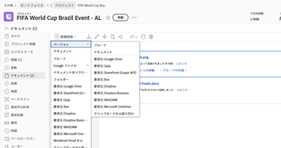

# ドキュメントの新しいバージョンをアップロードする

以前に Adobe Workfront にアップロードしたドキュメントの新しいバージョンを追加できます。

新しいバージョンのファイル名が以前のバージョンのファイル名と異なる場合、Workfront は新しいファイル名を持つドキュメントを表示します。

ドキュメントにプルーフが含まれていて、プルーフ済みドキュメントの新しいバージョンを作成する場合は、[ドキュメントのプルーフを作成](../../review-and-approve-work/proofing/creating-proofs-within-workfront/generate-proof-for-a-document.md)の記事で[ドキュメントをアップロードし、プルーフの新しいバージョンを作成](../../review-and-approve-work/proofing/creating-proofs-within-workfront/generate-proof-for-a-document.md#uploading-a-document-and-creating-a-new-version-of-a-proof)の節を参照してください。

外部アプリケーションから Workfront にリンクされた新しいバージョンのドキュメントを追加する方法について詳しくは、[外部アプリケーションからドキュメントをリンク](../../documents/adding-documents-to-workfront/link-documents-from-external-apps.md)の[リンクされたドキュメントの新しいバージョンを追加](../../documents/adding-documents-to-workfront/link-documents-from-external-apps.md#add)を参照してください。

## アクセス要件

+++ 展開すると、この記事の機能のアクセス要件が表示されます。

<table style="table-layout:auto"> 
 <col> 
 </col> 
 <col> 
 </col> 
 <tbody> 
  <tr> 
   <td role="rowheader">Adobe Workfront パッケージ</td> 
   <td> 
従来のWorkfront ストレージを使用してドキュメントを管理するWorkfront パッケージ

Adobe クラウドストレージを使用してドキュメントを管理するワークフローパッケージ
</td> 
  </tr> 
  <tr> 
   <td role="rowheader">Adobe Workfront ライセンス</td> 
   <td> 
   
コントリビューター以上

   
リクエスト以上
 </td> 
  </tr> 
  <tr data-mc-conditions=""> 
   <td role="rowheader">アクセスレベル設定*</td> 
   <td> 
ドキュメントへのアクセスを編集
  </td> 
  </tr> 
  <tr data-mc-conditions=""> 
   <td role="rowheader">オブジェクト権限</td> 
   <td> 
ドキュメントに関連付けられたオブジェクトへの編集アクセス権
 </td> 
  </tr> 
 </tbody> 
</table>

この表の情報について詳しくは、[Workfront ドキュメントのアクセス要件](/help/quicksilver/administration-and-setup/add-users/access-levels-and-object-permissions/access-level-requirements-in-documentation.md)を参照してください。
+++

## 従来のドキュメント領域に新しいドキュメントバージョンをアップロードする

組織が従来のWorkfront ストレージを使用している場合、Workfrontでドキュメントにアクセスすると、従来のドキュメント領域が表示されます。 従来のWorkfront ストレージについて詳しくは、[従来のWorkfront ストレージとAdobe クラウドストレージの違い](/help/quicksilver/review-and-approve-work/esm-overview.md)を参照してください。

### ドラッグ＆ドロップを使用して新しいバージョンを追加する

>[!NOTE]
>
>Internet Explorer ではドラッグ＆ドロップは機能しません。

1. ドキュメントがアップロードされるドキュメントエリアに移動します。
1. デスクトップまたは別のブラウザータブから、ドキュメントの新しいバージョンを Workfront の既存のバージョンの上にドラッグします。

   

   新しいバージョンをドラッグする際に、Workfront ドキュメントフォルダーの上にポインタを合わせると、そのバージョンを開くことができます。 次に、ファイルを画面の上部または下部にドラッグして、上下にスクロールできます。

1. 「**ドキュメント**」タブの既存のファイルの上に新しいバージョンをドロップします。

   ドキュメントバージョンの管理について詳しくは、[ドキュメントバージョンの管理](../../documents/managing-documents/manage-document-versions.md)を参照してください。

### 詳細メニューを使用して新しいバージョンを追加します。

1. 新しいバージョンを追加するドキュメントを選択します。
1. **新規追加**／**バージョン**&#x200B;をクリックします。

   

1. アップロードするドキュメントの種類を選択し、画面のプロンプトに従います。

## 新しいドキュメント領域に新しいドキュメントバージョンをアップロードする

組織でAdobe クラウドストレージを使用している場合、Workfrontでドキュメントにアクセスすると、新しいドキュメント エリアが表示されます。 Adobe クラウドストレージについて詳しくは、[Adobe クラウドストレージの概要](/help/quicksilver/review-and-approve-work/esm-overview.md)を参照してください。

### ドラッグ＆ドロップを使用して新しいバージョンを追加する

>[!NOTE]
>
>Internet Explorer ではドラッグ＆ドロップは機能しません。

1. ドキュメントがアップロードされるドキュメントエリアに移動します。
1. Workfrontの既存のバージョンの上に、新しいバージョンのドキュメントをドラッグします。

   

1. 「**ドキュメント**」タブの既存のファイルの上に新しいバージョンをドロップします。

   ドキュメントバージョンの管理について詳しくは、[ドキュメントバージョンの管理](../../documents/managing-documents/manage-document-versions.md)を参照してください。

### 詳細メニューを使用して新しいバージョンを追加します。

1. 新しいバージョンを追加するドキュメントを選択します。
1. 右側の「バージョンを表示」アイコン を開きます。
1. 「**新しいバージョンを追加**」をクリックします。

   

1. ドキュメントを検索し、**開く**&#x200B;をクリックします。

