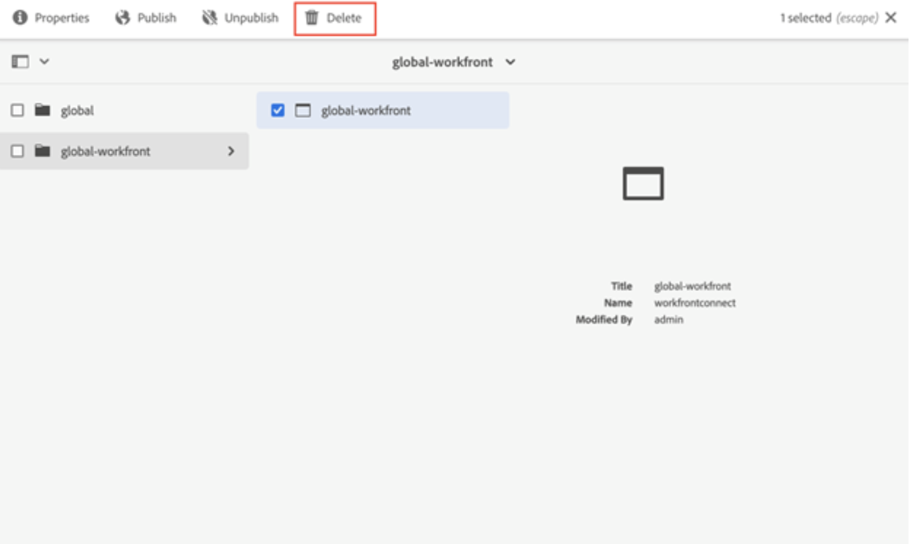

# Adobe Experience Manager レガシーコネクターでの Workfront のアンインストール

Workfront と Adobe Experience Manager Assets as a Cloud Service を接続する最新のネイティブ統合に、Workfront と Adobe Experience Manager レガシーコネクターをアンインストールする必要があります。

## Workfront から登録解除

1. Adobe Experience Manager を開きます。
1. Experience Manager で、**ツール**／**クラウドサービス**／**Workfront 統合の設定**&#x200B;に移動します。
1. 設定（デフォルトでは global-workfront）を選択し、「**プロパティ**」をクリックします。
   
1. ドキュメント、コメントおよびメタデータの同期を無効にします。ラベルは「無効」の日付にする必要があります。
これにより、Workfront のサブスクリプションが削除され、Day CQ Link Externalizer で定義されたのと同じURLを使用して新しいサブスクリプションを作成できます。

## Workfront 統合設定の削除

サブスクリプションを削除した後は、Workfront 統合設定を削除しても安全です。

1. 設定を開き、「**削除**」を選択します。
   

## マッピングを削除

次に、Workfront プロパティマッピングを削除する必要があります。

1. Experience Manager で、**ツール**／**アセット**／**Workfront プロパティマッピング**&#x200B;に移動します。

1. すべてのマッピングを選択し、「**削除**」をクリックします。

## ユーザー権限

Workfront から AEM Dam にアクセスするすべてのユーザーに、`/content/dam` への読み取り権限が付与されました。ユーザーがその権限を必要としなくなった場合は、そのユーザーに与えられている権限を削除できます。

コネクターは、システムユーザーの WorkFront サービスを使用して動作します。これは、コネクターをアンインストールする際にアンインストールされます。

>[!NOTE]
>
>コネクターバージョン2.0.3を使用し、グループを追加した場合`workfront-aem-connector-group`、**ツール**／**セキュリティ**／**グループ**&#x200B;に移動して削除する必要もあります。

## Day CQ Link Externalizer

Day CQ Link Externalizer が必要ない場合は、`/system/console/configMgr`に移動し「Day CQ Link Externalizer」を探すことで、これを`localhost:4502`に戻すことができます。

>[!NOTE]
>
>Adobe Experience Manager as a Cloud Service を使用している場合は、プロジェクトを調べ、_com.day.cq.commons.impl.ExternalizerImpl.xml_&#x200B;ファイルを&#x200B;_ui/apps/src/main/content/jcr_root/apps/mysite/config_&#x200B;内で見つけることでこれを変更できます。

## コネクターパッケージのアンインストール

コネクターパッケージをアンインストールするために必要な手順は、使用している Adobe Experience Manager のバージョンによって異なります。

### Adobe Experience Manager オンプレミス

オンプレミスで Adobe Experience Manager を使用している場合は、_crx/packmgr/index.jsp_&#x200B;に移動し、`workfront-aem-connector.all-<version>.zip` を探し、**その他**／**アンインストール**&#x200B;をクリックします。

Workfront で作成されたすべてのファイルが削除されていることを確認するために、`/conf` を確認してください。

### Adobe Experience Manager as a Cloud Service

Adobe Experience Manager as a Cloud Service の場合は、プロジェクトの pom.files からコネクターの依存関係を削除できます。

## ファイアウォールと Dispatcher

通信が不要になった場合は、忘れずにホワイトリストに登録されている Workfront URL を削除してください。また、コネクターは、Dispatcher に設定されたヘッダー apiKey とユーザー名を使用します。これらは削除することもできます。
