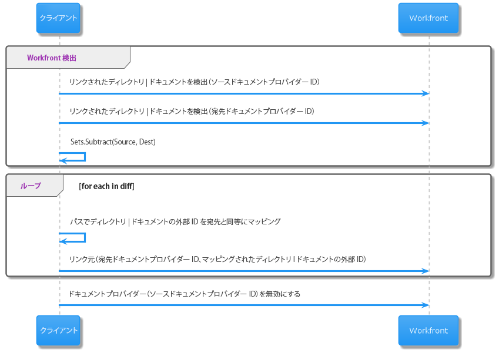

# リンクされたフォルダとドキュメントを移行する

API を使用して、リンクされたフォルダーとドキュメントをAdobe Experience Manager Assets に移行できます。

## 手順

1. 前の外部ドキュメントストレージプロバイダーにリンクされているすべてのドキュメントとフォルダーを特定し、Workfrontの内部ドキュメントまたはフォルダーの識別子と、含まれているフォルダーのフォルダー ID に注意します。

   >[!NOTE]
   >
   > 検出されたすべてのフォルダーまたはドキュメントをチェックして、新しいプロバイダーとのリンクがまだ作成されていないことを確認する必要があります。

1. 新しいリポジトリ内のドキュメントとフォルダーをパスで探し、外部システムでその ID を検索します。

1. 内部Workfront ID と新しい外部ストアの ID のマッピングを作成します。 次の手順で新しいリンクを作成するには、この手順が必要です。

1. Workfrontで新しいドキュメントまたはドキュメントフォルダーリンクを作成し、新しい外部 ID を使用して新しい場所のリソースを指します。

   1. **ドキュメント**:新しい外部ドキュメントプロバイダーを使用して、既存のドキュメントの新しいバージョンを追加します。
   1. **フォルダー**:同じ場所に同じ名前の新しいフィルダーを作成します。

>[!CAUTION]
>
>   既存のリンクされたフォルダーを削除しないでください。 その結果、データが失われる可能性があります。 Workfrontアプリケーションから古いフォルダーリンクを削除するには、「設定」領域でカスタムドキュメント統合を無効にします。


## リンクの移行プロセスの例



## API 情報

この節のWorkfront API について詳しくは、 [開発者向けドキュメント：ドキュメント](https://developer.workfront.com/documents.html).

### すべてのドキュメントを検索

すべて検索 **ドキュメント (DOCU)** リンク先 **ドキュメントプロバイダー** / **providerType** と **documentProviderID**.

```
Http Method: GET
 
Http Endpoint: {host}/attask/api/v14.0/document/search?fields=currentVersion:*&currentVersion:externalIntegrationType={providerType}
```

[API ドキュメントリファレンス](https://developer.workfront.com/documents.html#get-/docu/search)

### すべてのフォルダを検索

すべて検索 **ドキュメントフォルダ (DOCFDR)** 次のドキュメントプロバイダーにリンク： **providerType** と **documentProviderID**.

```
Http Method: GET
 
Http Endpoint: {host}/attask/api/v14.0/documentFolder/search?fields=*,linkedFolder:*&linkedFolder:externalIntegrationType={providerType}
```

API ドキュメント：（ドキュメントフォルダーエンドポイントは、現在、developer.workfront.com では扱われていません）。

### ドキュメントをリンク

リンク **ドキュメント (DOCU)** から **外部ドキュメントプロバイダー** / **providerType** と **documentProviderID**.

>[!IMPORTANT]
>
>ドキュメントは一時的に保存されます。 つまり、ドキュメントのすべてのバージョンにアクセスできます。 リンクを作成する際に、既存のドキュメント ID を指定できるので、そのドキュメントに新しいバージョンを書き込むだけで、そのデータは新しいプロバイダーで外部でホストされます。 このドキュメント ID は、置き換えるドキュメントリンクで見つかったドキュメント ID と同じです。 同じ概念文書です この新しいバージョンのバイトが別のプロバイダーで保存されていることを示すだけです。

```
Http Method: POST
 
Endpoint: {host}/internal/documents/linkExternalObjects
 
Http Body:
refObjCode=DOCU&refObjID={documentId}&providerType={providerType}&documentProviderID={documentProviderID}
```

API ドキュメント：（現在、developer.workfront.com では扱われていない内部リンクエンドポイント）

### フォルダーをリンク

リンク **ドキュメントフォルダ (DOCFDR)** から **外部ドキュメントプロバイダー** / **providerType** と **documentProviderID**.

>[!IMPORTANT]
>
>ドキュメントリンクの場合とは異なり、新しいリンクを配置するWorkfrontのフォルダーの「documentFolderId」が必要です。 これは、コピーしようとしているリンク先のフォルダーと同じ親フォルダーです。

>[!CAUTION]
>
>フォルダーは一時的には保存されません。 古いフォルダーは削除しないでください。 設定領域でカスタムドキュメント統合を無効にして、古いフォルダーを削除します。


```
Http Method: POST
 
Endpoint: {host}/internal/document/version/linkExternal
 
Http Body:
providerType={providerType}&documentProviderID={documentProviderID}&breadcrumb=[]&linkAction=LINKEXTERNAL&refObjCode={USER|PROJECT_TASK|TEMPLATE_TASK|securityRootObjectCode}&refObjID={userID|taskID|templateTaskID|securityRootId}&destFolderID={parentFolderId}
```

API ドキュメント：（現在、developer.workfront.com では扱われていない内部リンクエンドポイント）

## 重要な用語

* **文書**:Workfront内のデジタルアセット

* **ドキュメントフォルダー**:Workfront内のデジタルアセット用のコンテナ

* **ドキュメント ID**:デジタルアセットのWorkfront内部 ID

* **ドキュメントフォルダー ID**:Workfrontデジタルアセットフォルダーの内部 ID

* **ドキュメントプロバイダー ID**:特定のドキュメントプロバイダーに関連付けられた ID

>[!IMPORTANT]
>
> 任意のドキュメントプロバイダータイプに対して、1 人の顧客が複数のインスタンスを接続している場合があります。 例えば、複数のAEMリポジトリがリンクされている場合があります。 または、複数のGoogle Drive インスタンスがリンクされています。 ドキュメントプロバイダー ID は、置き換えまたは切り替え先の接続タイプの特定のインスタンスを示します。

* **ドキュメントストレージプロバイダーのタイプ（「外部統合タイプ」も含む）**:Workfrontがサポートするドキュメントストレージプロバイダー統合のタイプ。 専用の統合または「カスタム統合」を使用して、

* **現在のドキュメントストレージプロバイダーの種類 (providerType)**:

   ```
   ATTASK
   BOX
   GOOGLE
   SHAREPOINT
   WEBDAM
   WORKFRONTDAM
   INFERNO
   WIDEN
   DROPBOX
   DROPBOX_BUSINESS
   ONEDRIVE
   QUIP
   WEBHOOKS
   AEM
   MOCK
   ```

* **リンクされたドキュメント**:外部のドキュメントストレージプロバイダーでホストされるデジタルアセット。 Workfrontには、アセットに対して独自の内部「ドキュメント ID」が割り当てられますが、バイトは外部に保存されます。 これを容易にするために、Workfrontでは、外部参照リソースをリモートリポジトリまたはストア内に配置する際に役立つ「外部ドキュメント ID」も保存します。

* **リンクされたドキュメントフォルダ**:外部のドキュメントストレージプロバイダーでホストされるデジタルアセット用のコンテナです。 Workfrontには、アセットに対して独自の内部「ドキュメントフォルダー ID」がありますが、バイトは外部に保存されます。 これを容易にするために、Workfrontでは、外部参照リソースをリモートリポジトリまたはストア内に配置する際に役立つ「外部ドキュメント ID」も保存します。

* **外部ドキュメント ID**:アセットがワークフロントの外部に保存される際に割り当てられる ID。 Workfrontは、内部識別子を、外部システムでアセットを見つけるために使用される識別子に、この「外部ドキュメント識別子」フィールドを使用してマッピングします。 したがって、新しい外部ストアからドキュメントまたはフォルダーをリンクする場合は、外部ドキュメントプロバイダーが新しいリポジトリまたはストア内のドキュメントを識別できるよう、適切な形式で新しい外部ドキュメント識別子を作成する必要があります。

   >[!NOTE]
   >
   > Workfrontには、外部ドキュメント識別子用の標準がまだありません。 新しい仕様はAEM ID に使用されていますが、他の ID の場合、外部ドキュメント ID は、プロバイダーの種類に応じて異なる形式を取る場合があります。


* **オブジェクトタイプ**:これは、このドキュメントの目的でのみ使用される API の用語です。 これは、操作するワークフロント内の汎用オブジェクトの一種です。 この場合、「DOCU」と「DOCFDR」のタイプを持つドキュメントとフォルダを操作します。

* **オブジェクト ID**:操作する汎用オブジェクトの内部Workfront識別子。 ドキュメントとフォルダーを操作し、それぞれドキュメント ID またはドキュメントフォルダー ID にします。
