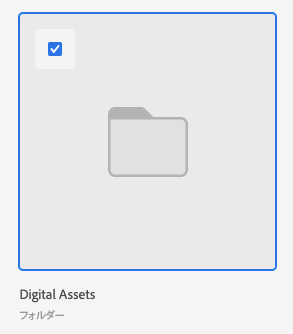

# 拡張コネクタを使用したアセットおよびフォルダーのリンク

ドキュメントをサポートしている任意のWorkfrontオブジェクトに、Experience Manager Assetsからアセットまたはフォルダーをリンクできます。 Experience Manager Assetsから送信されたアセットは、Workfrontのドキュメントストレージ全体にはカウントされません。 WorkfrontからExperience Manager Assetsにアップロードされ、送信されたドキュメントは、全体的なストレージにカウントされます。

## アクセス要件

この記事の手順を実行するには、次のアクセス権が必要です。

<table style="table-layout:auto"> 
 <col> 
 <col> 
 <tbody> 
  <tr> 
   <td role="rowheader">Adobe Workfront plan*</td> 
   <td> 
任意
 </td> 
  </tr> 
  <tr> 
   <td role="rowheader">Adobe Workfront license*</td> 
   <td> 
リクエスト以上
 </td> 
  </tr> 
  <tr> 
   <td role="rowheader">製品</td> 
   <td>Experience Manager Assets </td> 
  </tr> 
  <tr> 
   <td role="rowheader">アクセスレベル設定*</td> 
   <td> 
ドキュメントへのアクセスを編集
 
注意：まだアクセス権がない場合は、Workfront管理者に、アクセスレベルに追加の制限を設定しているかどうかを問い合わせてください。 Workfront管理者がアクセスレベルを変更する方法について詳しくは、 <a href="../../../administration-and-setup/add-users/configure-and-grant-access/create-modify-access-levels.md" class="MCXref xref">カスタムアクセスレベルの作成または変更</a>.
 </td> 
  </tr> 
  <tr> 
   <td role="rowheader">オブジェクト権限</td> 
   <td> 
ドキュメントの表示アクセス権以上
 
追加のアクセス権のリクエストについて詳しくは、 <a href="../../../workfront-basics/grant-and-request-access-to-objects/request-access.md" class="MCXref xref">オブジェクトへのアクセスのリクエスト </a>.
 </td> 
  </tr> 
 </tbody> 
</table>

&#42;保有しているプラン、ライセンスの種類、アクセス権を確認するには、Workfront管理者に問い合わせてください。

## 前提条件

始める前に、

* Workfront forExperience Manager拡張コネクタのインストール

## Experience Manager Assetsからのアセットのリンク

Experience Manager AssetsからWorkfrontにアセットをリンクできます。 アセットをリンクすると、次の操作が可能になります。

* [Experience Manager Assetsのリンクされたアセットの配達確認](../../../documents/workfront-and-experience-manager-integrations/workfront-for-experience-manager-enhanced-connector/enhanced-connector-proof-asset.md)
* [新しいバージョンのドキュメントをアップロード](../../../documents/managing-documents/upload-new-document-version.md)

アセットをExperience Manager Assetsにリンクするには：

1. 次に移動： **ドキュメント** ドキュメントを追加するWorkfrontの領域。
1. クリック **新規追加**」で、管理者が設定したExperience Manager Assets統合を選択します。

   >[!NOTE]
   >
   >この統合では、どのような名前も選択できるので、Experience Manager Assetsについては特に記載しないでください。

1. 使用するアセットを選択します。

   

1. クリック **リンク**.

## Experience Manager Assetsからのフォルダーのリンク

フォルダー内の個々のアセットを表示する権限は、Experience Manager Assets権限に依存します。

フォルダーをExperience Manager Assetsにリンクするには：

1. 次に移動： **ドキュメント** ドキュメントを追加するWorkfrontの領域。
1. クリック **新規追加**」で、管理者が設定したExperience Manager Assets統合を選択します。

   >[!NOTE]
   >
   >この統合では、どのような名前も選択できるので、Experience Manager Assetsについては特に記載しないでください。

1. 使用するフォルダを選択します。

   

1. クリック **リンク**.

## Experience Manager Assetsから新しいバージョンをリンク

Experience Manager Assetsから新しいアセットを引き出し、Workfrontで新しいバージョンとして既存のアセットに追加できます。 ドキュメントが既にリンクされていて、新しいバージョンがExperience Manager Assetsに追加されている場合は、新しいバージョンがWorkfrontに自動的に表示されます。

>[!TIP]
>
>に移動すると、アセットのすべてのバージョンを表示できます **ドキュメントの詳細** > **バージョン**.

Experience Manager Assetsから新しいバージョンをリンクするには：

1. 次に移動： **ドキュメント** ドキュメントを追加するWorkfrontの領域。
1. 新しいバージョンに置き換えるアセットを選択します。 リンクされたフォルダー内に新しいバージョンのアセットを作成することはできません。
1. クリック **新規追加**」で、管理者が設定したExperience Manager Assets統合を選択します。

   >[!NOTE]
   >
   >この統合では、どのような名前も選択できるので、Experience Manager Assetsについては特に記載しないでください。

1. 目的のアセットを選択します。

   

1. クリック **リンク**.
