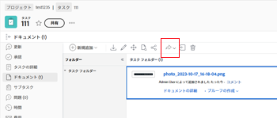

# 拡張コネクタ付きドキュメントの送信

WorkfrontからExperience Manager Assetsにドキュメントを送信できます。 WorkfrontからExperience Manager Assetsにアップロードされて送信されたドキュメントは、引き続きドキュメントストレージ全体に対してカウントされます。 Experience Manager Assetsからリンクされたアセットは、全体のストレージにはカウントされません。

## アクセス要件

この記事の手順を実行するには、次のアクセス権が必要です。

<table style="table-layout:auto"> 
 <col> 
 <col> 
 <tbody> 
  <tr> 
   <td role="rowheader">Adobe Workfront plan*</td> 
   <td> 
Pro 以上
 </td> 
  </tr> 
  <tr> 
   <td role="rowheader">Adobe Workfront license*</td> 
   <td> 
リクエスト以上
 </td> 
  </tr> 
  <tr> 
   <td role="rowheader">製品</td> 
   <td>Experience Manager Assets </td> 
  </tr> 
  <tr> 
   <td role="rowheader">アクセスレベル設定*</td> 
   <td> 
ドキュメントへのアクセスを編集
 
注意：まだアクセス権がない場合は、Workfront管理者に、アクセスレベルに追加の制限を設定しているかどうかを問い合わせてください。 Workfront管理者がアクセスレベルを変更する方法について詳しくは、 <a href="../../../administration-and-setup/add-users/configure-and-grant-access/create-modify-access-levels.md" class="MCXref xref">カスタムアクセスレベルの作成または変更</a>.
 </td> 
  </tr> 
  <tr> 
   <td role="rowheader">オブジェクト権限</td> 
   <td> 
ドキュメントのアクセス権以上の表示
 
追加のアクセス権のリクエストについて詳しくは、 <a href="../../../workfront-basics/grant-and-request-access-to-objects/request-access.md" class="MCXref xref">オブジェクトへのアクセスのリクエスト </a>.
 </td> 
  </tr> 
 </tbody> 
</table>

&#42;保有しているプラン、ライセンスの種類、アクセス権を確認するには、Workfront管理者に問い合わせてください。

## 前提条件

始める前に、

* Workfront for InstallExperience Manager拡張コネクタ

## ドキュメントをExperience Manager Assetsに送信

ユーザーがWorkfrontからExperience Manager Assetsにドキュメントを送信すると、マッピングされたメタデータはドキュメントに沿って転送されます。 設定した場合、変更が加えられるたびに、メタデータが継続的に同期します。

ドキュメントを送信するには：

1. 次に移動： **ドキュメント** 「Workfront」領域に移動し、送信するドキュメントを選択します。
1. クリック **送信先**」で、管理者が設定したExperience Manager Assets統合を選択します。

   >[!NOTE]
   >
   >この統合では、どのような名前も選択できるので、Experience Manager Assetsについては特に記載しないでください。

   

1. アセットの移動先を選択し、「 **フォルダーを選択**.
1. 目的の宛先が見つかったら、 **保存**.

## Experience Manager Assetsに新しいバージョンを送信

以前にWorkfrontにアップロードしたドキュメントに新しいバージョンを追加できます。 詳しくは、 [新しいバージョンのドキュメントをアップロード](../../../documents/managing-documents/upload-new-document-version.md). 最新バージョンがアップロードされたら、Experience Manager Assetsに送信できます。 Workfrontでマッピングされたフィールドが変更された場合、新しいバージョンは、送信時にExperience Manager Assetsのメタデータを更新します。

最新バージョンを送信するには：

1. 次に移動： **ドキュメント** 領域内のWorkfrontをクリックし、ドキュメントを探します。
1. クリック **送信先**」で、管理者が設定したExperience Manager Assets統合を選択します。

   >[!NOTE]
   >
   >この統合では、どのような名前も選択できるので、Experience Manager Assetsについては特に記載しないでください。

   

1. 「**保存**」をクリックします。新しいバージョンは、以前のバージョンと同じ場所に保存されます。
