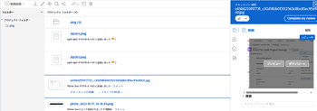

# 拡張コネクタを使用した、リンクされたアセットの表示またはダウンロード

Experience Manager AssetsからリンクされているAdobe Workfrontのアセットを表示またはダウンロードできます。

## アクセス要件

以下が必要です。

<table style="table-layout:auto"> 
 <col> 
 <col> 
 <tbody> 
  <tr> 
   <td role="rowheader">Adobe Workfront plan*</td> 
   <td> 
 任意
 </td> 
  </tr> 
  <tr> 
   <td role="rowheader">Adobe Workfrontライセンス*</td> 
   <td> 
リクエスト以上
 </td> 
  </tr> 
  <tr> 
   <td role="rowheader">製品</td> 
   <td>Experience Manager Assets Essentials インスタンスが必要です。</td> 
  </tr> 
  <tr> 
   <td role="rowheader">アクセスレベル設定*</td> 
   <td> 
ドキュメントへのアクセスを編集
 
注意：まだアクセス権がない場合は、Workfront管理者に、アクセスレベルに追加の制限を設定しているかどうかを問い合わせてください。 Workfront管理者がアクセスレベルを変更する方法について詳しくは、 <a href="../../../administration-and-setup/add-users/configure-and-grant-access/create-modify-access-levels.md" class="MCXref xref">カスタムアクセスレベルの作成または変更</a>.
 </td> 
  </tr> 
  <tr> 
   <td role="rowheader">オブジェクト権限</td> 
   <td> 
アクセス権以上の表示
 
追加のアクセス権のリクエストについて詳しくは、 <a href="../../../workfront-basics/grant-and-request-access-to-objects/request-access.md" class="MCXref xref">オブジェクトへのアクセスのリクエスト </a>.
 </td> 
  </tr> 
 </tbody> 
</table>

&#42;保有しているプラン、ライセンスの種類、アクセス権を確認するには、Workfront管理者に問い合わせてください。

## 前提条件

始める前に、

* Workfront forExperience Manager拡張コネクタのインストール

## Experience Manager Assetsからのリンクされたアセットの表示またはダウンロード

1. 表示またはダウンロードするドキュメントを見つけます。
1. ドキュメントリストから、ドキュメントを選択します。
1. 右側のドキュメントの概要で、上部のサムネールの上にマウスポインターを置いて、「 」を選択します。 **プレビュー** または **ダウンロード**.

   
