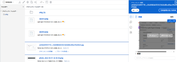

# リンクされたアセットの拡張コネクタによる表示またはダウンロード

Experience Manager Assets からリンクされている Adobe Workfront 内のアセットを表示またはダウンロードできます。

## アクセス要件

+++ 展開すると、この記事の機能のアクセス要件が表示されます。

<table style="table-layout:auto"> 
 <col> 
 <col> 
 <tbody> 
  <tr> 
   <td role="rowheader">Adobe Workfront パッケージ</td> 
   <td> 
任意
 </td> 
  </tr> 
  <tr> 
   <td role="rowheader">Adobe Workfront プラン</td> 
   <td> 
   
コントリビューター以上

   
リクエスト以上
 </td> 
  </tr> 
  <tr> 
   <td role="rowheader">その他の製品</td> 
   <td>Experience Manager Assets </td> 
  </tr> 
  <tr> 
   <td role="rowheader">アクセスレベル設定*</td> 
   <td> 
ドキュメントへのアクセスを編集
 s="MCXref xref"&gt; カスタム アクセス レベルを作成または変更</a>。
 </td> 
  </tr> 
  <tr> 
   <td role="rowheader">オブジェクト権限</td> 
   <td> 
ドキュメントの表示アクセス権またはそれ以上の権限
</td> 
  </tr> 
 </tbody> 
</table>

詳しくは、[Workfront ドキュメントのアクセス要件](/help/quicksilver/administration-and-setup/add-users/access-levels-and-object-permissions/access-level-requirements-in-documentation.md)を参照してください。

+++

## 前提条件

開始する前に、

* Workfront for Experience Manager 拡張コネクタをインストール

## Experience Manager Assets からリンクされたアセットの表示またはダウンロード

1. 表示またはダウンロードするドキュメントを特定します。
1. そのドキュメントをドキュメントリストから選択します。
1. 右側のドキュメントの概要で、上部のサムネールにポインタを合わせて、「**プレビュー**」または「**ダウンロード**」を選択します。

   
