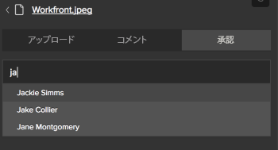

# Workfront Extension for IllustratorとInDesignの使用

>[!IMPORTANT]
>
>IllustratorおよびInDesign用のWorkfront拡張機能をに置き換えます。 [更新されたCreative Cloudプラグイン](/help/quicksilver/workfront-integrations-and-apps/adobe-workfront-for-creative-cloud/wf-cc-install-toc.md). 2022 年後半以降、この拡張機能はサポートされなくなり、そのまま使用できます。

Workfront拡張機能を使用して、Adobe IllustratorおよびAdobe InDesignで保存し、作成したデジタルコンテンツをWorkfrontに書き出すことができます。 これにより、ドキュメントのレビューと承認のプロセスが高速化されます。

Workfront Extension は、次のアプリケーションでAdobe Creative Cloud 2017 以降に対してサポートされます。

* InDesign
* Illustrator
* Photoshop

   >[!NOTE]
   >
   >新しい [Adobe Workfront for Photoshop](/help/quicksilver/workfront-integrations-and-apps/adobe-workfront-for-creative-cloud/wf-cc-install-ps.md) プラグイン。

## アクセス要件

この記事の手順を実行するには、次のアクセス権が必要です。

<table style="table-layout:auto"> 
 <col> 
 <col> 
 <tbody> 
  <tr> 
   <td role="rowheader">Adobe Workfront plan*</td> 
   <td> 
Pro 以上
 </td> 
  </tr> 
  <tr data-mc-conditions=""> 
   <td role="rowheader">Adobe Workfront license*</td> 
   <td> 
仕事以上
 </td> 
  </tr> 
  <tr> 
   <td role="rowheader">製品</td> 
   <td>Workfrontライセンスに加えて、Adobe Creative Cloudライセンスが必要です。</td> 
  </tr> 
  <tr> 
   <td role="rowheader">オブジェクト権限</td> 
   <td> 
操作するオブジェクトへのアクセスを編集します。
 
追加のアクセス権のリクエストについて詳しくは、 <a href="../../workfront-basics/grant-and-request-access-to-objects/request-access.md" class="MCXref xref">オブジェクトへのアクセスのリクエスト </a>.
 </td> 
  </tr> 
 </tbody> 
</table>

&#42;保有しているプラン、ライセンスの種類、アクセス権を確認するには、Workfront管理者に問い合わせてください。

## IllustratorまたはInDesignからWorkfront Extension にログインする {#log-in-to-workfront-extension-from-illustrator-or-indesign}

サポートされているAdobeアプリケーションの 1 つからWorkfrontにログインすると、サポートされているすべてのAdobeアプリケーションにログインします。

1. Workfront拡張機能を使用するAdobeアプリケーションに移動します。

   サポートされる各アプリケーションでサポートされる形式のリストについては、 [サポートされる書き出しファイル形式](#supported-exported-file-formats) 」を参照してください。

1. クリック **ウィンドウ** > **拡張機能** > Workfront

1. （オプション）Workfrontパネルを、Adobeアプリケーションで表示する位置にドラッグします。
1. 画面の指示に従って、Workfrontにログインします。

   >[!NOTE]
   >
   >* Workfrontは、ユーザーの認証と承認にほとんどの Web ベースの統合で使用される安全な標準である、OAuth 2.0 を使用してAdobe Creative Cloudに接続します。
   >* 次の項目を入力するよう求められた場合、 [ドメインまたはホスト] Workfrontアカウントに次の形式で入力します。 *yourCompany&#39;sDomain.my.workfront.com*. 会社のドメインは通常、会社の名前です。

   プロジェクトが現在のステータスの場合は、割り当てられた作業項目のリストが表示されます。 リストが表示されない場合は、Workfrontにログインします。

   個人用タスクは以下の場所に表示されます。 **プロジェクトなし**.

## Workfrontプロジェクト、タスクまたはイシューにファイルをアップロード {#upload-a-file-to-a-workfront-project-task-or-issue}

コンピューターのファイルシステムからファイルをアップロードしたり、Adobe Creative Cloudアプリケーションで現在開いているファイルをWorkfrontのプロジェクト、タスクまたはイシューに書き出したりできます。 

Adobe Creative Cloudからファイルをアップロードまたは書き出す際は、次の点を考慮してください。

* アクセスレベルでは、Workfrontへのドキュメントのアップロードを許可する必要があります。 詳しくは、 [ドキュメントへのアクセス権の付与](../../administration-and-setup/add-users/configure-and-grant-access/grant-access-documents.md).
* 必要な項目にドキュメントをアップロードする権限が必要です。 詳しくは、 [オブジェクトに対する共有権限の概要](../../workfront-basics/grant-and-request-access-to-objects/sharing-permissions-on-objects-overview.md).
* ファイルは、選択したWorkfrontオブジェクトの「ドキュメント」領域にアップロードされます。
* メインメニューの「ドキュメント」領域にドキュメントを書き出すことはできません  Adobe Creative Cloudアプリケーションから。

この節では、以下について説明します。

* [ファイルのアップロード](#upload-a-file)
* [現在開いているファイルをIllustratorまたはInDesignで書き出す](#export-a-file-currently-open-in-illustrator-or-indesign)
* [IllustratorまたはInDesignから新しいバージョンのファイルをアップロード](#upload-a-new-version-of-a-file-from-illustrator-or-indesign)

### ファイルのアップロード {#upload-a-file}

Adobe Creative Cloudアプリケーションを終了することなく、プロジェクト、タスクまたはイシューにファイルをアップロードできます。

1. Adobe Creative Cloudアプリケーションを開いたときにWorkfront拡張機能が表示されない場合は、 **ウィンドウ** > **拡張機能** > Workfront

   プロジェクトが現在のステータスの場合は、割り当てられた作業項目のリストが表示されます。 リストが表示されない場合は、Workfrontにログインします。

   個人用タスクは以下の場所に表示されます。 **プロジェクトなし**.

1. ファイルのアップロード先のプロジェクト、タスクまたはタスクの名前をクリックします。

   これを検索するには、 **検索** ボックスと選択 **プロジェクト**, **タスク**&#x200B;または **問題** を選択します。 **検索** ボックス 作業項目の名前が一覧に表示されない場合は、 **入力** をクリックして、表示するアクセス権のあるすべてのWorkfront項目を検索します。

1. クリック **選択** Workfront拡張機能の右下隅。
1. 内 **クリックして形式を選択** ドロップダウンメニューから、Workfrontでファイルを保存する形式をクリックします。

   サポートされる各アプリケーションでサポートされる形式のリストについては、 [サポートされる書き出しファイル形式](#supported-exported-file-formats) 」を参照してください。

1. （条件付き）ファイルをアップロードする作業項目にドキュメントフォルダが含まれている場合、**クリックしてドキュメントフォルダを選択** 「 」フィールドで、「 **選択**.

1. クリック **ローカルファイルのアップロード**.
1. 内 **ファイルを開く** 表示されるボックスで、ファイルシステム内のファイルを探し、 **開く**.

1. （オプション）ファイルの新しい名前を入力します。 

   

1. クリック **アップロード**.

   Workfrontで、指定したプロジェクト、タスクまたはイシューのドキュメント領域にドキュメントが表示されます。  

1. （オプション）ドキュメントの名前をクリックして、そのドキュメントの詳細ページをWorkfrontで開きます。

   Workfrontが新しいブラウザータブで開きます。

### 現在開いているファイルをIllustratorまたはInDesignで書き出す {#export-a-file-currently-open-in-illustrator-or-indesign}

1. サポートされているAdobe Creative Cloudアプリケーションで、Workfrontに書き出すファイルを開きます。 
1. Workfront拡張機能が表示されない場合は、 **ウィンドウ** > **拡張機能** > Workfront

   プロジェクトが現在のステータスの場合は、割り当てられた作業項目のリストが表示されます。 リストが表示されない場合は、Workfrontにログインします。

   個人用タスクは以下の場所に表示されます。 **プロジェクトなし**.

1. ファイルを書き出すプロジェクト、タスク、またはタスクの名前をクリックします。

   これを検索するには、 **検索** ボックスと選択 **プロジェクト**, **タスク**&#x200B;または **問題** を選択します。 **検索** ボックス 作業項目の名前が一覧に表示されない場合は、 **入力** をクリックして、表示するアクセス権のあるすべてのWorkfront項目を検索します。

1. 内 **クリックして形式を選択** ドロップダウンメニューから、Workfrontでファイルを保存する形式をクリックします。

   サポートされる各アプリケーションでサポートされる形式のリストについては、 [サポートされる書き出しファイル形式](#supported-exported-file-formats) 」を参照してください。

1. （条件付き）ファイルをアップロードする作業項目にドキュメントフォルダが含まれている場合、**クリックしてドキュメントフォルダを選択** 「 」フィールドで、「 **選択**.
1. （オプション）ドキュメントの名前を変更するには、ドキュメント名をクリックし、新しい名前を入力します。

   

1. クリック **書き出し**. 

   ドキュメントがWorkfrontに正常に書き出されたことを確認するメッセージが表示されます。

   Workfrontでは、ドキュメントは、Workfrontで指定したオブジェクトの「ドキュメント」領域に表示されます。

1. （オプション）ドキュメントの名前をクリックして、Workfrontでアクセスします。

   

   Workfrontが新しいブラウザータブで開きます。

### IllustratorまたはInDesignから新しいバージョンのファイルをアップロード {#upload-a-new-version-of-a-file-from-illustrator-or-indesign}

1. サポート対象のAdobeアプリケーションで作業中のファイルを、Workfrontの新しいバージョンのファイルとして書き出す場合は、Adobeアプリケーションでそのファイルを開きます。 
1. Workfront拡張機能が表示されない場合は、 **ウィンドウ** > **拡張機能** > Workfront

   プロジェクトが現在のステータスの場合は、割り当てられた作業項目のリストが表示されます。 リストが表示されない場合は、Workfrontにログインします。

   個人用タスクは以下の場所に表示されます。 **プロジェクトなし**.

1. 既存のドキュメントが表示されるプロジェクト、タスク、またはイシューの名前をクリックします。

   これを検索するには、 **検索** ボックスと選択 **プロジェクト**, **タスク**&#x200B;または **問題** を選択します。 **検索** ボックス 作業項目の名前が一覧に表示されない場合は、 **入力** をクリックして、表示するアクセス権のあるすべてのWorkfront項目を検索します。

   プロジェクト、タスクまたはイシューにアップロードされたすべてのドキュメントは、Adobeアプリケーションからアップロードされたかどうかに関係なく、リストに表示されます。

1.  
1. 内 **クリックして形式を選択** ドロップダウンメニューから、Workfrontでファイルを保存する形式をクリックします。

   これは、アプリケーションで開いているファイルをエクスポートする場合に必要なAdobeです。 サポートされる各アプリケーションでサポートされる形式のリストについては、 [サポートされる書き出しファイル形式](#supported-exported-file-formats) 」を参照してください。

1. Adobeアプリケーションで開いているファイルを、選択したWorkfrontドキュメントの新しいバージョンとして書き出す場合は、 **書き出し**.

   または

   選択したWorkfrontドキュメントの新しいバージョンとして、コンピューターのファイルシステムからファイルをアップロードする場合は、 **ローカルファイルのアップロード**&#x200B;表示されるボックスでファイルを探し、 **開く**&#x200B;を選択し、「 **アップロード**.

1. （オプション）ドキュメントの名前をクリックして、新しいバージョンをWorkfrontで表示します。 

   >[!NOTE]
   >
   >Workfrontのドキュメントの名前はデフォルトで入力され、編集できません。 また、新しいバージョンとしてアップロードまたは書き出すファイルの名前にも変更されません。
   >
   >
   >

## IllustratorまたはInDesignからのWorkfrontドキュメントに対するコメント {#comment-on-a-workfront-document-from-illustrator-or-indesign}

Adobeアプリケーション内のWorkfrontドキュメントに直接コメントを追加できます。 Workfrontでは、コメントは、ドキュメントが保存されているWorkfront項目の更新領域と更新領域に表示されます。 

1. サポートされているAdobe・アプリケーションの 1 つを開きます。
1. Workfront拡張機能が表示されない場合は、 **ウィンドウ** > **拡張機能** > Workfront

   プロジェクトが現在のステータスの場合は、割り当てられた作業項目のリストが表示されます。 リストが表示されない場合は、Workfrontにログインします。

   個人用タスクは以下の場所に表示されます。 **プロジェクトなし**.

1. 既存のドキュメントが表示されるプロジェクト、タスク、または問題をクリックします。

   これを検索するには、 **検索** ボックスと選択 **プロジェクト**, **タスク**&#x200B;または **問題** を選択します。 **検索** ボックス 作業項目の名前が一覧に表示されない場合は、 **入力** をクリックして、表示するアクセス権のあるすべてのWorkfront項目を検索します。

1. 既存のドキュメントの名前をクリックし、 **選択** Workfront拡張機能の右下隅。
1. 次をクリック： **コメント** 」タブをクリックして、表示されるボックスに更新を入力します。

1. （オプション）他のWorkfrontユーザーまたはチームをコメントに含めるには、 **担当者またはチームに通知** 」ボックスを選択し、ドロップダウンリストに表示される名前をクリックします。
1. （オプション）ドキュメントの承認をリクエストするには、 **承認リクエストを実行**.
1. クリック **更新**.

   ドキュメントの「更新」タブに更新が投稿されます。 コメントに含めたWorkfrontユーザーにはアプリ内通知が送信されます。また、Workfrontの設定によっては、が電子メール通知を受け取る場合もあります。

   Workfront内での通知について詳しくは、 [アプリ内通知の表示と管理](../../workfront-basics/using-notifications/view-and-manage-in-app-notifications.md). 

   電子メール通知の受信について詳しくは、 [Adobe Workfront通知](../../workfront-basics/using-notifications/wf-notifications.md).

## IllustratorまたはInDesignからのドキュメントの承認のリクエスト

Workfrontドキュメントの承認をAdobeアプリケーションから直接リクエストできます。

以下のエンティティからドキュメントの承認をリクエストできます。

* Workfrontユーザー
* Workfrontアカウントを持たない外部ユーザー

以下の方法で、Adobeアプリケーションからドキュメントの承認をリクエストできます。

* 承認者をドキュメントに添付する。
* 文書にコメントを付け、コメントをする際にその人に通知します。 承認者としてドキュメントに添付する

   ドキュメントにコメントを作成する際の承認リクエストについて詳しくは、 [IllustratorまたはInDesignからのWorkfrontドキュメントに対するコメント](#comment-on-a-workfront-document-from-illustrator-or-indesign) 」を参照してください。

アプリケーションからドキュメントに対する承認をAdobeするには：

1. サポートされているAdobe・アプリケーションの 1 つを開きます。
1. Workfront拡張機能が表示されない場合は、 **ウィンドウ** > **拡張機能** > Workfront

   プロジェクトが現在のステータスの場合は、割り当てられた作業項目のリストが表示されます。 リストが表示されない場合は、Workfrontにログインします。

   個人用タスクは以下の場所に表示されます。 **プロジェクトなし**.

1. 既存のドキュメントが表示されるプロジェクト、タスク、またはタスクをクリックし、既存のドキュメントの名前をクリックします。

   これを検索するには、 **検索** ボックスと選択 **プロジェクト**, **タスク**&#x200B;または **問題** を選択します。 **検索** ボックス 作業項目の名前が一覧に表示されない場合は、 **入力** をクリックして、表示するアクセス権のあるすべてのWorkfront項目を検索します。

1. 既存のドキュメントの名前をクリックし、 **選択** Workfront拡張機能の右下隅。
1. 次をクリック： **承認** タブをクリックします。
1. 承認者を追加するには、 **名前ボックスの入力を開始** 次のいずれかの操作を行います。

   * 承認者の名前を入力し、リストに表示されるときに選択します。

      

   * 外部ユーザーの電子メールアドレスを入力します。

1. クリック **承認をリクエスト**.

   コメントに含めるか承認者として追加したWorkfrontユーザーは、アプリ内通知を受け取り、Workfrontの設定に応じて、電子メール通知も受け取る場合があります。\
   外部ユーザーには電子メール通知が届き、承認を決定できます。

   Workfrontの通知について詳しくは、 [アプリ内通知の表示と管理](../../workfront-basics/using-notifications/view-and-manage-in-app-notifications.md). 電子メール通知の受信について詳しくは、 [Adobe Workfront通知](../../workfront-basics/using-notifications/wf-notifications.md).

## IllustratorまたはInDesignから配達確認を生成 {#generate-a-proof-from-illustrator-or-indesign}

自動ワークフローテンプレートを使用している場合は、Adobeアプリケーションで作成したドキュメントの配達確認を、アプリケーション内から移動することなく生成できます。 配達確認の作成について詳しくは、 [配達確認の作成](../../review-and-approve-work/proofing/creating-proofs-within-workfront/create-proofs--in-wf.md). 自動ワークフローテンプレートについて詳しくは、 [自動ワークフローテンプレート](../../review-and-approve-work/proofing/proofing-overview/automated-workflow.md#automate) in [自動ワークフローの概要](../../review-and-approve-work/proofing/proofing-overview/automated-workflow.md).

1. サポートされているAdobe・アプリケーションの 1 つを開きます。
1. Workfront拡張機能が表示されない場合は、 **ウィンドウ** > **拡張機能** > Workfront

   プロジェクトが現在のステータスの場合は、割り当てられた作業項目のリストが表示されます。 リストが表示されない場合は、Workfrontにログインします。

   個人用タスクは以下の場所に表示されます。 **プロジェクトなし**.

1. ドキュメントが既にWorkfrontにアップロードされている場合は、ドキュメントが表示されるWorkfront拡張機能でプロジェクト、タスクまたはイシューを選択し、ドキュメントの名前をクリックします。

   または

   AdobeドキュメントをWorkfrontオブジェクトにアップロードします（「 」の節を参照）。 [Workfrontプロジェクト、タスクまたはイシューにファイルをアップロード](#upload-a-file-to-a-workfront-project-task-or-issue) この記事で、ドキュメントの名前をクリックします。

1. 内 **クリックして形式を選択** ドロップダウンメニューから、Workfrontでファイルを保存する形式をクリックします。

   一部の形式は、この形式の後の手順で校正機能を有効にした後は使用できません。 詳しくは、 [サポートされる書き出しファイル形式](#supported-exported-file-formats) 」を参照してください。

1. クリック **新しい配達確認としてアップロード** をクリックして有効にします。
1. を選択します。 **ワークフローテンプレート** ドキュメントのレビュー時にユーザーに使用を許可する

   「 」の説明に従って、Workfront管理者が自動ワークフローテンプレートを設定します。 ご質問がある場合は、管理者に問い合わせてください。

   1. 少なくとも 1 つ追加してください **新しい受信者** をワークフローテンプレートのすべてのステージに追加します。

      名前の入力を開始し、表示されるドロップダウンリストに表示されたら、名前を選択できます。

   1. 次を指定： **配達確認の役割** およびの頻度 **E メールアラート** 追加する受信者ごとに

   1. （オプション） **電子メール通知** 「 」セクションで、追加したすべての配達確認受信者に対して、配達確認に関するオプションのカスタムメッセージを含む e メール通知を送信するかどうかを選択します。

1. クリック **配達確認を作成**.

   配達確認作成プロセスの進行状況を表示できます。 生成が完了すると、アラートが表示されます。 配達確認を作成したタスクを開くと、そのタスクがリストに表示されます。

## IllustratorやInDesignから離れずに新しいバージョンの配達確認をアップロード

1. 配達確認を含む既存のドキュメントをクリックし、 **選択** をクリックします。
1. クリック **新しい配達確認バージョンとしてアップロード** をクリックして有効にします。
1. （オプション） **ワークフローテンプレート** 新しいバージョンを確認する際に、ユーザーに使用を求める場合。

   別のテンプレートを選択しない場合、以前のバージョン用に選択されたテンプレートは有効なままになります。 また、以前のバージョンのテンプレートを変更した場合、新しいバージョンに対して変更が有効になります。

   「 」の説明に従って、Workfront管理者が自動ワークフローテンプレートを設定します。 ご質問がある場合は、管理者に問い合わせてください。

   1. 少なくとも 1 つ追加してください **新しい受信者** をワークフローテンプレートのすべてのステージに追加します。

      名前の入力を開始し、表示されるドロップダウンリストに表示されたら、名前を選択できます。

   1. 次を指定： **配達確認の役割** およびの頻度 **E メールアラート** 追加する受信者ごとに
   1. （オプション） **電子メール通知** 「 」セクションで、追加したすべての配達確認受信者に対して、配達確認に関するオプションのカスタムメッセージを含む e メール通知を送信するかどうかを選択します。

1. クリック **新しい配達確認バージョンを作成**.

   配達確認作成プロセスの進行状況を表示できます。 生成が完了すると、アラートが表示されます。 配達確認を作成したタスクを開くと、そのタスクがリストに表示されます。

## Workfront Extension からログアウトします。

1. Adobe・アプリケーションで、 **ウィンドウ** > **拡張機能** > Workfront

1. 次をクリック： **詳細** メニュー  をクリックします。

1. （オプション）「 **フィードバック** 簡単な調査を開き、Workfront for Adobe Creative Cloudに関するフィードバックを送信します。 
1. クリック **ログアウト**.\
   ログイン画面が表示されます。 ログインについて詳しくは、 [IllustratorまたはInDesignからWorkfront Extension にログインする](#log-in-to-workfront-extension-from-illustrator-or-indesign) 」を参照してください。

## サポートされる書き出しファイル形式 {#supported-exported-file-formats}

* [Adobe InDesignでサポートされる書き出し済みファイル形式](#supported-exported-file-formats-for-adobe-indesign)
* [Adobe Illustratorでサポートされる書き出しファイル形式](#supported-exported-file-formats-for-adobe-illustrator)

### Adobe InDesignでサポートされる書き出し済みファイル形式  {#supported-exported-file-formats-for-adobe-indesign}

Workfrontでは、ファイルをInDesignからWorkfrontに書き出すために、次のファイル形式をサポートしています。

* EPS - Encapsulated PostScript
* ePub — 固定レイアウトの電子文書
* ePub — リフロー可能な電子公開 &#42;
* HTML- HyperText マークアップ言語
* IDML -InDesignマークアップ言語 &#42;
* JPG、JPEG- Joint Photographic Experts Group
* PDF-Adobeポータブルドキュメントファイル
* PNG - Portable Network Graphics
* SWF-Flash Player &#42;
* XML — 拡張可能なマークアップ言語 &#42;

&#42; このファイル形式は、 **新しい配達確認をアップロード** が有効になっている ( このオプションについて詳しくは、 [IllustratorまたはInDesignから配達確認を生成](#generate-a-proof-from-illustrator-or-indesign) （この記事を参照）。 有効にする前にこのファイル形式が既に選択されている場合 **新しい配達確認をアップロード**&#x200B;を指定した場合、ファイル形式が「PDF」に変更されます。 リストから別の形式を選択できます。

### Adobe Illustratorでサポートされる書き出しファイル形式  {#supported-exported-file-formats-for-adobe-illustrator}

Workfrontでは、IllustratorからWorkfrontへのファイルの書き出しに、次のファイル形式をサポートしています。

* DWG - AutoCAD 図面、AutoCAD Interchange ファイル &#42;
* JPG、JPEG- Joint Photographic Experts Group
* PNG - Portable Network Graphics
* PSD- Photoshopドキュメント
* SWF-Flash Player &#42;
* TIFF — タグ付き画像ファイル形式

&#42; このファイル形式は、 **新しい配達確認をアップロード** が有効になっている ( このオプションについて詳しくは、 [IllustratorまたはInDesignから配達確認を生成](#generate-a-proof-from-illustrator-or-indesign) （この記事を参照）。 有効にする前にこのファイル形式が既に選択されている場合 **新しい配達確認をアップロード**&#x200B;の場合、ファイル形式が PNG に変更されます。 リストから別の形式を選択できます。
