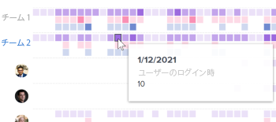

# Enhanced Analytics でのチーム別アクティビティのビジュアライゼーションの表示

<!-- Audited: 12/2023 -->

チーム別のアクティビティのビジュアライゼーションは、ホームチームの特定の期間に発生したアクティビティを表示し、異なるホームチームがAdobe Workfrontでどのように時間を費やしたかを理解できます。 このビジュアライゼーションは、Workfrontでのホームチームの設定に応じて、様々なインサイトを提供し、様々な質問に答えることができます。

>[!NOTE]
>
>プロジェクトアクティビティビジュアライゼーションは、このビジュアライゼーションに似ていますが、ホームチームに割り当てられた人ではなく、プロジェクトに割り当てられた人に基づくアクティビティを表示します。\
>プロジェクトアクティビティのビジュアライゼーションについて詳しくは、 [拡張分析でのプロジェクトアクティビティのビジュアライゼーションの表示](../enhanced-analytics/project-activity-overview.md).

{width="700"}

## アクセス要件

以下が必要です。

<table style="table-layout:auto"> 
 <col> 
 <col> 
 <tbody> 
  <tr> 
   <td role="rowheader"><a href="https://www.workfront.com/plans" target="_blank">Workfrontプラン</a></td> 
   <td> 
ビジネス以上
 </td> 
  </tr> 
  <tr> 
   <td role="rowheader"><a href="../administration-and-setup/add-users/access-levels-and-object-permissions/wf-licenses.md" class="MCXref xref">Adobe Workfrontライセンスの概要</a></td> 
   <td>
      
新規：
 
         <ul><li>明るいか高い</li></ul>
      
現在：

         <ul><li>レビュー以上</li></ul>
   </td> 
  </tr> 
  <tr> 
   <td role="rowheader">アクセスレベル設定</td> 
   <td> 
プロジェクトへのアクセスを表示
 <!--
Note: If you still don't have access, ask your Workfront administrator if they set additional restrictions in your access level. For information on how a Workfront administrator can change your access level, see <a href="../administration-and-setup/add-users/configure-and-grant-access/create-modify-access-levels.md" class="MCXref xref">Create or modify custom access levels</a>.
--> </td> 
  </tr> 
  <tr> 
   <td role="rowheader">オブジェクトの権限</td> 
   <td> 
表示
 <!--
For information on requesting additional access, see <a href="../workfront-basics/grant-and-request-access-to-objects/request-access.md" class="MCXref xref">Request access to objects </a>.
--> </td> 
  </tr> 
 </tbody> 
</table>

この表の情報の詳細については、 [Workfrontドキュメントのアクセス要件](/help/quicksilver/administration-and-setup/add-users/access-levels-and-object-permissions/access-level-requirements-in-documentation.md).

## 前提条件

拡張 Analytics を使用するための前提条件については、「前提条件」の節を参照してください。 [分析の概要の強化](../enhanced-analytics/enhanced-analytics-overview.md).

## チームごとのアクティビティのビジュアライゼーションについて

フィルタリングされた期間の特定のイベントを要約するために、様々なアクティビティが様々な色で表示されます。

* **ログインしたユーザー**：紫色のボックスは、その日にログインしたホームチームのユーザーを示します。 濃い色は、ログインしているユーザーの数が多いことを示します。

  

* **タスクステータスの変更**：ピンクのボックスは、ホームチームの人がその日のタスクのステータスを変更したことを示します。 濃い色は、変更されたタスクステータスの数が多いことを示します。

  

* **完了したタスク**：青いボックスは、ホームチームの人がその日にタスクを完了したことを示します。 濃い色は、完了したタスクの数が多いことを示します。

  

ボックスの上にマウスポインターを置くと、特定の日にアクションが完了した正確な回数が表示されます。 チームを選択して、ホームチームの各人によるこれらのアクティビティの分類を確認できます。

この情報を確認することで、次の項目を特定することができます。

* ホームチーム内で発生しているアクティビティと、その割合。
* 過剰な作業が行われているホームチームや、システムをより多く使用しているホームチーム。
* 作業の配分がホームチームに適しているか。

このビジュアライゼーションに最適なデータを取得する方法については、 [分析の概要の強化](../enhanced-analytics/enhanced-analytics-overview.md).

## チーム別アクティビティのビジュアライゼーションを表示

1. メインメニューアイコンをクリックします。 を選択し、「 **Analytics**.
1. 左のパネルで、「 」を選択します。 **People**.

   

1. （オプション）別の日付範囲を使用する場合は、日付範囲フィルターから新しい開始日と終了日を選択します。

   

   日付範囲フィルターの使用について詳しくは、 [拡張分析でのフィルターの適用](../enhanced-analytics/use-enhanced-analytics-filters.md).

1. （条件付き）チームフィルターを設定していない場合、チームフィルターを追加し、データを表示する各チームを選択します。

   Enhanced Analytics でのフィルターの追加について詳しくは、 [拡張分析でのフィルターの適用](../enhanced-analytics/use-enhanced-analytics-filters.md).

   フィルターを追加した後、最大 50 個のプロジェクトのデータが表示され、ページを離れたりWorkfrontからログアウトした後でもフィルターはアクティブなままになります。

1. （オプション）日付範囲を拡大するには、日付範囲の開始点としてビジュアライゼーション上の点を選択し、日付範囲の終わりまでドラッグします。

   その他のビジュアライゼーションはすべて、同じ日付範囲に更新され、期間フィルターが作成されます。

   

1. チーム名をクリック

   <!--
   <MadCap:conditionalText data-mc-conditions="QuicksilverOrClassic.Draft mode">
   or role
   </MadCap:conditionalText>
   -->

   ：ホームチームが完了したアクティビティの詳細を表示します。

   リストが展開され、ホームチームに割り当てられた各ユーザーのアクティビティが表示されます。

   <!--
    Role not available
   -->

1. 色付きのボックスの上にマウスポインターを置くと、ユーザーがアクションを完了した日付と、その日のアクションが完了した回数が表示されます。

   暗い色は、アクティビティが高いことを示します。

   

1. （オプション）ビジュアライゼーションデータを書き出すには、書き出しアイコン  ビジュアライゼーションの右上隅で、エクスポート形式を選択します。

   * **グラフ (PNG)**
   * **データテーブル (XSLX)**

