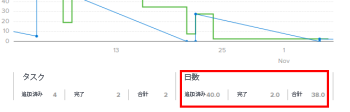
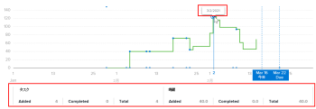

# 拡張分析でのバーンダウンビジュアライゼーションの表示

バーンダウンビジュアライゼーションは、特定のプロジェクトの時間の経過に伴うバーンダウンを示し、プロジェクトの状態、速度、残り時間（日数）間の関係を理解するのに役立ちます。

## アクセス要件

以下が必要です。

<table style="table-layout:auto"> 
 <col> 
 <col> 
 <tbody> 
  <tr> 
   <td role="rowheader"><a href="https://www.workfront.com/plans" target="_blank">Adobe Workfrontプラン</a>*</td> 
   <td> 
ビジネス以上
 </td> 
  </tr> 
  <tr> 
   <td role="rowheader"><a href="../administration-and-setup/add-users/access-levels-and-object-permissions/wf-licenses.md" class="MCXref xref">Adobe Workfrontライセンスの概要</a>*</td> 
   <td> 
レビュー以上
 </td> 
  </tr> 
  <tr> 
   <td role="rowheader">アクセスレベル設定*</td> 
   <td> 
プロジェクトへのアクセスを表示
 
注意：まだアクセス権がない場合は、Workfront管理者に、アクセスレベルに追加の制限を設定しているかどうかを問い合わせてください。 Workfront管理者がアクセスレベルを変更する方法について詳しくは、 <a href="../administration-and-setup/add-users/configure-and-grant-access/create-modify-access-levels.md" class="MCXref xref">カスタムアクセスレベルの作成または変更</a>.
 </td> 
  </tr> 
  <tr> 
   <td role="rowheader">オブジェクト権限</td> 
   <td> 
ビュー
 
追加のアクセス権のリクエストについて詳しくは、 <a href="../workfront-basics/grant-and-request-access-to-objects/request-access.md" class="MCXref xref">オブジェクトへのアクセスのリクエスト </a>.
 </td> 
  </tr> 
 </tbody> 
</table>

&#42;保有しているプラン、ライセンスの種類、アクセス権を確認するには、Workfront管理者に問い合わせてください。

## 前提条件

拡張 Analytics を使用するための前提条件については、 [分析の強化の概要](../enhanced-analytics/enhanced-analytics-overview.md).

## バーンダウンビジュアライゼーションの理解

青い実線は、開始日から計画完了日までの計画速度を示します。 作業が追加、削除、または更新されると、この線は調整され、プロジェクトが計画完了日に達すると、縦の破線に変わります。

実際の行には、時間の経過に伴うプロジェクトでの滞在時間（日数）が表示されます。 この線の色は、毎日のプロジェクトの状態を示します。

* **緑**:プロジェクトはターゲットになっています。

   

* **オレンジ**:その計画は危うい。

   

* **赤**:この計画は困難に陥っている。

   

これらのプロジェクト条件の詳細については、 [プロジェクト条件と条件タイプの概要](../manage-work/projects/manage-projects/project-condition-and-condition-type.md).

実際の線が垂直に上に移動すると、作業がプロジェクトに追加されます。 線が垂直に下に移動すると、プロジェクトの作業が削除または完了します。

ビジュアライゼーションの x 軸の下に、指定した日にタスクや時間（または日）がどのように変化したか（追加された金額、完了した金額、および 2 つの差）に関する詳細を表示できます。

バーンダウンビジュアライゼーションでこれらの情報をすべて表示すると、次の項目を判断できます。

* 時間の経過に伴う個々のプロジェクトの健全性
* 発生する問題（または計画外の作業）が計画作業に与えた影響。
* プロジェクトが元の完了日を過ぎて拡張されたイベント。

このビジュアライゼーションに最適なデータを取得する方法については、 [分析の強化の概要](../enhanced-analytics/enhanced-analytics-overview.md).

## バーンダウンビジュアライゼーションの表示

1. メインメニューアイコンをクリックします。 を選択し、「 **Analytics**.
1. （オプション）別の日付範囲を使用する場合は、日付範囲フィルターから新しい開始日と終了日を選択します。

   

   日付範囲フィルターの使用について詳しくは、 [拡張分析でのフィルターの適用](../enhanced-analytics/use-enhanced-analytics-filters.md).

1. （条件付き）プロジェクトデータセットを制限する必要がある場合は、使用するフィルタを選択して適用します。

   Enhanced Analytics でのフィルターの追加について詳しくは、 [拡張分析でのフィルターの適用](../enhanced-analytics/use-enhanced-analytics-filters.md).

   フィルターを追加した後、最大 50 個のプロジェクトのデータが表示され、ページを離れたりWorkfrontからログアウトした後でもフィルターはアクティブなままになります。

1. （オプション）日付範囲を拡大するには、日付範囲の開始点としてビジュアライゼーション上の点を選択し、日付範囲の終わりまでドラッグします。

   その他のビジュアライゼーションはすべて、同じ日付範囲に更新され、期間フィルターが作成されます。

   

1. フライトプランまたはプロジェクトツリーマップビジュアライゼーションで、プロジェクトをクリックして詳細を表示します。

   フライトビジュアライゼーションのバーンダウンとタスクが表示されます。

   >[!NOTE]
   >
   >これらの他のビジュアライゼーションについて詳しくは、次を参照してください。
   >
   >   
   >   
   >   * [Enhanced Analytics でのフライトプランビジュアライゼーションの表示](../enhanced-analytics/flight-plan-overview.md)
   >   * [拡張分析でのプロジェクトツリーマップビジュアライゼーションの表示](../enhanced-analytics/project-treemap-overview.md)
   >   * [Enhanced Analytics でのフライトビジュアライゼーションでのタスクの表示](../enhanced-analytics/tasks-in-flight-overview.md)

1. （オプション）予定時間からにビューを変更します。 **duration**.

   デフォルトでは、予定時間が選択されています。

   >[!NOTE]
   >
   >選択 **duration** すべての時間の情報を日に変更します。\
   >\
   >Enhanced 分析領域の期間について詳しくは、 [分析の強化の概要](../enhanced-analytics/enhanced-analytics-overview.md).

1. 折れ線グラフ上の任意の点をクリックします。

   選択した日の正確な日付と、タスクや時間（または日）に関する詳細情報が下に表示されます。

   

   >[!NOTE]
   >
   >実際の速度がビジュアライゼーションの X 軸（0 時間または 0 日間のインライン）に沿った平らな線である場合は、計画された時間（または日）はプロジェクトに追加されていませんでした。\
   >実際の速度が x 軸の上のフラットな線（時間数または日数を含むインライン）で下降しない場合、フィルタリングされた期間内にタスクが完了しなかったことを意味します。

1. （オプション）ビジュアライゼーションデータを書き出すには、 **書き出し** アイコン ビジュアライゼーションの右上隅で、エクスポート形式を選択します。

   * **グラフ (PNG)**
   * **データテーブル (XSLX)**

1. （オプション）選択したプロジェクトのタスクの進行状況に関する詳細を確認するには、バーンダウンビジュアライゼーションの下に表示されるフライト中のタスクビジュアライゼーションを確認します。
