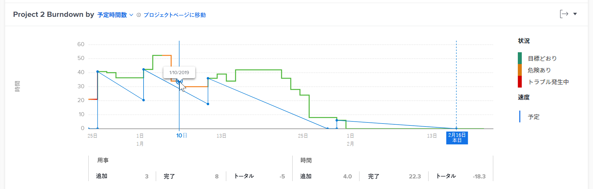

# 拡張分析でのバーンダウンビジュアライゼーションの表示

<!-- Audited: 12/2023 -->

バーンダウンビジュアライゼーションは、特定のプロジェクトのバーンダウンの推移を示し、プロジェクト状況、速度および残り時間（日数）の間の関係を理解するのに役立ちます。

## アクセス要件

この記事の手順を実行するには、次のアクセス権が必要です。

<table style="table-layout:auto"> 
 <col> 
 <col> 
 <tbody> 
  <tr> 
   <td role="rowheader">Adobe Workfront プラン</td> 
   <td>
      
新規：任意

      
または

      
現在：ビジネス以上
</td>
  </tr> 
  <tr> 
   <td role="rowheader">Adobe Workfront ライセンス</td> 
   <td>
      
新規：明るいかそれ以上

      
または

      
現在：レビュー以上

   </td> 
  </tr> 
  <tr> 
   <td role="rowheader">アクセスレベル設定</td> 
   <td> 
プロジェクトへの表示アクセス
 </td> 
  </tr> 
  <tr> 
   <td role="rowheader">オブジェクト権限</td> 
   <td> 
表示
 </td>
  </tr> 
 </tbody> 
</table>

この表の情報の詳細については、 [Workfrontドキュメントのアクセス要件](/help/quicksilver/administration-and-setup/add-users/access-levels-and-object-permissions/access-level-requirements-in-documentation.md).

## 前提条件

強化機能分析を使用するための前提条件については、[強化機能分析の概要](../enhanced-analytics/enhanced-analytics-overview.md)の「前提条件」の節を参照してください。

## バーンダウンビジュアライゼーションについて

青い実線は、開始日から予定完了日までの予定速度を示します。作業の追加、削除、更新に応じてこの線が調整され、プロジェクトが計画完了日に達すると、縦破線に変わります。

実線は、プロジェクトに費やした時間数（または日数）の推移を示します。この線の色は、毎日のプロジェクトの状況を示します。

* **緑**：プロジェクトが目標どおりであることを示します。

  

* **オレンジ**：プロジェクトが危険な状況にあることを示します。

  

* **赤**：プロジェクトにトラブルが発生していることを示します。

  

これらのプロジェクト状況について詳しくは、[プロジェクト状況と状況タイプの概要](../manage-work/projects/manage-projects/project-condition-and-condition-type.md)を参照してください。

作業がプロジェクトに追加されると、実線が垂直上方に移動します。プロジェクトの作業が削除されるか完了すると、実線が垂直下方に移動します。

ビジュアライゼーションの x 軸の下には、特定の日にタスクと時間数（または日数）がどのように変化したか（追加された量、完了した量およびこの 2 つの差）に関する詳細情報が表示されます。

バーンダウンビジュアライゼーションでこれらの情報をすべて表示すると、以下についての判断に役立ちます。

* 個々のプロジェクトの健全性の推移
* 発生する問題（または計画外の作業）が計画作業に与える影響
* 元の完了日を過ぎてプロジェクトを延長したイベント

このビジュアライゼーションに最適なデータを取得する方法については、[拡張分析の概要](../enhanced-analytics/enhanced-analytics-overview.md)を参照してください。

## バーンダウンビジュアライゼーションの表示

{{step1-to-analytics}}

1. （オプション）別の日付範囲を使用するには、日付範囲フィルターから新しい開始日と終了日を選択します。

   

   日付範囲フィルターの使用については、[拡張分析でのフィルターの適用](../enhanced-analytics/use-enhanced-analytics-filters.md)を参照してください。

1. （条件付き）プロジェクトデータセットを制限する必要がある場合は、使用するフィルターを選択して適用します。

   拡張分析でのフィルターの追加について詳しくは、[拡張分析でのフィルターの適用](../enhanced-analytics/use-enhanced-analytics-filters.md)を参照してください。

   フィルターを追加した後、最大 50 個のプロジェクトのデータが表示され、ページを離れたり Workfront からログアウトした後でもフィルターはアクティブの状態が維持されます。

1. （オプション）日付範囲を拡大するには、日付範囲の開始点となるビジュアライゼーション上のポイントを選択し、日付範囲の終わりまでドラッグします。

   その他のビジュアライゼーションはすべて同じ日付範囲に更新され、時間枠フィルターが自動的に作成されます。

   

1. フライトプランまたはプロジェクトツリーマップビジュアライゼーションで、プロジェクトをクリックして詳細情報を表示します。

   フライトビジュアライゼーションのバーンダウンとタスクが表示されます。

   >[!NOTE]
   >
   >これら他のビジュアライゼーションについて詳しくは、以下を参照してください。
   >
   >   * [拡張分析での進行計画ビジュアライゼーションの表示](../enhanced-analytics/flight-plan-overview.md)
   >   * [拡張分析でプロジェクトツリーマップビジュアライゼーションを表示](../enhanced-analytics/project-treemap-overview.md)
   >   * [拡張分析の「作業中のタスク」ビジュアライゼーションの確認](../enhanced-analytics/tasks-in-flight-overview.md)
   >

1. （オプション）表示を予定時間数から&#x200B;**期間**&#x200B;に変更します。

   予定時間数はデフォルトで選択されています。

   >[!NOTE]
   >
   >**期間**&#x200B;を選択すると、すべての時間数の情報を日数に変更します。\
   >\
   >拡張分析エリアの期間について詳しくは、[拡張分析の概要](../enhanced-analytics/enhanced-analytics-overview.md#duration-view)の期間ビューの節を参照してください。

1. 折れ線グラフ上の任意の点をクリックします。

   選択した日の正確な日付と、タスクおよび時間（または日）に関する詳細情報がグラフの下に表示されます。

   

   >[!NOTE]
   >
   >実際の速度がビジュアライゼーションの X 軸に沿った平坦な線（0 時間または 0 日間と一致）である場合は、予定時間数（または日数）はプロジェクトに追加されていなかったことを意味します。\
   >実際の速度が x 軸より上の平坦な線（ある時間数または日数と一致）であり下降しない場合は、フィルタリングされた期間に完了したタスクがなかったことを意味します。

1. （オプション）ビジュアライゼーションデータを書き出すには、 **書き出し** アイコン  ビジュアライゼーションの右上隅で、エクスポート形式を選択します。

   * グラフ (PNG)
   * データテーブル (XSLX)

1. （オプション）選択したプロジェクトのタスクの進行状況に関する詳細を確認するには、バーンダウンビジュアライゼーションの下に表示されるフライト中のタスクビジュアライゼーションを確認します。 詳しくは、 [Enhanced Analytics でのフライトビジュアライゼーションでのタスクの表示](/help/quicksilver/enhanced-analytics/tasks-in-flight-overview.md).
