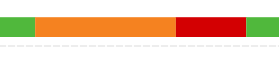
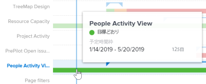

# Enhanced Analytics でのフライトプランビジュアライゼーションの表示

フライトプランビジュアライゼーションは、（適用されたフィルター条件内で）実行されたプロジェクトの数、これらのプロジェクトの期間中に発生した条件の変化、およびこれらのプロジェクトが計画完了期限にどの程度近づいているかを示します。

## アクセス要件

以下が必要です。

<table style="table-layout:auto"> 
 <col> 
 <col> 
 <tbody> 
  <tr> 
   <td role="rowheader"><a href="https://www.workfront.com/plans" target="_blank">Adobe Workfrontプラン</a>*</td> 
   <td> 
ビジネス以上
 </td> 
  </tr> 
  <tr> 
   <td role="rowheader"><a href="../administration-and-setup/add-users/access-levels-and-object-permissions/wf-licenses.md" class="MCXref xref">Adobe Workfrontライセンスの概要</a>*</td> 
   <td> 
レビュー以上
 </td> 
  </tr> 
  <tr> 
   <td role="rowheader">アクセスレベル設定*</td> 
   <td> 
プロジェクトへのアクセスを表示
 
注意：まだアクセス権がない場合は、Workfront管理者に、アクセスレベルに追加の制限を設定しているかどうかを問い合わせてください。 Workfront管理者がアクセスレベルを変更する方法について詳しくは、 <a href="../administration-and-setup/add-users/configure-and-grant-access/create-modify-access-levels.md" class="MCXref xref">カスタムアクセスレベルの作成または変更</a>.
 </td> 
  </tr> 
  <tr> 
   <td role="rowheader">オブジェクト権限</td> 
   <td> 
プロジェクトへのアクセスを表示
 
追加のアクセス権のリクエストについて詳しくは、 <a href="../workfront-basics/grant-and-request-access-to-objects/request-access.md" class="MCXref xref">オブジェクトへのアクセスのリクエスト </a>.
 </td> 
  </tr> 
 </tbody> 
</table>

&#42;保有しているプラン、ライセンスの種類、アクセス権を確認するには、Workfront管理者に問い合わせてください。

## 前提条件

拡張 Analytics を使用するための前提条件については、 [分析の強化の概要](../enhanced-analytics/enhanced-analytics-overview.md).

## フライトプランビジュアライゼーションについて

プロジェクトの実際の期間には、次のプロジェクト条件のみが表示されます。

* 目標どおり
* リスクあり
* トラブル発生中

プロジェクト条件について詳しくは、 [プロジェクト条件と条件タイプの概要](../manage-work/projects/manage-projects/project-condition-and-condition-type.md).

フライトプランビジュアライゼーションには、次のプロジェクトの詳細が表示されます。

* **計画期間**:青い横線はプロジェクトの計画長を表し、線の両端に三角形が表示され、開始日と終了日が示されます。

   

* **実際の期間**:計画期間の下の太い色付きの線は、プロジェクトの実際の長さを表します。 線の色は、プロジェクトの生活中の特定の時間におけるプロジェクトの条件に応じて変化します。

   

* **実際の条件**:太い色付きの線は、異なる時点でのプロジェクトの状態も示します。 線の色は、プロジェクトの条件に応じて変化します。

   * **緑**:ターゲット時
   * **オレンジ**:リスク
   * **赤**:トラブル状態

   

フライトプランビジュアライゼーションのプロジェクト行の上にマウスポインターを置くと、プロジェクトの計画期間、現在のプロジェクト条件、および該当する場合はカスタム条件に関する情報を確認できます。 期間や条件に影響を与えた可能性のある内容について詳しくは、「拡張分析」領域の他のビジュアライゼーションを参照してください。

この情報を表示すると、次の項目を特定するのに役立ちます。

* 元の計画完了日を過ぎたプロジェクトを延長するイベント。
* プロジェクトで問題が発生し始めたとき。
* 同じ期間に開かれているプロジェクトの数。
* アクティブなプロジェクトの数。
* 特別な注意やサポートを必要とするプロジェクト。

このビジュアライゼーションに最適なデータを取得する方法について詳しくは、 [分析の強化の概要](../enhanced-analytics/enhanced-analytics-overview.md).

## フライトプランビジュアライゼーションを表示

1. 次をクリック： **メインメニュー** アイコン を選択し、「 **Analytics**.
1. （オプション）別の日付範囲を使用する場合は、日付範囲フィルターから新しい開始日と終了日を選択します。

   

   日付範囲フィルターの使用について詳しくは、 [拡張分析でのフィルターの適用](../enhanced-analytics/use-enhanced-analytics-filters.md).

1. （条件付き）プロジェクトデータセットを制限する必要がある場合は、使用するフィルタを選択して適用します。

   Enhanced Analytics でのフィルターの追加について詳しくは、 [拡張分析でのフィルターの適用](../enhanced-analytics/use-enhanced-analytics-filters.md).

   フィルターを追加した後、最大 50 個のプロジェクトのデータが表示され、ページを離れたりWorkfrontからログアウトした後でもフィルターはアクティブなままになります。

1. （オプション）日付範囲を拡大するには、日付範囲の開始点としてビジュアライゼーション上の点を選択し、日付範囲の終わりまでドラッグします。

   その他のビジュアライゼーションはすべて、同じ日付範囲に更新され、期間フィルターが作成されます。

   

1. （オプション）プロジェクトの並べ替え方法を変更するには、 **並べ替え基準** フライトプランビジュアライゼーションの右上隅にあるメニューで、新しい並べ替えオプションを選択します。

   * **A - Z**
   * **Z - A**
   * **完了予定日**
   * **予定開始日**

   ページ上のその他すべてのビジュアライゼーションは、並べ替えの選択に合わせて更新されます。

1. （条件付き）データセットに 50 個を超えるプロジェクトがある場合、ビジュアライゼーションの左下隅にある矢印を使用して、50 個のプロジェクトの 1 つのグループから次のグループに移動します。

   ページ上のその他すべてのビジュアライゼーションは、ページの選択に合わせて更新されます。

   

1. プロジェクトバーグラフの上にマウスポインターを置くと、青い日付線と、次の詳細が表示されます。

   * 計画されたタイムライン
   * 現在の条件
   * カスタム条件（該当する場合）

   

1. （オプション）ビジュアライゼーションデータを書き出すには、 **書き出し** アイコン  ビジュアライゼーションの右上隅で、エクスポート形式を選択します。

   * **グラフ (PNG)**
   * **データテーブル (XSLX)**

1. その他のプロジェクト情報を表示するには、ビジュアライゼーション上のプロジェクトをクリックして、フライトビジュアライゼーションのバーンダウンとタスクを開きます。

   これらのビジュアライゼーションは、プロジェクトが何を追跡したかに関する深いインサイトを得るのに役立ちます。 また、進行中のプロジェクトを簡単にチェックインできます。\
   バーンダウンビジュアライゼーションについて詳しくは、 [拡張分析でのバーンダウンビジュアライゼーションの表示](../enhanced-analytics/burndown-overview.md). フライトビジュアライゼーションのタスクについて詳しくは、 [Enhanced Analytics でのフライトビジュアライゼーションでのタスクの表示](../enhanced-analytics/tasks-in-flight-overview.md).

