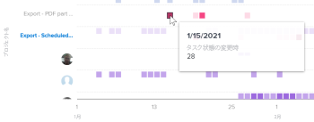

# 拡張分析でのプロジェクトアクティビティのビジュアライゼーションの表示

<!-- Audited: 12/2023 -->

プロジェクトアクティビティビジュアライゼーションは、特定の期間に発生した、プロジェクトレベルのアクティビティ（プロジェクトに割り当てられた各人のアクティビティ）の集計ビューを表示します。 フォーカスを絞り込んでプロジェクト内のアクティビティを理解したり、プロジェクトアクティビティをAdobe Workfrontの他のプロジェクトと比較したりできます。

>[!NOTE]
>
>チーム別のアクティビティビジュアライゼーションは、このビジュアライゼーションと同じように動作しますが、チーム別のアクティビティビジュアライゼーションには、すべてのプロジェクトのホームチームアクティビティが表示されます。\
>チーム別アクティビティのビジュアライゼーションについて詳しくは、 [Enhanced Analytics でのチーム別アクティビティのビジュアライゼーションの表示](../enhanced-analytics/activity-by-team-overview.md).

## アクセス要件

以下が必要です。

<table style="table-layout:auto"> 
 <col> 
 <col> 
 <tbody> 
  <tr> 
   <td role="rowheader"><a href="https://www.workfront.com/plans" target="_blank">Workfrontプラン</a></td> 
   <td> 
ビジネス以上
 </td> 
  </tr> 
  <tr> 
   <td role="rowheader"><a href="../administration-and-setup/add-users/access-levels-and-object-permissions/wf-licenses.md" class="MCXref xref">Adobe Workfrontライセンスの概要</a></td> 
   <td>   
新規：
 
   <ul><li>明るいか高い</li></ul>
   
現在：

   <ul><li>レビュー以上</li></ul>
 </td> 
  </tr> 
  <tr> 
   <td role="rowheader">アクセスレベル設定</td> 
   <td> 
プロジェクトへのアクセスを表示
 <!--
Note: If you still don't have access, ask your Workfront administrator if they set additional restrictions in your access level. For information on how a Workfront administrator can change your access level, see <a href="../administration-and-setup/add-users/configure-and-grant-access/create-modify-access-levels.md" class="MCXref xref">Create or modify custom access levels</a>.
--> </td> 
  </tr> 
  <tr> 
   <td role="rowheader">オブジェクトの権限</td> 
   <td> 
表示
 <!--
For information on requesting additional access, see <a href="../workfront-basics/grant-and-request-access-to-objects/request-access.md" class="MCXref xref">Request access to objects </a>.
--> </td> 
  </tr> 
 </tbody> 
</table>

この表の情報の詳細については、 [Workfrontドキュメントのアクセス要件](/help/quicksilver/administration-and-setup/add-users/access-levels-and-object-permissions/access-level-requirements-in-documentation.md).

## 前提条件

拡張 Analytics を使用するための前提条件については、「前提条件」の節を参照してください。 [分析の概要の強化](../enhanced-analytics/enhanced-analytics-overview.md).

## プロジェクトアクティビティのビジュアライゼーションについて

プロジェクトアクティビティは様々な色で表示され、一定期間にプロジェクト内の特定のイベントを要約します。

* **ログインしたユーザー**：紫色のボックスは、その日にログインしたプロジェクトに割り当てられたユーザーを示します。 濃い色は、ログインしているユーザーの数が多いことを示します。

  

* **タスクステータスの変更**：ピンク色のボックスは、その日にユーザーがプロジェクトのタスクのステータスを変更したことを示しています。 濃い色は、変更されたタスクステータスの数が多いことを示します。

  

* **完了したタスク**：青いボックスは、ユーザーがプロジェクトのタスクを完了したことを示します。 濃い色は、完了したタスクの数が多いことを示します。

  

ボックスの上にマウスポインターを置くと、特定の日にアクションが完了した正確な回数が表示されます。 プロジェクトを選択して、プロジェクトの個々の投稿者によるこれらのアクティビティの分類を表示できます。

この情報を確認することで、次の項目を特定するのに役立ちます。

* 特定のプロジェクトのアクティビティ。
* 他のプロジェクトと比較した、あるプロジェクトのアクティビティ。
* プロジェクトで作業しているユーザーと作業頻度。

このビジュアライゼーションに最適なデータを取得する方法については、 [分析の概要の強化](../enhanced-analytics/enhanced-analytics-overview.md).

## プロジェクトアクティビティのビジュアライゼーションを表示

1. メインメニューアイコンをクリックします。 を選択し、「 **Analytics**.
1. （オプション）別の日付範囲を使用する場合は、日付範囲フィルターから新しい開始日と終了日を選択します。

   

   日付範囲フィルターの使用について詳しくは、 [拡張分析でのフィルターの適用](../enhanced-analytics/use-enhanced-analytics-filters.md).

   >[!NOTE]
   >
   >3 ヶ月を超える期間に対して日付範囲を選択した場合、プロジェクトアクティビティのビジュアライゼーションにはデータが表示されません。

1. （条件付き）プロジェクトデータセットを制限する必要がある場合は、使用するフィルタを選択して適用します。

   Enhanced Analytics でのフィルターの追加について詳しくは、 [拡張分析でのフィルターの適用](../enhanced-analytics/use-enhanced-analytics-filters.md).

   フィルターを追加した後、最大 50 個のプロジェクトのデータが表示され、ページを離れたりWorkfrontからログアウトした後でもフィルターはアクティブなままになります。

1. （オプション）日付範囲を拡大するには、日付範囲の開始点としてビジュアライゼーション上の点を選択し、日付範囲の終わりまでドラッグします。

   その他のビジュアライゼーションはすべて、同じ日付範囲に更新され、期間フィルターが作成されます。

   

1. （オプション）プロジェクトの並べ替え方法を変更するには、 **並べ替え基準** メニューで、新しい並べ替えオプションを選択します。

   * **A ～ Z**
   * **Z - A**
   * **計画完了日**
   * **計画開始日**

   ページ上のその他すべてのビジュアライゼーションは、並べ替えの選択に合わせて更新されます。

1. （条件付き）データセットに 50 個を超えるプロジェクトがある場合、ビジュアライゼーションの左下隅にある矢印を使用して、50 個のプロジェクトの 1 つのグループから次のグループに移動します。

   ページ上のその他すべてのビジュアライゼーションは、ページの選択に合わせて更新されます。

   

1. ビジュアライゼーションのプロジェクトをクリックして、プロジェクトの詳細を表示します。

   リストが展開し、プロジェクトの個々の投稿者のアクティビティが表示されます。

1. ボックスにマウスポインターを置くと、ユーザーがアクションを完了した日付と、その日のアクションが完了した回数が表示されます。

   

1. （オプション）ビジュアライゼーションデータを書き出すには、 **書き出しアイコン**  ビジュアライゼーションの右上隅で、エクスポート形式を選択します。

   * **グラフ (PNG)**
   * **データテーブル (XSLX)**

