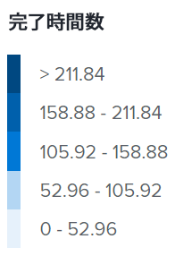
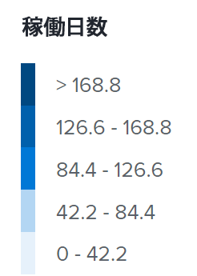
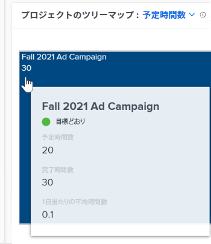
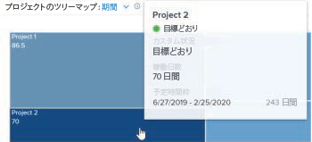

# 強化機能分析でプロジェクトツリーマップビジュアライゼーションを表示

<!-- Audited: 12/2023 -->

プロジェクトツリーマップビジュアライゼーションは、特定の時間枠内での作業時間（または日数）を他の作業量と比較して表示するものです。これは、ユーザーがプロジェクトにどれだけの時間を費やしたかを把握するのに役立ちます。

{width="700"}

## アクセス要件

以下が必要です。

<table style="table-layout:auto"> 
 <col> 
 <col> 
 <tbody> 
  <tr> 
   <td role="rowheader"><a href="https://www.workfront.com/plans" target="_blank">Adobe Workfront プラン</a></td> 
   <td> 
ビジネス以上
 </td> 
  </tr> 
  <tr> 
   <td role="rowheader"><a href="../administration-and-setup/add-users/access-levels-and-object-permissions/wf-licenses.md" class="MCXref xref">Adobe Workfrontライセンスの概要</a></td> 
   <td>   
新規：
 
   <ul><li>明るいか高い</li></ul>
   
現在：

   <ul><li>レビュー以上</li></ul>
 </td> 
  </tr> 
  <tr> 
   <td role="rowheader">アクセスレベル設定</td> 
   <td> 
プロジェクトへの表示アクセス
 <!--
Note: If you still don't have access, ask your Workfront administrator if they set additional restrictions in your access level. For information on how a Workfront administrator can change your access level, see <a href="../administration-and-setup/add-users/configure-and-grant-access/create-modify-access-levels.md" class="MCXref xref">Create or modify custom access levels</a>.
--> </td> 
  </tr> 
  <tr> 
   <td role="rowheader">オブジェクト権限</td> 
   <td> 
表示
 <!--
For information on requesting additional access, see <a href="../workfront-basics/grant-and-request-access-to-objects/request-access.md" class="MCXref xref">Request access to objects </a>.
--> </td> 
  </tr> 
 </tbody> 
</table>

この表の情報の詳細については、 [Workfrontドキュメントのアクセス要件](/help/quicksilver/administration-and-setup/add-users/access-levels-and-object-permissions/access-level-requirements-in-documentation.md).

## 前提条件

強化機能分析を使用するための前提条件については、[強化機能分析の概要](../enhanced-analytics/enhanced-analytics-overview.md)の「前提条件」の節を参照してください。

## プロジェクトのツリーマップビジュアライゼーションについて

プロジェクトツリーマップビジュアライゼーションのボックスはプロジェクトを表し、ボックスのサイズは様々なプロジェクトに費やされた時間の比較を示します。ボックスが大きいほど、プロジェクトに費やす時間が長くなります。

プロジェクトツリーマップビジュアライゼーションは以下で構成されます。

* **小さな水色のボックス**：時間数または日数が少ないプロジェクトは、水色の小さなボックスとして表示されます。

  

* **大きな濃い青色のボックス**：時間や日数が長いプロジェクトは、濃い青色の大きなボックスで表示されます。

  

* **中型の青いボックス**：2 つのカテゴリの間にあるプロジェクトは、濃い青と水色の間の青の色合いの中型のボックスとして表示されます。中型のボックスには 3 つの青の色合いがあります。

右側の凡例は、青の色合いごとに完了した時間の内訳を示しています。この凡例は動的であり、データに従って更新されます。

>[!NOTE]
>
>予定時間数別ではなく期間別にプロジェクトツリーマップビジュアライゼーションを表示している場合、この凡例には青色の色合いごとに作業日数の内訳が表示されます。\
>>

この情報は、以下を判断するうえで役に立ちます。

* 選択した日付範囲内で作業中の項目の優先度。
* チームが何に時間を費やしているのか。
* チームが正しいことに焦点を当てているかどうか。
* 特定のプロジェクトをクリックすると、その期間にわたってプロジェクトの範囲がどの程度変化したか。

このビジュアライゼーションに最適なデータを取得する方法については、[強化機能分析の概要](../enhanced-analytics/enhanced-analytics-overview.md)を参照してください。

## プロジェクトツリーマップビジュアライゼーションの表示

1. メインメニューアイコン  をクリックし、「**分析**」を選択します。
1. （オプション）別の日付範囲を使用するには、日付範囲フィルターから新しい開始日と終了日を選択します。

   

   日付範囲フィルターの使用については、[拡張分析でのフィルターの適用](../enhanced-analytics/use-enhanced-analytics-filters.md)を参照してください。

1. （条件付き）プロジェクトデータセットを制限する必要がある場合は、使用するフィルターを選択して適用します。

   拡張分析でのフィルターの追加について詳しくは、[拡張分析でのフィルターの適用](../enhanced-analytics/use-enhanced-analytics-filters.md)を参照してください。

   フィルターを追加した後、最大 50 個のプロジェクトのデータが表示され、ページを離れたり Workfront からログアウトした後でもフィルターはアクティブの状態が維持されます。

1. （オプション）プロジェクトの並べ替え方法を変更するには、プロジェクトツリーマップビジュアライゼーションの右上隅にある&#x200B;**並べ替え**&#x200B;メニューをクリックし、新しい並べ替えオプションを選択します。

   * **A - Z**
   * **Z - A**
   * **完了予定日**
   * **予定開始日**

   ページ上の他のすべてのビジュアライゼーションは、並べ替えの選択に合わせて更新されます。

1. （条件付き）データセット内に 50 を超えるプロジェクトがある場合は、ビジュアリゼーションの左下隅にある矢印を使用すると、50 プロジェクトから成る 1 つのグループから次のグループに移動できます。

   ページ上の他のすべてのビジュアライゼーションは、ページの選択に合わせて更新されます。

   

1. （オプション）ビューを&#x200B;**予定時間数**&#x200B;から&#x200B;**期間**&#x200B;に変更します。

   予定時間数はデフォルトで選択されています。

1. プロジェクトにポインタを合わせると、プロジェクト状況、合計予定時間数、合計完了時間数およびプロジェクトに費やした 1 日あたりの平均時間数が表示されます。

   

   >[!NOTE]
   >
   >**期間**&#x200B;ビューを選択した場合は、期間の下記の詳細が表示されます。
   >
   >* **予定時間枠**：プロジェクトを完了するために予定されている日数。
   >* **稼働日数**：上部で選択した日付範囲内に完了した各タスクの予定期間を 1 日の時間数で割ったものです。
   >   
   >
   >
   >期間について詳しくは、[拡張分析の概要](../enhanced-analytics/enhanced-analytics-overview.md)の「期間ビュー」節を参照してください。

1. （オプション）ビジュアライゼーションデータを書き出すには、ビジュアライゼーションの右上隅にある&#x200B;**書き出しアイコン**  をクリックしたあと、書き出し形式を選択します。

   * **グラフ（PNG）**
   * **データテーブル (XLSX)**

1. プロジェクトをクリックすると、バーンダウンとタスクがフライトビジュアライゼーションで開かれ、タスクと時間数（または日数）がプロジェクトのサイズに与えた影響に関して、より深いインサイトを得ることができます。

バーンダウンビジュアライゼーションについて詳しくは、[拡張分析におけるバーンダウンビジュアライゼーションの表示](../enhanced-analytics/burndown-overview.md)を参照してください。フライトビジュアライゼーションのタスクについて詳しくは、[拡張分析におけるフライトビジュアライゼーションのタスクの表示](../enhanced-analytics/tasks-in-flight-overview.md)を参照してください。

