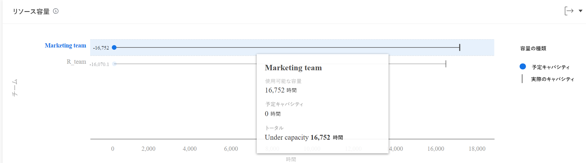
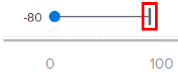
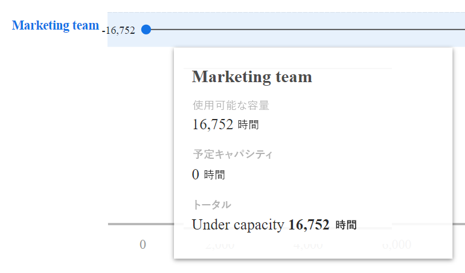

# 拡張分析でのリソース容量ビジュアライゼーションの表示

「生産資源生産能力」ビジュアライゼーションでは、チームの生産能力が超過したか、不足していたか、または生産能力であるかが表示されます。

## アクセス要件

以下が必要です。

<table style="table-layout:auto"> 
 <col> 
 <col> 
 <tbody> 
  <tr> 
   <td role="rowheader"><a href="https://www.workfront.com/plans" target="_blank">Adobe Workfrontプラン</a>*</td> 
   <td> 
ビジネス以上
 </td> 
  </tr> 
  <tr> 
   <td role="rowheader"><a href="../administration-and-setup/add-users/access-levels-and-object-permissions/wf-licenses.md" class="MCXref xref">Adobe Workfrontライセンスの概要</a>*</td> 
   <td> 
レビュー以上
 </td> 
  </tr> 
  <tr> 
   <td role="rowheader">アクセスレベル設定*</td> 
   <td> 
プロジェクトへのアクセスを表示
 
注意：まだアクセス権がない場合は、Workfront管理者に、アクセスレベルに追加の制限を設定しているかどうかを問い合わせてください。 Workfront管理者がアクセスレベルを変更する方法について詳しくは、 <a href="../administration-and-setup/add-users/configure-and-grant-access/create-modify-access-levels.md" class="MCXref xref">カスタムアクセスレベルの作成または変更</a>.
 </td> 
  </tr> 
  <tr> 
   <td role="rowheader">オブジェクト権限</td> 
   <td> 
ビュー
 
追加のアクセス権のリクエストについて詳しくは、 <a href="../workfront-basics/grant-and-request-access-to-objects/request-access.md" class="MCXref xref">オブジェクトへのアクセスのリクエスト </a>.
 </td> 
  </tr> 
 </tbody> 
</table>

&#42;保有しているプラン、ライセンスの種類、アクセス権を確認するには、Workfront管理者に問い合わせてください。

## 前提条件

拡張 Analytics を使用するための前提条件については、 [分析の強化の概要](../enhanced-analytics/enhanced-analytics-overview.md).

## リソース容量のビジュアライゼーションについて

「生産資源生産能力」ビジュアライゼーションでは、チームの生産能力が超過したか、不足していたか、または生産能力であるかが表示されます。 この計算は次の項目に基づいておこなわれます。

* **使用可能な容量**:ホームチームがフィルタリングされた期間に作業できる合計時間

   >[!NOTE]
   >
   >将来の期間を調べると、使用可能な容量は過去 7 日間のチームの能力に基づいて計算されます。 このため、スケジュールされた PTO は考慮されません。

* **計画能力**:フィルターを適用した期間にホームチームから予想される予定作業時間の合計

ホームチームの予定時間と実際の予定時間をこの比較で比較すると、十分な作業をホームチームに割り当てていないか、または大量の作業負荷からの燃え尽きを経験しているかを判断するのに役立ちます。

「生産資源生産能力」ビジュアライゼーションには、次の詳細が表示されます。

* **計画能力**:ホームチーム名をインラインで指定すると、青い円はホームチームに割り当てられた予定時間数を表します。

   

* **実際の容量**:ホームチーム名をインラインで指定する場合、縦線はホームチームが使用できる時間数を表します。

   

* **容量超過**:縦線の右側に横線と青い円が表示されると、ホームチームは、使用可能な時間数で完了できる以上の作業を割り当てられました。 つまり、フィルターを適用した期間でチームが容量を超えている可能性があります。 チームが完了する必要がある残り時間数が青い円の右側に表示されます。

   

* **容量不足**:縦線の左側に横線と青い円が表示されると、ホームチームは割り当てられた予定作業時間よりも時間が長くなります。 つまり、フィルターを適用した期間でチームの処理能力が低下している可能性があります。 ホームチームが作業を完了するのに使用できる時間の追加数が、青い円の左側に表示されます。

   

行の上にマウスポインターを置くと、計画済み容量と使用可能容量の正確な時間数、およびホームチームが処理能力を超えている、または不足している時間数が表示されます。

この情報を表示すると、次の項目を特定するのに役立ちます。

* ホームチームが割り当て超過または割り当て超過の場合。
* 最大のプロジェクトは、ホームチームが注目していたものでした。
* どのホームチームが仕事に利用できるか。

このビジュアライゼーションに最適なデータを取得する方法については、 [分析の強化の概要](../enhanced-analytics/enhanced-analytics-overview.md).

## リソース処理能力ビジュアライゼーションの表示

1. メインメニューアイコンをクリックします。 を選択し、「 **Analytics**.
1. 左のパネルで、「 」を選択します。 **人**.

   

1. （オプション）別の日付範囲を使用する場合は、日付範囲フィルターから新しい開始日と終了日を選択します。

   

   日付範囲フィルターの使用について詳しくは、 [拡張分析でのフィルターの適用](../enhanced-analytics/use-enhanced-analytics-filters.md).

1. （条件付き）チームフィルターを設定していない場合、チームフィルターを追加し、データを表示する各チームを選択します。

   Enhanced Analytics でのフィルターの追加について詳しくは、 [拡張分析でのフィルターの適用](../enhanced-analytics/use-enhanced-analytics-filters.md).

   フィルターを追加した後、最大 50 個のプロジェクトのデータが表示され、ページを離れたりWorkfrontからログアウトした後でもフィルターはアクティブなままになります。

1. （オプション）日付範囲を拡大するには、日付範囲の開始点としてビジュアライゼーション上の点を選択し、日付範囲の終わりまでドラッグします。

   その他のビジュアライゼーションはすべて、同じ日付範囲に更新され、期間フィルターが作成されます。

   

1. ホームチームの行にカーソルを合わせて、まだスケジュール可能な時間数、ホームチームが完了する予定の時間数、および合計作業時間数（超過、未満、または容量でのラベル付け）を確認します。

   

1. （オプション）ビジュアライゼーションデータを書き出すには、 **書き出しアイコン**  ビジュアライゼーションの右上隅で、エクスポート形式を選択します。

   * **グラフ (PNG)**
   * **データテーブル (XSLX)**

1. ホームチーム名をクリックすると、チームの能力ビジュアライゼーションの詳細が表示されます。

   チームの容量のビジュアライゼーションの詳細については、 [拡張分析でのチーム容量ビジュアライゼーションの表示](../enhanced-analytics/team-capacity-overview.md).

