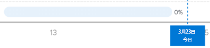
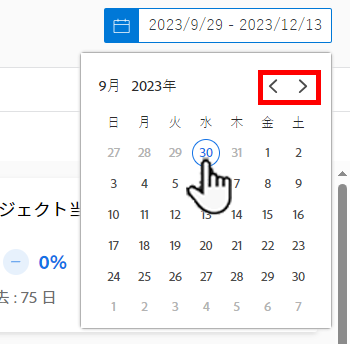
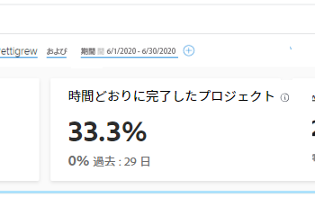
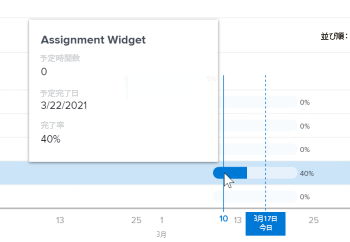
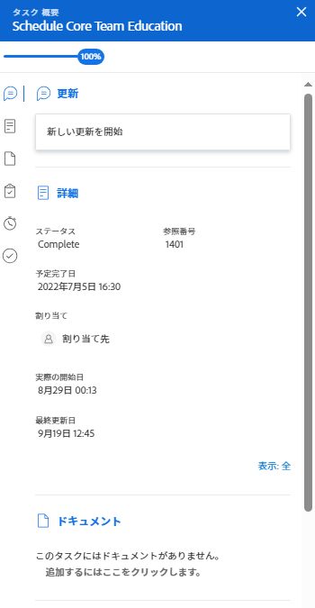

# Enhanced Analytics でのフライトビジュアライゼーションでのタスクの表示

Tasks in flight ビジュアライゼーションは、プロジェクトで進行中のタスク数（適用されたフィルタ条件内）、各タスクの完了作業の割合、およびタスクのスケジュールを表示します。

## アクセス要件

以下が必要です。

<table style="table-layout:auto"> 
 <col> 
 <col> 
 <tbody> 
  <tr> 
   <td role="rowheader"><a href="https://www.workfront.com/plans" target="_blank">Adobe Workfrontプラン</a>*</td> 
   <td> 
ビジネス以上
 </td> 
  </tr> 
  <tr> 
   <td role="rowheader"><a href="../administration-and-setup/add-users/access-levels-and-object-permissions/wf-licenses.md" class="MCXref xref">Adobe Workfrontライセンスの概要</a>*</td> 
   <td> 
レビュー以上
 </td> 
  </tr> 
  <tr> 
   <td role="rowheader">アクセスレベル設定*</td> 
   <td> 
プロジェクトへのアクセスを表示
 
タスクへのアクセス権を表示（タスクを更新するには、タスクへのアクセス権を編集する必要があります）
 
注意：まだアクセス権がない場合は、Workfront管理者に、アクセスレベルに追加の制限を設定しているかどうかを問い合わせてください。 Workfront管理者がアクセスレベルを変更する方法について詳しくは、 <a href="../administration-and-setup/add-users/configure-and-grant-access/create-modify-access-levels.md" class="MCXref xref">カスタムアクセスレベルの作成または変更</a>.
 </td> 
  </tr> 
  <tr> 
   <td role="rowheader">オブジェクト権限</td> 
   <td> 
プロジェクトオブジェクトとタスクオブジェクトの両方に対する権限を表示します
 
追加のアクセス権のリクエストについて詳しくは、 <a href="../workfront-basics/grant-and-request-access-to-objects/request-access.md" class="MCXref xref">オブジェクトへのアクセスのリクエスト </a>.
 </td> 
  </tr> 
 </tbody> 
</table>

&#42;保有しているプラン、ライセンスの種類、アクセス権を確認するには、Workfront管理者に問い合わせてください。

## 前提条件

拡張 Analytics を使用するための前提条件については、 [分析の強化の概要](../enhanced-analytics/enhanced-analytics-overview.md).

## フライトビジュアライゼーションのタスクについて

フライトプランのタスクビジュアライゼーションには、次のタスクの詳細が表示されます。

* **計画タスクの期間**:タスクバーの長さは、タスクの開始日と完了日に基づく計画期間を示します。

   

* **作業作業が完了しました**:タスクバー内の濃い青色は、タスクの完了作業時間を示します。 この完了率は、タスクバーの右側に表示されます。

   

* **残り作業量**:タスクバー内の明るい青色は、タスクの完了に必要な作業量を示します。

   

この情報は、次の項目を判断する際に役立ちます。

* 仕事の取り組みが焦点を当てている場所
* プロジェクトのリスクを招く可能性のあるタスク。
* タスクが完了するまでにどの程度近いかを示します。
* 特定のタスクについて話す必要があるユーザー。

このビジュアライゼーションに最適なデータを取得する方法については、 [分析の強化の概要](../enhanced-analytics/enhanced-analytics-overview.md).

## タスクをフライトビジュアライゼーションで表示

1. メインメニューアイコンをクリックします。 を選択し、「 **Analytics**.
1. （オプション）別の日付範囲を使用する場合は、日付範囲フィルターから新しい開始日と終了日を選択します。

   

   日付範囲フィルターの使用について詳しくは、 [拡張分析でのフィルターの適用](../enhanced-analytics/use-enhanced-analytics-filters.md).

1. （条件付き）プロジェクトデータセットを制限する必要がある場合は、使用するフィルタを選択して適用します。

   Enhanced Analytics でのフィルターの追加について詳しくは、 [拡張分析でのフィルターの適用](../enhanced-analytics/use-enhanced-analytics-filters.md).

   フィルターを追加した後、最大 50 個のプロジェクトのデータが表示され、ページを離れたりWorkfrontからログアウトした後でもフィルターはアクティブなままになります。

1. フライトプランまたはプロジェクトツリーマップビジュアライゼーションで、プロジェクトをクリックして詳細を表示します。

   フライトビジュアライゼーションのバーンダウンとタスクが表示されます。

   >[!NOTE]
   >
   >これらの他のビジュアライゼーションについて詳しくは、次を参照してください。
   >
   >   
   >   
   >   * [Enhanced Analytics でのフライトプランビジュアライゼーションの表示](../enhanced-analytics/flight-plan-overview.md)
   >   * [拡張分析でのプロジェクトツリーマップビジュアライゼーションの表示](../enhanced-analytics/project-treemap-overview.md)
   >   * [拡張分析でのバーンダウンビジュアライゼーションの表示](../enhanced-analytics/burndown-overview.md)

1. （オプション）日付範囲を拡大するには、日付範囲の開始点としてビジュアライゼーション上の点を選択し、日付範囲の終わりまでドラッグします。

   その他のビジュアライゼーションはすべて、同じ日付範囲に更新され、期間フィルターが作成されます。

   

1. （オプション）タスクの並べ替え方法を変更するには、 **並べ替え基準** メニューで、新しい並べ替えオプションを選択します。

   * **完了日**
   * **昇順 （A-Z)**
   * **作業の分類構造** （このオプションは、プロジェクトでのタスクの表示順に一致します）。

   ページ上のその他すべてのビジュアライゼーションは、並べ替えの選択に合わせて更新されます。

1. 選択したプロジェクトのタスクの進捗状況を確認し、特定のタスクの上にマウスポインターを置いて、予定時間数、予定期限、完了率を確認します。

   

1. タスクをクリックして、画面の右側にタスクの詳細を開き、タスクの詳細情報の表示、更新の表示、入力、タスクの変更を行うことができます。

   

1. （オプション）ビジュアライゼーションデータを書き出すには、 **書き出しアイコン**  ビジュアライゼーションの右上隅で、エクスポート形式を選択します。

   * **グラフ (PNG)**
   * **データテーブル (XSLX)**

