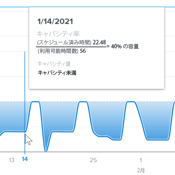

# 拡張分析でのチーム容量ビジュアライゼーションの表示

チーム容量ビジュアライゼーションは、ホームチームが持つ総容量、過剰割り当て済みか未割り当てか、および時間の経過に伴う容量の動的さを示します。

## アクセス要件

以下が必要です。

<table style="table-layout:auto"> 
 <col> 
 <col> 
 <tbody> 
  <tr> 
   <td role="rowheader"><a href="https://www.workfront.com/plans" target="_blank">Adobe Workfrontプラン</a>*</td> 
   <td> 
ビジネス以上
 </td> 
  </tr> 
  <tr> 
   <td role="rowheader"><a href="../administration-and-setup/add-users/access-levels-and-object-permissions/wf-licenses.md" class="MCXref xref">Adobe Workfrontライセンスの概要</a>*</td> 
   <td> 
レビュー以上
 </td> 
  </tr> 
  <tr> 
   <td role="rowheader">アクセスレベル設定*</td> 
   <td> 
プロジェクトへのアクセスを表示
 
注意：まだアクセス権がない場合は、Workfront管理者に、アクセスレベルに追加の制限を設定しているかどうかを問い合わせてください。 Workfront管理者がアクセスレベルを変更する方法について詳しくは、 <a href="../administration-and-setup/add-users/configure-and-grant-access/create-modify-access-levels.md" class="MCXref xref">カスタムアクセスレベルの作成または変更</a>.
 </td> 
  </tr> 
  <tr> 
   <td role="rowheader">オブジェクト権限</td> 
   <td> 
ビュー
 
追加のアクセス権のリクエストについて詳しくは、 <a href="../workfront-basics/grant-and-request-access-to-objects/request-access.md" class="MCXref xref">オブジェクトへのアクセスのリクエスト </a>.
 </td> 
  </tr> 
 </tbody> 
</table>

&#42;保有しているプラン、ライセンスの種類、アクセス権を確認するには、Workfront管理者に問い合わせてください。

## 前提条件

拡張 Analytics を使用するための前提条件については、 [分析の強化の概要](../enhanced-analytics/enhanced-analytics-overview.md).

## チームの容量のビジュアライゼーションを理解する

チームの処理能力ビジュアライゼーションには、特定の日にホームチームに割り当てられた作業量が表示されます。

* **バーンアウト**:濃い青色の塗りの色が点線の上にある場合、ホームチームは、チームが作業できる時間数内に完了できるよりも多くの作業時間を割り当てます。 これは、チームが割り当て超過で、燃え尽きに近づいている可能性があることを示しています。

   

* **未挑戦**:濃い青色の塗りの色が点線より下の場合、ホームチームは割り当てられた作業量よりも多くの時間作業を行うことができます。 これは、チームの割り当てが不十分で、挑戦を受けない可能性があることを示します。

   

* **残高**:明るい色や透明な青い塗りの色がちょうど上、すぐ下、または点線にある場合、ホームチームには、使用可能な作業時間内に完了できるように割り当てられた作業時間が割り当てられます。 これは、チームの作業負荷がより均衡していることを示しています。

   

ビジュアライゼーションの任意のポイントにカーソルを合わせると、指定した日の次の詳細が表示されます。

* **予定時間**:これは、チームが完了する必要がある予定作業時間数です。
* **利用可能な時間**:チームが作業できる作業時間数です。
* **処理能力**:処理能力の割合に加えて、「生産能力で」、「生産能力不足」または「過剰生産能力」の指定も表示されます。

この情報を表示すると、次の項目を特定するのに役立ちます。

* ホームチームが割り当て超過または割り当て超過になったとき。
* ホームチームが日々割り当て超過または割り当て超過の場合。
* ホームチームの作業負荷の一貫性が日々どの程度向上しているか。
* 新しい作業で容量の問題を発生させる場合。

このビジュアライゼーションに最適なデータを取得する方法については、 [分析の強化の概要](../enhanced-analytics/enhanced-analytics-overview.md).

## チームの処理能力ビジュアライゼーションを表示

1. メインメニューアイコンをクリックします。 を選択し、「 **Analytics**.
1. 左のパネルで、「 」を選択します。 **人**.

   

1. （オプション）別の日付範囲を使用する場合は、日付範囲フィルターから新しい開始日と終了日を選択します。

   

   日付範囲フィルターの使用について詳しくは、 [拡張分析でのフィルターの適用](../enhanced-analytics/use-enhanced-analytics-filters.md).

1. （条件付き）チームフィルターを設定していない場合、チームフィルターを追加し、データを表示する各チームを選択します。

   Enhanced Analytics でのフィルターの追加について詳しくは、 [拡張分析でのフィルターの適用](../enhanced-analytics/use-enhanced-analytics-filters.md).

   フィルターを追加した後、最大 50 個のプロジェクトのデータが表示され、ページを離れたりWorkfrontからログアウトした後でもフィルターはアクティブなままになります。

1. リソース容量ビジュアライゼーションで、チームをクリックして詳細を表示します。

   チームの処理能力ビジュアライゼーションが表示されます。

   リソース処理能力のビジュアライゼーションについて詳しくは、 [拡張分析でのリソース容量ビジュアライゼーションの表示](../enhanced-analytics/resource-capacity-overview.md).

1. （オプション）日付範囲を拡大するには、日付範囲の開始点としてビジュアライゼーション上の点を選択し、日付範囲の終わりまでドラッグします。

   その他のビジュアライゼーションはすべて、同じ日付範囲に更新され、期間フィルターが作成されます。

   

1. グラフ化されたライン上のポイントの上にマウスポインターを置くと、指定した日付の予定時間と予定時間、容量の割合、およびホームチームがその時点で過ぎたか、満たされていなかったか、または能力であったかが表示されます。

   

1. （オプション）ビジュアライゼーションデータを書き出すには、 **書き出しアイコン**  ビジュアライゼーションの右上隅で、エクスポート形式を選択します。

   * **グラフ (PNG)**
   * **データテーブル (XSLX)**

