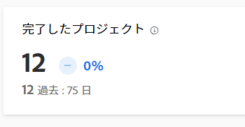
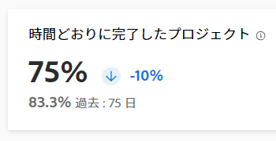
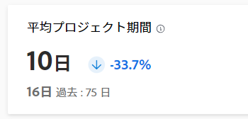
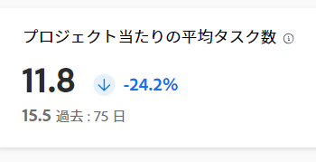

# 拡張分析 KPI について

>[!IMPORTANT]
>
>この機能を使用するには、ビジネスプラン以上が必要です。\
>利用可能な様々なプランについて詳しくは、[Adobe Workfront プラン](https://www.workfront.com/plans)を参照してください。

拡張分析領域の画面の上部に、4 つの主要業績評価指標（KPI）が表示されます。これらの指標を使用すると、プロジェクトにかかる時間、プロジェクトの規模、特定の時間枠内に完了したプロジェクトの数をすばやく把握できます。これらの数は、このページのビジュアライゼーションに表示されるプロジェクトの最大数（50）に制限されません。代わりに、このデータは任意のセットフィルターに適用されるすべてのプロジェクトに基づいており、選択した日付範囲または任意のフィルターを変更すると、これらの数値が調整されます。

フィルターを追加する方法については、[拡張分析でのフィルターの適用](../enhanced-analytics/use-enhanced-analytics-filters.md)を参照してください。

## 完了したプロジェクト

「完了したプロジェクト」KPI は、フィルターした期間内に完了したプロジェクトの数と、前の期間以降に増加または減少した割合を示します。これらの数値の下に、前の期間に完了したプロジェクトの数と、前の期間の日数が表示されます。

## 時間どおりに完了したプロジェクト

「時間どおりに完了したプロジェクト」KPI は、フィルターした期間内に時間どおり完了したプロジェクトの数と、前の期間以降に増加または減少した割合を示します。これらの数値の下に、前の期間で時間通りに完了したプロジェクトの割合と、前の期間の日数が表示されます。

## 平均プロジェクト期間

平均プロジェクト期間 KPI は、フィルターした期間内に実際の終了日があるプロジェクトの平均完了時間（日、週、または年）と、前の期間からの割合の増減を示します。これらの数値の下に、前の期間の実際の終了日を持つプロジェクトの平均完了時間と、前の期間の日数が表示されます。

## プロジェクト当たりの平均タスク数

プロジェクトごとの平均タスク数 KPI は、フィルターした期間内にプロジェクトに割り当てられたタスクの平均数と、前の期間以降に増加または減少した割合を示します。これらの数値の下に、前の期間のプロジェクトに割り当てられたタスクの平均数と、前の期間の日数が表示されます。

