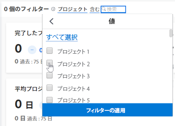
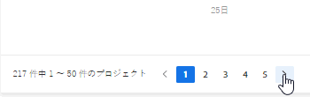
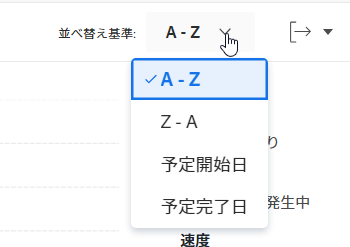
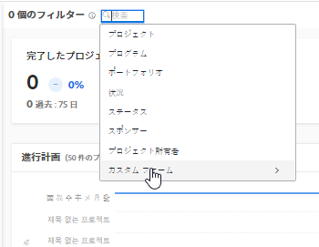
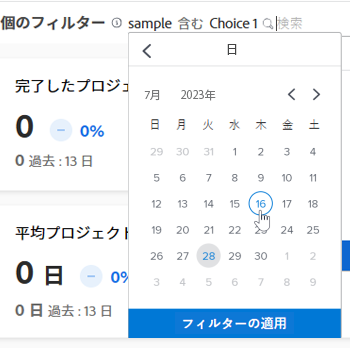
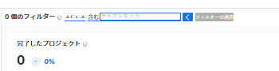
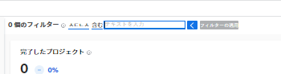
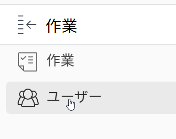
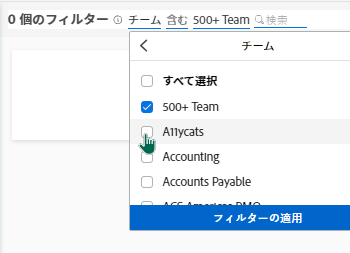
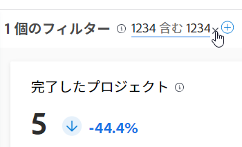

# 拡張分析でのフィルターの適用

拡張分析領域のフィルターは、特定のプロジェクトや特定のタイプのデータに焦点を当てるのに役立ちます。 使用するフィルターのタイプによって、次の情報を得ることができます。

* 所有しているプロジェクト
* 特定のポートフォリオまたはプログラムビュー
* 特定の期間（週、四半期、会計年度）の主要業績評価指標

必要に応じてフィルターを追加および削除できます。Adobe Workfrontでは、ログアウトしても、適用したフィルターが保持されます。

## アクセス要件

このタスクを完了するには、次の条件を満たす必要があります。

<table style="table-layout:auto"> 
 <caption style="text-align: left;">
  *保有するプラン、ライセンスの種類、アクセス権を確認するには、Workfront管理者にお問い合わせください。
 </caption> 
 <col> 
 <col> 
 <tbody> 
  <tr> 
   <td> 
<a href="https://www.workfront.com/plans" target="_blank">Workfrontプラン</a>*
 </td> 
   <td>ビジネス以上</td> 
  </tr> 
  <tr> 
   <td> 
<a href="../administration-and-setup/add-users/access-levels-and-object-permissions/wf-licenses.md" class="MCXref xref">Adobe Workfrontライセンスの概要</a>*
 </td> 
   <td> 
レビュー以上
 </td> 
  </tr> 
  <tr> 
   <td><b>アクセスレベル*</b> </td> 
   <td> 
プロジェクトへのアクセスを表示
 
また、特定のプロジェクトフィールドフィルターオプションを表示するには、タスク、Portfolio、ユーザーへの表示アクセス権も必要です。
 
注意：アクセスレベルを編集ダイアログの「追加の制限を設定」セクションで制限を選択した場合、フィルターの適用後に、フィルターまたは拡張分析ページにすべての情報が表示されないことがあります。 Workfront管理者がアクセスレベルを変更する方法について詳しくは、 <a href="../administration-and-setup/add-users/configure-and-grant-access/create-modify-access-levels.md" class="MCXref xref">カスタムアクセスレベルの作成または変更</a>.
 </td> 
  </tr> 
  <tr> 
   <td> 
<b>オブジェクト権限</b> 
 </td> 
   <td> 
ビュー
 
追加のアクセス権のリクエストについて詳しくは、 <a href="../workfront-basics/grant-and-request-access-to-objects/request-access.md" class="MCXref xref">オブジェクトへのアクセスのリクエスト </a>.
 </td> 
  </tr> 
 </tbody> 
</table>

## 前提条件

拡張分析を使用するための前提条件については、 [前提条件](../enhanced-analytics/enhanced-analytics-overview.md#prerequi) in [分析の強化の概要](../enhanced-analytics/enhanced-analytics-overview.md).

## 日付範囲フィルターの変更 {#change-the-date-range-filter}

デフォルトでは、拡張分析領域のビジュアライゼーションには、過去 60 日間および今後 15 日間のデータが表示されます。 新しい日付範囲を選択し、「拡張分析」領域のすべてのビジュアライゼーションに適用できます。 ページから別のページに移動した場合、次回戻ると、デフォルトの日付範囲が適用されます。

>[!TIP]
>
>キーボードのキーを使用して、カレンダーウィジェットから日付範囲に移動して開き、選択することもできます。\
>詳しくは、 [キーボードショートカット](../enhanced-analytics/enhanced-analytics-overview.md#keyboard) 記事のセクション [分析の強化の概要](../enhanced-analytics/enhanced-analytics-overview.md).

新しい日付範囲を選択するには：

1. メインメニューアイコンをクリックします。 を選択し、「 **Analytics**.
1. 画面の右上隅で、日付範囲フィールドをクリックして、カレンダービューを開きます。
1. カレンダーの上にある矢印を使用して開始日の月を指定し、開始日を選択します。

   

1. カレンダーの上にある矢印を使用して終了日の月を指定し、終了日を選択します。
1. （オプション）より小さい日付範囲でズームインするには、ビジュアライゼーションの 1 つで、特定の日付から別の日付にマウスをドラッグします。

   画面上のすべてのビジュアライゼーションが、選択した期間に合わせて更新され、時間枠フィルターが既存のフィルターの横に表示されます。 このフィルターは、ログアウトしたり、拡張分析領域から移動した場合には保持されません。

   

## フィルターの追加

デフォルトのプロジェクトフィールド、カスタムフォームフィールド、およびプロジェクトに割り当てられたホームチームに基づいて、フィルターを追加できます。

>[!TIP]
>
>キーボードのキーを使用して、に移動し、新しいフィルターを追加することもできます。\
>詳しくは、 [キーボードショートカット](../enhanced-analytics/enhanced-analytics-overview.md#keyboard) 記事のセクション [分析の強化の概要](../enhanced-analytics/enhanced-analytics-overview.md).

* [プロジェクトフィールドフィルターを追加する](#add-a-project-field-filter)
* [プロジェクトフィールドフィルターを追加する](#add-a-project-field-filter)
* [チームフィルターを追加](#add-a-team-filter)

### プロジェクトフィールドフィルターを追加する {#add-a-project-field-filter}

プロジェクトフィールドフィルターを使用すると、デフォルトでプロジェクトに含まれるフィールドに入力された値に基づいて、プロジェクトやタスクのデータをフィルタリングできます。

次のプロジェクトフィールドフィルタータイプを使用できます。

| **プロジェクト** | 選択したプロジェクトのデータのみを表示します |
|---|---|
| **プログラム** | 選択したプログラム内のプロジェクトのデータのみを表示します |
| **ポートフォリオ** | 選択したポートフォリオ内のプロジェクトのみのデータを表示します |
| **状況** | 選択した条件（ターゲット、リスク、問題が発生した場合）を最近使用したプロジェクトのデータのみを表示します |
| **ステータス** | 選択したステータス（完了、現在、保留中、キャンセルなど）の直近のプロジェクトのデータのみを表示します。 |
| **スポンサー** | 選択したスポンサーを持つプロジェクトのデータのみを表示します |
| **プロジェクト所有者** | 選択したプロジェクト所有者を持つプロジェクトのデータのみを表示します |

{style=&quot;table-layout:auto&quot;}

カスタムフォームフィルターの動作は異なります。 詳しくは、 [プロジェクトフィールドフィルターを追加する](#add-a-project-field-filter).

プロジェクトフィールドフィルターを追加するには：

1. メインメニューアイコンをクリックします。 を選択し、「 **Analytics**.
1. 画面の左上隅で、 **フィルターを追加**&#x200B;をクリックし、目的のフィルタータイプを選択します。

   >[!NOTE]
   >
   >フィルターのタイプごとに異なるデータが表示されます。 1 つのフィルターで使用できるフィルターの種類は 1 つだけです。 選択した後は、別のプロジェクトフィールドフィルターではフィルタータイプを使用できません。

1. データを表示する値を見つけるには、 **検索** 」フィールドで、フィルターに含める各値を選択します。

   現在の値をすべて選択するには、 **すべてを選択**.

   

1. 必要な値をすべて選択したら、 **フィルターを適用**.\
   ページの右上隅にあるプロジェクト数が、適用したフィルターを反映して更新されます。
1. 追加する各フィルターに対して、これらの手順を繰り返します。

   フィルターを追加すると、最大 50 個のプロジェクトに関するデータが以下のビジュアライゼーションに表示されます。

   >[!TIP]
   >
   >デフォルトで表示される 50 個を超えるプロジェクトのデータを表示するには、次の操作を行います。
   >
   >   
   >   
   >   * 左下隅の矢印を使用して、そのビジュアライゼーション内の次の 50 個のプロジェクトを表示します。\
      >     
   >   
   >   * ビジュアライゼーションの「並べ替え順」ドロップダウンメニューを使用して、プロジェクトを異なる順序で表示します。\
      >     

   日付範囲を調整するには、 [日付範囲フィルターの変更](#change-the-date-range-filter).

### プロジェクトカスタムフォームフィルターを追加する

「カスタムフォーム」フィルタータイプを使用すると、プロジェクトの「カスタムフォーム」フィールドに入力された値に基づいて、プロジェクトとタスクのデータをフィルタリングできます。 他の拡張分析フィルタータイプとは異なり、複数のカスタムフォームフィルターを追加できます。 各カスタムフォームフィルターには、特定のカスタムフォームの選択されたフィールド内でのみ入力された値が含まれます。

カスタムフォームフィルターを追加するには：

1. メインメニューアイコンをクリックします。 を選択し、「 **Analytics**.
1. 画面の左上隅で、 **フィルターを追加**&#x200B;を選択し、「 **カスタムフォーム**.

   

1. 必要な 3 文字以上のテキストを **検索** 「 」フィールドで、カスタムフォームを選択します。
1. 目的のフィールドを選択し、フィルターに追加するフィールドのタイプに基づいて、次のいずれかの操作を実行します。

   >[!NOTE]
   >
   >フィルターに追加できないカスタムフォームフィールドタイプもあります。 現在、Enhanced Analytics は、上記のフィールドタイプのみをサポートしています。

   * **チェックボックス**, **ドロップダウン**&#x200B;または **ラジオボタン**:選択したフィールドでフィルターに含める各値を選択するか、 **すべてを選択** チェックボックス。\
      

   * **日付**:矢印を使用して特定の月に移動した後、フィルターに含める日付を選択したフィールドで選択します。\
      

   * **テキスト**:選択したフィールド内で、フィルターに含めるテキストを入力します。\
      

   * **数値**:フィルターに含める数を、選択したフィールド内に入力します。\
      

1. フィルタする値を入力または選択した後、 **フィルターを適用**.

   ページの右上隅にあるプロジェクト数が、適用したフィルターを反映して更新されます。

1. 追加する各フィルターに対して、これらの手順を繰り返します。

   フィルターを追加すると、最大 50 個のプロジェクトに関するデータが以下のビジュアライゼーションに表示されます。

   >[!TIP]
   >
   >デフォルトで表示される 50 個を超えるプロジェクトのデータを表示するには、次の操作を行います。
   >
   >   
   >   
   >   * 左下隅の矢印を使用して、そのビジュアライゼーション内の次の 50 個のプロジェクトを表示します。\
      >     
   >   
   >   * ビジュアライゼーションの「並べ替え順」ドロップダウンメニューを使用して、プロジェクトを異なる順序で表示します。\
      >     

   日付範囲を調整するには、 [日付範囲フィルターの変更](#change-the-date-range-filter).

### チームフィルターを追加 {#add-a-team-filter}

1. メインメニューアイコンをクリックします。 を選択し、「 **Analytics**.
1. 左側のパネルで、 **人**.

   

1. 画面の左上隅で、 **フィルターを追加**&#x200B;を選択し、 **チーム** フィルター。
1. データを表示するチームを見つけるには、 **検索** 」フィールドで、フィルターに含める各チームを選択します。 すべてのチームを選択するには、 **すべてを選択**.

   

   >[!NOTE]
   >
   >すべてのチームは、アクセスレベルに関係なく、フィルターオプションとして含まれます。

1. 目的のチームをすべて選択したら、 **フィルターを適用**.

   フィルターを追加すると、データは以下のビジュアライゼーションに表示されます。

   日付範囲を調整するには、 [日付範囲フィルターの変更](#change-the-date-range-filter).

## フィルターの削除

フィルターはいつでも削除できます。 フィルターを削除しても、次に拡張分析領域にアクセスしたときには表示されません。

>[!TIP]
>
>また、キーボードのキーを使用して、既存のフィルターに移動したり、既存のフィルターを削除したりすることもできます。\
>詳しくは、 [キーボードショートカット](../enhanced-analytics/enhanced-analytics-overview.md#keyboard) 記事のセクション [分析の強化の概要](../enhanced-analytics/enhanced-analytics-overview.md).

フィルターを削除するには：

1. メインメニューアイコンをクリックします。 を選択し、「 **Analytics**.
1. 作業用フィルターを削除する場合は、「 **作業** 領域

   または

   人物フィルターを削除する場合は、 **人** をクリックします。

1. 目的のフィルターを見つけ、 **X** 削除します。

   

   フィルターはアクティブではなくなり、再度追加しない限り表示されません。
