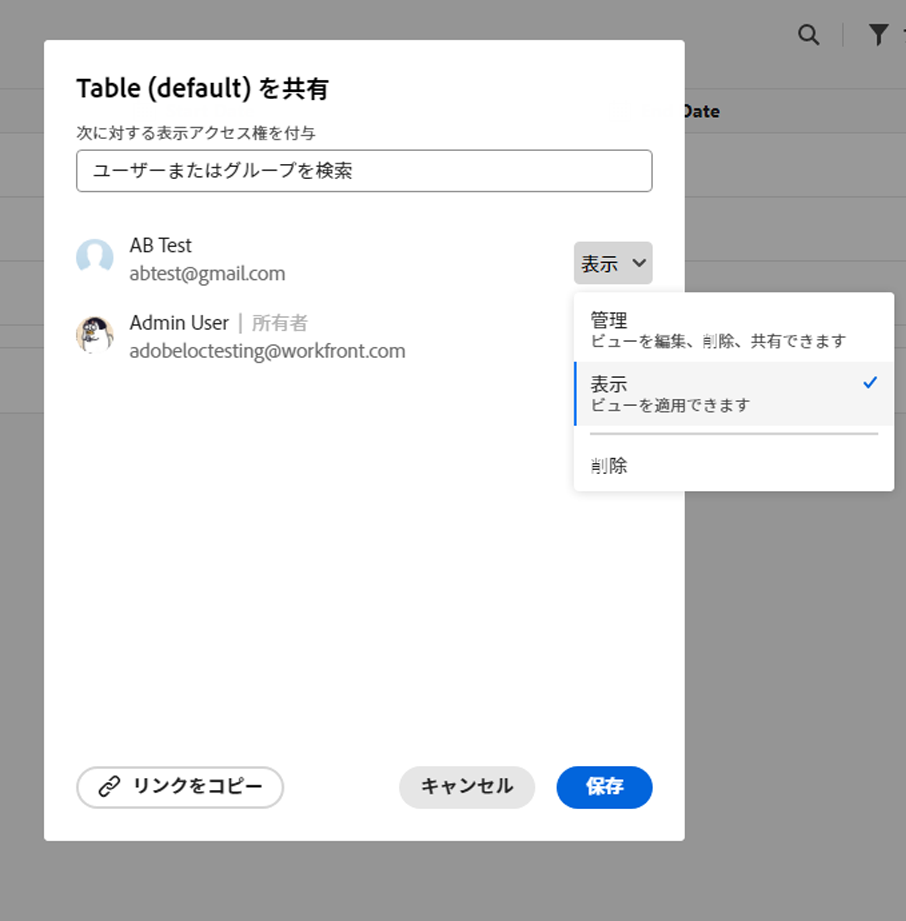

<!--*****************ADD TO TOC AND MINITOC WHEN RELEASING*********************-->

<!--update the metadata and description when we turn this article live; also, update title after Bob adds Maestro as a product-->

# ビューの共有

他のユーザーとビューを共有して、Adobe Workfront Maestro で作業する際のコラボレーションを確保できます。

ワークスペースに権限を付与しても、レコードタイプページのビューに対する他のユーザーの権限は付与されません。 他のユーザーと共有するには、レコードタイプのページ内の個々のビューに権限を付与する必要があります。

## アクセス要件

この記事の手順を実行するには、次のアクセス権が必要です。

<table style="table-layout:auto">
 <col>
 </col>
 <col>
 </col>
 <tbody>
    <tr>
<tr>
<td>
   
 製品
 </td>
   <td>
   
 Adobe Workfront
 </td>
  </tr>  
 <td role="rowheader">
Adobe Workfront協定
</td>
   <td>

組織は、Maestro クローズ済みベータプログラムのAdobeに登録する必要があります。 この新しいオファーについては、アカウント担当者にお問い合わせください。 

   </td>
  </tr>
  <tr>
   <td role="rowheader">
Adobe Workfrontプラン
</td>
   <td>

任意

   </td>
  </tr>
  <tr>
   <td role="rowheader">
Adobe Workfrontライセンス
</td>
   <td>
   
任意
 
  </td>
  </tr>

<tr>
   <td role="rowheader">
アクセスレベル設定
</td>
   <td> AdobeMaestro のアクセス制御はありません
  
</td>
  </tr>

<tr>
   <td role="rowheader">
オブジェクトの権限
</td>
   <td> 
ビューに対する権限の管理
  
</td>
  </tr>

<tr>
   <td role="rowheader">
レイアウトテンプレート
</td>
   <td> 
Workfrontまたはグループ管理者は、レイアウトテンプレートに Maestro 領域を追加する必要があります。 
  
</td>
  </tr>
 </tbody>
</table>

## ビューに対する権限の共有

管理権限を持つ作成または表示を共有できます。

>[!NOTE]
>
>システム管理者は、自分で作成しなかったビューを表示または共有できません。 ユーザーは、自分と共有されているビューの表示や共有のみを行うことができます。

他のユーザーとビューを共有するには：

{{step1-to-maestro}}

1. 表示を共有するワークスペースを開き、「レコードタイプ」カードをクリックします。

   レコードタイプのページが開きます。

1. 「表示」ドロップダウンメニューで、共有する表示の上にマウスポインターを置いて、 **その他** メニュー  ビュー名の右に移動し、 **共有**.

   

1. Adobe Analytics の **にビューアクセスを許可** フィールドにユーザーまたはグループの名前を入力し、リストに表示されたらクリックします。

   

1. ドロップダウンメニューから次の権限レベルの 1 つを選択します。
   * 表示
   * 管理

     権限レベルと各レベルでユーザーが実行できるアクションについて詳しくは、 [AdobeMaestro での共有権限の概要](../access/sharing-permissions-overview.md).
1. 「**保存**」をクリックします。

## ビューに対する権限の削除

{{step1-to-maestro}}

1. 表示を共有するワークスペースを開き、「レコードタイプ」カードをクリックします。

   レコードタイプのページが開きます。

1. 「表示」ドロップダウンメニューで、共有する表示の上にマウスポインターを置いて、 **その他** メニュー  ビュー名の右に移動し、 **共有**.

1. 削除するユーザーまたはグループを見つけ、「 **削除** （ユーザーまたはグループの名前の右側にある権限ドロップダウンメニュー）

1. 「**保存**」をクリックします。

   削除されたユーザーまたはグループに属するユーザーは、ビューにアクセスできなくなります。