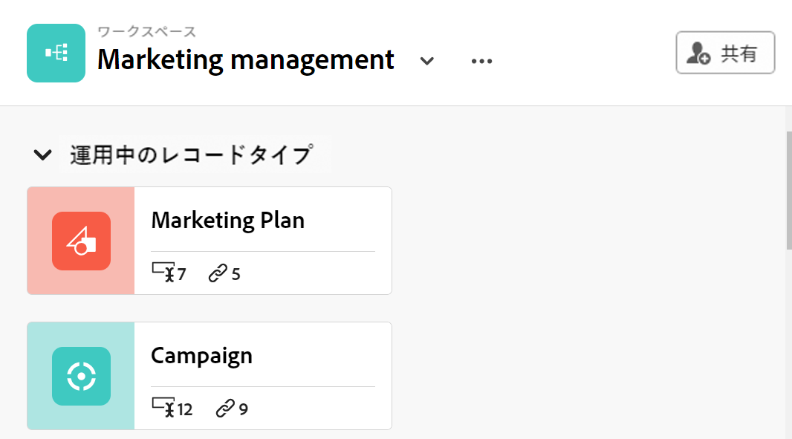
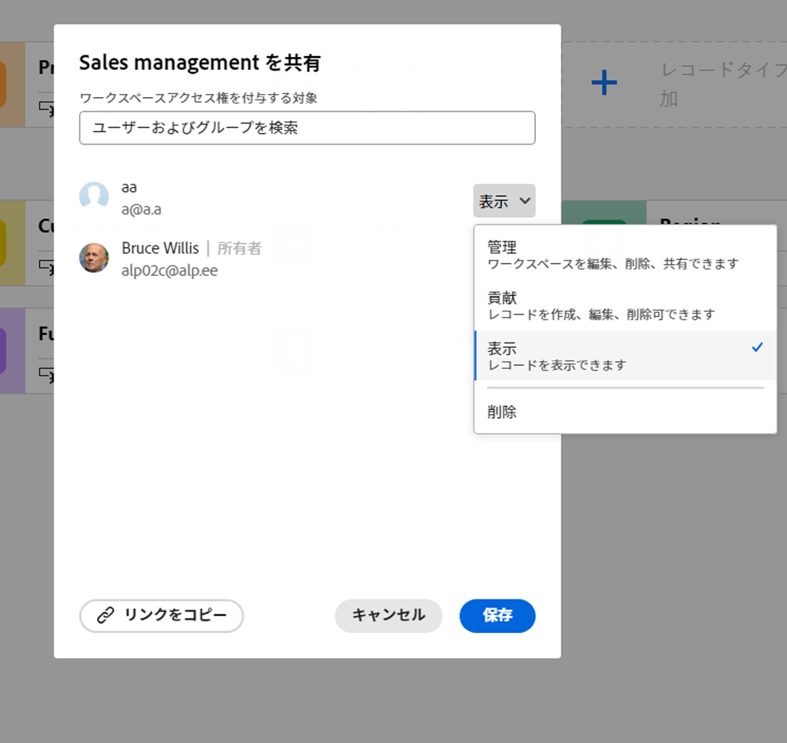

<!--update the metadata and description when we turn this article live; also, update title after Bob adds Planning as a product ??-->

# ワークスペースの共有

{{maestro-important-intro}}

ワークスペースを他のユーザーと共有して、Adobe Workfront Planning で作業する際のコラボレーションを確保できます。

>[!NOTE]
>
>ワークスペースに権限を付与しても、レコードタイプページのビューに対する他のユーザーの権限は付与されません。 他のユーザーと共有するには、レコードタイプのページ内の個々のビューに権限を付与する必要があります。 詳しくは、 [ビューの共有](/help/quicksilver/maestro/access/share-views.md).

## アクセス要件

この記事の手順を実行するには、次のアクセス権が必要です。

<table style="table-layout:auto">
 <col>
 </col>
 <col>
 </col>
 <tbody>
    <tr>
<tr>
<td>
   
 製品
 </td>
   <td>
   
 Adobe Workfront
 </td>
  </tr>  
 <td role="rowheader">
Adobe Workfront協定
</td>
   <td>

組織は、Adobe Workfront Planning クローズ済みベータプログラムに登録されている必要があります。 この新しいオファーについては、アカウント担当者にお問い合わせください。 

   </td>
  </tr>
  <tr>
   <td role="rowheader">
Adobe Workfront プラン
</td>
   <td>

任意

   </td>
  </tr>
  <tr>
   <td role="rowheader">
Adobe Workfront ライセンス
</td>
   <td>
   
新規：標準

   または
   
現在：プラン 
 
  </td>
  </tr>

<tr>
   <td role="rowheader">
アクセスレベル設定
</td>
   <td> Adobe Workfront Planning のアクセス制御はありません
  
</td>
  </tr>

<tr>
   <td role="rowheader">
権限
</td>
   <td> 
ワークスペースに対する権限の管理
  
</td>
  </tr>

<tr>
   <td role="rowheader">
レイアウトテンプレート
</td>
   <td> 
Workfront管理者を含むすべてのユーザーには、メインメニューの「計画」領域を含むレイアウトテンプレートを割り当てる必要があります。 
 
詳しくは、 <a href="/help/quicksilver/maestro/access/access-overview.md">アクセスの概要</a>. 
 
</td>
  </tr>
 </tbody>
</table>

## ワークスペースに対する権限の共有

以下のユーザーは、ワークスペースを他のユーザーと共有できます。

* システム管理者は、作成しなかったワークスペースを含め、すべてのワークスペースを共有できます。
* 他のすべてのユーザーは、管理権限を持つワークスペースのみを共有できます。

ワークスペースを他のユーザーと共有するには：

{{step1-to-maestro}}

1. 共有するワークスペースを開き、「 **共有** をクリックします。

   

1. Adobe Analytics の **ワークスペースへのアクセス権の付与** フィールドにユーザーまたはグループの名前を入力し、リストに表示されたらクリックします。

   

1. ドロップダウンメニューから次の権限レベルの 1 つを選択します。
   * 表示
   * 参加
   * 管理

     権限レベルと各レベルでユーザーが実行できるアクションについて詳しくは、 [Adobe Workfront Planning での共有権限の概要](../access/sharing-permissions-overview.md).
1. クリック **リンクをコピー** をクリックして、ワークスペースへのリンクをクリップボードにコピーします。
1. コピーしたリンクを他のユーザーと共有します。 このワークスペースにアクセスするには、リンクを受け取ったユーザーがアクティブユーザーであり、Workfrontにログインする必要があります。
1. 「**保存**」をクリックします。

## ワークスペースに対する権限の削除

{{step1-to-maestro}}

1. 権限を削除するワークスペースを開き、「 **共有** をクリックします。
1. ユーザー名またはグループ名の右にあるドロップダウンメニューをクリックし、 **削除**.
1. 「**保存**」をクリックします。

   削除されたユーザーまたはグループに属するユーザーは、ワークスペースまたはそのオブジェクトにアクセスできなくなりました。