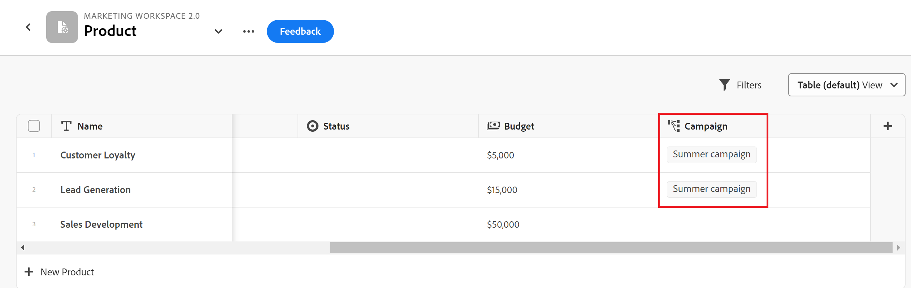
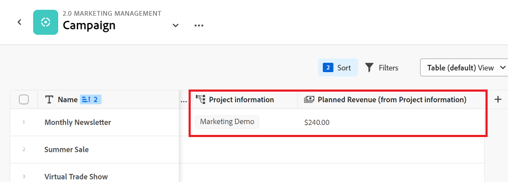

# レコードタイプとレコードの接続例

>[!IMPORTANT]
>
>この記事の情報は、Adobe・マエストロに関して、Adobeからの新しいオファーです。
>
>現在、Adobe・マエストロは、限られた数の顧客に対してオープンなベータプログラムの一部です。
>
>Maestro のベータプログラムへの参加について詳しくは、アカウント担当者にお問い合わせください。
>
>詳しくは、 [Adobeマエストロの概要](../maestro-overview.md).

この記事では、次の例を説明します。

* 2 つの Maestro レコードタイプと 2 つの Maestro レコード間の接続を作成する方法。

* Adobeの Maestro レコードタイプとWorkfrontプロジェクトオブジェクトタイプの間の接続、および Maestro レコードとプロジェクトの間の接続を作成する方法。

詳しくは、次の記事も参照してください。

* [レコードタイプを接続](../architecture-and-fields/connect-record-types.md)
* [レコードを接続](../records/connect-records.md)

## 2 つの Maestro レコードタイプとレコードを接続する（例）

例えば、元のレコードタイプとして Campaign という名前のレコードタイプがあるとします。

また、Product という別のレコードタイプもあり、Budget という通貨フィールドを持ちます。

Campaign のレコードタイプにフィールドを作成し、レコードタイプ「Product」の「Budget」フィールドの値を表示できます。

手順は次のとおりです。

1. キャンペーンレコードタイプのテーブルビューを開きます。
1. 次をクリック： **+** テーブル表示の右上隅にあるアイコンを使用して新しいフィールドを追加し、「 **新しい接続**.
1. 次の情報を追加します。例：

   * **レコードタイプ**：製品 <!--did they change the casing here?-->
   * **名前**：製品情報。 これは、リンクされたレコードフィールドの名前です。
   * **説明**：キャンペーンを関連付けたい製品です。
   * **複数のレコードを許可**：このオプションを選択したままにすると、リンクされたレコードタイプのフィールド（製品情報）が元のレコード（キャンペーン）に表示される場合に、ユーザーは複数のレコードを選択できます。 この場合、1 つのキャンペーンに接続する複数の製品を選択できます。
   * **参照フィールドを選択**：このオプションを選択したままにした場合、 **参照フィールドを追加** ボックスが開き、製品フィールドをキャンペーンのレコードタイプにリンクできます。 この手順をスキップし、後で製品フィールドを追加できます。

   

1. （条件付き） **「ルックアップフィールドを選択」オプション** 前の手順で、 **製品** レコードのタイプを選択する場合は、 **+** アイコン **予算** 「 」フィールドで「 」をクリックし、 **フィールドを追加**. これにより、 **予算（製品情報から）**：リンクされたフィールドの名前です。 製品予算の情報は、キャンペーンレコードのこのフィールドに表示されます。

   

   >[!TIP]
   >
   >    選択したすべての製品の予算を合計 1 つの数として表示する場合は、 **SUM** 」と入力します。 ユーザーが **製品情報** リンクされたレコードフィールド **予算（製品情報から）** 「 」フィールドでは、すべての予算値が加算され、合計が表示されます。 <!-- check the shot below - added a bug with a couple of UI changes here-->
   >
   > 次を選択した場合、 **なし**&#x200B;の代わりに **SUM**&#x200B;に設定すると、個々の予算がコンマで区切って表示されます。

   これにより、次のフィールドが生成されます。

   * キャンペーンのレコードテーブルビューと詳細ページで、以下の操作をおこないます。

      * **製品情報** （リンクされたレコードフィールド）：製品の名前または名前が表示されます。
      * **予算（製品情報から）** （リンクされたフィールド）:「製品の情報」フィールドで選択した製品の予算が表示されます。

   * [ 商品レコード ] テーブルビューおよび商品の [ 詳細 ] ページで、次の操作を行います。

      * **Campaign**：これは、製品レコードタイプがキャンペーンレコードタイプからリンクされていることを示します。

     

   >[!TIP]
   >
   >    リンクされたレコードフィールドの前には関係アイコンが付きます .

1. 次の手順で **製品情報** フィールドに、 **Campaign** レコードタイプのテーブルビューで、「キャンペーンレコードタイプ」ページのテーブルに新しい行を追加して、キャンペーンを作成します。
1. 次をクリック： **+** アイコンを  **製品情報** 新しいキャンペーンの列。 The **オブジェクトの接続** ボックスが表示されます。 リンク先のレコードタイプの名前がボックスの左上隅に表示されます。

   

1. キャンペーンレコードに接続する製品レコードを選択し、 **オブジェクトの接続**.

   次の列が、キャンペーンレコードタイプのテーブルに入力されます。
   * The **製品情報** フィールドは、選択した製品でキャンペーンレコードに入力されます。
   * **予算（製品情報から）** 「 」フィールドには、選択した各製品の予算値か、選択した製品のすべての予算の合計が入力されます。

   

   >[!TIP]
   >
   >複数の値に対して集計を選択しない場合、すべての値がコンマで区切って表示されます。

1. 次の手順で **Campaign** フィールド **製品** 表ビューで、「製品レコードタイプ」の表ビューから開始し、キャンペーン情報を選択する手順 5～7 を繰り返します。 これにより、キャンペーンレコードタイプページのテーブルの「製品情報」フィールドも更新されます。 <!--ensure the step numbers remain correct-->

## Maestro レコードタイプをWorkfrontプロジェクトオブジェクトタイプに接続し、レコードを個々のプロジェクトに接続します。

例えば、元のレコードタイプとして Campaign という名前のレコードタイプがあるとします。

また、Workfrontには「計画収益」と呼ばれるフィールドを持つプロジェクトがあります。

レコードタイプのキャンペーンに接続フィールドを作成し、特定のキャンペーンに関して、Workfrontのプロジェクトの「計画売上高」フィールドの値を表示できます。

手順は次のとおりです。

1. Campaign レコードタイプをWorkfrontプロジェクトに接続するワークスペースに移動します。
1. 選択したワークスペースで、キャンペーンレコードタイプのテーブルビューを開きます。
1. 次をクリック： **+** テーブル表示の右上隅にあるアイコンを使用して新しいフィールドを追加し、「 **新しい接続**.
1. 次の情報を追加します。例：

   * **レコードタイプ**:Workfrontプロジェクト (Workfrontサブセクションから ) <!--did they change the casing here for the field label and did they take "Workfront" out of the name of the object?-->
   * **名前**：プロジェクト情報。 これは、リンクされたオブジェクトフィールドの名前です。
   * **説明**：キャンペーンを関連付けたいプロジェクトです。
   * 
      * **複数のレコードを許可**：このオプションを選択したままにすると、リンクされたオブジェクトタイプフィールド（プロジェクト情報）が元のレコード（キャンペーン）に表示される場合に、ユーザーは複数のオブジェクトを選択できます。
   * **参照フィールドを選択**：このオプションを選択したままにした場合、 **参照フィールドを追加** ボックスが開き、「プロジェクト」フィールドをキャンペーンレコードタイプとリンクできます。 この手順をスキップし、後でプロジェクトフィールドを追加できます。

   

1. （条件付き） **「ルックアップフィールドを選択」オプション** 前の手順で、 **プロジェクト** オブジェクトタイプを選択する場合は、 **+** アイコン **計画収益** 「 」フィールドで「 」をクリックし、 **フィールドを追加**. これにより、 **計画収益（プロジェクト情報から）**：リンクされたフィールドの名前です。 「プロジェクトの売上高」フィールドの情報は、キャンペーンレコードのこのフィールドに表示されます。

   >[!TIP]
   >
   >    選択したすべてのプロジェクトの計画収益を合計 1 つとして表示する場合は、 **SUM** 」と入力します。 ユーザーが **プロジェクト情報** リンクされたオブジェクトフィールド、 **計画収益（製品情報から）** 「 」フィールドではすべての値が加算され、合計が表示されます。 <!-- check the shot below - added a bug with a couple of UI changes here-->
   >
   > 次を選択した場合、 **なし**&#x200B;の代わりに **SUM**&#x200B;に設定すると、個々の計画売上高がコンマで区切られて表示されます。

   

   これにより、次のフィールドが生成されます。

   * キャンペーンのレコードテーブルビューと詳細ページで、以下の操作をおこないます。

      * **プロジェクト情報** （リンクされたオブジェクトフィールド）：プロジェクトの名前または名前が表示されます。
      * **計画収益（プロジェクト情報から）** （リンクされたフィールド）:「プロジェクト情報」フィールドで選択したプロジェクトの計画売上高が表示されます。

   >[!TIP]
   >
   >    リンクされたオブジェクトフィールドの前には、関係アイコンが付きます .

1. 次の手順で **プロジェクト情報** フィールドに、 **Campaign** レコードタイプのテーブルビューで、テーブルに新しい行を追加してキャンペーンを作成します。
1. 次をクリック： **+** アイコンを  **プロジェクト情報** 新しいキャンペーンの列。 The **オブジェクトの接続** ボックスが表示されます。 リンク先のオブジェクトタイプの名前が (Workfront Project) ボックスの左上隅に表示されます。

   

1. キャンペーンレコードに接続する 1 つ以上のプロジェクトを選択し、「 **オブジェクトの接続**.

   選択したワークスペースに以下が追加されます。

   * キャンペーンレコードタイプテーブルで、以下の操作を実行します。
      * The **プロジェクト情報** 「 」フィールドには、選択したプロジェクトがキャンペーンレコードに入力されます。
      * The **計画収益（製品情報から）** 「 」フィールドには、選択した各製品の予算値が入力されます。 これは読み取り専用フィールドです。

   

   >[!TIP]
   >
   >複数の値の集計を選択せずに、オブジェクトリンクフィールドで複数のオブジェクトを選択すると、すべての値がコンマで区切って表示されます。

   * 選択したワークスペースに対する読み取り専用のWorkfront Project レコードタイプです。

1. ページのヘッダーのレコード名の左側にある逆向き矢印をクリックして、更新するワークスペースに移動します。
1. を開きます。 **Workfront Project** レコードタイプのページを開くレコードタイプカード。

   「 Workfront Project レコードタイプ」ページには、次の点に注意してください。

   * これは読み取り専用の Maestro レコードタイプで、削除や更新はできません。
   * キャンペーンに接続するために選択したプロジェクトは、「 Workfrontプロジェクトのレコードタイプ」ページに個別のレコードとして表示されます。 また、プロジェクトのレコードは読み取り専用で、Workfrontでプロジェクトが更新されると、情報が自動的に更新されます。 Workfront Project レコードタイプで表示するには、接続された Maestro レコードからさらにプロジェクトを追加する必要があります。
   * 「キャンペーンのリンクされたレコード」フィールドには、「キャンペーンのレコードタイプ」ページで、プロジェクトに接続されているキャンペーンの名前が入力されます。

1. （オプション） Maestro でWorkfrontプロジェクトの詳細ページを開くには、次のいずれかの操作を行います。

   * リンク元のレコードタイプ (**Campaign**)、「 Workfrontプロジェクトのリンクされたレコード」フィールド (**プロジェクト情報**) をクリックし、Workfrontプロジェクトの名前をクリックします。
   * 次から： **テーブル** のビュー **Workfront Project** レコードページで、Workfrontプロジェクトの名前をクリックします。

     または

     次をクリック： **その他** Workfrontプロジェクトの右側のメニューで、「 **表示**.

     

   リンクされたWorkfrontプロジェクトの Maestro 詳細ページが開きます。 これは読み取り専用ページです。

1. （オプション）リンクされたWorkfrontプロジェクトをWorkfrontで開くには、次のいずれかの操作を行います。

   * 次から： **テーブル** のビュー **Workfront Project** ページで、Workfrontプロジェクトの名前をクリックします。

   または

   次をクリック： **その他** Workfrontプロジェクト名の右にあるメニューで、「 **ソースに移動**.

   

   Workfrontプロジェクトページが開きます。 権限がある場合は、Workfrontプロジェクトに関する情報を編集できます。

1. 次をクリック： **フィールドを追加** アイコン  [ Workfront Project Maestro] レコードタイプのテーブルの右上隅にある [ Workfront Project Maestro] レコードタイプに、さらにプロジェクトフィールドを追加します。
1. 次をクリック： **+** Workfront Project Maestro レコードに追加するプロジェクトフィールドのアイコン **未選択のフィールド** 」セクションに入力します。
1. 次をクリック： **-** Workfront Project Maestro レコードから削除するプロジェクトフィールドのアイコン ( **選択したフィールド** 」セクションに入力します。
1. 「**保存**」をクリックします。

   >[!TIP]
   >
   >    Workfront Project Maestro レコードに追加するフィールドは、Workfrontプロジェクトページにのみ追加され、リンクされたフィールドとしてキャンペーンレコードタイプのページには追加されません。 キャンペーン用に表示するには、Campaign レコードタイプの「プロジェクト情報 connected-object」フィールドからプロジェクトフィールドを追加する必要があります。

1. （オプションおよび条件付き）プロジェクトに少なくとも 2 つの日付フィールドを表示するように選択した場合、 **表示** 「 Workfront Project レコードタイプ」テーブルのドロップダウンメニュー **ビューを作成** > **タイムライン** > **作成** タイムラインビューを作成し、プロジェクトをタイムラインに表示するには、次の手順に従います。
