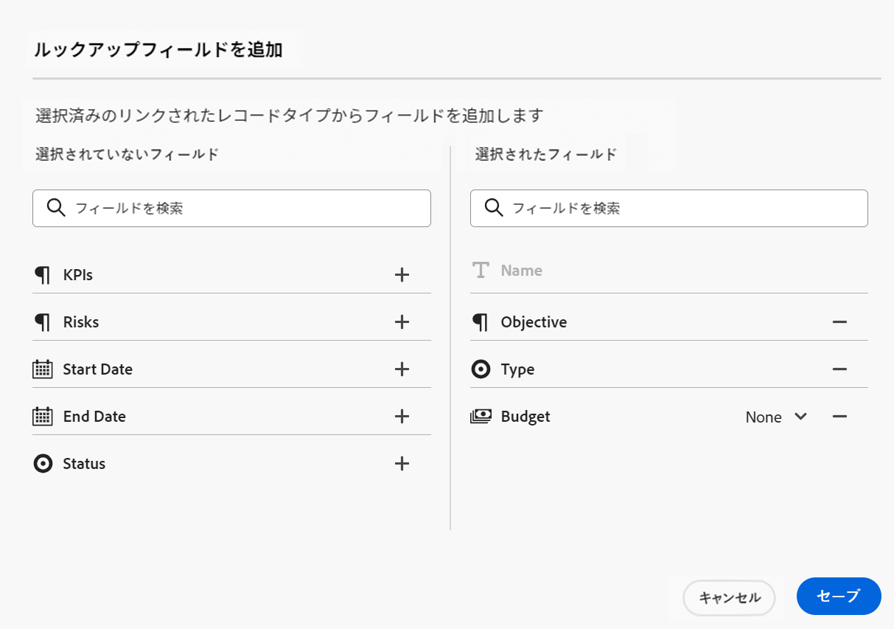
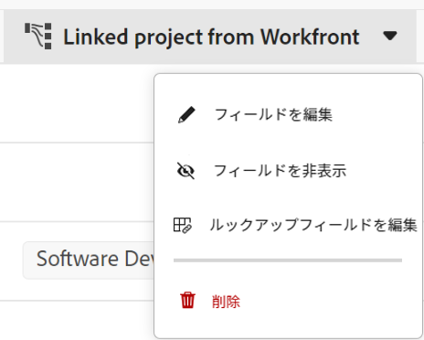

<!-----
title: Connect record types
description: A way to indicate how individual record types relate to one another is to connect them. Also, you can connect Maestro record types with object types from other applications to enhance your users' experience and keep their focus in one application.
hidefromtoc: yes
hide: yes
feature: Work management
role: User
author: Alina
--->

<!--update the metadata with real information when making this avilable in TOC and in the left nav-->
<!--************ THIS MIGHT NO LONGER BE A 'RELATIONSHIP' TYPE FIELD, BECAUSE THEY WILL SHOW IT IN THE CONNECTION TAB*****************************-->

# レコードタイプを接続

>[!IMPORTANT]
>
>この記事の情報は、Adobe Workfrontからの新しいオファーであるAdobe・マエストロを指します。
>
>現在、Adobe・マエストロは、限られた数の顧客に対してオープンなベータプログラムの一部です。 Maestro 機能を使用するには、Workfrontのお客様である必要があります。
>
>Maestro のベータプログラムへの参加について詳しくは、アカウント担当者にお問い合わせください。
>
>詳しくは、 [Adobeマエストロの概要](../maestro-overview.md).

Adobeマエストロを使用すると、組織で必要なレコードの種類を含む完全にカスタマイズ可能なワークスペースをデザインできます。 個々のレコードの種類を相互に関連付ける方法を示すには、レコードの種類を接続します。 また、Maestro レコードタイプを他のアプリケーションのオブジェクトタイプと接続して、ユーザーのエクスペリエンスを向上させ、1 つのアプリケーションにフォーカスを合わせることもできます。

次の項目を接続できます。

* マエストロオペレーショナルレコードタイプを相互に
* マエストロ分類を相互に
* マエストロオペレーショナルレコードタイプと分類を相互に分類する
* 他のアプリケーションのオブジェクト・タイプを持つオペレーショナル・レコード・タイプと分類をマエストロします。

これにより、別の Maestro レコード上に、リンクされたレコードまたはオブジェクトタイプのフィールドを表示できます。

この記事では、2 つの Maestro レコードタイプまたは Maestro レコードタイプを別のアプリケーションのオブジェクトと接続する方法について説明します。

レコードまたはオブジェクトの種類間の接続が確立されたら、個々のレコードを相互に接続できます。

別のアプリケーションからオブジェクトに Maestro レコードを接続する方法については、 [レコードを接続](../records/connect-records.md).

レコードタイプを接続する例については、 [レコードタイプとレコードの接続例](../architecture/example-connect-record-types-and-records.md).

<!--ensure this last linked article is right; the title and the link should have changed-->

## アクセス要件

この記事の手順を実行するには、次のアクセス権が必要です。

<table style="table-layout:auto">
 <col>
 </col>
 <col>
 </col>
 <tbody>
    <tr>
<tr>
<td>
   
 Adobe産物
 </td>
   <td>
   
 Adobe Workfront
 
   
<b>メモ</b>

   
Maestro のレコードタイプをExperience Manager Assetsに接続するには、Adobe Experience Manager Assetsライセンスが必要です。組織のWorkfrontインスタンスをAdobeビジネスプラットフォームまたはAdobe Admin Consoleにオンボーディングする必要があります。 

   </td>
  </tr>  
 <td role="rowheader">
Adobe Workfront協定
</td>
   <td>

組織は、Maestro クローズ済みベータプログラムのAdobeに登録する必要があります。 この新しいオファーについては、アカウント担当者にお問い合わせください。 

   </td>
  </tr>
  <tr>
   <td role="rowheader">
Adobe Workfrontプラン
</td>
   <td>

任意

   </td>
  </tr>
  <tr>
   <td role="rowheader">
Adobe Workfrontライセンス
</td>
   <td>
   
任意
 
  </td>
  </tr>

<tr>
   <td role="rowheader">アクセスレベル</td>
   <td> 
任意
  
</td>
  </tr>
<tr>
   <td role="rowheader">レイアウトテンプレート</td>
   <td> 
システム管理者は、レイアウトテンプレートに Maestro 領域を追加する必要があります。 詳しくは、 <a href="../access/access-overview.md">アクセスの概要</a>. 
  
</td>
  </tr>
 </tbody>
</table>

<!--
After permssions - replace the table with: 

<table style="table-layout:auto">
 <col>
 </col>
 <col>
 </col>
 <tbody>
    <tr>
<tr>
<td>
   
 Adobe product
 </td>
   <td>
   
 Adobe Workfront
 
To connect Maestro record types with Experience Manager Assets, you must have an Adobe Experience Manager Assets license and your organization's instance of Workfront must be onboarded to the Adobe Business Platform or the Adobe Admin Console.
 </td>
  </tr>  
 <td role="rowheader">
Adobe Workfront agreement
</td>
   <td>

Your organization must be enrolled in the Adobe Maestro closed beta program. Contact your account representative to inquire about this new offering. 

   </td>
  </tr>
  <tr>
   <td role="rowheader">
Adobe Workfront plan
</td>
   <td>

Any

   </td>
  </tr>
  <tr>
   <td role="rowheader">
Adobe Workfront license
</td>
   <td>
   
Any
 
  </td>
  </tr>
  
  <tr>
   <td role="rowheader">
Access level
</td>
   <td> 
Any
  
</td>
  </tr>
<tr>
   <td role="rowheader">
Layout template
</td>
   <td> 
Your Workfront or group administrator must add the Maestro area in your layout template. For information, see <a href="../access/access-overview.md">Access overview</a>. 
  
</td>
  </tr>
<tr>
   <td role="rowheader">
Permissions
</td>
   <td> 
Manage permissions to a workspace</a> 
  
   
System Administrators have permissions to all workspaces, including the ones they did not create
</td>
  </tr>
 </tbody>
</table>

-->

<!--Maybe enable this at GA - but Maestro is not supposed to have Access controls in the Workfront Access Level: 
>[!NOTE]
>
>If you don't have access, ask your Workfront administrator if they set additional restrictions in your access level. For information on how a Workfront administrator can change your access level, see [Create or modify custom access levels](../administration-and-setup/add-users/configure-and-grant-access/create-modify-access-levels.md). -->

<!-- Notes to add for the table: for the "Workfront plans" row: the above is only for closed beta; when going to GA - activate the following plans:    

Current plan: Prime and Ultimate

Legacy plan: Enterprise
-->

<!-- Notes for the table: for the "Workfront access" row: 
For more information, see <a href="../../administration-and-setup/add-users/access-levels-and-object-permissions/wf-licenses.md" class="MCXref xref">Adobe Workfront licenses overview</a>.
-->

## レコードタイプの接続に関する考慮事項

次の点に注意してください。

* Maestro では、次のエンティティを接続できます。

   * 2 種類のオペレーショナルレコード
   * 2 つの分類
   * オペレーショナルレコードのタイプと分類
   * 別のアプリケーションのオペレーショナルレコードタイプまたは分類およびオブジェクトタイプ。

* 次のオブジェクトは、Maestro レコードタイプを使用して、次のアプリケーションから接続できます。

   * ADOBE WORKFRONT:

      * プロジェクト
      * ポートフォリオ
      * プログラム
      * 会社
      * グループ

   * ADOBE EXPERIENCE MANAGER ASSETS:

      * 画像
      * フォルダー

     >[!IMPORTANT]
     >
     >Adobe Experience Manager Assetsライセンスが必要です。Maestro レコードをAdobe Experience Manager Assetsに接続するには、組織のWorkfrontインスタンスをAdobeビジネスプラットフォームまたはAdobe Admin Consoleにオンボーディングする必要があります。
     >
     >Adobe Admin Consoleのオンボーディングについて質問がある場合は、 [AdobeUnified Experience に関する FAQ](/help/quicksilver/workfront-basics/navigate-workfront/workfront-navigation/unified-experience-faq.md).

* レコードタイプを別のレコードタイプに接続するか、別のアプリケーションのオブジェクトタイプに接続すると、次のシナリオが存在します。

   * **2 つのレコードタイプを接続する場合**：接続元のレコードタイプに「リンクされたレコード」フィールドが作成されます。 接続先のレコードタイプに、同様の「リンクされたレコード」フィールドが作成されます。

     例えば、「Campaign」レコードタイプを「Product」レコードタイプに接続すると、「Linked Product」という名前のリンクされたレコードフィールドが「Campaign」レコードタイプに作成され、「Campaign」という名前のリンクされたレコードタイプが「Product」レコードタイプに自動的に作成されます。

   * **別のアプリケーションのオブジェクトタイプにレコードタイプを接続する場合**：接続元のレコードタイプにリンクされたレコードフィールドが作成されます。 リンクされたレコードフィールドは、サードパーティのアプリケーションオブジェクト上に自動的に作成されません。

     サードパーティのアプリケーションオブジェクトに対して新しい Maestro レコードタイプが作成されるのは、実際のオブジェクトが Maestro レコードに接続されている場合のみです。

     詳しくは、 [レコードを接続](../records/connect-records.md).

   * **接続先のレコードまたはオブジェクトからルックアップフィールドを追加する場合**：リンクされたフィールドは、リンク元のレコードに取り込むために選択した参照フィールドが表示される、接続元のレコードに追加されます。 レコードのフィールドは常に読み取り専用で、サードパーティのオブジェクトの値が自動的に設定されます。

     例えば、「Campaign」の Maestro レコードタイプをWorkfrontプロジェクトに接続し、プロジェクトの「計画完了日」フィールドを Maestro レコードに取り込むと、リンク元のレコードに対して「計画完了日」(Project) と呼ばれるリンクフィールドが自動的に作成されます。

* リンクされたレコードフィールドの前には関係アイコンが付きます .

  リンクされたフィールドの前には、フィールドタイプを識別するアイコンが付いています。 例えば、フィールドが数値、段落、日付であることを示すアイコンなどです。

* レコードタイプの個々のレコードを作成した後、リンクされたレコードタイプのフィールドから接続先のレコードを選択できます。 詳しくは、 [レコードを接続](../records/connect-records.md).

## レコードタイプを接続

<!--when changes here, also update the article for "Connect records"-->

{{step1-to-maestro}}

最後にアクセスしたワークスペースは、デフォルトで開きます。

1. （オプション）既存のワークスペース名の右側にある下向き矢印を展開し、レコードタイプを接続するワークスペースを選択します。
1. レコードタイプのカードをクリックして、レコードタイプのページを開きます。
1. 次をクリック： **+** アイコンをクリックし、 **新しい接続** タブをクリックします。

   

1. Adobe Analytics の **レコードタイプ** フィールド、レコードタイプを検索するか、次のいずれかを選択します。 <!--is the field name spelled right? lowercase "t"?-->

   * 選択したワークスペースの別のオペレーショナルレコードタイプまたは分類

     >[!TIP]
     >
     >選択したワークスペースのレコードタイプと分類のみが接続できます。
     > 
     >選択したワークスペースに他のレコードタイプがない場合は、ワークスペース名は表示されません。

   * A **プロジェクト、Portfolio、プログラム、会社**&#x200B;または **グループ化** から **Workfront Object Types** 」セクションに入力します。
   * **Experience Manager Assets** から **Adobeアプリ** 」セクションに入力します。

   

1. 次の情報を更新します。

   * **名前**：テーブル表示または元のレコードタイプの詳細ページに表示される、接続されたフィールドの名前。 これにより、元のレコードの種類のテーブルビューまたは元のレコードのリンクされたレコードフィールドに、リンクされたレコード列が作成されます。 <!--ensure they updated this; and update the screen shot: it used to be "Label"-->

   >[!TIP]
   >
   >リンク先のレコードの名前を、接続されたレコードフィールドの名前に含めて、新しいフィールドのレコードの種類を取り込むことをお勧めします。 リンクされたレコードの名前は、新しくリンクされたレコードフィールドまたはリンクされたフィールドには表示されません。

   * **説明**:「接続されたレコード」フィールドに関する追加情報。 フィールドの説明は、テーブルのフィールドの列にカーソルを合わせると表示されます。
   * **複数のレコードを許可**：リンクされたレコードタイプのフィールドが元のレコードに表示される場合に、ユーザーが複数のレコードを追加できるようにするには、このオプションを選択します。 これはデフォルトで選択されています。
   * **参照フィールドを選択**：選択したレコードタイプからフィールドを追加するには、このオプションを選択します。 これはデフォルトで選択されています。

1. （条件付きおよびオプション）Workfrontオブジェクトの接続を選択した場合、 **カスタムフォーム** から **これらの条件に一致するプロジェクトのみをリンク** 」セクションに入力します。 <!--this needs to be updated for each object when they fix this UI.--> 選択したカスタムフォームがアタッチされているオブジェクトのみが、選択した Maestro レコードタイプにリンクできます。 複数のフォームを選択できます。

   

1. （条件付き）Experience Manager Assetsへの接続を選択した場合、 **Experience Managerリポジトリ** ドロップダウンメニュー ( **次のリポジトリーからのアセットのリンク** 」セクションに入力します。 これは必須フィールドです。 このフィールドには、Experience Manager Assetsでアクセス権のあるリポジトリのみが表示されます。

   

1. 「**作成**」をクリックします。

1. （条件付き） **参照フィールドを選択** 設定、 **参照フィールドを追加** ボックスが開きます。

   次をクリック： **+** アイコンをクリックして、 **未選択のフィールド** 領域。

   または

   次をクリック： **-** アイコンを使用して、次の場所からフィールドを削除します。 **選択したフィールド** 領域

   

1. （オプション）「 **スキップ** リンクされたレコードやオブジェクトからフィールドを追加しないでください。 The **名前** リンクされたレコードのフィールドは、元のレコードのテーブルビューに表示される唯一のフィールドです。

1. （オプションおよび条件付き）数値、通貨、割合または日付タイプのフィールドをリンクする場合は、集計値も選択します。 ユーザーがリンクされたレコードフィールドで複数のリンクされたレコードを選択する場合、リンクされたフィールドの値は、コンマで区切るか、選択した集計に従って集計値として表示されます。

   

   >[!NOTE]
   >
   > レコードタイプをExperience Manager Assetsに接続する場合、集約は使用できません。

   次の中から選択します。

   * **なし**：複数のレコードから取得された値をコンマで区切って表示します。 これはデフォルトの選択です。
   * **MAX**：リンクされたレコードフィールドで選択された複数のレコードから取得されたすべての値の最大値を表示します。
   * **最小**：リンクされたレコードフィールドで選択された複数のレコードから取得されたすべての値の最小値を表示します。
   * **SUM**：リンクされたレコードフィールドで選択された複数のレコードから取得されたすべての値の合計を表示します。
   * **AVG**：リンクされたレコードフィールドで選択された複数のレコードから取得されたすべての値の平均を表示します。

   >[!NOTE]
   >
   >例えば、キャンペーンレコード（元のレコード）から製品レコード（リンクされたレコード）をリンクし、「製品フィールド」という名前を付けることができます。 また、キャンペーンレコードから製品レコードの「予算」フィールドをリンクし、「製品の予算」と呼ぶこともできます。 「製品」フィールドで複数のレコードを選択できる場合は、予算が$120,000 の製品 1 と、予算が$100,000 の製品 2 を選択できます。 選択した集約に応じて、元のレコードから、リンクされたフィールドに次の予算情報を表示できます。
   >
   >* **なし**:120,000 ドル、100,000 ドル
   >* **MAX**:120,000 ドル
   >* **最小**:100,000 ドル
   >* **SUM**:220,000 ドル
   >* **AVG**:110,000 ドル
   >

1. （オプション） **検索** アイコン  をクリックしてフィールドを検索します。

1. クリック **フィールドを追加** をクリックして変更を保存します。

   次の項目が追加されます。

   * 手動で追加した後に、リンクされたレコードタイプのレコードを表示する、リンクされたレコードフィールド。 リンクされたレコードフィールドの名前は、手順 5 で選択した名前です。 <!--accurate-->

   * リンクされたレコードフィールドに手動でレコードを追加した後に、リンクされたレコードタイプのフィールドの情報を表示する、リンクされたフィールド（複数可）。 リンクされたフィールドは、 **参照フィールドを選択** 接続を作成する際に設定が選択されます。 リンクされたフィールドの名前は、次のパターンに従って付けられます。

     `<Name of the original field on the linked record> (from <Name of your linked field>)`

   * Maestro レコードタイプを相互にリンクすると、リンク先のレコードタイプにも、リンクされたレコードフィールドが追加されます。 リンクされたレコードタイプのリンクされたレコードフィールドの名前は、リンク元のレコードタイプの名前です。

     例えば、「Campaign」レコードタイプから「Product」レコードタイプをリンクし、「Linked Product」キャンペーンの接続済みフィールドに名前を付けた場合、「Campaign」リンク済みレコードタイプに対して「Campaign」リンク済みレコードフィールドが作成されます。

1. （オプション）元のレコードの種類またはリンクされたレコードの種類のテーブルビューで、リンクされたレコードフィールドのヘッダーにある下向き矢印をクリックし、次のいずれかをクリックします。

   * **フィールドを編集**：更新できるのは **名前** そして **説明** フィールドの情報。
   * **参照フィールドの編集**：リンクされているレコードのフィールドを追加または削除します。

   

   参照フィールドを追加または削除するには、上記の手順 9～13 の指示に従います。 <!--ensure these step numbers stay accurate-->

   >[!NOTE]
   >
   > リンク元のレコードの参照フィールドを、サードパーティのアプリケーション内のオブジェクトを示す、リンクされたレコードタイプに追加することはできません。
   >
   > 例えば、Workfrontプロジェクトにリンクする際に Maestro Project レコードタイプに表示される「Campaign」リンクされたレコードフィールドから、「Campaign」Maestro オブジェクトのルックアップフィールドを追加することはできません。

1. （オプション）リンク元のレコードタイプから、リンクされたレコードフィールドのヘッダーにある下向き矢印をクリックし、 **削除**.

   レコードフィールドと、リンクされているその他の参照フィールドは削除され、フィールドとその情報は復元できません。

   >[!TIP]
   >
   >    リンク先のレコードタイプのリンクされたレコードフィールドは削除されません。 <!-- is this still accurate?! -->
