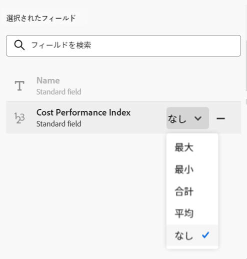

<!-----
title: Connect record types
description: A way to indicate how individual record types relate to one another is to connect them. Also, you can connect Adobe Workfront Planning record types with object types from other applications to enhance your users' experience and keep their focus in one application.
hidefromtoc: yes
hide: yes
feature: Work management
role: User
author: Alina
--->

<!--update the metadata with real information when making this avilable in TOC and in the left nav-->
<!--************ THIS MIGHT NO LONGER BE A 'RELATIONSHIP' TYPE FIELD, BECAUSE THEY WILL SHOW IT IN THE CONNECTION TAB*****************************-->

# レコードタイプを接続

{{maestro-important-intro}}

Adobe Workfront Planning を使用して、組織で必要なレコードタイプを含む、完全にカスタマイズ可能なワークスペースを設計できます。 個々のレコードタイプが互いにどのように関連しているかは、レコードタイプを接続するとよくわかります。また、Workfront Planning のレコードタイプを他のアプリケーションのオブジェクトタイプと結び付けて、ユーザーエクスペリエンスを向上させ、1 つのアプリケーションに集中することができます。

レコードタイプを相互に接続したり、他のアプリケーションのオブジェクトタイプを使用してレコードタイプを接続したりできます。

これにより、Workfront Planning レコード上のリンクされたレコードまたはオブジェクト タイプのフィールドを表示することができます。

ここでは、Workfront Planning 内の 2 つのレコードタイプを関連付ける方法、または別のアプリケーションのオブジェクトを使用してレコードタイプを関連付ける方法について説明します。

レコードまたはオブジェクトタイプ間の接続を確立した後で、個々のレコードを相互に接続できます。

Workfront Planning レコードを別のアプリケーションからオブジェクトに接続する方法は、次を参照してください [レコードを接続](../records/connect-records.md).

レコードタイプの接続例について詳しくは、[レコードタイプとレコードの接続例](../architecture/example-connect-record-types-and-records.md)を参照してください。

<!--ensure this last linked article is right; the title and the link should have changed-->

## アクセス要件

この記事の手順を実行するには、次のアクセス権が必要です。

<table style="table-layout:auto">
 <col>
 </col>
 <col>
 </col>
 <tbody>
    <tr>
<tr>
<td>
   
 製品
 </td>
   <td>
   
 Adobe Workfront
 
Adobe Workfront Planning レコードタイプをExperience Manager Assetsに接続するには、Adobe Experience Manager Assets ライセンスが必要で、組織のWorkfront インスタンスがAdobeの Business Platform またはAdobe Admin Consoleにオンボーディングされている必要があります。
 </td>
  </tr>  
 <td role="rowheader">
Adobe Workfront の契約
</td>
   <td>

Adobe Workfront Planning クローズドベータ版プログラムに登録されている必要があります。 この新しいオファーについては、アカウント担当者にお問い合わせください。 

   </td>
  </tr>
  <tr>
   <td role="rowheader">
Adobe Workfront プラン
</td>
   <td>

任意

   </td>
  </tr>
  <tr>
   <td role="rowheader">
Adobe Workfront ライセンス
</td>
   <td>
   
任意
 
  </td>
  </tr>

<tr>
   <td role="rowheader">
アクセスレベル設定
</td>
   <td> 
Adobe Workfront Planning には、アクセス レベルの制御はありません
  
</td>
  </tr>
<tr>
   <td role="rowheader">
レイアウトテンプレート
</td>
   <td> 
Workfront管理者またはグループ管理者が、レイアウトテンプレートにプランニング エリアを追加する必要があります。 詳しくは、<a href="../access/access-overview.md">アクセス権の概要</a>を参照してください。 
  
</td>
  </tr>
<tr>
   <td role="rowheader">
権限
</td>
   <td> 
ワークスペースに対する管理権限</a> 
  
   
システム管理者は、自分が作成したものでないものも含めて、すべてのワークスペースに対する権限を持っています。
</td>
  </tr>
 </tbody>
</table>

<!--Maybe enable this at GA - but planing is not supposed to have Access controls in the Workfront Access Level: 
>[!NOTE]
>
>If you don't have access, ask your Workfront administrator if they set additional restrictions in your access level. For information on how a Workfront administrator can change your access level, see [Create or modify custom access levels](../administration-and-setup/add-users/configure-and-grant-access/create-modify-access-levels.md). -->

<!-- Notes to add for the table: for the "Workfront plans" row: the above is only for closed beta; when going to GA - activate the following plans:    

Current plan: Prime and Ultimate

Legacy plan: Enterprise
-->

<!-- Notes for the table: for the "Workfront access" row: 
For more information, see <a href="../../administration-and-setup/add-users/access-levels-and-object-permissions/wf-licenses.md" class="MCXref xref">Adobe Workfront licenses overview</a>.
-->

## レコードタイプの接続に関する考慮事項

* Adobe Workfront Planning では、次のエンティティを接続できます。

   * 2 つのレコードタイプ

     レコードタイプは、同じワークスペースに属している必要があります。
   * 別のアプリケーションからのレコードタイプとオブジェクトタイプ。

* 次のオブジェクトタイプを次のアプリケーションからWorkfront Planning レコードタイプに関連付けることができます。

   * Adobe Workfront：

      * プロジェクト
      * ポートフォリオ
      * プログラム
      * 会社
      * グループ

   * Adobe Experience Manager Assets：

      * 画像
      * フォルダー

     >[!IMPORTANT]
     >
     >Workfront Planning レコードをAdobe Experience Manager Assetsに接続するには、Workfrontのライセンスを持ち、組織のAdobe Experience Manager Assets インスタンスをAdobeビジネスプラットフォームまたはAdobe Admin Consoleにオンボーディングする必要があります。
     >
     >Adobe Admin Console のオンボーディングについて質問がある場合は、[Adobe Unified Experience の FAQ](/help/quicksilver/workfront-basics/navigate-workfront/workfront-navigation/unified-experience-faq.md) を参照してください。

* レコードタイプの個々のレコードを作成した後、リンクされたレコードタイプのフィールドから接続先のレコードを選択できます。詳しくは、[レコードの接続](../records/connect-records.md)を参照してください。

* レコードタイプを別のレコードタイプに接続するか、別のアプリケーションのオブジェクトタイプに接続すると、次のシナリオが存在します。

   * **2 つのレコードタイプを接続する場合**：接続元のレコードタイプに、リンクされたレコードフィールドが作成されます。接続先のレコードタイプに、同様のリンクされたレコードフィールドが作成されます。

     例えば、「キャンペーン」レコードタイプを「製品」レコードタイプに接続すると、「リンクされた製品」という名前のリンクされたレコードフィールドがキャンペーンレコードタイプに作成され、「キャンペーン」という名前のリンクされたレコードタイプが製品レコードタイプに自動的に作成されます。

   * **別のアプリケーションのオブジェクトタイプにレコードタイプを接続する場合**：接続元のレコードタイプに、リンクされたレコードフィールドが作成されます。他のアプリケーションのオブジェクトタイプには、リンクされたレコードフィールドが自動的に作成されません。

     新しいWorkfront Planning 読み取り専用レコードタイプは、実際のオブジェクトがWorkfront Planning レコードに接続されている場合にのみ、他のアプリケーションのオブジェクトに対して作成されます。

     詳しくは、[レコードの接続](../records/connect-records.md)を参照してください。

   * **接続先のレコードまたはオブジェクトのルックアップ フィールドを追加したとき**：他のアプリケーションのオブジェクトのフィールドをWorkfront Planning のレコードタイプに接続できます。 これらは、リンクされたフィールドまたはルックアップフィールドです。レコードまたはオブジェクトを接続すると、リンクされたフィールドに、接続されたレコードまたはオブジェクトの情報が自動的に表示されます。リンクされたルックアップフィールドは常に読み取り専用で、接続されたレコードまたはオブジェクトの値が自動的に設定されます。

     例えば、「キャンペーン」レコードタイプをWorkfront プロジェクトと結び付け、プロジェクトの「予定完了日」フィールドをWorkfront計画レコードに取り込む場合、プロジェクトの「予定完了日」というリンク済みフィールドがキャンペーン用に自動的に作成されます。 このリンクされたフィールドを手動で編集することはできません。（プロジェクトからの）「予定完了日」フィールドには、リンクされたプロジェクトの予定完了日が表示されます。

     >[!IMPORTANT]
     >
     >    ワークスペースに対する表示権限以上の権限を持つユーザーは、リンクされたオブジェクトタイプのアプリケーションでの権限やアクセスレベルに関係なく、リンクされたフィールドの情報を表示できます。

* リンクされたレコードフィールドの前には関係アイコン  が付きます。

  リンクされたフィールドの前には、フィールドタイプを識別するアイコンが付きます。例えば、フィールドが数値、段落、日付であることを示すアイコンなどです。

## レコードタイプを接続

<!--when changes here, also update the article for "Connect records"-->

{{step1-to-maestro}}

最後にアクセスしたワークスペースが、デフォルトで開きます。

1. （オプション）既存のワークスペース名の右側にある下向き矢印を展開し、レコードタイプを接続するワークスペースを選択します。
1. レコードタイプのカードをクリックして、レコードタイプページを開きます。
1. テーブルビューの右上隅にある **+** アイコンをクリックし、「**新しい接続**」タブを選択します。

   

1. 「**レコードタイプ**」フィールドでレコードタイプを検索するか、次のいずれかを選択します。

   * 選択したワークスペースのセクションに表示される別のレコードタイプ

     >[!TIP]
     >
     >選択したワークスペースのレコードタイプのみを接続できます。
     > 
     >選択したワークスペースに他のレコードタイプがない場合、ワークスペースセクションは表示されません。

   * 「**Workfront オブジェクトタイプ**」セクションの&#x200B;**プロジェクト、ポートフォリオ、プログラム、会社**&#x200B;または&#x200B;**グループ**。
   * 「**Adobe アプリケーション**」セクションの **Experience Manager Assets**。

   

1. 次の情報を更新します。

   * **名前**：接続されたフィールドの名前（元のレコードタイプのテーブルビューまたはレコードページで表示されるもの）。 これにより、元のレコードタイプのテーブルビューまたは元のレコードのリンクされたレコードフィールドに、リンクされたレコード列が作成されます。

   >[!TIP]
   >
   >新しいフィールドがどのレコードタイプから取得されているかを把握するために、接続されたレコードフィールドの名前にリンク先のレコードの名前を含めることをお勧めします。リンクされたレコードの名前は、新しくリンクされたレコードフィールドまたはリンクされたフィールドには表示されません。

   * **説明**：接続されたレコードフィールドに関する追加情報。フィールドの説明は、テーブル内でフィールドの列にポインタを合わせると表示されます。
   * **複数のレコードを許可**：リンクされたレコードタイプのフィールドが元のレコードに表示される場合に、ユーザーが複数のレコードを追加できるようにするには、このオプションを選択します。これはデフォルトで選択されています。
   * **ルックアップフィールドを選択**：選択したレコードタイプからフィールドを追加するには、このオプションを選択します。ルックアップフィールドは、リンク先のレコードタイプまたはオブジェクトタイプに関連付けられたフィールドです。このフィールドをリンクすると、リンク先のレコードまたはオブジェクトの情報がリンク元のレコードに表示されます。これはデフォルトで選択されています。

1. （条件付きおよびオプション）Workfront オブジェクトの接続を選択した場合、「**これらの条件に一致するオブジェクトのみをリンク**」セクションから「**カスタムフォーム**」を選択します。選択したレコードタイプにリンクできるのは、選択したカスタムフォームが添付されているオブジェクトのみです。 複数のフォームを選択できます。

   

   >[!NOTE]
   >
   > このリストに表示される前に、選択したオブジェクトのカスタムフォームを Workfront で作成する必要があります。

1. （条件付き）Experience Manager Assets への接続を選択した場合、「**次のリポジトリからアセットをリンク**」セクションの **Experience Manager リポジトリ**&#x200B;ドロップダウンメニューからリポジトリを選択します。必須フィールドです。このフィールドには、Experience Manager Assets 内で、自身がアクセス権を持つリポジトリのみが表示されます。

   

1. 「**作成**」をクリックします。

1. （条件付き）**ルックアップフィールドを選択**&#x200B;設定を選択した場合、「**ルックアップフィールドを追加**」ボックスが開きます。

   **+** アイコンをクリックして、**選択されていないフィールド**&#x200B;エリアからフィールドを追加します。

   または

   **-** アイコンをクリックして、**選択されたフィールド**&#x200B;エリアからフィールドを削除します。

   

   レコードやオブジェクトをリンクした後、接続されたフィールドの値が自動的に入力されます。

   >[!IMPORTANT]
   >
   >    ワークスペースに対する表示権限以上の権限を持つユーザーは、リンクされたオブジェクトタイプのアプリケーションでの権限やアクセスレベルに関係なく、リンクされたフィールドの情報を表示できます。

1. （オプション）「**スキップ**」をクリックして、リンクされたレコードやオブジェクトからフィールドを追加しないようにします。リンクされたレコードの&#x200B;**名前**&#x200B;は、元のレコードのテーブルビューに唯一表示されるフィールドです。

1. （オプションおよび条件付き）数値、通貨、パーセンテージまたは日付タイプのフィールドをリンクすることを選択する場合は、アグリゲータ値も選択します。リンクされたレコードフィールドでユーザーが複数のリンクされたレコードを選択した場合、リンクされたフィールドの値は、コンマで区切られるか、選択したアグリゲーターに従って集計された値として表示されます。

   

   >[!NOTE]
   >
   > レコードタイプを Experience Manager Assets に接続した場合、アグリゲーターは使用できません。

   次の中から選択します。

   * **なし**：複数のレコードから取得された値をコンマで区切って表示します。これはデフォルトの選択です。
   * **最大**：リンクされたレコードフィールドで選択された複数のレコードから取得されたすべての値の最大値を表示します。
   * **最小**：リンクされたレコードフィールドで選択された複数のレコードから取得されたすべての値の最小値を表示します。
   * **合計**：リンクされたレコードフィールドで選択された複数のレコードから取得されたすべての値の合計を表示します。
   * **平均**：リンクされたレコードフィールドで選択された複数のレコードから取得されたすべての値の平均を表示します。

   >[!NOTE]
   >
   >例えば、キャンペーンレコード（元のレコード）から製品レコード（リンクされたレコード）をリンクし、「製品フィールド」という名前を付けることができます。また、キャンペーンレコードから製品レコードの予算フィールドをリンクし、「製品の予算」という名前を付けることもできます。「製品フィールド」で複数のレコードを選択できるようにした場合、予算が 120,000 ドルの製品 1 と、予算が 100,000 ドルの製品 2 を選択できます。選択したアグリゲーターに応じて、元のレコードから、リンクされたフィールドに次の予算情報を表示できます。
   >
   >* **なし**：120,000 ドル、100,000 ドル
   >* **最大**：120,000 ドル
   >* **最小**：100,000 ドル
   >* **合計**：220,000 ドル
   >* **平均**：110,000 ドル
   >

1. （オプション）「**検索**」アイコン  をクリックしてフィールドを検索します。

1. 「**フィールドを追加**」をクリックして変更を保存します。

   次のアイテムが追加されます。

   * リンク元のレコードタイプ上のリンクされたレコードフィールド。リンクされたレコードタイプの個別のレコードが手動で追加された後、リンクされたレコードフィールドに表示されます。レコードの追加について詳しくは、[レコードを接続](/help/quicksilver/maestro/records/connect-records.md)を参照してください。リンクされたレコードフィールドの名前は、手順 6 で選択した名前です。<!--accurate-->

   * リンクされたレコードフィールドに手動でレコードまたはオブジェクトを追加した後に、リンクされたレコードまたはオブジェクトタイプのフィールドの情報を表示する、リンクされたフィールド（複数可）。リンクされたフィールドは、接続の作成時に&#x200B;**ルックアップフィールドを選択**&#x200B;設定が選択されている場合にのみ作成されます。リンクされたフィールドは、次のパターンに従って自動的に名前が付けられます。

     `<Name of the original field on the linked record> (from <Name of your linked field>)`

     例えば、キャンペーンレコードタイプをプログラムレコードタイプにリンクし、プログラムにリンクされたレコードフィールドに「プログラム情報」という名前を付け、キャンペーンのテーブルビューにプログラムの予算フィールドも表示するように選択した場合、リンクされたフィールドにはキャンペーンのテーブルビュー内で、自動的に `Budget (from Program information)` という名前が付けられます。

   * レコードタイプを相互にリンクすると、リンク先のレコードタイプにリンクされたレコードフィールドも追加されます。 リンクされたレコードタイプ上のリンクされたレコードフィールド名は、リンク元のレコードタイプ名です。

     例えば、「キャンペーン」レコードタイプから「製品」レコードタイプをリンクし、キャンペーンの接続されたフィールドに「リンクされた製品」という名前を付けた場合、「キャンペーン」にリンクされたレコードフィールドが製品レコードタイプに対して作成されます。

     >[!TIP]
     >
     > Workfront Planning でリンク元のレコード・タイプに対する別のアプリケーションのオブジェクトには、リンクされたレコード・フィールドは作成されません。

1. （オプションおよび条件付き）元のレコードタイプまたはリンクされたレコードタイプのテーブルビューで、リンクされたレコードフィールドのヘッダーにある下向き矢印をクリックし、次のいずれかをクリックします。

   * **フィールドを編集**：更新できるのは、フィールドの&#x200B;**名前**&#x200B;と&#x200B;**説明**&#x200B;情報のみです。
   * **ルックアップフィールドを編集**：任意のリンクされたレコードのフィールドを追加または削除します。

   

   ルックアップフィールドを追加または削除するには、上記の手順 10～14 の指示に従います。<!--ensure these step numbers stay accurate-->

   >[!NOTE]
   >
   > リンク元のレコード タイプに属するルックアップ フィールドを、別のアプリケーションのオブジェクト タイプに追加することはできません。
   >
   > 例えば、キャンペーンからリンク先の Workfront プロジェクトに「キャンペーンステータス」のルックアップフィールドを追加することはできません。

1. （オプション）リンクされたレコード フィールドのヘッダー、またはリンク元のレコード タイプのルックアップ フィールドのヘッダーにある下向き矢印をクリックし、「**削除**」をクリックします。

   レコードフィールドまたはルックアップフィールドが削除されます。レコードフィールドを削除すると、リンクされたレコードに関連付けられているルックアップフィールドも削除されます。
