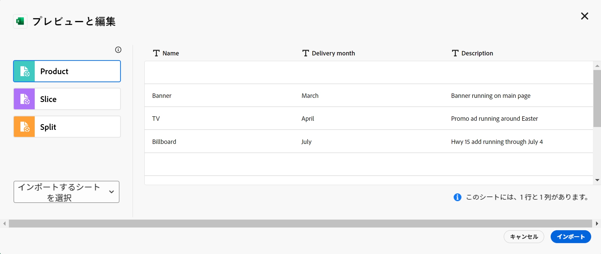
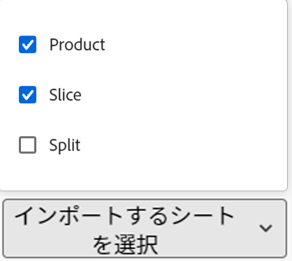

<!--update the metadata with real information when making this available in TOC and in the left nav-->
<!--this is linked to the UI in an empty workspace screen-->

# レコードタイプの作成

{{maestro-important-intro}}

レコードタイプは、Adobe Workfront Planning のオブジェクトタイプです。 Workfront Planning では、組織のライフサイクルで必要な作業に関連するアイテムを示すカスタムレコードタイプを作成できます。
レコードタイプは次のいずれかになります。

レコードタイプについて詳しくは、を参照してください。 [レコードタイプの概要](../architecture/overview-of-record-types-and-taxonomies.md).

## アクセス要件

この記事の手順を実行するには、次のアクセス権が必要です。

<table style="table-layout:auto">
 <col>
 </col>
 <col>
 </col>
 <tbody>
    <tr>
<tr>
<td>
   
 製品
 </td>
   <td> Adobe Workfront
   </td>
  </tr>  
 <td role="rowheader">
Adobe Workfront の契約
</td>
   <td>

Adobe Workfront Planning クローズドベータ版プログラムに登録されている必要があります。 この新しいオファーについては、アカウント担当者にお問い合わせください。 

   </td>
  </tr>
  <tr>
   <td role="rowheader">
Adobe Workfront プラン
</td>
   <td>

任意

   </td>
  </tr>
  <tr>
   <td role="rowheader">
Adobe Workfront ライセンス
</td>
   <td>
   
現在：プラン

   または
   
新規：標準 
 
  </td>
  </tr>

<tr>
   <td role="rowheader">
アクセスレベル設定
</td>
   <td> 
Workfront Planning には、アクセス レベルの制御はありません
  
</td>
  </tr>
<tr>
   <td role="rowheader">
レイアウトテンプレート
</td>
   <td> 
Workfront管理者またはグループ管理者が、レイアウトテンプレートにプランニング エリアを追加する必要があります。 詳しくは、<a href="../access/access-overview.md">アクセス権の概要</a>を参照してください。 
  
</td>
  </tr>
<tr>
   <td role="rowheader">
権限
</td>
   <td> 
ワークスペースに対する権限を管理</a> 
  
   
システム管理者は、自身が作成しなかったワークスペースも含め、すべてのワークスペースに対する権限を持っています。
</td>
  </tr>
 </tbody>
</table>

<!--Maybe enable this at GA - but Planning is not supposed to have Access controls in the Workfront Access Level: 
>[!NOTE]
>
>If you don't have access, ask your Workfront administrator if they set additional restrictions in your access level. For information on how a Workfront administrator can change your access level, see [Create or modify custom access levels](../administration-and-setup/add-users/configure-and-grant-access/create-modify-access-levels.md). -->

<!-- Notes to add for the table: for the "Workfront plans" row: the above is only for closed beta; when going to GA - activate the following plans:    

Current plan: Prime and Ultimate

Legacy plan: Enterprise
-->

<!-- Notes for the table: for the "Workfront access" row: 
For more information, see <a href="../../administration-and-setup/add-users/access-levels-and-object-permissions/wf-licenses.md" class="MCXref xref">Adobe Workfront licenses overview</a>.
-->

## レコードタイプの作成に関する考慮事項

* 以下の方法で、ワークスペースでレコードタイプを作成できます。

   * 自動：
      * テンプレートを使用してワークスペースを作成する場合。

        詳しくは、[ワークスペースの作成](../architecture/create-workspaces.md)を参照してください。

      * Excel または CSV ファイルを使用して読み込む場合。

        >[!IMPORTANT]
        >
        >この機能は、2024 年 3 月 21 日（PT）以降、一時的に無効になりました。 後日有効になります。

     <!--this should not ne known anymore: * When you add objects from another application to a linked record field of a record. This creates a read-only record type in Workfront Planning which is connected to object types from the original application. 
        For information about connecting record types with object types from another application, see [Connect record types](/help/quicksilver/maestro/architecture/connect-record-types.md).
        For information about connecting objects with records, see [Connect records](/help/quicksilver/maestro/records/connect-records.md). -->
   * 手動：

      * 最初から。

        この記事では、レコードタイプを最初から作成する方法について説明します。

* レコードタイプは、セクション内およびワークスペースのあるセクションから別のセクションに移動できます。 あるワークスペースから別のワークスペースにレコードタイプを移動することはできません。

## ワークスペーステンプレートを使用してレコードタイプを作成

Workfront Planning テンプレートを使用してワークスペースを作成する際に、レコード・タイプを自動的に作成できます。 各テンプレートには、サンプルレコードタイプが含まれています。

テンプレートからワークスペースを作成する場合、レコードタイプは次のセクションにグループ化されます。

* 運用中のレコードタイプ
* 分類

運用中のレコードタイプおよび分類セクションの両方で、レコードタイプを手動で追加できます。

ワークスペースの作成については、[ワークスペースの作成](../architecture/create-workspaces.md)を参照してください。

各テンプレートにどのようなレコードタイプが含まれるかについては、[ワークスペーステンプレートのリスト](../architecture/workspace-templates.md)を参照してください。。

## レコードタイプを最初から作成

{{step1-to-maestro}}

最後にアクセスしたワークスペースが、デフォルトで開きます。

1. （オプション）既存のワークスペース名の右側にある下向き矢印を展開し、レコードタイプを作成するワークスペースを選択します。
1. （任意）クリック **セクションを追加** 新規セクションをワークスペースに追加します。
1. 「**レコードタイプを追加**」をクリックします。
1. （条件付き） Excel または CSV ファイルのインポートによるレコードタイプの作成が有効な場合は、 **ゼロから**. そうでない場合、 **レコードタイプを追加** ボックスが開きます。

   

1. 次の情報を更新します。

   * **レコードタイプ名**:「名称未設定の操作レコードタイプ」を、作成しようとしているレコードタイプの名前に置き換えます。
   * **外観**：レコードタイプに関連付けられているアイコンのカラーと形状を定義します。次の操作を実行します。
      * 新しいレコードタイプを識別する色を選択します。これがレコードタイプアイコンの色になります。デフォルトでは、灰色が選択されています。
      * リストからアイコンを選択するか、何を表しているかを示すアイコン名を入力していき、目的のアイコンが表示されたら選択します。これがレコードタイプのアイコンになります。デフォルトでは、ファイルアイコンが選択されています。

1. **レコードタイプを追加**&#x200B;ボックスの外側をクリックして、レコードタイプを保存します。

   レコードタイプカードが、選択したセクションとワークスペースに追加されます。
レコードタイプに含まれているフィールドの数が、カードに表示されます。
1. （オプション）レコードタイプカードをクリックして、レコードタイプページを開きます。

   

   デフォルトでは、レコードタイプページがテーブル表示に表示されます。 テーブルの列は、新しいレコードタイプに関連付けられているフィールドです。各行は追加する必要がある一意のレコードです。

   >[!TIP]
   >
   >    Excel または CSV ファイルからレコードタイプを読み込むと、レコードも読み込まれます。

   デフォルトでは、運用レコードタイプのテーブルビュー列に次のフィールドが表示されます。

   * 名前
   * 説明
   * 開始日
   * 終了日
   * ステータス

1. （オプション）ページのヘッダーのレコードタイプ名を更新します

   または

   レコードタイプ名の右側にある&#x200B;**その他**&#x200B;アイコン  をクリックし、「**名前を変更**」を選択して、名前を変更します。

1. （オプション）「**+ 新規レコード**」をクリックして、選択したレコードタイプのレコードを追加します。詳しくは、[レコードの作成](../records/create-records.md)を参照してください。
1. （オプション）テーブルの右上隅にある「**+**」アイコンをクリックして、レコードタイプにさらにフィールドを追加します。

   フィールドの作成について詳しくは、[フィールドの作成](../fields/create-fields.md)を参照してください。

1. （オプション）レコードタイプ名の左側にあるヘッダーの左向き矢印をクリックして、選択したワークスペースに戻ります。

   レコードタイプカードには、レコードタイプに含まれているフィールドと接続の数が表示されます。

   

   レコードの追加、レコードタイプの削除または編集、レコードタイプページのビューの更新について詳しくは、次の記事を参照してください。

   * [レコードの作成](../records/create-records.md)
   * [レコードタイプの削除](../architecture/delete-record-types.md)
   * [レコードタイプの編集](../architecture/edit-record-types.md)
   * [レコードビューの管理](../views/manage-record-views.md)

1. （オプション）ワークスペースから、レコードタイプカードをクリックして保持し、目的の場所でレコードタイプをドラッグ&amp;ドロップするか、別のセクションに移動します。

   変更内容は自動的に保存されます。

## Excel または CSV ファイルをインポートしてレコードタイプを作成

>[!IMPORTANT]
>
>この機能は、2024 年 3 月 21 日（PT）以降、一時的に無効になりました。 後日有効になります。

Excel または CSV ファイルを使用してレコードタイプをインポートする場合は、次の点を考慮してください。

* Excel ファイルの各シートがレコードタイプになります。
* 各シートの列は、各レコードタイプに関連付けられているフィールドになります。
* フィールドは、それぞれのレコードタイプに固有のものです。
* 各シートの各行は、それぞれのレコードタイプに関連付けられている一意のレコードになります。
* Excel ファイルの各シートは以下を超えないようにします。
   * 50,000 行
   * 500 列
* Excel ファイルは 5 MB を超えないようにします。
* 空のシートはサポートされていません。

Excel ファイルを使用してレコードタイプをインポートするには、次の手順に従います。

{{step1-to-maestro}}

最後にアクセスしたワークスペースが、デフォルトで開きます。

1. （オプション）既存のワークスペース名の右側にある下向き矢印を展開し、レコードタイプを作成するワークスペースを選択します。
1. 「**レコードタイプを追加**」をクリックします。
1. クリック **Excel/CSV**.
1. コンピューターに既に保存されている Excel または CSV ファイルをドラッグ＆ドロップするか、「**CSV または Excel ファイルを選択**」をクリックしてファイルを参照します。
1. 「**データをレビュー**」をクリックします。

   プレビューと編集ボックスに次の情報が表示されます。

   * シートの名前または作成しようとしているレコードタイプの名前が、左パネルに表示されます。Workfront Planning では、新しいレコード・タイプごとにデフォルトでアイコンと色が選択されます。
   * 最初のシートまたはレコードタイプが選択され、それに関連付けられているフィールドの名前が列ヘッダーとして表示されます。各フィールドのタイプはデフォルトで選択されています。
   * 各行は新しいレコードを表します。プレビューと編集ボックスには、最初の 10 レコードのみが表示されます。

   

1. （オプション）左パネルで各シートの名前をクリックして、そこに含まれている情報を確認します。

   >[!NOTE]
   >
   >    空のシートはサポートされておらず、淡色表示されます。

1. （オプション）**インポートするシートを選択**&#x200B;ドロップダウンメニューをクリックし、インポートしないシートの選択を解除します。

   

   選択を解除したシートは、グレーの背景で表示されます。

1. ファイルをインポートする準備ができたら、「**インポート**」をクリックします。

   Workfront Planning に次の情報がインポートされます：

   * 新しいレコードタイプ
   * 各レコードタイプに関連付けられている新しいフィールド
   * 各レコードタイプに関連付けられている新しいレコード

   レコードタイプページでフィールドとレコードの管理を開始できます。

   読み込まれたレコードタイプとその情報をWorkfront Planning にアクセスできるユーザー全員が表示および編集できるようになりました。 <!--this will change with permissions-->

<!--## Connect record types with object types from another application

You can connect a record type and an object type from another application. This creates a read-only record type in Workfront Planning that corresponds to the object type in the other application. 

For example, you can create record types by connecting Workfront Planning record types with Workfront projects. As a result, the Workfront project object type is imported into Workfront Planning as a read-only record type. By default, the record type is named "Workfront Project." (********************)has this name changed? Lusine wanted to change it at some point***********)
    
You can import the following objects from the following applications: 

* From Workfront:

    * Projects
    * Portfolios
    * Programs
    * Company
    * Group

For more information, see [Connect record types](../architecture/connect-record-types.md). 
-->