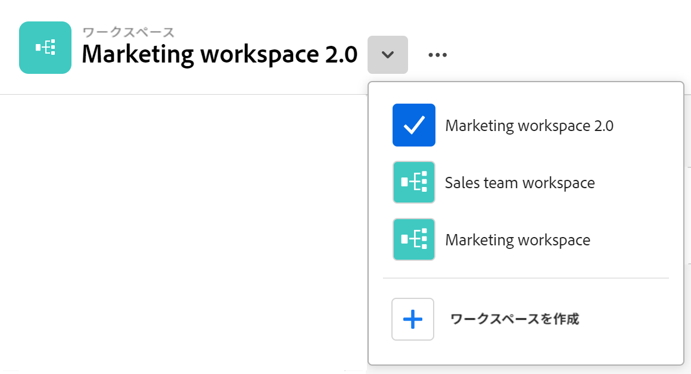

<!--udpate the metadata with real information when making this avilable in TOC and in the left nav-->

# ワークスペースの作成

{{maestro-important-intro}}

Adobe Workfront計画では、ワークスペースは、チームが作業を計画するための一元化された場所です。

ワークスペースは、チームが使用するレコードの種類の集まりで、チームの作業ライフサイクルを表します。 ワークスペースは、Adobe Workfront計画で完全にカスタマイズできます。

## アクセス要件

この記事の手順を実行するには、次のアクセス権が必要です。

<table style="table-layout:auto">
 <col>
 </col>
 <col>
 </col>
 <tbody>
    <tr>
<tr>
<td>
   
 製品
 </td>
   <td>
   
 Adobe Workfront
 </td>
  </tr>  
 <td role="rowheader">
Adobe Workfront協定
</td>
   <td>

組織は、Workfornt Planning クローズ済みベータプログラムにAdobeする必要があります。 この新しいオファーについては、アカウント担当者にお問い合わせください。 

   </td>
  </tr>
  <tr>
   <td role="rowheader">
Adobe Workfront プラン
</td>
   <td>

任意

   </td>
  </tr>
  <tr>
   <td role="rowheader">
Adobe Workfront ライセンス*
</td>
   <td>
   
新規：標準

   または
   
現在：プラン
 
  </td>
  </tr>

<tr>
   <td role="rowheader">
アクセスレベルの設定
</td>
   <td> 
Adobe Workfront Planning には、アクセスレベルの制御はありません

</td>
  </tr>

<tr>
   <td role="rowheader">
権限
</td>
   <td> 
作成したワークスペースに対する管理権限を受け取ります。 
  
</td>
  </tr>

<tr>
   <td role="rowheader">
レイアウトテンプレート
</td>
   <td> 
「計画」領域をレイアウトテンプレートに追加する必要があります。 詳しくは、 <a href="../access/access-overview.md">アクセスの概要</a>. 
  
</td>
  </tr>

</tbody>
</table>

アクセス要件について詳しくは、 [Workfrontドキュメントのアクセス要件](/help/quicksilver/administration-and-setup/add-users/access-levels-and-object-permissions/access-level-requirements-in-documentation.md).

<!--Maybe enable this at GA - but Planning is not supposed to have Access controls in the Workfront Access Level: 
>[!NOTE]
>
>If you don't have access, ask your Workfront administrator if they set additional restrictions in your access level. For information on how a Workfront administrator can change your access level, see [Create or modify custom access levels](../administration-and-setup/add-users/configure-and-grant-access/create-modify-access-levels.md). -->

<!-- Notes to add for the table: for the "Workfront plans" row: the above is only for closed beta; when going to GA - activate the following plans:    

Current plan: Prime and Ultimate

Legacy plan: Enterprise
-->

<!-- Notes for the table: for the "Workfront access" row: 
For more information, see <a href="../../administration-and-setup/add-users/access-levels-and-object-permissions/wf-licenses.md" class="MCXref xref">Adobe Workfront licenses overview</a>.
-->

## ワークスペースに関する考慮事項

* 各単位の固有の動作方法に合わせて、組織内の特定の組織単位のワークスペースを作成できます。
* ワークスペースに含まれるレコードタイプは、組織単位の作業ライフサイクルを反映する必要があります。
* ワークスペースを作成する場合、自分だけがワークスペースにアクセスし、管理する権限を持っています。 他のユーザーと同じスペースで共同作業を行うには、ユーザーと共有する必要があります。 詳しくは、 [ワークスペースの共有](/help/quicksilver/maestro/access/share-workspaces.md). システム管理者は、作成しなかったワークスペースも含め、すべてのワークスペースを管理できます。
* 組織のWorkfrontインスタンスには、最大 1,000 個のワークスペースを含めることができます。
* ワークスペースには、各ワークスペースに固有のレコードタイプが含まれます。 <!--this might change-->

## ワークスペースの作成

{{step1-to-maestro}}

1. （条件付き）環境にワークスペースがない場合、 **ワークスペースを作成**

   または、既存のワークスペースから、ワークスペース名の右側を下向きでクリックし、 **ワークスペースを作成**.

   

   これにより、Workfront計画の「ワークスペース」領域が開きます。
1. （オプションおよび条件付き）「 **プレビュー** 次の事前定義済みの workspace テンプレートのいずれかに含まれます。

   * マーケティング管理
   * セールス管理
   * 製品管理

   オペレーショナル・レコードのタイプ、分類、および各テンプレートに関連付けられているフィールドの数を示します。

   

   Workfront planning workspace テンプレートについて詳しくは、 [Workspace テンプレートのリスト](../architecture/workspace-templates.md).

1. クリック **テンプレートを使用** 選択したテンプレートからワークスペースの作成を開始するには

   または

   クリック **ワークスペースを作成** をクリックして、ワークスペースをゼロから作成します。

   次のタイプのワークスペース用の 1 つが作成されます。

   * 空のワークスペース。ゼロからワークスペースを作成する際に、レコードタイプの手動で追加を開始できます。
   * サンプルレコードタイプが設定されたワークスペース。テンプレートの 1 つを使用する際に、さらにカスタマイズできます。

1. 新しいワークスペースのヘッダーにあるワークスペース名の中をクリックして名前を変更し、Enter キーを押します。

   または

   次をクリック： **その他** メニュー をクリックし、 **名前を変更**.

1. （オプションおよび条件付き）ワークスペースに既にセクションがある場合は、 **セクションを追加** をクリックして、新しいセクションをワークスペースに追加します。 1 つのセクションに複数のレコードタイプを含めることができます。

1. （オプションおよび条件付き）ワークスペースをテンプレートから作成した場合、 **オペレーショナルレコードのタイプ** または **分類** セクション

   または

   セクションの名前にマウスポインターを置いて、 **その他** メニュー を選択し、次に **名前を変更** をクリックして、セクションの名前を変更します。

   >[!TIP]
   >
   >セクションを作成した場合でも、任意のワークスペースから任意のセクションの名前を変更できます。

1. （オプション）セクションの場所を変更するには、次のいずれかの操作を行います。

   * セクション名の上にマウスポインターを置いて、 **つかむ** アイコン をクリックし、右側のスポットにドラッグ&amp;ドロップします。
   * セクション名の上にマウスポインターを置いて、 **その他** メニュー を選択し、次に **上に移動** または **下に移動**. セクションは、ワークスペース内で上下に移動します。

1. （オプション）新しいセクションを追加するには、次のいずれかの操作を行います。

   * クリック **セクションを追加** ワークスペースの下部に表示されます。
   * セクション名の上にマウスポインターを置いて、 **その他** メニュー を選択し、次に **上にセクションを追加** または **下にセクションを追加**.

1. （オプション）「 **レコードタイプを追加** をクリックして、レコードタイプをワークスペースに追加します。

   詳しくは、 [レコードタイプの作成](../architecture/create-record-types.md).

