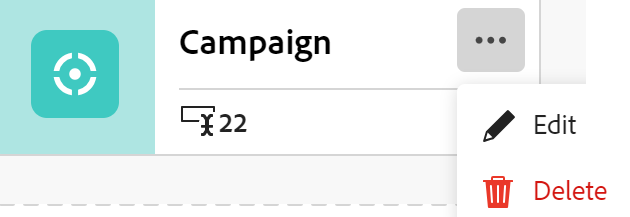

<!--update the metadata with real information when making this available in TOC and in the left nav
---
title: Edit record types
description: You can edit record types after they have been saved. Record types are the object types of Adobe Workfront Planning.
author: Alina
role: User
feature: Work Management 
topic: Architecture
hidefromtoc: yes
hide: yes
---

-->

# レコードタイプの編集

{{planning-important-intro}}

レコードタイプは、Adobe Workfront Planning のオブジェクトタイプです。自分または他のユーザーが作成したレコードタイプの外観を編集できます。Workfront Planning レコードタイプの作成について詳しくは、[レコードタイプの作成](../architecture/create-record-types.md)を参照してください。

## アクセス要件

この記事の手順を実行するには、次のアクセス権が必要です。

<table style="table-layout:auto">
 <col>
 </col>
 <col>
 </col>
 <tbody>
    <tr>
<tr>
<td>
   
 製品
 </td>
   <td>
   
 Adobe Workfront
 
Adobe Workfront Planning のレコードタイプを Experience Manager Assets に接続するには、Adobe Experience Manager Assets ライセンスが必要です。組織の Workfront インスタンスが Adobe Business Platform または Adobe Admin Console にオンボーディングされている必要があります。
 </td>
  </tr>  
 <td role="rowheader">
Adobe Workfront の契約
</td>
   <td>

Workfront Planning の早期アクセス段階に登録されている必要があります 

   </td>
  </tr>
  <tr>
   <td role="rowheader">
Adobe Workfront プラン
</td>
   <td>

任意

   </td>
  </tr>
  <tr>
   <td role="rowheader">
Adobe Workfront ライセンス
</td>
   <td>
   
任意
 
  </td>
  </tr>

<tr>
   <td role="rowheader">
アクセスレベル設定
</td>
   <td> 
Workfront Planning に対するアクセスレベルのコントロールはありません
  
</td>
  </tr>

<tr>
   <td role="rowheader">
権限
</td>
   <td> 
ワークスペースに対する権限を管理</a> 
  
   
システム管理者は、自身が作成しなかったワークスペースも含め、すべてのワークスペースに対する権限を持っています。
</td>
  </tr>
<tr>
   <td role="rowheader">
レイアウトテンプレート
</td>
   <td> 
Workfront 管理者やグループ管理者は、レイアウトテンプレートに Planning エリアを追加する必要があります。詳しくは、<a href="../access/access-overview.md">アクセス権の概要</a>を参照してください。 
  
</td>
  </tr>

</tbody>
</table>

<!--Maybe enable this at GA - but Planning is not supposed to have Access controls in the Workfront Access Level: 
>[!NOTE]
>
>If you don't have access, ask your Workfront administrator if they set additional restrictions in your access level. For information on how a Workfront administrator can change your access level, see [Create or modify custom access levels](../administration-and-setup/add-users/configure-and-grant-access/create-modify-access-levels.md). -->

## レコードタイプの編集

{{step1-to-maestro}}

最後にアクセスしたワークスペースが、デフォルトで開きます。

1. （オプション）既存のワークスペース名の右側にある下向き矢印を展開し、レコードタイプを編集するワークスペースを選択します。
1. レコードタイプのカードにポインタを合わせて、 **詳細** メニュー  レコードタイプカードの右上隅のをクリックします **編集**.

   

1. が含まれる **レコードタイプを編集** ボックスで、次の情報を更新します。

   * 必要に応じて、レコードタイプ名を編集します。 <!--did they add a field label for this? -->
   * **説明**：レコードタイプの説明を編集または追加し、その詳細を設定します。
   * レコードタイプに関連付けられたアイコンの色と形状を編集します。 次の操作を実行します。
      * レコードタイプを識別する色を選択します。これがレコードタイプアイコンの色になります。デフォルトでは、灰色が選択されています。
      * リストからアイコンを選択するか、何を表しているかを示すアイコン名を入力していき、目的のアイコンが表示されたら選択します。これがレコードタイプのアイコンになります。デフォルトでは、ファイルアイコンが選択されています。

     

1. 「**保存**」をクリックします。
1. （オプション）ワークスペースエリアでレコードタイプカードをクリックして、レコードタイプのページを開きます。
1. 「」をクリックします **詳細** レコードタイプ名の右側にあるメニューをクリックし、 **編集** レコードタイプに関する情報を更新します。

   >[!TIP]
   >
   >   ヘッダーでレコードタイプの名前を変更できます。

   

   <!--check this screen shot - not sure this is valid ???-->

1. （オプション）レコードタイプ名の右側にある下向き矢印を展開し、別のレコードタイプを選択して編集します。
