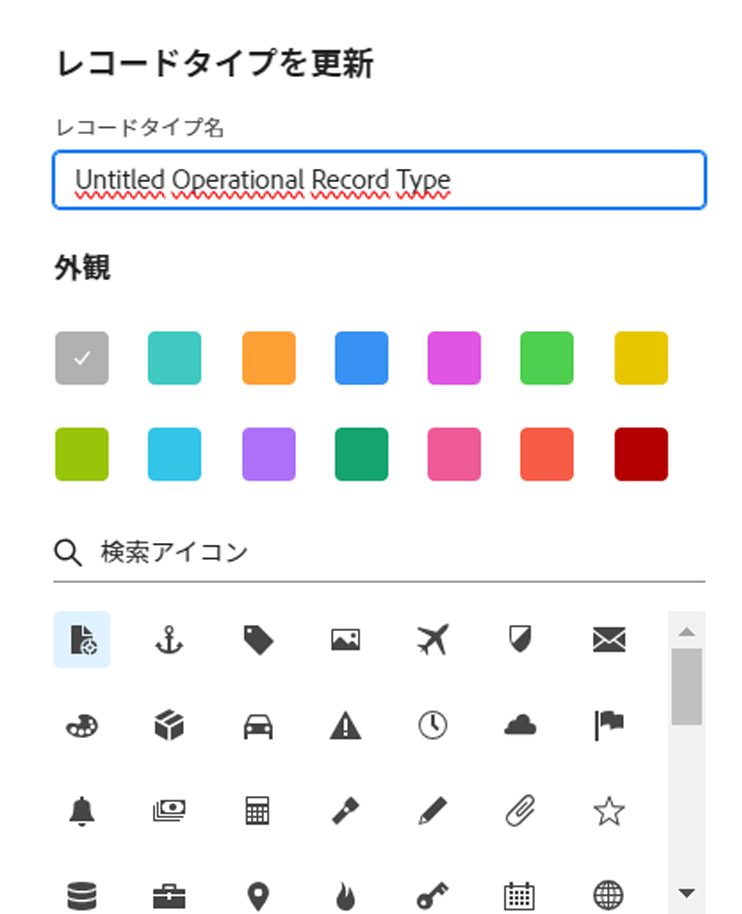

<!--update the metadata with real information when making this available in TOC and in the left nav
---
title: Edit record types
description: You can edit record types after they have been saved. Record types are the object types of Adobe Workfront Planning.
author: Alina
role: User
feature: Work Management 
topic: Architecture
hidefromtoc: yes
hide: yes
---

-->

# レコードタイプを編集

{{maestro-important-intro}}

レコード・タイプは、Adobe Workfront Planning のオブジェクト・タイプです。 自分または他のユーザーが作成したレコードタイプの外観を編集できます。 Workfront Planning のレコードタイプの作成の詳細は、 [レコードタイプの作成](../architecture/create-record-types.md).

## アクセス要件

この記事の手順を実行するには、次のアクセス権が必要です。

<table style="table-layout:auto">
 <col>
 </col>
 <col>
 </col>
 <tbody>
    <tr>
<tr>
<td>
   
 製品
 </td>
   <td>
   
 Adobe Workfront
 
Adobe Workfront Planning のレコードタイプをExperience Manager Assetsに接続するには、Adobe Experience Manager Assetsライセンスが必要です。組織のWorkfrontインスタンスをAdobeビジネスプラットフォームまたはAdobe Admin Consoleにオンボーディングする必要があります。
 </td>
  </tr>  
 <td role="rowheader">
Adobe Workfront協定
</td>
   <td>

組織は、Adobe Workfront Planning クローズ済みベータプログラムに登録されている必要があります。 この新しいオファーについては、アカウント担当者にお問い合わせください。 

   </td>
  </tr>
  <tr>
   <td role="rowheader">
Adobe Workfront プラン
</td>
   <td>

任意

   </td>
  </tr>
  <tr>
   <td role="rowheader">
Adobe Workfront ライセンス
</td>
   <td>
   
任意
 
  </td>
  </tr>

<tr>
   <td role="rowheader">
アクセスレベル設定
</td>
   <td> 
Workfront Planning には、アクセスレベルの制御はありません
  
</td>
  </tr>

<tr>
   <td role="rowheader">
権限
</td>
   <td> 
ワークスペースに対する権限の管理</a> 
  
   
システム管理者は、作成しなかったワークスペースも含め、すべてのワークスペースに対する権限を持っています
</td>
  </tr>
<tr>
   <td role="rowheader">
レイアウトテンプレート
</td>
   <td> 
Workfrontまたはグループ管理者は、レイアウトテンプレートに計画領域を追加する必要があります。 詳しくは、 <a href="../access/access-overview.md">アクセスの概要</a>. 
  
</td>
  </tr>

</tbody>
</table>

<!--Maybe enable this at GA - but Planning is not supposed to have Access controls in the Workfront Access Level: 
>[!NOTE]
>
>If you don't have access, ask your Workfront administrator if they set additional restrictions in your access level. For information on how a Workfront administrator can change your access level, see [Create or modify custom access levels](../administration-and-setup/add-users/configure-and-grant-access/create-modify-access-levels.md). -->

## レコードタイプを編集

{{step1-to-maestro}}

最後にアクセスしたワークスペースは、デフォルトで開きます。

1. （オプション）既存のワークスペース名の右側にある下向き矢印を展開し、レコードタイプを編集するワークスペースを選択します。
1. レコードタイプのカードの上にマウスポインターを置いて、 **その他** メニュー  レコードタイプカードの右上隅にあるをクリックし、 **外観を更新**.

   

1. Adobe Analytics の **レコードタイプを更新** ボックスで、次の情報を更新します。

   * **レコード名**：必要に応じて、レコードタイプ名を編集します。 <!--correct this - I asked Garik to change this field to "Record type name"-->
   * **外観**：レコードタイプに関連付けられたアイコンの色と形状を編集します。 次の操作を実行します。
      * レコードの種類を識別する色を選択します。 これは、レコードタイプアイコンの色です。 デフォルトでは「グレー」が選択されています。
      * リストからアイコンを選択するか、アイコンの名前を入力して内容を説明し、表示されたときに選択します。 これは、レコードタイプのアイコンです。 デフォルトでは、ファイルアイコンが選択されています。

     

1. の外側をクリック **レコードタイプを更新** 」ボックスを使用して変更を保存します。
1. （オプション）ワークスペース領域でレコードタイプカードをクリックして、レコードタイプのページを開きます。
1. 次をクリック： **その他** レコードタイプ名の右にあるメニューをクリックし、 **名前を変更** レコードタイプの名前を変更するには

   または

   ヘッダーのレコードタイプの名前を変更します。  <!--check to see if they renamed this to "Rename" - it kept going back and forth between Rename and Edit-->

    <!--check this screen shot - not sure this is valid ???-->

   レコードタイプのページのヘッダーでレコードタイプの名前を変更することもできます。
1. （オプション）レコードタイプ名の右側にある下向き矢印を展開し、編集する別のレコードタイプを選択します。
