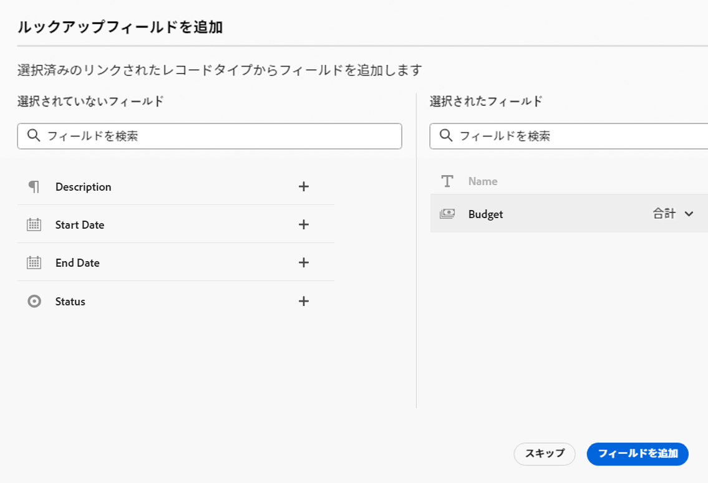
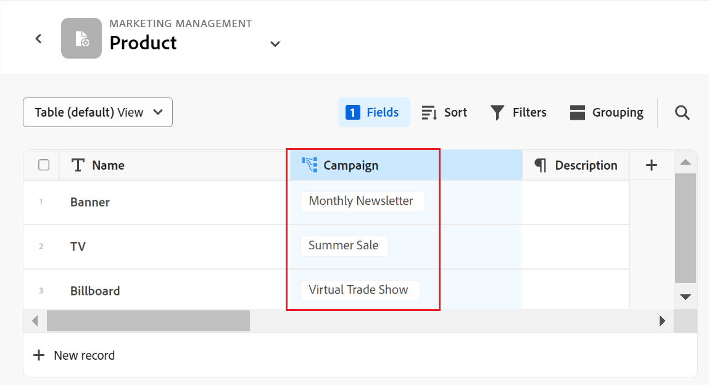
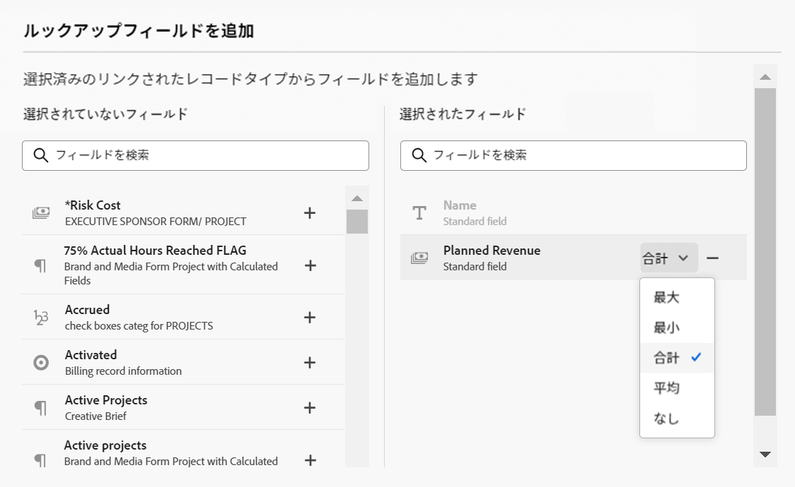

# レコードタイプとレコードの接続例

{{maestro-important-intro}}

この記事では、次の例を説明します。

* 2 つの Maestro レコードタイプと 2 つの Maestro レコード間の接続を作成する方法。

* Adobeの Maestro レコードタイプとWorkfrontプロジェクトオブジェクトタイプの間の接続、および Maestro レコードとプロジェクトの間の接続を作成する方法。

詳しくは、次の記事も参照してください。

* [レコードタイプを接続](../architecture/connect-record-types.md)
* [レコードを接続](../records/connect-records.md)

## 2 つの Maestro レコードタイプとレコードを接続する（例）

例えば、元のレコードタイプとして Campaign という名前のレコードタイプがあるとします。

また、Product という別のレコードタイプもあり、Budget という通貨フィールドを持ちます。

Campaign のレコードタイプにフィールドを作成し、レコードタイプ「Product」の「Budget」フィールドの値を表示できます。

手順は次のとおりです。

1. ワークスペースでキャンペーンレコードタイプのテーブルビューを開きます。
1. 次をクリック： **+** テーブル表示の右上隅にあるアイコンを使用して新しいフィールドを追加し、「 **新しい接続**&#x200B;を選択し、次に **製品** 」をクリックします。
1. 次の情報を追加します。例：

   * **レコードタイプ**：製品 <!--did they change the casing here?-->
   * **名前**：製品情報。 これは、リンクされたレコードフィールドの名前です。
   * **説明**：キャンペーンを関連付けたい製品です。
   * **複数のレコードを許可**：このオプションを選択したままにすると、リンクされたレコードタイプのフィールド（製品情報）が元のレコード（キャンペーン）に表示される場合に、ユーザーは複数のレコードを選択できます。 この場合、1 つのキャンペーンに接続する複数の製品を選択できます。
   * **参照フィールドを選択**：このオプションを選択したままにした場合、 **参照フィールドを追加** ボックスが開き、製品フィールドをキャンペーンのレコードタイプにリンクできます。 次をクリックできます。 **スキップ** この手順をスキップし、後で製品フィールドを追加するには、を参照してください。

   

1. （条件付き） **「ルックアップフィールドを選択」オプション** 前の手順で、 **製品** レコードのタイプを選択する場合は、 **+** アイコン **予算** 「 」フィールドで「 」をクリックし、 **フィールドを追加**. これにより、 **予算（製品情報から）**：リンクされたフィールドの名前です。 製品予算の情報は、キャンペーンレコードのこのフィールドに表示されます。

   

   >[!TIP]
   >
   >    選択したすべての製品の予算を合計 1 つの数として表示する場合は、 **SUM** 」と入力します。 ユーザーが **製品情報** リンクされたレコードフィールド **予算（製品情報から）** 「 」フィールドでは、すべての予算値が加算され、合計が表示されます。 <!-- check the shot below - added a bug with a couple of UI changes here-->
   >
   > 次を選択した場合、 **なし**&#x200B;の代わりに **SUM**&#x200B;に設定すると、個々の予算がコンマで区切って表示されます。

   これにより、次のフィールドが生成されます。

   * キャンペーンのレコードテーブルビューと詳細ページで、以下の操作をおこないます。

      * **製品情報** （リンクされたレコードフィールド）：製品の名前または名前が表示されます。
      * **予算（製品情報から）** （リンクされたフィールド）:「製品の情報」フィールドで選択した製品の予算が表示されます。

   * [ 商品レコード ] テーブルビューおよび商品の [ 詳細 ] ページで、次の操作を行います。

      * **Campaign**：これは、製品レコードタイプがキャンペーンレコードタイプからリンクされていることを示します。

     

   >[!TIP]
   >
   >    リンクされたレコードフィールドの前には関係アイコンが付きます .

1. 次から： **Campaign** レコードタイプのテーブルビューで、「キャンペーンレコードタイプ」ページのテーブルに新しい行を追加して、キャンペーンを作成します。

1. 内側をダブルクリック  **製品情報** 新しいキャンペーンの列。

   

1. 次のいずれかの操作を行います。

   * リストから接続されている製品の名前をクリックして、選択したレコードに追加します。 製品は自動的に追加されます。
   * 製品の名前を入力し、リストに表示されたらクリックします。 製品は自動的に追加されます。
   * クリック **すべてを表示** すべての製品を表示します。

1. （条件付き）クリックした場合 **すべて選択** 前の手順では、 **オブジェクトの接続** ボックスが表示されます。

   

1. 検索ボックスに商品の名前を入力し始め、商品がリストに表示されたら選択します

   または

   キャンペーンレコードに接続する製品レコードを選択し、 **オブジェクトの接続**.

   >[!TIP]
   >
   >    キャンペーンの詳細ページを開き、リンクされたレコードフィールドを見つけて、 **+** アイコンをクリックして、接続された「製品」レコードタイプから製品を追加します。

   次の列が、キャンペーンレコードタイプのテーブルに入力されます。
   * The **製品情報** フィールドは、選択した製品でキャンペーンレコードに入力されます。
   * **予算（製品情報から）** 「 」フィールドには、選択した各製品の予算値が入力されます。または、選択した製品の全予算の合計が入力されます（集計に対して SUM を選択した場合）。

   

   >[!TIP]
   >
   >複数の値に対して集計を選択しない場合、すべての値がコンマで区切って表示されます。

1. 次の手順で **Campaign** フィールド **製品** 表ビューで、「製品レコードタイプ」の表ビューから開始し、キャンペーン情報を選択する手順 5～7 を繰り返します。 これにより、キャンペーンレコードタイプページのテーブルの「製品情報」フィールドも更新されます。 <!--ensure the step numbers remain correct-->

## Maestro レコードタイプをWorkfrontプロジェクトオブジェクトタイプに接続し、レコードを個々のプロジェクトに接続する

例えば、元のレコードタイプとして Campaign という名前のレコードタイプがあるとします。

また、Workfrontには「計画収益」と呼ばれるフィールドを持つプロジェクトがあります。

レコードタイプのキャンペーンの接続フィールドを作成し、Maestro のキャンペーンに関連するWorkfrontのプロジェクトの「計画収益」フィールドの値を表示できます。

手順は次のとおりです。

1. Campaign レコードタイプをWorkfrontプロジェクトに接続するワークスペースに移動します。
1. 選択したワークスペースで、キャンペーンレコードタイプのテーブルビューを開きます。
1. 次をクリック： **+** テーブル表示の右上隅にあるアイコンを使用して新しいフィールドを追加し、「 **新しい接続**&#x200B;を選択し、次に **プロジェクト** （内） **Workfrontオブジェクトタイプ** 」セクションに入力します。
1. 次の情報を追加します。例：

   * **レコードタイプ**:Workfrontプロジェクト (Workfrontサブセクションから )
   * **名前**：プロジェクト情報。 これは、リンクされたオブジェクトフィールドに名前を付けることができる例です。
   * **説明**：キャンペーンを関連付けたいプロジェクトです。 これは、接続されたレコードフィールドの説明の例です。
   * 
      * **複数のレコードを許可**：このオプションを選択したままにすると、リンクされたプロジェクトタイプフィールド（プロジェクト情報）が元のレコード（キャンペーン）に表示される場合に、ユーザーは複数のプロジェクトを選択できます。
   * **参照フィールドを選択**：このオプションを選択したままにした場合、 **参照フィールドを追加** ボックスが開き、「プロジェクト」フィールドをキャンペーンレコードタイプとリンクできます。 次をクリックできます。 **スキップ** この手順をスキップし、後でプロジェクトフィールドを追加するには、次の手順を実行します。

   

1. （条件付き） **「ルックアップフィールドを選択」オプション** 前の手順で、 **プロジェクト** オブジェクトタイプを選択する場合は、 **+** アイコン **計画収益** 「 」フィールドで「 」をクリックし、 **フィールドを追加**. これにより、 **計画収益（プロジェクト情報から）**：リンクされたフィールドの名前です。 「プロジェクト計画売上高」フィールドの情報は、キャンペーンレコードのこのフィールドに自動的に表示されます。

   >[!TIP]
   >
   >    選択したすべてのプロジェクトの計画収益を合計 1 つとして表示する場合は、 **SUM** 」と入力します。 ユーザーが **プロジェクト情報** リンクされたオブジェクトフィールド、 **計画収益（製品情報から）** 「 」フィールドではすべての値が加算され、合計が表示されます。 <!-- check the shot below - added a bug with a couple of UI changes here-->
   >
   > 次を選択した場合、 **なし**&#x200B;の代わりに **SUM**&#x200B;に設定すると、個々の計画売上高がコンマで区切られて表示されます。

   

   これにより、次のフィールドが生成されます。

   * キャンペーンのレコードテーブルビューと詳細ページで、以下の操作をおこないます。

      * **プロジェクト情報** （リンクされたオブジェクトフィールド）：プロジェクトの名前または名前が表示されます。
      * **計画収益（プロジェクト情報から）** （リンクされたフィールド）:「プロジェクト情報」フィールドで選択したプロジェクトの計画売上高が表示されます。

   >[!TIP]
   >
   >    リンクされたオブジェクトフィールドの前には、関係アイコンが付きます .

1. 次から： **Campaign** レコードタイプのテーブルビューで、テーブルに新しい行を追加してキャンペーンを作成します。

1. 内側をダブルクリック  **プロジェクト情報** 新しいキャンペーンの列。

   

1. 次のいずれかの操作を行います。

   * リストからプロジェクトの名前をクリックして、選択したレコードに追加します。 プロジェクトが自動的に追加されます。
   * プロジェクトの名前を入力し、リストに表示されたらクリックします。 プロジェクトが自動的に追加されます。
   * クリック **すべてを表示** をクリックして、すべてのプロジェクトを表示します。

1. （条件付き）クリックした場合 **すべて選択** 前の手順では、 **オブジェクトの接続** ボックスが表示されます。

   

1. 検索ボックスにプロジェクトの名前を入力し、リストに表示されたら選択します

   または

   キャンペーンレコードに接続するプロジェクトレコードを選択し、「 **オブジェクトの接続**.

   >[!TIP]
   >
   >    キャンペーンの詳細ページを開き、リンクされたプロジェクトフィールドを見つけて、 **+** アイコンをクリックして、接続された製品レコードタイプからプロジェクトを追加します。

   これにより、選択したワークスペースに次の情報が追加されます。

   * キャンペーンレコードタイプテーブルで、以下の操作を実行します。
      * The **プロジェクト情報** 「 」フィールドには、選択したプロジェクトがキャンペーンレコードに入力されます。
      * The **計画収益（製品情報から）** 「 」フィールドには、選択した各製品の予算値が入力されます。 これは読み取り専用フィールドです。

   

   >[!TIP]
   >
   >複数の値の集計を選択せずに、オブジェクトリンクフィールドで複数のオブジェクトを選択すると、すべての値がコンマで区切って表示されます。

1. [ 接続されたレコード ] フィールドで、プロジェクトの名前をクリックします。

   読み取り専用の Maestro プロジェクトの **詳細** ページに貼り付けます。
プロジェクトに関する情報を確認します。 選択したプロジェクトフィールドのみが「詳細」ページに表示されます。

1. クリック **ソースに移動** （少なくともプロジェクトに対する表示権限を持っている場合） Workfrontでプロジェクトを開くための画面の右上隅。
1. （オプション） Workfrontのプロジェクトに関する情報を更新します（更新する権限がある場合）。

1. キャンペーンテーブルビューで、 **プロジェクト情報** フィールドヘッダーをクリックし、下向き矢印をクリックして、 **参照フィールドを編集します。**
1. 次をクリック： **+** Workfront Project Maestro レコードに追加するプロジェクトフィールドのアイコン **未選択のフィールド** 」セクションに入力します。
1. 次をクリック： **-** Workfront Project Maestro レコードから削除するプロジェクトフィールドのアイコン ( **選択したフィールド** 」セクションに入力します。
1. 「**保存**」をクリックします。

   追加のリンクされたフィールドは、キャンペーンのレコードタイプに追加されます。
