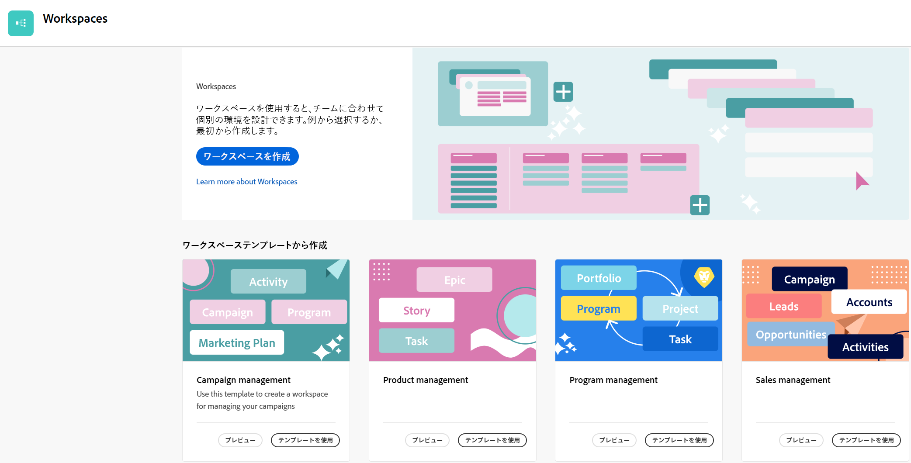
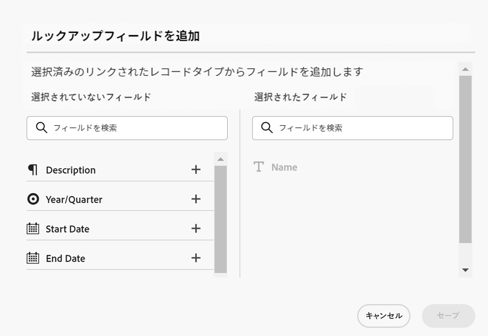

# Adobe Workfront planning capabilities の概要

<!--udpate the metadata with real information when making this avilable in TOC and in the left nav-->

<!-- remove the references to closed beta from the entire article-->

<!--update the video in the IMPORTANT below, when we have something better, especially after Open Beta - remove it-->

>[!IMPORTANT]
>
>この記事の情報は、Adobe Workfrontの新しいオファーであるAdobe Workfrontの計画機能に関するものです。
>
>現在、計画機能は、限られた数のお客様に対してオープンなベータプログラムの一部です。 これらの機能を使用するには、Workfrontのユーザーである必要があります。
>
>計画機能のベータプログラムへの参加について詳しくは、アカウント担当者にお問い合わせください。
>[Adobe Workfrontの計画機能を示すビデオを視聴します。](https://video.tv.adobe.com/v/3424253/){target=_blank}

## Adobe Workfront計画機能の概要

Adobe Workfrontの計画機能は、Adobe Workfrontの新しい機能です。 プランニング機能の目的は、組織の運用上の詳細を包括的に把握し、作業管理ライフサイクルの各段階で重要なビジネス上の質問に答えることです。

チームやリーダーシップは、次のような質問に対する明確な回答を必要とします。

* 第 4 四半期に EMEA で実行しているキャンペーンの数は？
* 同時キャンペーンの間にオーディエンスの重複はありますか？
* 認知プログラムは今どの程度順調に進んでいるのでしょうか？
* 特定のキャンペーンのアセットはどのように表示されますか？ どちらがまだ承認を受ける必要がありますか？

これらの質問に答えるために、リーダーシップは、計画から実行、配信から結果の測定まで、あらゆる作業段階の全体像を提供できるソリューションを必要とします。 現在、組織はプロセスの一部をカバーできるツールを持っていますが、多くの場合、作業のすべての段階に対して適切な接続を持たず、確実に結果を提供することもできません。

主な機能の一部を次に示します。

* 作業プロセスに参加するすべてのステージおよびすべての関係者に対して、作業を管理するという問題を解決します。
* 組織で使用するオブジェクトの種類（またはレコードの種類）を決定して、これらのオブジェクトを相互にリンクする方法を設定することで、ワークフローを完全にカスタマイズします。
* 他のシステムのオブジェクトタイプにリンクし、すべてのプロセスに対して一貫性のあるフレームワークを作成します。

## 現在利用可能なAdobe Workfront Planning 機能

次の表に、計画機能で使用可能な主な機能と、その使用可能なタイムラインを示します。 このリストには、すべての機能が含まれているわけではありません。

新機能とリリース日について詳しくは、 [Adobe Workfront planning 機能リリースアクティビティ](/help/quicksilver/maestro/release-activity.md).

| 機能 | 利用可能 | 近日中に利用可能 | 調査中 |
|----------------------------------------------------|:-----------------------------:|:--------------------------------:|:----------------:|
| ワークスペースの作成 | ✓ |                                  |                  |
| オペレーショナルレコードタイプの作成 | ✓ |                                  |                  |
| 分類の作成 | ✓ |                                  |                  |
| 個々の名前付きレコードと分類を作成 | ✓ |                                  |                  |
| レコードのカスタムフィールドを作成 | ✓ |                                  |                  |
| Excel または CSV ファイルを使用してレコードの種類とフィールドをインポートする | ✓ |                                  |                  |
| レコードをリンク | ✓ |                                  |                  |
| テーブル内のレコードの表示 | ✓ |                                  |                  |
| タイムラインでのレコードの表示 | ✓ |                                  |                  |
| レコードのフィルタリング | ✓ |                                  |                  |
| タイムラインビューでのレコードのグループ化 | ✓ |                                  |                  |
| テーブルビューでのレコードのグループ化 | ✓ |                                 |                  |
| テーブルビューでのレコードの並べ替え | ✓ |                                 |                  |
| タイムラインビューでのレコードの並べ替え |                               | ✓ |                  |
| テーブル表示でのグループの並べ替え |                               | ✓ |                  |
| タイムライン表示でのグループの並べ替え |                               | ✓ |                  |
| ワークスペースの接続 |                               | ✓ |                  |
| プランニング機能のレコードと分類の接続 | ✓ |
| テーブルビューでのレコードの検索 | ✓ |   |
| タイムラインビューでのレコードの検索 | ✓ |   |
| 計画機能レコードをWorkfrontプロジェクト、プログラム、ポートフォリオ、会社、グループに接続 | ✓ |                                 |                  |
| 計画機能レコードのAdobe Experience Manager Assets への接続 | ✓ |                                  |                 |
| レコードの詳細ページ | ✓ |                                  |                  |
| レコードの詳細ページのレイアウトを更新します |                               | ✓ |                  |
| ワークスペースの共有 | ✓ | |  |
| ビューの共有 | ✓ | |  |
| リクエストの送信 |                               |                                  | ✓ |
| クリエイティブの概要 |                               |                                  | ✓ |
| レコードの色とアイコンのカスタマイズ | ✓ |                                  |                 |
| レコードにコメントを追加 | ✓ |                                  |                 |
| レコードにサムネールを追加 | ✓ |                                  |                 |
| レコードの変更履歴を表示 | ✓ |                                  |                 |
| 段落フィールドのリッチテキスト書式設定 | ✓ |                                  |                 |
| Adobe Workfront Fusion 用Adobe Workfront Planning 機能モジュール | ✓ |                                  |                 |
| あるフィールドから別のフィールドに情報をコピーして貼り付けます。 | ✓ |                                  |                 |

## Workfrontインスタンスでのユーザーに対するAdobe Workfront Planning 機能の有効化

組織は、計画機能にアクセスする前に、Adobe Workfront Planning 機能クローズ済みベータ・プログラムに登録する必要があります。 ベータ版プログラムへの登録について詳しくは、アカウント担当者にお問い合わせください。

へのアクセス権の付与と、他のユーザーによる計画機能の使用に関する詳細は、 [アクセスの概要](/help/quicksilver/maestro/access/access-overview.md).

## Adobe Workfront planning cappalities の用語

計画機能はWorkfrontに含まれていますが、独自の概念と用語が付属しています。 組織の計画機能の設定に着手する前に、計画機能の概念に精通していることを確認してください。

計画機能のフレームワークは完全にカスタマイズ可能です。 組織のニーズに合わせて、すべてのレコードタイプ、その属性、および関連付けられたフィールドを作成できます。

主な計画機能オブジェクトと概念は次のとおりです。

* **Workspace**：特定の組織の運用ライフサイクルを定義するレコードタイプと分類のコレクションです。 ワークスペースは、組織単位の作業枠です。

  1 つのWorkfrontインスタンスに最大 1,000 個のワークスペースを設定できます。

  

  詳しくは、 [ワークスペースの作成](../maestro/architecture/create-workspaces.md).

* **レコードタイプ**：主な計画機能のオブジェクト・タイプ。

  オブジェクト・タイプが事前に定義されているWorkfrontとは異なり、計画機能では、独自のオブジェクト・タイプを作成できます。

  例えば、Workfrontでは、プログラム、Portfolio、プロジェクト、タスク、またはイシューのオブジェクトの種類が既に作成されています。

  計画機能では、組織のワークフローに合う任意のレコードタイプを作成できます。 後で、レコードの種類を相互に関連付けたり、フォームの依存関係を定義したりできます。

  詳しくは、 [オペレーショナル・レコード・タイプと分類の概要](../maestro/architecture/overview-of-record-types-and-taxonomies.md).

  計画機能には次のレコード・タイプがあります。

   * **オペレーショナルレコードの種類**：戦略計画、イニシアチブまたは実行済みの作業を表すレコードタイプ。

     

     例えば、キャンペーン、アクティビティ、プログラムは、運用レコードのタイプにすることができます。

     詳しくは、 [レコードタイプの作成](../maestro/architecture/create-record-types.md).

   * **分類**：操作レコードタイプに関する属性をキャプチャするレコードタイプ。

     

     分類の作成は、オペレーショナル・レコード・タイプの作成と同じですが、プランニング機能では、オペレーショナル・レコード・タイプと分類レコード・タイプが区別されます。 分類の目的は、オペレーショナル・レコード・タイプを強化することです。 <!--this is no longer true, but might be later?!: A taxonomy is a record without dates, like a static list of attributes.-->

     例えば、Audience、Region、Address は、分類タイプのレコードタイプにすることができます。

     詳しくは、 [分類レコードタイプの作成](../maestro/architecture/create-a-taxonomy.md).

* **レコード**：計画機能レコードタイプのインスタンス。 レコードは、オペレーショナルレコードタイプまたは分類を指す場合があります。

  
  

  レコードタイプをワークスペースに追加した後、そのタイプのレコードをレコードタイプのページに追加できます。

  例えば、「キャンペーン」は運用レコードタイプ、「EMEA 向け夏キャンペーン」はキャンペーンレコードタイプのレコードです

  または

  「地域」は分類タイプのレコードタイプで、「南北アメリカおよび中南米」は分類レコードです。「EMEA — 中央ヨーロッパ」は分類レコードです。

  詳しくは、 [レコードを作成](../maestro/records/create-records.md).

* **Workspace テンプレート**：定義済みのテンプレートを使用して、ワークスペースを作成できます。 定義済みのレコード・タイプ、分類、およびテンプレートに含まれるフィールドを使用するか、独自のレコードを追加できます。

  

  Adobe Workfrontのプランニング機能には、セールス、マーケティング、製品管理の各ワークスペーステンプレートが付属しています。

  詳しくは、 [ワークスペースの作成](../maestro/architecture/create-workspaces.md).

* **フィールド**：フィールドは、レコードタイプに関する情報を含む、オペレーショナルレコードタイプまたは分類レコードタイプに追加できる属性です。 <!--check the shot below, "Connection" needs to be in lowercase-->

  

  機能フィールドの計画に関する考慮事項：

   * レコードタイプに追加したフィールドは、自動的にそのタイプのすべてのレコードに関連付けられ、それらのレコードに関するデータを取り込むために使用できます。

   * レコードタイプのページに適用されたテーブルビューでは、フィールドが列として表示されます。 また、レコードの詳細ページにも表示されます。

   * フィールドはレコードタイプに固有で、レコードタイプ間では転送されません。

   * 計画機能フィールドは完全にカスタマイズ可能で、計画機能でのみアクセスできます。 計画機能フィールドには、Workfrontからアクセスできません。

  詳しくは、 [フィールドの作成](../maestro/fields/create-fields.md).

  新しいオペレーショナルレコードタイプは、デフォルトで次の定義済みフィールドに関連付けられます。

   * 名前
   * 説明
   * 開始日
   * 終了日
   * ステータス

  新しい分類レコードタイプは、デフォルトで、「名前」フィールドに関連付けられます。

  次のタイプのカスタムフィールドを作成できます。

   * 1 行テキスト
   * 段落
   * 複数選択
   * 単一選択
   * 日付
   * 数値
   * パーセンテージ
   * 通貨
   * チェックボックス
   * 式
   * ユーザー
   * 作成者
   * 作成日
   * 最終変更者
   * 最終変更日

* **リンクされたレコードタイプ**, **リンクされたレコード**、および **リンクされたレコードフィールド**：次のエンティティ間に接続を作成できます。

   * 2 つの計画機能レコード・タイプ。
   * 計画機能のレコードタイプと、Workfrontプロジェクト、プログラム、ポートフォリオ、会社、またはグループオブジェクトタイプ。
   * 計画機能のレコードタイプとAdobe Experience Managerのアセット、フォルダ、コレクション。

     レコードの種類をExperience Managerオブジェクトとリンクするには、Adobe Experience Managerライセンスが必要です。

     

  レコードタイプ間の接続を確立した後で、それらのタイプの個々のレコードを相互に接続できます。 レコード間の接続は、リンクされたレコードフィールドとして表示されます。

* **リンクされたフィールド** （または参照フィールド）:2 つのレコードタイプ間の接続を確立し、個々のレコードをリンクした後、接続元のレコード上のリンクされたレコードのフィールドを参照できます。

  例えば、計画機能キャンペーンをWorkfrontプロジェクトに接続する場合、計画機能キャンペーンレコードに、接続されたプロジェクトの「プロジェクト所有者」フィールドを表示できます。

  

  レコードの種類、レコードのリンク、およびリンクされたフィールドの作成については、次の記事を参照してください。

   * [レコードタイプを接続](../maestro/architecture/connect-record-types.md)
   * [レコードを接続](../maestro/records/connect-records.md)

<!--not yet:* Fields are reusable across Record Types.  -->

* **件数**：レコードは、異なるタイプの表示のそれぞれのレコードタイプページに表示されます。

  

  ビューには、フィールドのリスト（列）、レコードのリスト（行）、順序（並べ替え）、適用または適用可能なフィルターおよびグループ化など、特定のビュータイプのパーソナライズされた設定が含まれます。

  レコードタイプページに適用できるビュータイプは次のとおりです。

   * **テーブル表示**：レコードとそのフィールドを表形式で表示します。 テーブルの行は個々のレコードで、列はレコードフィールドです。 これはデフォルトの表示です。

     

   * **タイムライン表示**：少なくとも 2 つの日付タイプフィールドを持つレコードを時系列で表示します。

     

  詳しくは、 [レコードビューの管理](../maestro/views/manage-record-views.md).

## Adobe Workfront planning 機能のオブジェクト制限

次の表に、計画機能で作成できるオブジェクトの数の制限を示します。 制限事項は、開発の次の段階に進むにつれて変化する場合があります。

| Adobe Workfront planning capabilities オブジェクト | 制限 |
|-------------------------------------------------------------------------------|:---------------------------------------------------------------------------------------------------------------:|
| 1 つのWorkfrontインスタンスの Workspaces の数 | 1,000 |
| 1 つのワークスペースのレコードタイプの数 | 1,000（ワークスペースの分類、または他のアプリケーションからインポートするオブジェクトを含む） |
| 1 つのレコードタイプのレコード数 | 50,000 |
| 1 つのレコードタイプまたは分類のフィールド数 | 500 |
| テキストフィールドの文字数 | 1,000 文字 |
| レコードタイプのテーブルに貼り付けることができるファイルのサイズ | 1 MB |
| API を使用してインポートできる、レコードタイプテーブルのファイルサイズ | 1.5 MB |
| API リクエストを実行できる割合 | 1 分あたり 200 リクエスト |
| テーブルにインポートできる Excel ファイルの CSV サイズ | 5MB |

## Adobe Workfrontの計画機能の検索

組織が計画機能にアクセスでき、システムまたはグループ管理者が計画機能領域をメインメニューに追加したことを確認します。 詳しくは、 [アクセスの概要](/help/quicksilver/maestro/access/access-overview.md).

計画機能を検索する手順は、次のとおりです。

1. Adobe Workfrontにログインします。

1. 次をクリック： **メインメニュー**  をクリックするか、 **メインメニュー**  左上隅にある場合は、

1. クリック **マエストロ** .

   「ワークスペース」(Workspaces) 領域が開きます。

1. （オプションおよび推奨）次のいくつかの操作を続行して、作業構造を構築します。

   1. ワークスペースをゼロから作成するか、テンプレートを使用します。

   1. 新しいワークスペースにレコードタイプを追加します。

   1. 新しいワークスペースに分類を追加します。

   1. レコードタイプの名前をクリックして、レコードのページを開きます。 デフォルトでは、レコードページがテーブルビューで開きます。

   1. 次のいずれかの操作を行って、テーブルビューをカスタマイズします。

      * レコードタイプにフィールドを追加するには、 **+** アイコンが表示されます。 ビューの列は、レコードタイプに関連付けられたフィールドです。
      * レコードを追加するには、 **+** アイコンが表示されます。 ビューの行は、選択したレコードタイプの一意のレコードです。
      * クリック **フィルター** を使用して、レコードタイプのページに表示する情報をフィルタリングします。

   1. レコードの名前をクリックすると、レコードの [ 詳細 ] ページに詳細情報が表示されます。

   1. 以下からタイムラインビューを作成する： **表示** レコードタイプページの右上隅にあるドロップダウンメニュー。

   1. フィルター、グループ化または設定を更新して、タイムライン表示をカスタマイズします。

## Adobe Workfront planning 機能リリースアクティビティ

計画能力に新しい機能を定期的にリリースしています。 リリースされた機能の最新のリストについては、 [Adobe Workfront planning 機能リリースアクティビティ](../maestro/release-activity.md).

