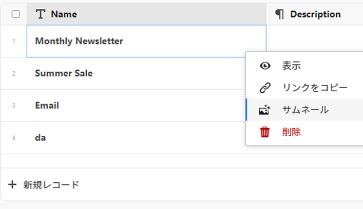
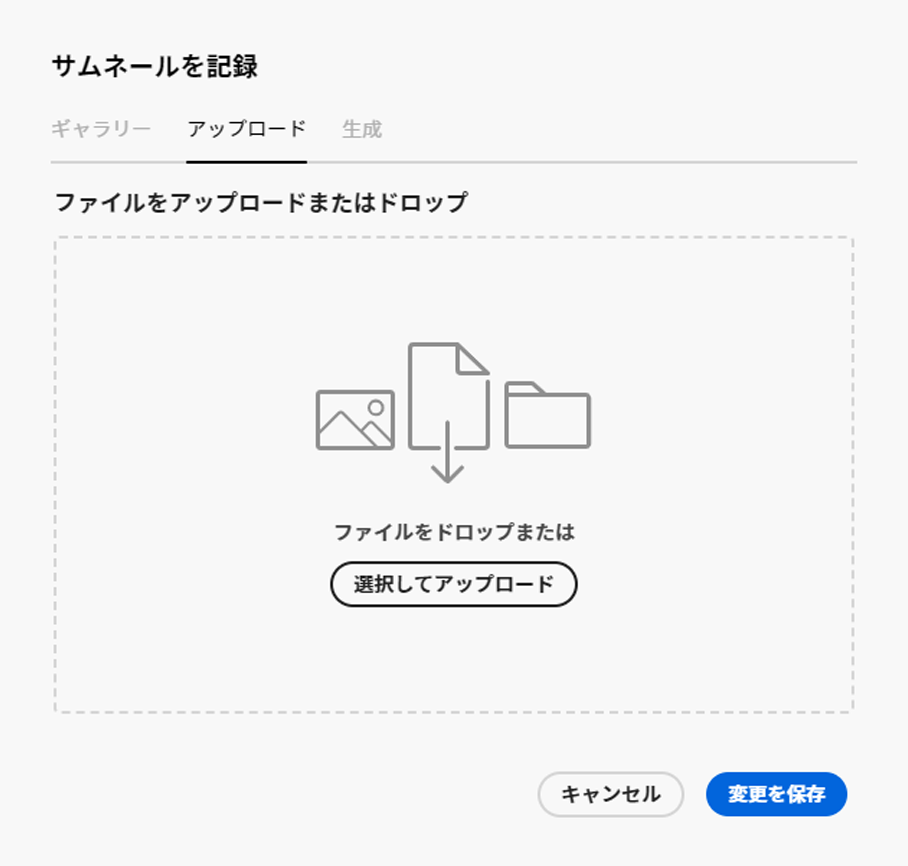

<!--update the metadata with real information-->

# レコードにサムネールを追加

>[!IMPORTANT]
>
>この記事の情報は、Adobe Workfrontからの新しいオファーであるAdobe・マエストロを指します。
>
>現在、Adobe・マエストロは、限られた数の顧客に対してオープンなベータプログラムの一部です。 Maestro 機能を使用するには、Workfrontのお客様である必要があります。
>
>Maestro のベータプログラムへの参加について詳しくは、アカウント担当者にお問い合わせください。
>
>詳しくは、 [Adobeマエストロの概要](../maestro-overview.md).

レコードをAdobeMaestro 内の一意のサムネールに関連付けて、簡単に認識できるようにすることができます。

レコードの作成と編集を開始する前に、レコードタイプを作成する必要があります。
詳しくは、 [レコードタイプの作成](../architecture/create-record-types.md).

## アクセス要件

<!--************double-check permissions here - asking Isk and Lilit what permissions users need for adding thumbnails-->

この記事の手順を実行するには、次のアクセス権が必要です。

<table style="table-layout:auto">
 <col>
 </col>
 <col>
 </col>
 <tbody>
    <tr>
<tr>
<td>
   
 製品
 </td>
   <td>
   
 Adobe Workfront
 </td>
  </tr>  
 <td role="rowheader">
Adobe Workfront協定
</td>
   <td>

組織は、Maestro クローズ済みベータプログラムのAdobeに登録する必要があります。 この新しいオファーについては、アカウント担当者にお問い合わせください。 

   </td>
  </tr>
  <tr>
   <td role="rowheader">
Adobe Workfrontプラン
</td>
   <td>

任意

   </td>
  </tr>
  <tr>
   <td role="rowheader">
Adobe Workfrontライセンス
</td>
   <td>
   
任意
 
  </td>
  </tr>

<tr>
   <td role="rowheader">
アクセスレベル設定
</td>
   <td> 
Maestro のアクセス制御はありません 
  
</td>
  </tr>
<tr>
   <td role="rowheader">
権限
</td>
   <td> 
ワークスペースに権限を付与する（またはそれ以上の場合） 
  
   
システム管理者は、作成しなかったワークスペースも含め、すべてのワークスペースに対する権限を持っています

</td>
  </tr>
<tr>
   <td role="rowheader">
レイアウトテンプレート
</td>
   <td>  
Workfrontの管理者を含むすべてのユーザーには、メインメニューの Maestro 領域を含むレイアウトテンプレートを割り当てる必要があります。 
 
詳しくは、 <a href="/help/quicksilver/maestro/access/access-overview.md">アクセスの概要</a>. 
  
</td>
  </tr>

</tbody>
</table>

## サムネールの記録に関する考慮事項

テーブルビュー内のレコードを視覚的に区別するために、レコードごとに一意のサムネール画像を関連付けることができます。

次の点に注意してください。

* サムネールとして追加できるのは、画像ファイルのみです。
  <!--above: when you know exactly what type of files are allowed, add the exact extensions above-->
* テーブルビューで個々のレコードにサムネール画像を追加できます。
* サムネールはレコード情報に属し、レコードが表示されるビューに表示されます。 例えば、次の領域では、レコード情報と共にサムネールが表示されます。

   * テーブルビューのレコードの主フィールド
   * タイムライン表示のレコードバー。
* レコードの詳細ページやタイムラインビューからは、レコードのサムネールを追加できません。
* レコードの詳細ページにサムネールは表示されません。

## レコードにサムネールを追加する

{{step1-to-maestro}}

1. レコードにサムネールを追加するワークスペースを選択し、レコードタイプカードをクリックします。

   レコードタイプのページが開きます。
1. 以下からテーブルビューを選択します。 **表示** ドロップダウンメニュー。 選択したタイプのすべてのレコードがテーブルに表示されます。
1. 主フィールドの情報にカーソルを合わせ、 **その他** メニュー を選択し、次に **サムネール**.

   

   >[!TIP]
   >
   >   主フィールドは、テーブルビューの最初の列に表示されるフィールドです。 主フィールドは常にフリーズし、隠したり再配置することはできません。

   The **サムネールを記録** ボックスが開きます。

   

   <!--update screen shot with correct casing-->

1. Adobe Analytics の **アップロード** タブをクリックし、ファイルをドラッグ&amp;ドロップしてサムネールとして追加するか、 **アップロードを選択**&#x200B;をクリックし、追加する画像ファイルを参照します。 ファイルはお使いのコンピューターに保存する必要があります。
1. （オプション）サイズ調整ツールを使用して、画像の切り抜きとサイズ変更をおこないます。
1. クリック **画像を使用** をクリックして、画像をサムネールとして追加します。
これにより、 **サムネールを記録** ボックス。
1. （条件付き）少なくともテーブルビューに対する Contribute 権限を持っている場合は、 **フィールド** をクリックします。
1. を選択します。 **サムネール** サムネールの表示/非表示を切り替えます。 デフォルトでは、このオプションは選択されていません。

   

   サムネールは、プライマリフィールド値の左側に表示されます。
1. （オプションおよび条件付き）Contribute またはそれ以上の権限を持っていない場合は、 **表示** ドロップダウンメニューを使用するか、ビューを作成します。
1. （オプション）サムネールを削除するには、プライマリフィールドの上にマウスポインターを置いて、 **その他** メニュー > **サムネール** > **削除** アイコン を選択し、次に **変更を保存**.
