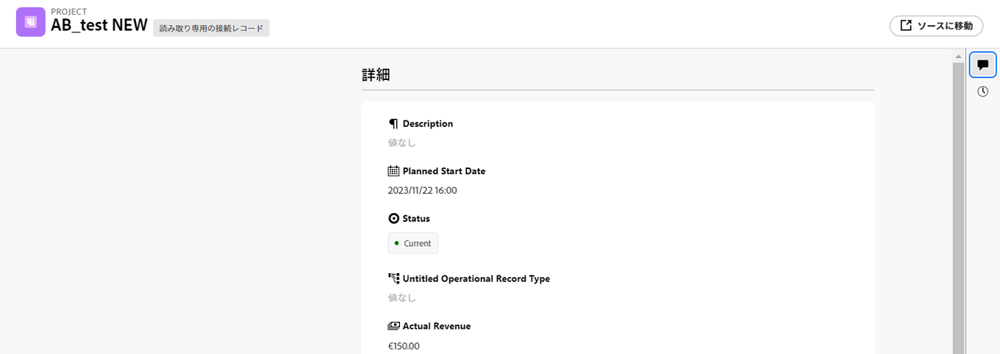
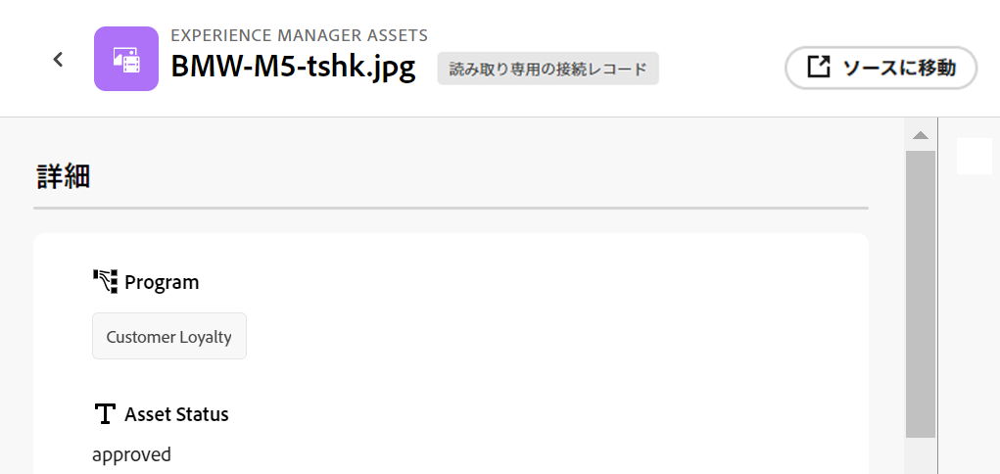

<!--when you make this live, update the metadata above to this: 
---
title: Connect records and objects
description: In addition to connecting Maestro records to one another, you can also connect Maestro records to objects from other applications.  
topic: Architecture
role: User
hidefromtoc: yes
hide: yes
---
-->
<!--udpate the metadata with real information when making this available in TOC and in the left nav-->

<!--if you change steps here, also update steps in the "Connect records" article-->

# レコードを接続

>[!IMPORTANT]
>
>この記事の情報は、Adobe Workfrontからの新しいオファーであるAdobe・マエストロを指します。
>
>現在、Adobe・マエストロは、限られた数の顧客に対してオープンなベータプログラムの一部です。 Maestro 機能を使用するには、Workfrontのお客様である必要があります。
>
>Maestro のベータプログラムへの参加について詳しくは、アカウント担当者にお問い合わせください。
>
>詳しくは、 [Adobeマエストロの概要](../maestro-overview.md).

AdobeMaestro レコードを相互に接続したり、他のアプリケーションのオブジェクトに接続したりできます。

最初に、別のアプリケーションから 2 つのレコードの種類またはレコードの種類をオブジェクトの種類に接続し、次に、レコードの種類の [ テーブル ] ビューを使用して、レコードを別のオブジェクトに接続します。

レコードタイプを相互に接続する方法、または他のアプリケーションからオブジェクトタイプに接続する方法については、「 [レコードタイプを接続](../architecture/connect-record-types.md).

レコードタイプを接続する例については、 [レコードタイプとレコードの接続例](../architecture/example-connect-record-types-and-records.md).

次の項目を接続できます。

* マエストロの運用記録
* 分類レコードに対する運用レコードのマエストロ
* 他のアプリケーションの操作レコードとオブジェクトをマエストロします。

  以下のアプリケーションから、以下に示すタイプのオブジェクトに Maestro レコードを接続できます。

   * Adobe Workfront

      * プロジェクト
      * ポートフォリオ
      * プログラム
      * 会社
      * グループ

   * Adobe Experience Manager Assets

      * 画像ファイル
      * フォルダー

  <!--when you add more objects, fix the Access Requirements below which right now refer only to projects-->

## アクセス要件

この記事の手順を実行するには、次のアクセス権が必要です。

<table style="table-layout:auto">
 <col>
 </col>
 <col>
 </col>
 <tbody>
    <tr>
<tr>
<td>製品
 </td>
   <td>
   
 Adobe Workfront
 
   
Maestro レコードをExperience Manager Assetsに接続するには、Adobe Experience Manager Assetsライセンスが必要です。組織のWorkfrontインスタンスをAdobeビジネスプラットフォームまたはAdobe Admin Consoleにオンボーディングする必要があります。

   </td>
  </tr>  
 <td role="rowheader">
Adobe Workfront協定
</td>
   <td>

組織は、Maestro クローズ済みベータプログラムのAdobeに登録する必要があります。 この新しいオファーについては、アカウント担当者にお問い合わせください。 

   </td>
  </tr>
  <tr>
   <td role="rowheader">
Adobe Workfrontプラン
</td>
   <td>

任意

   </td>
  </tr>
  <tr>
   <td role="rowheader">
Adobe Workfrontライセンス
</td>
   <td>
   
任意
 
  </td>
  </tr>

<tr>
   <td role="rowheader">
アクセスレベルの設定
</td>
   <td> 
Maestro のアクセスレベルコントロールはありません
  
</td>
  </tr>
<tr>
   <td role="rowheader">
権限
</td>
   <td> 
ワークスペースに対する権限の管理</a> 
  
   
システム管理者は、作成しなかったワークスペースも含め、すべてのワークスペースに対する権限を持っています

</td>
  </tr>

<tr>
   <td role="rowheader">
レイアウトテンプレート
</td>
   <td> 
Workfrontまたはグループ管理者は、レイアウトテンプレートに Maestro 領域を追加する必要があります。 詳しくは、 <a href="../access/access-overview.md">アクセスの概要</a>. 
  
</td>
  </tr>

</tbody>
</table>

<!--Maybe enable this at GA - but Maestro is not supposed to have Access controls in the Workfront Access Level: 
>[!NOTE]
>
>If you don't have access, ask your Workfront administrator if they set additional restrictions in your access level. For information on how a Workfront administrator can change your access level, see [Create or modify custom access levels](../administration-and-setup/add-users/configure-and-grant-access/create-modify-access-levels.md). -->

## レコードを接続

### レコードの接続に関する考慮事項

* レコードタイプを接続すると、接続されたレコードタイプが、リンク元のレコードタイプのテーブルにリンクされたレコードフィールドとして表示されます。
* リンクされたレコードフィールドから、リンクされたレコードとオブジェクトの種類のレコードとオブジェクトを参照して追加できます。
* リンクされたレコードタイプのフィールドを、リンク元のレコードタイプのテーブルに追加できます。
* リンク元のレコードのリンクされたフィールドの値を手動で更新することはできません。

  リンクされたレコードのリンクされたフィールドの値は、設定した Maestro ワークスペースまたはサードパーティアプリケーションから自動的にリンクされる Maestro レコードに入力されます。

* Maestro へのアクセス権とワークスペースに対する管理権限を持つすべてのユーザーは、Maestro レコード間または Maestro レコードと他のアプリケーションのオブジェクト間で行う接続を表示できます。 接続先のサードパーティアプリケーションに対する権限に関係なく、接続されたレコードやオブジェクトを表示できます。 <!--check with PM-->
* 接続されたレコードが存在するワークスペースに対する管理権限を持っている場合は、他のユーザーの接続を表示および編集できます。
* 1 つの Maestro レコードを別のアプリケーションから 1 つまたは複数のオブジェクトに接続できます。
* Maestro レコードを他のレコードやオブジェクトとリンクするには、次の条件を満たす必要があります。

   * 少なくとも 1 つの Maestro ワークスペース、レコードタイプ、およびレコード。

     詳しくは、次の記事を参照してください。

      * [ワークスペースの作成](../architecture/create-workspaces.md)
      * [レコードタイプの作成](../architecture/create-record-types.md)
      * [レコードを作成](../records/create-records.md)

   * レコードタイプ間の接続、または他のアプリケーションのレコードタイプとオブジェクト間の接続。 詳しくは、 [レコードタイプを接続](../architecture/connect-record-types.md)

### Maestro レコードを接続

{{step1-to-maestro}}

最後にアクセスしたワークスペースは、デフォルトで開きます。

1. （オプション）既存のワークスペース名の右側にある下向き矢印を展開し、レコードを接続するワークスペースを選択します。
1. レコードタイプのカードをクリックして、レコードタイプのページを開きます。
1. を選択します。 **テーブル** から表示 **表示** レコードタイプページの右上隅にあるドロップダウンメニュー。
1. （オプション）テーブルに新しい行を追加して、選択したレコードタイプにレコードを追加します。 詳しくは、 [レコードを作成](../../maestro/records/create-records.md).
1. テーブルビューに表示されたレコードから、リンクされたレコード列に移動し、他のレコードとリンクするレコードに対応するセルの上にマウスポインターを置いて、 **+** アイコン。

   The **オブジェクトの接続** ボックスが表示されます。

   

1. 検索ボックスにレコードの名前を入力し始め、リストに表示されたときにレコードを選択します

   または

   ボックスで 1 つまたは複数のレコードの名前を選択し、 **オブジェクトの接続** をクリックします。

   次の情報が追加されます。

   * リンクされたレコードは、手順 5 で選択したレコードの、リンクされたレコードフィールドに表示されます。 <!--accurate?--> リンクされたレコードを更新すると、リンク元のレコードのリンクされたフィールドが自動的に更新されます。 リンクされたフィールドは手動で編集できません。

     >[!TIP]
     >
     >* 「リンクされたフィールド」と「ルックアップフィールド」は同じ意味で使用されます。
     >
     >* を有効にした場合、 **複数のレコードを許可** レコード・タイプを接続する際に、複数の選択したオブジェクトのフィールドの値は、コンマで区切って表示されるか、選択した集約に従って集計されます。

1. （オプション） Maestro レコードタイプのページを閉じて、選択したワークスペースに移動します。
1. リンク先のレコードタイプのカードをクリックします。

   例えば、 **Campaign** レコードを Product レコードに追加する場合は、 **製品** カード。

   レコードタイプカードがテーブル表示で開きます。 表示されていない場合は、表ビューを選択します。

   次の点に注意してください。 **Campaign** 「リンクされたレコード」フィールドには、「製品レコードタイプ」ページで製品にリンクしたキャンペーンの名前が表示されます。 キャンペーン情報を更新すると、製品レコードタイプの「キャンペーン」リンクされたレコードフィールドが自動的に更新されます。

### Maestro レコードをWorkfrontオブジェクトに接続

<!--when we will have more applications to link to from Maestro, change the title to soemthing like: Connect Maestro records to objects from other applications-->

Maestro レコードタイプとWorkfrontオブジェクトタイプの間に接続を作成した後、Workfront内のオブジェクトに個々の Maestro レコードを接続できます。 接続したWorkfrontフィールドは、オブジェクトをリンクする Maestro レコードに自動的に設定されます。

{{step1-to-maestro}}

最後にアクセスしたワークスペースは、デフォルトで開きます。

1. （オプション）既存のワークスペース名の右側にある下向き矢印を展開し、レコードを接続するワークスペースを選択します。
1. レコードタイプのカードをクリックして、レコードタイプのページを開きます。
1. を選択します。 **テーブル** から表示 **表示** レコードタイプページの右上隅にあるドロップダウンメニュー。

1. （オプション）テーブルに新しい行を追加して、選択したレコードタイプに個々のレコードを追加します。 詳しくは、 [レコードを作成](../../maestro/records/create-records.md).
1. （条件付き）選択したレコードの種類をWorkfrontオブジェクトで接続した場合、リンクされたオブジェクト列に移動し、Workfrontからのオブジェクトにリンクするレコードに対応するセルの上にマウスポインターを置いて、 **+** アイコン。

   The **オブジェクトの接続** ボックスが表示されます。

   

   サードパーティのアプリケーションのオブジェクトとレコードタイプを接続する方法の詳細については、「 [レコードタイプを接続](../architecture/connect-record-types.md).

1. 検索ボックスにWorkfrontオブジェクトの名前を入力し始め、リストに表示されたら選択します

   または

   ボックスで 1 つまたは複数のオブジェクトの名前を選択し、 **オブジェクトの接続** をクリックします。

   次の情報が追加されます。

   * 選択したWorkfrontオブジェクトが、リンクされたレコードフィールドに追加されます。
   * レコードタイプをWorkfrontに接続したときにレコードを追加した場合、リンクされたフィールド（または参照フィールド）には、Workfrontからの情報が自動的に入力されます。
   * 「&lt; Name of the Workfront object type >」という新しいレコードタイプが、リンク元の Maestro レコードと同じワークスペースに作成されます。 オブジェクトの名前は、このレコードタイプの名前に含まれます。 例えば、Workfrontプロジェクトにリンクすると、 **プロジェクト** マエストロのレコードタイプ。

     これは読み取り専用のレコードタイプで、Maestro レコードから作成した新しいリンクオブジェクトフィールドで選択されたWorkfrontオブジェクトが表示されます。 リンクされたオブジェクトのリンクされたフィールドは、読み取り専用のリンクされたWorkfrontレコードにも表示されます。

     >[!IMPORTANT]
     >
     > 読み取り専用のWorkfrontオブジェクトレコードタイプは、個々のプロジェクトが Maestro レコードに追加された場合にのみ作成されます。 Maestro レコードタイプとWorkfrontオブジェクトタイプ間の接続を作成するだけでは、Workfrontレコードタイプは作成されません。

     Workfrontオブジェクトのフィールドからの既存の情報は、リンクされたフィールドまたは参照フィールドに表示されます。

     >[!TIP]
     >
     >
     >* 「複数レコードを許可」設定を有効にした場合、複数のオブジェクトの値は、コンマで区切って表示されるか、選択した集約に従って集計されます。
     >
     >* Maestro リンクされたレコードに対するリンクされたレコードフィールドは、WorkfrontのリンクされたWorkfrontオブジェクトに対して作成されません。

1. （オプション） Maestro レコードタイプのページを閉じて、選択したワークスペースに移動します。
1. （オプション） Workfrontオブジェクトレコードタイプのカードをクリックします。 例えば、 **プロジェクト** カード (Workfrontプロジェクトにリンクしている場合 ) 読み取り専用のWorkfrontレコードタイプカードがテーブルビューで開きます。

   Workfrontのレコードタイプページに表示されるレコードは、Maestro のレコードからリンクされた読み取り専用のWorkfrontオブジェクトです。 Workfrontのレコードタイプからリンクされたフィールドは、読み取り専用の列としても表示され、Workfrontで入力されると自動的に入力されます。

1. （オプション） Maestro でWorkfrontオブジェクトレコードの詳細ページを開くには、次のいずれかの操作を行います。

   * リンク元のレコードの種類から、「 Workfrontオブジェクトのリンクされたレコード」フィールドに移動し、Workfrontオブジェクトの名前をクリックします。
   * 次から： **テーブル** 「 Workfrontレコードタイプ」ページのビューで、Workfrontオブジェクトの名前をクリックします。

     または

     次をクリック： **その他** Workfrontオブジェクト名の右にあるメニューをクリックし、 **表示**.

     

   リンクされたWorkfrontオブジェクトの [Maestro 詳細 ] ページが開きます。 これは読み取り専用ページです。

1. （オプション）リンクされたWorkfrontオブジェクトをWorkfrontで開くには、次のいずれかの操作を行います。

   * 次から： **テーブル** [Workfrontレコードタイプ ] ページのビューで、Workfrontオブジェクトの名前をクリックして、Maestro で Project レコードを開きます。

   または

   次をクリック： **その他** Workfrontオブジェクト名の右側にあるメニューを開き、 **ソースに移動**.

   

   これにより、 Workfrontオブジェクトページが開きます。 Workfrontオブジェクトに関する情報を編集できます（編集する権限がある場合）。

1. （オプション） Maestro の読み取り専用のWorkfrontオブジェクトレコードページで、 **フィールドを追加** アイコン  テーブルビューの右上隅で、Workfrontレコードタイプに対してWorkfrontフィールドを追加または削除します。

   >[!NOTE]
   >
   >  Workfrontオブジェクトレコードタイプのページで追加または削除するフィールドは、Workfrontオブジェクトタイプにリンクする Maestro レコードタイプからは追加または削除されません。 フィールドは読み取り専用のWorkfrontレコードタイプのページにのみ表示されるので、Maestro で確認できます。

1. （オプションおよび条件付き） Workfrontオブジェクトに少なくとも 2 つの日付フィールドを追加した場合、 **表示** 「 Workfrontオブジェクトレコードタイプ」ページのドロップダウンメニューで、「 **タイムライン** 表示または **ビューを作成** をクリックして、タイムラインビューを作成します。  詳しくは、 [タイムライン表示を管理](/help/quicksilver/maestro/views/manage-the-timeline-view.md).

   Workfrontのリンクされたオブジェクトが、タイムラインビューに表示されます。

### Maestro レコードをAdobe Experience Managerオブジェクトに接続

<!--when we will have more applications to link to from Maestro, change the title to soemthing like: Connect Maestro records to objects from other applications-->

>[!IMPORTANT]
>
>Adobe Experience Manager Assetsライセンスが必要です。Maestro レコードをAdobe Experience Manager Assetsに接続するには、組織のWorkfrontインスタンスをAdobeビジネスプラットフォームまたはAdobe Admin Consoleに転送する必要があります。
>
>Adobe Admin Consoleのオンボーディングについて質問がある場合は、 [AdobeUnified Experience に関する FAQ](/help/quicksilver/workfront-basics/navigate-workfront/workfront-navigation/unified-experience-faq.md).

Maestro レコードタイプとAdobe Experience Manager Assetsの間に接続を作成した後、個々の Maestro レコードをExperience Managerアセットに接続できます。 接続の作成時にExperience Manager Assetsから接続したアセットフィールドは、リンク元の Maestro レコードタイプに自動的に入力されます。

{{step1-to-maestro}}

最後にアクセスしたワークスペースは、デフォルトで開きます。

1. （オプション）既存のワークスペース名の右側にある下向き矢印を展開し、レコードを接続するワークスペースを選択します。
1. レコードタイプのカードをクリックして、レコードタイプのページを開きます。
1. を選択します。 **テーブル** から表示 **表示** レコードタイプページの右上隅にあるドロップダウンメニュー。

1. （オプション）テーブルに新しい行を追加して、選択したレコードタイプに個々のレコードを追加します。 詳しくは、 [レコードを作成](../../maestro/records/create-records.md).
1. （条件付き）選択したレコードの種類をExperience Manager Assetsで接続した場合、リンクされたオブジェクト列に移動し、Experience Managerから他のオブジェクトにリンクするレコードに対応するセルの上にマウスポインターを置いて、 **+** アイコン。

   The **アセットを選択** ボックスが表示されます。 <!--update screen shot with actual assets-->

   

   サードパーティのアプリケーションのオブジェクトとレコードタイプを接続する方法の詳細については、「 [レコードタイプを接続](../architecture/connect-record-types.md).

1. 次のアセットタイプのいくつかをクリックして選択します。

   * 画像
   * フォルダー

   複数のアセットを選択できます。

   >[!IMPORTANT]
   >
   > 接続できるのは、アクセス権のあるアセットのみで、Experience Managerで表示できます。 接続すると、すべての Maestro ユーザーは、Experience Manager Assetsでのアクセスに関係なく、Maestro でアセットを表示できます。

1. クリック **選択**.

   次の情報が追加されます。

   * 選択したExperience Managerアセットが、リンクされたレコードフィールドに追加されます。
   * リンクされたフィールド（または参照フィールド）には、Experience ManagerConnected Assets からの情報が入力されます。
   * 「Experience Manager Assets」という新しいレコードタイプが、リンク元の Maestro レコードと同じワークスペースに作成されます。 <!--is this still added?-->

     これは読み取り専用のレコードタイプで、Maestro レコードから作成した新しいリンクオブジェクトフィールドで選択したExperience Managerアセットが表示されます。 リンクされたオブジェクトのリンクされたフィールドは、読み取り専用のリンクされたExperience Managerレコードにも表示されます。

     >[!IMPORTANT]
     >
     > 読み取り専用のExperience Manager Assetsレコードタイプは、個々のアセットが Maestro レコードに追加された場合にのみ作成されます。 Maestro レコードタイプとExperience Manager Assetsの間の接続を作成するだけでは、Experience Manager Assetsレコードタイプは作成されません。

     Experience Managerアセットのフィールドの既存の情報は、リンクされたフィールドまたは参照フィールドに表示されます。

     >[!TIP]
     >
     >
     >* [ 複数レコードを許可 ] 設定を有効にした場合、複数のオブジェクトの値がコンマで区切って表示されます。
     >
     >* Maestro リンクされたレコードへのリンクされたレコードフィールドは、Experience Manager Assetsアプリケーション内のリンクされたExperience Managerアセットに対して作成されません。

1. （オプション） Maestro レコードタイプのページを閉じて、選択したワークスペースに移動します。
1. Experience Manager Assetsレコードタイプのカードをクリックします。 読み取り専用のExperience Manager Assetsレコードタイプカードがテーブルビューで開きます。

   Experience Manager Assetsレコードタイプのページに表示されるレコードは読み取り専用のアセットです。 Experience Manager Assetsのレコードタイプからリンクされたフィールドは、読み取り専用の列としても表示され、Experience Managerで入力されると自動的に入力されます。

1. （オプション）Experience Manager Assetsにリンクしたレコードタイプに移動し、「リンクされたレコード」フィールドでアセットの名前をクリックします。 Experience Managerのアセットの詳細がポップアップウィンドウに表示されます。 <!--update screen shot with hi-rez picture-->

   

   画像ファイルの次のフィールドが表示されます。

   * 画像のサムネール
   * 画像ファイル名
   * 寸法
   * サイズ
   * 説明
   * Experience Manager内のファイルパス
   * アセットタイプ
   * 作成日
   * 変更日時

1. （オプション） Maestro でExperience Manager Assetsレコードの詳細ページを開くには、以下の手順を実行します。

   1. 次に移動： **Experience Manager Assets** 最初に選択したのと同じワークスペース内の Maestro レコードタイプカードをクリックして、レコードタイプのページを開きます。
Experience Manager Assets Maestro レコードタイプのページは読み取り専用です。
   1. テーブル表示で、アセットの名前をクリックします。

      または

      アセット名の上にマウスポインターを置いて、 **その他** メニュー  をクリックし、アセット名の右側にある「 **表示**.\
      これにより、アセットの Maestro が開きます。 **詳細** ページに貼り付けます。 これは読み取り専用ページです。
1. （オプション）Experience Managerアセットのレコードの詳細ページをExperience Managerで開くには、次のいずれかの操作を行います。

   * リンク元のレコードの Maestro レコードタイプページに移動し、リンクされたレコードフィールドでアセットの名前をクリックしてポップアップウィンドウを開き、 **開く** アイコン  をクリックしてアセットを開きます。
   * 次に移動： **Experience Manager Assets** 最初に選択したのと同じワークスペース内の Maestro レコードタイプカードをクリックしてレコードタイプページを開き、アセットの名前をクリックして Maestro を開きます。 **詳細** ページ、「 **ソースに移動** をクリックします。

     
   * 次に移動： **Experience Manager Assets** 最初に選択したのと同じワークスペース内で Maestro レコードタイプカードをクリックし、Experience Manager Assetsレコードタイプページを開き、アセットの名前の上にマウスポインターを置いて、「 **その他** メニュー、次に「 **ソースに移動**.

     

   アセットがExperience Manager Assetsで開きます。

1. （オプション） **フィールドを追加** アイコン  「Experience Manager Assetsレコードタイプ」ページのテーブルビューの右上隅で、Experience Managerフィールドを追加または削除します。

   >[!NOTE]
   >
   >  Experience Manager Assetsのレコードタイプページで追加または削除したフィールドは、Experience Managerアセットにリンクする Maestro レコードタイプからは追加も削除もされません。 フィールドは読み取り専用のExperience Manager Assetsレコードタイプのページにのみ表示されるので、Maestro で確認できます。

1. （オプションおよび条件付き）Experience Managerにリンクされたアセットに少なくとも 2 つの日付フィールドを追加した場合、 **表示** 「 Experience Manager Assetsレコードタイプ」ページのドロップダウンメニューで、「 **タイムライン** 表示または **ビューを作成** をクリックして、タイムラインビューを作成します。  詳しくは、 [タイムライン表示を管理](/help/quicksilver/maestro/views/manage-the-timeline-view.md).
Experience Manager Assetsのリンクされたアセットがタイムライン表示に表示されます。