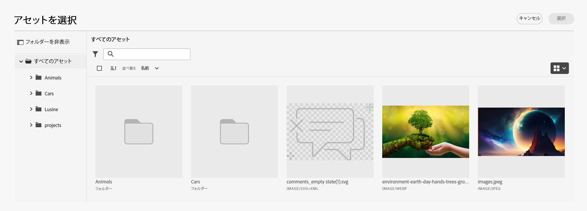
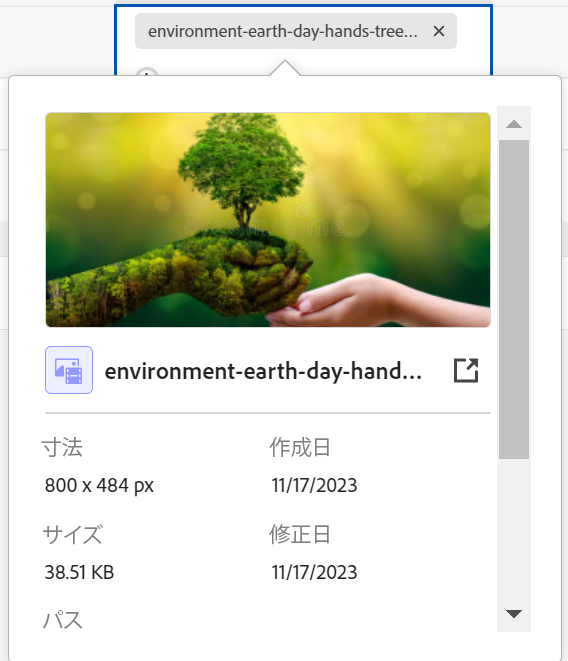

<!--when you make this live, update the metadata above to this: 
---
title: Connect records and objects
description: In addition to connecting Maestro records to one another, you can also connect Maestro records to objects from other applications.  
topic: Architecture
role: User
hidefromtoc: yes
hide: yes
---
-->
<!--update the metadata with real information when making this available in TOC and in the left nav-->

<!--if you change steps here, also update steps in the "Connect records" article-->

# レコードを接続

{{maestro-important-intro}}

AdobeMaestro レコードを相互に接続したり、他のアプリケーションのオブジェクトに接続したりできます。

最初に 2 つのレコードタイプを相互に接続するか、別のアプリケーションから 1 つのレコードタイプをオブジェクトタイプに接続する必要があります。 これにより、リンクされたレコードフィールドが作成されます。 その後、リンクされたレコードフィールドを使用して、レコードを別のアプリケーションから別のオブジェクトに、または別のレコードに接続できます。

レコードの接続は、別のアプリケーションからのオブジェクトへのレコードの接続と似ています。

レコードタイプを相互に接続する方法、または他のアプリケーションからオブジェクトタイプに接続する方法については、「 [レコードタイプを接続](../architecture/connect-record-types.md).

レコードタイプを接続する例については、 [レコードタイプとレコードの接続例](../architecture/example-connect-record-types-and-records.md).

次の項目を接続できます。

* マエストロの運用記録
* 分類レコードを含む運用レコードをマエストロ
* マエストロ分類
* 他のアプリケーションのオブジェクトを持つオペレーショナルレコードまたは分類をマエストロします。

  以下のアプリケーションから、以下に示すタイプのオブジェクトに Maestro レコードを接続できます。

   * Adobe Workfront

      * プロジェクト
      * ポートフォリオ
      * プログラム
      * 会社
      * グループ

   * Adobe Experience Manager Assets

      * 画像ファイル
      * フォルダー

  <!--when you add more objects, fix the Access Requirements below which right now refer only to projects-->

## アクセス要件

この記事の手順を実行するには、次のアクセス権が必要です。

<table style="table-layout:auto">
 <col>
 </col>
 <col>
 </col>
 <tbody>
    <tr>
<tr>
<td>製品
 </td>
   <td>
   
 Adobe Workfront
 
   
Maestro レコードをExperience Manager Assetsに接続するには、Adobe Experience Manager Assetsライセンスが必要です。組織のWorkfrontインスタンスをAdobeビジネスプラットフォームまたはAdobe Admin Consoleにオンボーディングする必要があります。

   </td>
  </tr>  
 <td role="rowheader">
Adobe Workfront協定
</td>
   <td>

組織は、Maestro クローズ済みベータプログラムのAdobeに登録する必要があります。 この新しいオファーについては、アカウント担当者にお問い合わせください。 

   </td>
  </tr>
  <tr>
   <td role="rowheader">
Adobe Workfront プラン
</td>
   <td>

任意

   </td>
  </tr>
  <tr>
   <td role="rowheader">
Adobe Workfront ライセンス
</td>
   <td>
   
任意
 
  </td>
  </tr>

<tr>
   <td role="rowheader">
アクセスレベルの設定
</td>
   <td> 
Maestro のアクセスレベルコントロールはありません
  
</td>
  </tr>
<tr>
   <td role="rowheader">
権限
</td>
   <td> 
レコードを接続するためのワークスペースに対する権限の管理 
  
   
他のアプリケーションでのアクセスに関係なく、他のアプリケーションからのオブジェクトやフィールドへのすべての接続を表示するワークスペースに対する表示権限またはそれ以上の権限。 

   
システム管理者は、作成しなかったワークスペースを含め、すべてのワークスペースに対する権限を持ちます。

</td>
  </tr>

<tr>
   <td role="rowheader">
レイアウトテンプレート
</td>
   <td> 
Workfrontまたはグループ管理者は、レイアウトテンプレートに Maestro 領域を追加する必要があります。 詳しくは、 <a href="../access/access-overview.md">アクセスの概要</a>. 
  
</td>
  </tr>

</tbody>
</table>

<!--Maybe enable this at GA - but Maestro is not supposed to have Access controls in the Workfront Access Level: 
>[!NOTE]
>
>If you don't have access, ask your Workfront administrator if they set additional restrictions in your access level. For information on how a Workfront administrator can change your access level, see [Create or modify custom access levels](../administration-and-setup/add-users/configure-and-grant-access/create-modify-access-levels.md). -->

## レコードを接続

### レコードの接続に関する考慮事項

* レコードタイプを接続すると、リンク元のレコードタイプのテーブルと、リンク元のレコードの [ 詳細 ] ページに、リンクされたレコードタイプがリンクされたレコードフィールドとして表示されます。
* リンクされたレコードフィールドから、リンクされたレコードとオブジェクトの種類のレコードとオブジェクトを参照して追加できます。
* リンク元のレコードタイプのテーブルに、リンクされたレコードタイプのフィールドを追加できます。
* リンク元のレコードのリンクされたフィールドの値を手動で更新することはできません。

  リンクされたレコードのリンクされたフィールドの値は、元のレコードまたはオブジェクトから自動的にリンクされる Maestro レコードに設定されます。

* Maestro と View のアクセス権を持つユーザーは、Maestro レコード間または Maestro レコードと他のアプリケーションのオブジェクト間で行う接続を、ワークスペースに対して表示できます。 接続先のアプリケーションでの権限に関係なく、接続されたレコードやオブジェクトを表示できます。
* 接続されたレコードが存在するワークスペースに対する管理権限を持っている場合は、他のユーザーの接続を表示および編集できます。
* 1 つの Maestro レコードを別のアプリケーションから 1 つまたは複数のオブジェクトに接続できます。
* Maestro レコードを他のレコードやオブジェクトとリンクするには、次の条件を満たす必要があります。

   * 少なくとも 1 つの Maestro ワークスペース、レコードタイプ、およびレコード。

     詳しくは、次の記事を参照してください。

      * [ワークスペースの作成](../architecture/create-workspaces.md)
      * [レコードタイプの作成](../architecture/create-record-types.md)
      * [レコードを作成](../records/create-records.md)

   * レコードタイプ間の接続、または他のアプリケーションのレコードタイプとオブジェクト間の接続。 詳しくは、 [レコードタイプを接続](../architecture/connect-record-types.md)

### Maestro レコードを接続

{{step1-to-maestro}}

最後にアクセスしたワークスペースは、デフォルトで開きます。

1. （オプション）既存のワークスペース名の右側にある下向き矢印を展開し、レコードを接続するワークスペースを選択します。
1. レコードタイプのカードをクリックして、レコードタイプのページを開きます。
1. を選択します。 **テーブル** から表示 **表示** レコードタイプページの右上隅にあるドロップダウンメニュー。
1. （オプション）テーブルに新しい行を追加して、選択したレコードタイプにレコードを追加します。 詳しくは、 [レコードを作成](../../maestro/records/create-records.md).
1. （条件付き）選択したレコードの種類を別のレコードの種類に接続した後、リンクされたレコードの列に移動し、他のレコードとリンクするレコードに対応するセルをダブルクリックします。

   

1. 次のいずれかの操作を行います。

   * リストから接続されたレコードの名前をクリックし、選択したレコードに追加します。 レコードが自動的に追加されます。
   * レコードの名前を入力し、リストに表示されたらクリックします。 レコードが自動的に追加されます。
   * クリック **すべてを表示** すべてのレコードを表示します。

1. （条件付き）クリックした場合 **すべて選択** 前の手順では、 **オブジェクトの接続** ボックスが表示されます。

   

1. 検索ボックスにレコードの名前を入力し始め、リストに表示されたときにレコードを選択します

   または

   ボックスで 1 つまたは複数のレコードの名前を選択し、 **オブジェクトの接続** をクリックします。

   >[!TIP]
   >
   >    レコードの詳細ページを開き、リンクされたレコードフィールドを見つけて、 **+** アイコンをクリックし、接続されたレコードまたはオブジェクトタイプからレコードを追加します。

   次の情報が追加されます。

   * リンクされたレコードは、手順 6 で選択したレコードの、リンクされたレコードフィールドに表示されます。 <!--accurate?-->
   * レコードタイプを接続したときにリンクされた参照フィールドを追加した場合、リンクされたレコードの情報がリンクされたフィールドに設定されます。

   リンクされたレコードを更新すると、自動的にリンク元のレコードのリンクされたフィールドが更新されます。 リンクされたフィールドは手動で編集できません。

   >[!TIP]
   >
   >* 「リンクされたフィールド」と「ルックアップフィールド」は同じ意味で使用されます。
   >
   >* を有効にした場合、 **複数のレコードを許可** レコード・タイプを接続する際に、複数の選択したオブジェクトのフィールドの値は、コンマで区切って表示されるか、選択した集約に従って集計されます。

1. （オプション） Maestro レコードタイプのページを閉じて、選択したワークスペースに移動します。
1. リンク先のレコードタイプのカードをクリックします。

   例えば、 **Campaign** レコードを Product レコードに追加する場合は、 **製品** カード。

   レコードタイプカードがテーブル表示で開きます。 表示されていない場合は、表ビューを選択します。

   次の点に注意してください。 **Campaign** 「リンクされたレコード」フィールドには、「製品レコードタイプ」ページで製品にリンクしたキャンペーンの名前が表示されます。 キャンペーン情報を更新すると、製品レコードタイプの「キャンペーン」リンクされたレコードフィールドが自動的に更新されます。

### Maestro レコードをWorkfrontオブジェクトに接続

<!--when we will have more applications to link to from Maestro, change the title to something like: Connect Maestro records to objects from other applications-->

Maestro レコードタイプとWorkfrontオブジェクトタイプの間に接続を作成した後、Workfront内のオブジェクトに個々の Maestro レコードを接続できます。 接続したWorkfrontフィールドは、オブジェクトをリンクする Maestro レコードに自動的に設定されます。

>[!NOTE]
>
>WorkfrontオブジェクトをWorkfrontの Maestro レコードと接続することはできません。

{{step1-to-maestro}}

最後にアクセスしたワークスペースは、デフォルトで開きます。

1. （オプション）既存のワークスペース名の右側にある下向き矢印を展開し、レコードを接続するワークスペースを選択します。
1. レコードタイプのカードをクリックして、レコードタイプのページを開きます。
1. を選択します。 **テーブル** から表示 **表示** ドロップダウンメニュー。

1. クリック **新しいレコード**  をクリックして、選択したレコードタイプに個々のレコードを追加します。 詳しくは、 [レコードを作成](../../maestro/records/create-records.md).
1. （条件付き）選択したレコードの種類をWorkfrontのオブジェクトの種類に接続したら、リンクされたオブジェクトの列に移動し、Workfrontのオブジェクトにリンクするレコードに対応するセルをダブルクリックします。

   

1. 次のいずれかの操作を行います。

   * リストからオブジェクトをクリックして、選択したレコードに追加します。 オブジェクトはアルファベット順に表示されます。 オブジェクトが自動的に追加されます。
   * オブジェクトの名前を入力し、リストに表示されたらクリックします。 オブジェクトが自動的に追加されます。
   * クリック **すべてを表示** ：表示する権限を持っているすべてのオブジェクトを表示します。

1. （条件付き）クリックした場合 **すべてを表示** 前の手順では、 **オブジェクトの接続** ボックスが表示されます。

   

1. 検索ボックスにWorkfrontオブジェクトの名前を入力し始め、リストに表示されたら選択します

   または

   ボックスで 1 つまたは複数のオブジェクトの名前を選択し、 **オブジェクトの接続** をクリックします。

   >[!IMPORTANT]
   >
   >* 追加できるのは、表示するアクセス権のあるWorkfrontオブジェクトのみです。
   >
   >* Workfrontオブジェクトを追加すると、Workspace に対する表示権限以上の権限を持つすべてのユーザーは、Workfrontでの権限やアクセスに関係なく、Workfrontオブジェクトとそのフィールド情報を表示できます。

   次の情報が追加されます。

   * 選択したWorkfrontオブジェクトが、リンクされたレコードフィールドに追加されます。
   * レコードタイプをWorkfrontに接続したときにレコードを追加した場合、Workfrontオブジェクトのリンクされたフィールド（または参照フィールド）には、Workfrontからの情報が自動的に入力されます。

   >[!TIP]
   >
   >レコードの詳細ページを開き、リンクされたレコードフィールドを見つけて、 **+** アイコンを使用して、接続されたオブジェクトタイプからオブジェクトを追加します。

   別のアプリケーションのオブジェクトにレコードの種類を接続する方法の詳細については、「 [レコードタイプを接続](../architecture/connect-record-types.md).

1. （オプション） Maestro レコードに接続されているWorkfrontオブジェクトの名前を、テーブルビューのリンクされたフィールドまたは **詳細** マエストロレコードのページ。

   読み取り専用の Maestro が開きます。 **詳細** リンクされたWorkfrontオブジェクトのページ。 レコードタイプをWorkfrontオブジェクトに接続した際に、参照フィールドとして選択したフィールドは、Workfront Maestro レコードの [ 詳細 ] ページに表示されます。

   >[!TIP]
   >
   >* 「複数レコードを許可」設定を有効にすると、ルックアップフィールドの値は、コンマで区切って表示されるか、選択した集約に従って集計されます。
   >
   >* リンクされたレコードフィールドは、Workfront内のリンクされたWorkfrontオブジェクトに対しては作成されません。

1. （オプション）リンクされたWorkfrontオブジェクトをWorkfrontで開くには、 **ソースに移動** ( Workfrontオブジェクトの「詳細」ページの右上隅 )。

   

   少なくともオブジェクトを表示するための表示権限を持っている場合は、 Workfrontオブジェクトページが開きます。 Workfrontオブジェクトに関する情報を編集できます（編集する権限がある場合）。

1. （オプション） Maestro レコードタイプのテーブルビューで、リンクされたWorkfrontオブジェクトの列見出しの上にマウスポインターを置き、ドロップダウンメニューをクリックして、 **参照フィールドの編集**.

1. Workfrontオブジェクトのフィールドを **未選択のフィールド** 領域

   または

   Workfrontオブジェクトのフィールドを **選択したフィールド** 領域。

   これにより、Maestro レコードからリンクされたフィールドを追加または削除します。 削除されたフィールドに関連付けられている情報は、Workfrontに残ります。

### Maestro レコードをAdobe Experience Managerオブジェクトに接続

<!--when we will have more applications to link to from Maestro, change the title to something like: Connect Maestro records to objects from other applications-->

>[!IMPORTANT]
>
>Adobe Experience Manager Assetsライセンスが必要です。Maestro レコードをAdobe Experience Manager Assetsに接続するには、組織のWorkfrontインスタンスをAdobeビジネスプラットフォームまたはAdobe Admin Consoleに転送する必要があります。
>
>Adobe Admin Consoleのオンボーディングについて質問がある場合は、 [AdobeUnified Experience に関する FAQ](/help/quicksilver/workfront-basics/navigate-workfront/workfront-navigation/unified-experience-faq.md).

Maestro レコードタイプとAdobe Experience Manager Assetsの間に接続を作成した後、個々の Maestro レコードをExperience Managerアセットに接続できます。 接続の作成時にExperience Manager Assetsから接続したアセットフィールドは、リンク元の Maestro レコードタイプに自動的に入力されます。

{{step1-to-maestro}}

最後にアクセスしたワークスペースは、デフォルトで開きます。

1. （オプション）既存のワークスペース名の右側にある下向き矢印を展開し、レコードを接続するワークスペースを選択します。
1. レコードタイプのカードをクリックして、レコードタイプのページを開きます。
1. を選択します。 **テーブル** から表示 **表示** レコードタイプページの右上隅にあるドロップダウンメニュー。

1. （オプション）「 **新しいレコード** をクリックして、選択したレコードタイプに新しいレコードを追加します。 詳しくは、 [レコードを作成](../../maestro/records/create-records.md).
1. （条件付き）選択したレコードの種類をExperience Manager Assetsに接続した後、リンクされたオブジェクト列に移動し、Experience Managerから他のオブジェクトにリンクするレコードに対応するセルの上にマウスポインターを置いて、 **+** アイコン。

   >[!TIP]
   >
   >  次を追加すると、 **+** アセットをレコードに接続するための、Maestro レコードの詳細ページにある「リンクされたオブジェクト」フィールドのアイコン。

   The **アセットを選択** ボックスが表示されます。 <!--we might change this to Connect assets-->

   

1. 次のアセットタイプのいくつかをクリックして選択します。

   * 画像
   * フォルダー

   複数のアセットを選択できます。

   >[!IMPORTANT]
   >
   > 接続できるのは、アクセス権のあるアセットのみで、Experience Managerで表示できます。 接続すると、すべての Maestro ユーザーは、Experience Manager Assetsでのアクセスに関係なく、Maestro でアセットを表示できます。

1. クリック **選択**. <!-- we might change this to Connect-->

   次の情報が追加されます。

   * 選択したExperience Managerアセットが、リンクされたレコードフィールドに追加されます。
   * リンクされたフィールド（または参照フィールド）には、Experience ManagerConnected Assets からの情報が入力されます。

     Experience Managerアセットのフィールドの既存の情報は、リンクされたフィールドまたは参照フィールドに自動的に表示されます。

     >[!TIP]
     >
     >* 「複数レコードを許可」設定を有効にした場合、複数のオブジェクトの値は、コンマで区切られて表示されるか、選択した集約に従って集計されて表示されます。
     >
     >* Maestro リンクされたレコードへのリンクされたレコードフィールドは、Experience Manager Assetsアプリケーション内のリンクされたExperience Managerアセットに対して作成されません。

1. （オプション）Experience Manager Assetsにリンクしたレコードタイプに移動し、「リンクされたレコード」フィールドでアセットの名前をクリックします。 Experience Managerのアセットの詳細がポップアップウィンドウに表示されます。 <!--update screen shot with hi-rez picture-->

   

   画像ファイルの次のフィールドが表示されます。

   * 画像のサムネール
   * 画像ファイル名
   * 寸法
   * サイズ
   * 説明
   * Experience Manager内のファイルパス
   * アセットタイプ
   * 作成日
   * 変更日時

1. （オプション）Experience Managerアセットレコードの詳細ページをExperience Managerで開くには、リンク元のレコードの Maestro レコードタイプページに移動し、リンクされたレコードフィールドのアセット名をクリックしてポップアップウィンドウを開き、 **開く** アイコン  をクリックしてアセットを開きます。

   これにより、Adobe Experience Manager AssetsでExperience Managerアセットが開きます。

1. （オプション） Maestro レコードタイプのテーブルビューで、リンクされたExperience Managerアセットの列見出しの上にマウスポインターを置き、ドロップダウンメニューをクリックして、 **参照フィールドの編集**.

1. Experience Manager Assetsオブジェクトのフィールドを **未選択のフィールド** 領域

   または

   Workfrontオブジェクトのフィールドを **選択したフィールド** 領域。

   これにより、Maestro レコードからリンクされたフィールドを追加または削除します。 削除されたフィールドに関連付けられている情報は、Experience AssetsAdobeに残ります。
