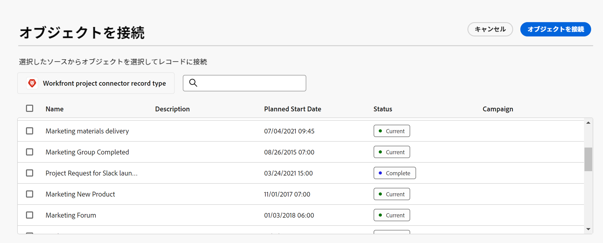

<!--when you make this live, update the metadata above to this: 
---
title: Connect records and objects
description: In addition to connecting Maestro records to one another, you can also connect Maestro records to objects from other applications.  
topic: Architecture
role: User
hidefromtoc: yes
hide: yes
---
-->
<!--udpate the metadata with real information when making this available in TOC and in the left nav-->

<!--if you change steps here, also update steps in the "Connect records" article-->

# レコードを接続

>[!IMPORTANT]
>
>現在、Adobe・マエストロは、限られた数の顧客に対してオープンなベータプログラムの一部です。
>
>Maestro のベータプログラムへの参加について詳しくは、アカウント担当者にお問い合わせください。
>
>詳しくは、 [Adobeマエストロの概要](../maestro-overview.md).

AdobeMaestro レコードを相互に接続したり、他のアプリケーションのオブジェクトに接続したりできます。

最初に、別のアプリケーションから 2 つのレコードの種類またはレコードの種類をオブジェクトの種類に接続し、次に、レコードの種類の [ テーブル ] ビューを使用して、レコードを別のオブジェクトに接続します。

レコードタイプを相互に接続する方法、または他のアプリケーションからオブジェクトタイプに接続する方法については、「 [レコードタイプを接続](../architecture-and-fields/connect-record-types.md).

レコードタイプを接続する例については、 [レコードタイプとレコードの接続例](../architecture-and-fields/example-connect-record-types-and-records.md).

次の項目を接続できます。

* マエストロの運用記録
* 分類レコードに対する運用レコードのマエストロ
* 他のアプリケーションの操作レコードとオブジェクトをマエストロします。

  現在、次のアプリケーションとオブジェクトタイプがサポートされています。

   * Adobe Workfront

      * プロジェクト
      * ポートフォリオ
      * プログラム
      * 会社
      * グループ

  <!--when you add more objects, fix the Access Requirements below which right now refer only to projects-->

## アクセス要件

この記事の手順を実行するには、次のアクセス権が必要です。

<table style="table-layout:auto">
 <col>
<tbody>
<td>
   
 Adobe産物
 </td>
   <td>
   
 Adobe Workfront
 </td>
  </tr>  
 <td role="rowheader">
Adobe Workfront協定
</td>
   <td>

組織は、Maestro クローズ済みベータプログラムのAdobeに登録する必要があります。 この新しいオファーについては、アカウント担当者にお問い合わせください。 

   </td>
  </tr>
  <tr>
   <td role="rowheader">
Adobe Workfrontプラン
</td>
   <td>

任意

   </td>
  </tr>
  <tr>
   <td role="rowheader">
Adobe Workfrontライセンス
</td>
   <td>
任意（Maestro レコードを作成する場合）
 

Workfrontでプロジェクトを表示するには、以上を操作します。

  
詳しくは、 <a href="../../administration-and-setup/add-users/access-levels-and-object-permissions/wf-licenses.md">Adobe Workfrontライセンスの概要</a>.
 
  </td>
  </tr>
  <tr>
   <td role="rowheader">アクセスレベル</td>
   <td> 
任意（Maestro レコードを作成する場合）

プロジェクト、Portfolio、プログラムへのアクセス権を表示または高くする
 

グループや会社への追加のアクセス（グループや会社のユーザーが属していない場合）
   
</td>
  </tr>
<tr>
   <td role="rowheader">
オブジェクトの権限
</td>
   <td> 
Maestro レコードとリンクするオブジェクトに対する権限を表示するか、それ以上に設定します  
</td>
  </tr>
<tr>
   <td role="rowheader">
レイアウトテンプレート
</td>
   <td> 
システム管理者は、レイアウトテンプレートに Maestro 領域を追加する必要があります。 詳しくは、 <a href="../access/grant-access.md">AdobeMaestro へのアクセスを許可</a>. 
</td>
  </tr>
 </tbody>
</table>

<!--Maybe enable this at GA - but Maestro is not supposed to have Access controls in the Workfront Access Level: 
>[!NOTE]
>
>If you don't have access, ask your Workfront administrator if they set additional restrictions in your access level. For information on how a Workfront administrator can change your access level, see [Create or modify custom access levels](../administration-and-setup/add-users/configure-and-grant-access/create-modify-access-levels.md). -->

<!-- Notes to add for the table: for the "Workfront plans" row: the above is only for closed beta; when going to GA - activate the following plans:    

Current plan: Prime and Ultimate

Legacy plan: Enterprise
-->

<!-- Notes for the table: for the "Workfront access" row: 
For more information, see <a href="../../administration-and-setup/add-users/access-levels-and-object-permissions/wf-licenses.md" class="MCXref xref">Adobe Workfront licenses overview</a>.
-->

## レコードを接続

### レコードの接続に関する考慮事項

* レコードタイプ間の接続が確立されると、接続されたレコードタイプは、リンク元のレコードタイプのテーブルに、リンクされたレコードフィールドとして表示されます。
* リンクされたレコードフィールドから、リンクされたレコードとオブジェクトの種類のレコードとオブジェクトを参照して追加できます。
* リンクされたレコードタイプのフィールドを、リンク元のレコードタイプのテーブルに追加できます。
* リンク元のレコードのリンクされたフィールドの値を手動で更新することはできません。

  リンクされたレコードのリンクされたフィールドの値は、自動的にリンク元の Maestro レコードに設定されます。

* Maestro にアクセスできるすべてのユーザーは、Maestro レコード間、または Maestro レコードとWorkfrontオブジェクト間の接続を確認できます。 また、他のユーザーの接続を表示および編集することもできます。 <!--add that this is based on your permissions in both Maestro and Workfront (or, later, any other application)-->
* 1 つの Maestro レコードを別のアプリケーションから 1 つまたは複数のオブジェクトに接続できます。
* 分類をレコード・タイプに接続したり、別のアプリケーションのオブジェクトに接続したりすることはできません。 <!-- this is temporary; there will be certain objects (teams, etc) that will be linked to taxonomies, per Lilit-->
* 現在、Maestro レコードはWorkfrontオブジェクトにのみリンクできます。 Maestro レコードをWorkfrontオブジェクトとリンクするには、次の情報が必要です。

   * Workfrontオブジェクト。 例えば、まずWorkfrontでプロジェクト、ポートフォリオ、プログラム、会社、グループを作成する必要があります。
   * Maestro ワークスペース、レコードタイプ、およびレコード。 詳しくは、次の記事を参照してください。

      * [ワークスペースの作成](../architecture-and-fields/create-workspaces.md)
      * [レコードタイプの作成](../architecture-and-fields/create-record-types.md)
      * [レコードを作成](../records/create-records.md)

   * レコードタイプ間の接続、または他のアプリケーションのレコードタイプとオブジェクト間の接続。 詳しくは、 [レコードタイプを接続](../architecture-and-fields/connect-record-types.md).

### Maestro レコードを接続

1. 次をクリック： **メインメニュー** アイコン  Workfrontの右上隅に <!---or the **Main menu** icon   in the upper-left corner, if available--> 次に、「 **マエストロ** .

   最後にアクセスしたワークスペースは、デフォルトで開きます。

1. （オプション）既存のワークスペース名の右側にある下向き矢印を展開し、レコードを接続するワークスペースを選択します。
1. レコードタイプのカードをクリックして、レコードタイプのページを開きます。
1. 以下からテーブルビューを選択します。 **表示** レコードタイプページの右上隅にあるドロップダウンメニュー。
1. 選択したレコードタイプから別のレコードまたはオブジェクトタイプに接続を追加します。 詳しくは、 [レコードタイプを接続](../architecture-and-fields/connect-record-types.md).

リンクされたレコードタイプを表示する新しい列がテーブルに追加されます。

1. テーブルに新しい行を追加して、選択したレコードタイプにレコードを追加します。 詳しくは、 [レコードを作成](../../maestro/records/create-records.md).
1. テーブルビューに表示されたレコードから、リンクされたレコード列に移動し、他の Maestro レコードとリンクするレコードに対応するセルの上にマウスポインターを置いて、 **+** アイコン。

   The **オブジェクトの接続** ボックスが表示されます。

   

1. 検索ボックスにレコードの名前を入力し始め、リストに表示されたときにレコードを選択します

   または

   ボックスで 1 つまたは複数のレコードの名前を選択し、 **オブジェクトの接続** をクリックします。

   次の情報が追加されます。

   * リンクされたレコードは、手順 3 で選択したレコードの、リンクされたレコードフィールドに表示されます。 リンクされたレコードを更新すると、リンク元のレコードのリンクされたレコードフィールドが自動的に更新されます。 <!--ensure the number of the step stays accurate-->
   * リンクされたレコードに属するリンクされたフィールドには、元のリンクされたレコードの情報が自動的に入力されます。 リンクされたフィールドは手動で編集できません。

     >[!TIP]
     >
     >* 「リンクされたフィールド」と「ルックアップフィールド」は同じ意味で使用されます。
     >
     >* レコード・タイプを接続したときに「複数レコードを許可」設定を有効にした場合、選択した複数のオブジェクトのフィールドの値は、コンマで区切って表示されるか、選択した集約に従って集計されます。

1. （オプション） Maestro レコードタイプのページを閉じて、選択したワークスペースに移動します。
1. リンク先のレコードタイプのカードをクリックします。

   例えば、Campaign レコードと製品レコードを結び付けた場合、 **製品** カード。

   レコードタイプカードがテーブル表示で開きます。

   「キャンペーンのリンクされたレコード」フィールドに、製品にリンクしたキャンペーンの名前が「製品のレコードタイプ」ページに表示されます。 キャンペーン情報を更新すると、製品レコードタイプの「キャンペーン」リンクされたレコードフィールドが自動的に更新されます。

### Maestro レコードをWorkfrontオブジェクトに接続

<!--when we will have more applications to link to from Maestro, change the title to soemthing like: Connect Maestro records to objects from other applications-->

Maestro レコードタイプとWorkfrontオブジェクトタイプの間に接続を作成した後、Workfront内のオブジェクトに個々の Maestro レコードを接続できます。 また、Workfrontオブジェクトのフィールドを Maestro レコードタイプに接続することもできます。

1. 次をクリック： **メインメニュー** アイコン  Workfrontの右上隅に <!---or the **Main menu** icon   in the upper-left corner, if available--> 次に、「 **マエストロ** .

   最後にアクセスしたワークスペースは、デフォルトで開きます。

1. （オプション）既存のワークスペース名の右側にある下向き矢印を展開し、レコードを接続するワークスペースを選択します。
1. レコードタイプのカードをクリックして、レコードタイプのページを開きます。
1. 以下からテーブルビューを選択します。 **表示** レコードタイプページの右上隅にあるドロップダウンメニュー。
1. 選択したレコードタイプに対して、Workfrontからオブジェクトタイプに新しい接続を追加します。 「 Workfront 」セクションの下で、次のオブジェクトから選択します。

   * プロジェクト
   * ポートフォリオ
   * プログラム
   * 会社
   * グループ

   詳しくは、 [レコードタイプを接続](../architecture-and-fields/connect-record-types.md).

   新しい列がテーブルに追加され、リンクされたオブジェクトタイプが表示されます。

1. テーブルに新しい行を追加して、選択したレコードタイプに個々のレコードを追加します。 詳しくは、 [レコードを作成](../../maestro/records/create-records.md).
1. テーブルビューに表示されるレコードから、リンクされたオブジェクト列に移動し、Workfrontの他のオブジェクトとリンクするレコードに対応するセルの上にマウスポインターを置いて、 **+** アイコン。 <!--change Workfront to other applications, when this will be possible-->

   The **オブジェクトの接続** ボックスが表示されます。

   

1. 検索ボックスにWorkfrontオブジェクトの名前を入力し始め、リストに表示されたら選択します

   または

   ボックスで 1 つまたは複数のオブジェクトの名前を選択し、 **オブジェクトの接続** をクリックします。

   次の情報が Maestro に追加されます。

   * 選択したWorkfrontオブジェクトが、リンクされたレコードフィールドに追加されます。
   * リンクされたレコードにフィールドを追加する際に選択したリンクされたフィールドごとに、新しいリンクされたフィールド（または参照フィールド）が作成されます。
   * 「Workfrontオブジェクト」という新しいレコードタイプが、リンク元の Maestro レコードと同じワークスペースに作成されます。 オブジェクトの名前は、このレコードタイプの名前に含まれます。 例えば、Workfrontプロジェクトにリンクすると、Maestro にWorkfrontプロジェクトのレコードタイプが作成されます。

     これは読み取り専用のレコードタイプで、Maestro レコードから作成した新しいリンクオブジェクトフィールドで選択されたWorkfrontオブジェクトが表示されます。 リンクされたオブジェクトのリンクされたフィールドは、読み取り専用のリンクされたWorkfrontレコードにも表示されます。

     >[!IMPORTANT]
     >
     > 読み取り専用のWorkfrontオブジェクトレコードタイプは、個々のプロジェクトが Maestro レコードに追加された場合にのみ作成されます。 Maestro レコードタイプとWorkfrontオブジェクトタイプ間の接続を作成するだけでは、Workfrontレコードタイプは作成されません。

     Workfrontオブジェクトのフィールドからの既存の情報は、リンクされたフィールドまたは参照フィールドに表示されます。

     >[!TIP]
     >
     >
     >* 「複数レコードを許可」設定を有効にした場合、複数のオブジェクトの値は、コンマで区切って表示されるか、選択した集約に従って集計されます。
     >
     >* Maestro リンクされたレコードに対するリンクされたレコードフィールドは、リンクされたWorkfrontオブジェクトに対しては作成されません。

1. （オプション） Maestro レコードタイプのページを閉じて、選択したワークスペースに移動します。
1. Workfrontオブジェクトレコードタイプのカードをクリックします。 例えば、 **Workfrontプロジェクト** カード (Workfrontプロジェクトにリンクしている場合 ) 読み取り専用のWorkfrontレコードタイプカードがテーブルビューで開きます。

   >[!NOTE]
   >
   >    * Workfrontレコードタイプのページに表示されるレコードは、読み取り専用のWorkfrontオブジェクトです。 Workfrontのレコードタイプからリンクされたフィールドは、読み取り専用の列としても表示され、Workfrontで入力されると自動的に入力されます。
   >    * Maestro でWorkfrontフィールドを手動で更新することはできません。 WorkfrontオブジェクトのフィールドはWorkfrontで入力する必要があり、フィールドの値は Maestro のWorkfrontレコードに自動的に表示されます。
   >
   >    * Workfrontオブジェクトのレコードの種類をタイムラインビューに表示するには、読み取り専用のWorkfrontレコードの種類のページの [ テーブル ] ビューに少なくとも 2 つの日付フィールドを表示する必要があります。

1. （オプション） **その他** メニュー  ページのヘッダーで「 Workfrontオブジェクトレコードタイプ名」の横にある「 **名前を変更** をクリックして、レコードの名前を編集します。

   >[!NOTE]
   >
   >    リンクされたWorkfrontレコードタイプやオブジェクトは、Workfrontレコードタイプのページから削除できません。

1. （オプション） **フィールドを追加** アイコン  「 Workfrontレコードタイプ」ページのテーブルビューの右上隅で、WorkfrontレコードタイプのWorkfrontフィールドを追加または削除します。

   >[!NOTE]
   >
   >  Workfrontオブジェクトレコードタイプのページで追加または削除するフィールドは、Workfrontオブジェクトタイプにリンクする Maestro レコードタイプからは追加または削除されません。 フィールドは読み取り専用のWorkfrontレコードタイプのページにのみ表示されるので、Maestro で確認できます。

1. （オプション） Workfrontオブジェクトレコードタイプページの「表示」ドロップダウンメニューから「タイムライン」ビューを選択して、Workfrontのリンクされたオブジェクトをタイムラインビューに表示します。

