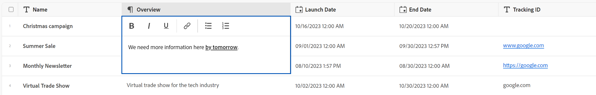

<!--update the metadata with real information when making this avilable in TOC and in the left nav-->

# レコードの編集

{{maestro-important-intro}}

レコードに関連付けられたフィールドの値を編集することで、Adobe Workfront Planning 内のレコード情報を編集できます。

レコードの作成と編集を開始する前に、レコードタイプを作成する必要があります。

詳しくは、[リクエストタイプの作成](../architecture/create-record-types.md)を参照してください。

レコードの作成について詳しくは、[レコードの作成](/help/quicksilver/maestro/records/create-records.md)を参照してください。

&lt;!-- ここでは、詳細ビューのフィールドがテーブルビューのフィールドと同じであることに言及しています。この記事は、この情報を参照するために管理レコードビュー 1 からリンクされています -->

## アクセス要件

この記事の手順を実行するには、次のアクセス権が必要です。

<table style="table-layout:auto">
 <col>
 </col>
 <col>
 </col>
 <tbody>
    <tr>
<tr>
<td>
   
 製品
 </td>
   <td>
   
 Adobe Workfront
 </td>
  </tr>  
 <td role="rowheader">
Adobe Workfront の契約
</td>
   <td>

組織は、Adobe Workfront Planning の限定ベータ版プログラムに登録する必要があります。この新しいオファーについては、アカウント担当者にお問い合わせください。 

   </td>
  </tr>
  <tr>
   <td role="rowheader">
Adobe Workfront プラン
</td>
   <td>

任意

   </td>
  </tr>
  <tr>
   <td role="rowheader">
Adobe Workfront ライセンス*
</td>
   <td>
   
新規：ライト以上

   または
   
現在：ワーク以上
 
  </td>
  </tr>

<tr>
   <td role="rowheader">
アクセスレベル設定
</td>
   <td> 
Adobe Workfront Planning に対するアクセス制御はありません
  
</td>
  </tr>
<tr>
   <td role="rowheader">
権限
</td>
   <td> 
ワークスペースに対する参加以上の権限</a> 
  
   
システム管理者は、自身が作成しなかったワークスペースも含め、すべてのワークスペースに対する権限を持っています。

</td>
  </tr>
<tr>
   <td role="rowheader">
レイアウトテンプレート
</td>
   <td> 
Workfront 管理者やグループ管理者は、レイアウトテンプレートに Planning エリアを追加する必要があります。詳しくは、<a href="../access/access-overview.md">アクセス権の概要</a>を参照してください。 
  
</td>
  </tr>

</tbody>
</table>

*詳しくは、[Workfront ドキュメントのアクセス要件](/help/quicksilver/administration-and-setup/add-users/access-levels-and-object-permissions/access-level-requirements-in-documentation.md)を参照してください。

## レコードの編集に関する考慮事項

* ワークスペースへの権限がある場合は、自分が作成したレコードや他のユーザーが作成したレコードを編集できます。
* 次のエリアからレコードフィールドを編集できます。

   * レコード ビューでのレコードのプレビュー
   * レコードのページ
   * テーブルビューでのインライン。

* ユーザーがビューでレコードを編集すると、変更はすべてのビューで直ちに表示され、レコードページは他のすべてのユーザーに表示されます。

* 次のタイプのフィールドは自動的に更新され、手動で値を編集することはできません。
   * 他のレコードからリンクされたフィールド
   * 数式タイプのフィールド
   * システムフィールド（作成者、作成日、最終変更者、最終変更日）
* 表示しているレコードが他のレコードにリンクされている場合、編集中のレコードの新しい情報がリンクされたレコードに反映されます。
* レコードを一括で編集することはできません。<!--this will probably change-->
* URL は、http://、https://、ftp://、www のいずれかで始まる場合にのみ、1 行テキストフィールドタイプのリンクとして認識されます。
* 各レコードにカバー画像を追加できます。 画像はレコードごとに一意であり、同じ時間のすべてのレコードには適用されません。
* レコードページのフィールドの順序を編集し、レコードのカバー画像を追加できます。詳しくは、[レコードページの管理](/help/quicksilver/maestro/records/manage-the-record-page.md)を参照してください。

## レコードの編集

次のエリアからレコードを編集できます。

* [レコードタイプのテーブルビューから](#edit-a-record-from-the-table-view-of-a-record-type)
* [ビュー内のレコードのプレビューから](#edit-a-record-from-the-records-box-in-a-view)
* [レコードのページから](#edit-a-record-from-the-records-page)

### レコードタイプのテーブルビューでレコードをインラインで編集

{#step1-to-maestro}

最後にアクセスしたワークスペースが開きます。

1. （オプション）ワークスペース名の右側にある下向き矢印をクリックして、レコードを更新するワークスペースを選択します。
1. レコードタイプのカードをクリックします。

   レコードタイプのページが開きます。
1. （条件付き）テーブルビューのタブをクリックするか、「**+ 表示**」をクリックして、テーブルビューを作成します。最後にアクセスしたときに別のタイプのビューでレコードタイプを表示した場合を除き、テーブルビューがデフォルトのビューになります。

   選択したレコードタイプに関連付けられているレコードが、テーブルビューに表示されます。
1. レコードの行内をクリックして、レコードに関する情報の編集をインラインで開始します。

   

   >[!TIP]
   >
   >  次のフィールドは読み取り専用で、Workfront によって自動的に更新されるので、情報を編集できません。
   >  
   >  * レコードタイプを接続して作成されるリンクフィールド。詳しくは、[レコードタイプの接続](../architecture/connect-record-types.md)を参照してください。
   >  * 次のタイプのフィールド：作成者、作成日、最終変更者、最終変更日、数式フィールド。

1. （オプションおよび条件付き）段落タイプのフィールドを編集する場合、次の&#x200B;**リッチテキスト**&#x200B;書式オプションを使用します：

   * 太字
   * 斜体
   * 下線
   * リンクを追加
   * 箇条書きリストを追加
   * 番号付きリストを追加

   

1. （オプション）接続されたレコードフィールドをダブルクリックして、接続済みレコードやオブジェクトを別のレコードに追加します。詳しくは、[レコーのを接続](/help/quicksilver/maestro/records/connect-records.md)を参照してください。
1. キーボードの **Enter** キーを押すか、行の外側をクリックして変更を保存します。変更点は自動的に保存されます。テーブルビューの右上隅に&#x200B;**保存済み**&#x200B;インジケータが短時間表示され、変更が保存されたことを示します。

1. （オプション）あるフィールドから別のフィールドに情報をコピー＆ペーストするには、次のいずれかの操作を行います。

   * 1 つのフィールドの 1 つ以上の既存の値をコピーして、別のレコードの同じタイプのフィールドに貼り付けます
   * 列の列ヘッダーをクリックして選択、コピーし、別の列の列見出しをクリックして、コピーした列の内容をペーストします。列には、類似したフィールドタイプが含まれている必要があります。
   * Shift キーを押したまま、表内の複数の行をクリックして選択し、選択した行の情報をコピーしてから、別の行をクリックして、選択した情報を新しい行とその後の行にペーストします。
   * 1 つのセルから情報をコピーして、複数のセルを選択し、同じ情報を複数のセルに貼り付けます。 複数のセルを選択して、隣接する行と列の複数のセルに同じ情報を貼り付けることができます。

   >[!NOTE]
   >
   >次の点に注意してください。
   >
   >* 次のキーボードショートカットを使用して、情報をコピー＆ペーストします。
   >   * コピー：CTRL + C（Macの場合は⌘ + C）
   >   * ペースト：Ctrl + V（Macの場合は⌘ + V）
   >
   >* レコードページにフィールド値をコピー＆ペーストすることはできません。この機能は、レコードタイプのテーブルビューでのみサポートされます。
   >* 次のフィールドタイプのフィールド値をコピーして貼り付けることはできません。
   >
   >
   >    * レコードタイプを接続して作成されたリンクされたフィールド（または参照フィールド）。 リンクされたレコードフィールドをコピー＆ペーストできます。詳しくは、[レコードタイプの接続](../architecture/connect-record-types.md)を参照してください。
   >    * 次のタイプのフィールド：作成者、作成日、最終変更者、最終変更日

1. （オプション）次のキーボードショートカットを使用すると、レコードの情報の編集やコピー＆ペーストの取り消しまたはやり直しを実行できます。

   * Ctrl + Z（Mac の場合は ⌘ + z）で、変更を取り消します
   * Ctrl + Shift + Z（Mac の場合は ⌘ + Shift + Z）で、変更を元に戻します

   >[!TIP]
   >
   >    キーボードショートカットを複数回連続して使用して、複数の変更を元に戻すことができます。

1. （オプション）レコードにサムネールを追加します。詳しくは、[レコードへのサムネールの追加](/help/quicksilver/maestro/records/add-thumbnails-to-records.md)を参照してください。

### ビューでのレコードのプレビューからのレコードの編集

{{step1-to-maestro}}

最後にアクセスしたワークスペースが開きます。

1. （オプション）ワークスペース名の右側にある下向き矢印をクリックして、レコードを更新するワークスペースを選択します。

1. レコードタイプのカードをクリックします。

   レコードタイプのページが開きます。

1. 任意のタイプのビューで、レコードの名前をクリックします

   または

   テーブル表示で、 **詳細を開く** アイコン  レコード名の左側。 レコードのプレビューがビューで開きます。

   

   >[!TIP]
   >
   >「名前」フィールドがプライマリフィールドである場合にのみ、テーブルビューでレコードの「名前」フィールドの左側に&#x200B;**詳細を開く**&#x200B;アイコンを表示できます。

1. レコードのプレビューのフィールド情報の編集を開始します。

   >[!TIP]
   >
   >  次のフィールドは読み取り専用で、Workfront によって自動的に更新されるので、情報を編集できません。
   >  
   >  * レコードタイプを接続して作成されるリンクフィールド。詳しくは、[レコードタイプの接続](../architecture/connect-record-types.md)を参照してください。
   >  * 次のタイプのフィールド：作成者、作成日、最終変更者、最終変更日、数式フィールド。

1. （任意）クリック **カバーを追加** レコードにカバー画像を追加する。 詳しくは、を参照してください [レコードへのカバー画像の追加](/help/quicksilver/maestro/records/add-a-cover-image-to-a-record.md).

   Workfront では、変更を自動的に保存します。

1. （任意） **新しいタブで開く** アイコン  <!--check the icon; they are changing it--> レコードのプレビューの右上隅で、レコードのページを新しいタブで開きます。 この記事の[レコードのページからレコードを編集](#edit-a-record-from-the-records-page)の節の説明に従って、レコードを引き続き編集します。

### レコードのページからレコードを編集

{{step1-to-maestro}}

最後にアクセスしたワークスペースが開きます。

1. （オプション）ワークスペース名の右側にある下向き矢印をクリックして、レコードを更新するワークスペースを選択します。

1. レコードタイプのカードをクリックします。

   レコードタイプのページが開きます。

1. 次のいずれかの操作を行います。

   * の説明に従って、任意の表示からレコードのプレビューにアクセスします [ビューでのレコードのプレビューからのレコードの編集](#edit-a-record-from-the-records-preview-in-a-view) この記事のセクションで、 **新しいタブで開く** アイコン  <!--check the icon; they are changing it--> レコードのプレビューの右上隅で、レコードのページを新しいタブで開きます。

   * **テーブル**&#x200B;ビューで、レコードの名前にポインタを合わせ、**詳細**&#x200B;メニュー  をクリックし、更に「**表示**」をクリックします。

     

     レコードページが開きます。

     

1. レコードページの編集可能なフィールドをクリックして編集します。

   >[!TIP]
   >
   >  次のフィールドは読み取り専用で、Workfront によって自動的に更新されるので、情報を編集できません。
   >  
   >  * レコードタイプを接続して作成されるリンクフィールド。詳しくは、[レコードタイプの接続](../architecture/connect-record-types.md)を参照してください。
   >  * 次のタイプのフィールド：作成者、作成日、最終変更者、最終変更日、数式フィールド。

1. （任意）クリック **カバーを追加** レコードにカバー画像を追加する。 詳しくは、を参照してください [レコードへのカバー画像の追加](/help/quicksilver/maestro/records/add-a-cover-image-to-a-record.md).

   Workfront では、変更を自動的に保存します。

