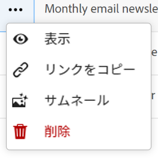
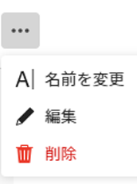

<!--update the metadata with real information when making this avilable in TOC and in the left nav-->

# レコードを編集

{{maestro-important-intro}}

レコードに関連付けられたフィールドの値を編集することで、Adobe Workfront Planning でレコード情報を編集できます。

レコードの作成と編集を開始する前に、レコードタイプを作成する必要があります。

詳しくは、 [レコードタイプの作成](../architecture/create-record-types.md).

レコードの作成について詳しくは、 [レコードを作成](/help/quicksilver/maestro/records/create-records.md).

&lt;! — ここで、詳細ビューのフィールドはテーブルビューのフィールドと同じであると言います。この記事は、この情報を参照するために、レコードビューの管理からリンクされています —>

## アクセス要件

この記事の手順を実行するには、次のアクセス権が必要です。

<table style="table-layout:auto">
 <col>
 </col>
 <col>
 </col>
 <tbody>
    <tr>
<tr>
<td>
   
 製品
 </td>
   <td>
   
 Adobe Workfront
 </td>
  </tr>  
 <td role="rowheader">
Adobe Workfront協定
</td>
   <td>

組織がAdobe Workfront Planning ベータプログラムに登録されている必要があります。 この新しいオファーについては、アカウント担当者にお問い合わせください。 

   </td>
  </tr>
  <tr>
   <td role="rowheader">
Adobe Workfront プラン
</td>
   <td>

任意

   </td>
  </tr>
  <tr>
   <td role="rowheader">
Adobe Workfront ライセンス*
</td>
   <td>
   
新規：明るいかそれ以上

   または
   
現在：作業以上
 
  </td>
  </tr>

<tr>
   <td role="rowheader">
アクセスレベル設定
</td>
   <td> 
Adobe Workfront Planning のアクセス制御はありません
  
</td>
  </tr>
<tr>
   <td role="rowheader">
権限
</td>
   <td> 
ワークスペースに権限を付与する（またはそれ以上の場合）</a> 
  
   
システム管理者は、作成しなかったワークスペースも含め、すべてのワークスペースに対する権限を持っています

</td>
  </tr>
<tr>
   <td role="rowheader">
レイアウトテンプレート
</td>
   <td> 
Workfrontまたはグループ管理者は、レイアウトテンプレートに計画領域を追加する必要があります。 詳しくは、 <a href="../access/access-overview.md">アクセスの概要</a>. 
  
</td>
  </tr>

</tbody>
</table>

*詳しくは、 [Workfrontドキュメントのアクセス要件](/help/quicksilver/administration-and-setup/add-users/access-levels-and-object-permissions/access-level-requirements-in-documentation.md).

## レコードの編集に関する考慮事項

* ワークスペースに対する権限を付与されている場合は、自分が作成したレコードや他のユーザーが作成したレコードを編集できます。
* 次の領域でレコードフィールドを編集できます。

   * レコードビューのレコードの [ 詳細 ] ボックス。
   * レコードの詳細ページ。
   * インライン、テーブル表示。

* 次のタイプのフィールドは自動的に更新され、値を手動で編集することはできません。
   * 他のレコードからリンクされたフィールド
   * 数式タイプのフィールド
   * システムフィールド（作成者、作成日、最終変更者、最終変更日）
* 表示したレコードが他のレコードにリンクされている場合、編集中のレコードの新しい情報は、リンクされたレコードに反映されます。
* レコードを一括で編集することはできません。 <!--this will probably change-->
* URL は、http://、https://、ftp://、www のいずれかで始まる場合にのみ、1 行のテキストフィールドタイプのリンクとして認識されます。.

## レコードを編集

次の領域でレコードを編集できます。

* [レコードタイプのテーブルビューから](#edit-a-record-from-the-table-view-of-a-record-type)
* [レコードの詳細ページから](#edit-a-record-from-the-records-details-page)

### レコードタイプのテーブルビューでレコードをインライン編集する

{#step1-to-maestro}

最後にアクセスしたワークスペースが開きます。

1. （オプション）ワークスペース名の右側にある下向き矢印をクリックして、レコードを更新するワークスペースを選択します。
1. レコードタイプのカードをクリックします。

   レコードタイプのページが開きます。
1. （条件付き）テーブルビューのタブをクリックするか、 **+表示** をクリックして、テーブルビューを作成します。 最後にアクセスしたときに別のタイプのビューでレコードタイプを表示した場合を除き、テーブルビューはデフォルトのビューにする必要があります。

   選択したレコードタイプに関連付けられているレコードが、テーブルビューに表示されます。
1. レコードの行内をクリックして、レコードに関する情報の編集をインラインで開始します。

   

   >[!NOTE]
   >
   >  次のフィールドの情報は読み取り専用で、Workfrontによって自動的に更新されるので、編集できません。
   >  
   >  * レコードタイプを接続して作成した、リンクされたフィールド。 詳しくは、 [レコードタイプを接続](../architecture/connect-record-types.md).
   >  * 作成者、作成日、最終変更者、最終変更日、数式フィールドの各タイプのフィールド。

1. （オプションおよび条件付き）段落タイプのフィールドを編集する場合、次の **リッチテキスト** フォーマットオプション：

   * 太字
   * 斜体
   * 下線
   * リンクを追加
   * 箇条書きリストを追加
   * 番号付きリストを追加

   

1. （オプション）接続されたレコードフィールドをダブルクリックして、接続されたレコードまたはオブジェクトを別のレコードに追加します。 詳しくは、 [レコードを接続](/help/quicksilver/maestro/records/connect-records.md).
1. 押す **入力** キーボードでクリックするか、行の外側をクリックして変更を保存します。 変更内容は自動的に保存されます。 A **保存済み** インジケータは、テーブルビューの右上隅に短く表示され、変更が保存されたことを示します。

1. （オプション）あるフィールドから別のフィールドに情報をコピーして貼り付けるには、次のいずれかの操作を行います。

   * フィールドの 1 つ以上の既存の値をコピーし、別のレコードの同じタイプのフィールドに貼り付けます
   * 列の列見出しをクリックして選択してコピーし、別の列の列見出しをクリックして、コピーした列の内容を貼り付けます。 列には、類似したフィールドタイプが含まれている必要があります。
   * Shift キーを押しながらクリックし、テーブル内の複数の行を選択し、選択した行の情報をコピーし、別の行をクリックして、選択した情報を新しい行に貼り付け、その後の行に次の情報を貼り付けます。

   >[!NOTE]
   >
   >次の点に注意してください。
   >
   >* 情報のコピーと貼り付けには、次のキーボードショートカットを使用します。
   >   * コピー： CTRL + C( Macの場合は⌘ + C)
   >   * 貼り付け： Ctrl + V (Macの場合は⌘ + V)
   >* 情報を貼り付けたフィールドと同じタイプのレコードフィールド以外の別のソースから情報をコピーすることはできません。
   >
   >* レコードの「詳細」領域にフィールド値をコピーして貼り付けることはできません。 この機能は、レコードタイプのテーブルビューでのみサポートされます。
   >* 次のフィールドタイプのフィールド値をコピーして貼り付けることはできません。
   >
   >
   >    * レコードタイプを接続して作成した、リンクされたフィールド。 リンクされたレコードフィールドをコピーして貼り付けることができます。 詳しくは、 [レコードタイプを接続](../architecture/connect-record-types.md).
   >    * 次のタイプのフィールド：作成者、作成日、最終変更者、最終変更日

1. （オプション）次のキーボードショートカットを使用して、レコード情報の編集またはコピーと貼り付けの取り消しまたはやり直しをおこないます。

   * Ctrl + Z( Macの場合は⌘ + Z)：変更を元に戻します。
   * Ctrl + Shift + Z(Macの場合は⌘ + Shift + Z)：変更をやり直します。

   >[!TIP]
   >
   >    複数の変更を元に戻すには、キーボードショートカットを複数回連続して使用します。

1. （オプション）レコードにサムネールを追加します。 詳しくは、 [レコードにサムネールを追加する](/help/quicksilver/maestro/records/add-thumbnails-to-records.md).

### レコードの詳細ボックスからレコードをビューで編集する

任意のビューの「詳細」ボックスからレコードを編集できます。

{{step1-to-maestro}}

最後にアクセスしたワークスペースが開きます。

1. （オプション）ワークスペース名の右側にある下向き矢印をクリックして、レコードを更新するワークスペースを選択します。

1. レコードタイプのカードをクリックします。

   レコードタイプのページが開きます。

1. 任意のタイプのビューで、レコードの名前をクリックします。

   または

   テーブルビューで、 **詳細を開く** アイコン  レコード名の左側に移動するか、レコード名をクリックします。 The **詳細** ボックスがビューで開きます。

   

   >[!TIP]
   >
   >次の項目を表示すると、 **詳細を開く** テーブルビューのレコードの [ 名前 ] フィールドの左側にあるアイコンは、[ 名前 ] フィールドが主フィールドの場合にのみ表示されます。

1. フィールド情報の編集を **詳細** ボックス。 Workfrontは変更を自動的に保存します。

1. （オプション） **新しいタブで開く** アイコン  <!--check the icon; they are changing it--> の右上隅に **詳細** レコードの **詳細** ページを新しいタブに追加します。 レコードの編集を続行します。詳しくは、 [レコードの詳細ページからレコードを編集する](#edit-a-record-from-the-records-details-page) 」の節を参照してください。

### レコードの詳細ページからレコードを編集する

レコードは詳細ページから編集できます。

{{step1-to-maestro}}

最後にアクセスしたワークスペースが開きます。

1. （オプション）ワークスペース名の右側にある下向き矢印をクリックして、レコードを更新するワークスペースを選択します。

1. レコードタイプのカードをクリックします。

   レコードタイプのページが開きます。

1. 次のいずれかの操作を行います。

   * 任意のビューから、「詳細」ボックスにアクセスします ( [レコードの詳細ボックスからレコードをビューで編集する](#edit-a-record-from-the-records-details-box-in-a-view)」の節を参照してください。 次に、 **新しいタブで開く** アイコン  <!--check the icon; they are changing it--> の右上隅に **詳細** レコードの **詳細** ページを新しいタブに追加します。

   * 次から： **テーブル** 表示し、レコード名の上にマウスポインターを置いて、 **その他** メニュー を選択し、次に **表示**

     

     レコード **詳細** ページが開きます。

     

1. 次をクリック： **その他** メニュー  をクリックし、 **編集**

   または

   詳細ページの編集可能なフィールド内をクリックして、情報を編集します。

    <!--ensure the options have not changed or been renamed-->

1. 「**変更を保存**」をクリックします。