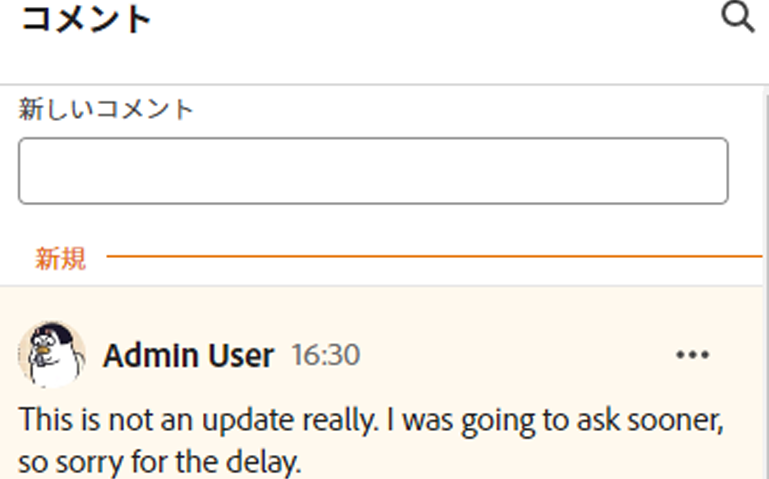
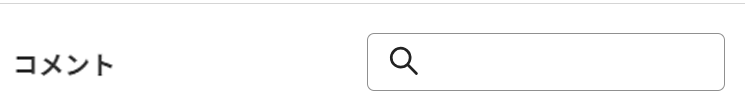
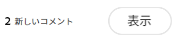
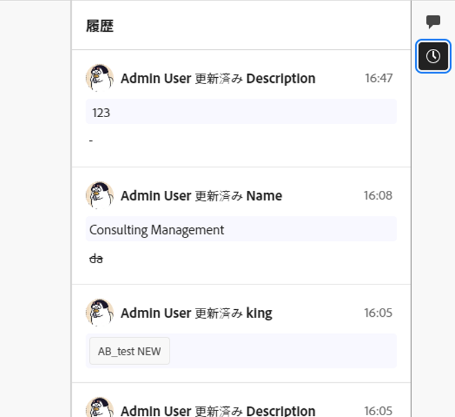

# レコードコメントの管理

<!--update the metadata with real information when making this available in TOC and in the left nav-->
<!--update the system updates articles when we release to open beta - check the long commenting stream article list and see articles that document where in the system we have system updates; "Maestro records" should be there-->

<!--The highlighted information on this page refers to functionality not yet generally available. It is available only in the Preview environment for all customers. 

For information about the current release schedule, see [First Quarter 2024 release overview](/help/quicksilver/product-announcements/product-releases/24-q1-release-activity/24-q1-release-overview.md). -->

レコードの [ コメント ] 領域にコメントや返信を追加することで、AdobeMaestro レコードに関する共同作業を行うことができます。

<!--replace first paragraph with this and update the Description in the metadata: 
You can collaborate on Adobe Maestro records, by adding comments or replies in the right panel of a record. You can also view other changes made to the record in this area.

The right panel of a record displays the following sections:

* Comments: Users can add comments and reply to existing ones.
* History: When you make a change to a record, Maestro records the change in this section. 
-->

## レコードにコメントする際の考慮事項

* レコードの [ コメント ] セクションで、Maestro のオペレーショナルレコードとタクソノミにコメントと返信を追加できます。

* リンクされたレコードに追加されたコメントは、リンク元のレコードには表示されません。 例えば、Campaign レコードにリンクされている Maestro Product レコードにコメントを付けると、コメントは Maestro の Product レコードにのみ表示され、リンク元の Campaign レコードには表示されません。

* Maestro レコードと別のアプリケーションのオブジェクトとの接続の結果として作成された Maestro レコードにコメントを追加できます。

  例えば、Workfrontプロジェクトを Maestro レコードと接続した後で、Project Maestro レコードにコメントを付けることができます。 詳しくは、 [レコードを接続](/help/quicksilver/maestro/records/connect-records.md).

* 他のアプリケーションでリンクされたオブジェクトに追加されたコメントは Maestro には表示されず、Maestro でリンクされたオブジェクトに追加されたコメントは他のアプリケーションには表示されません。

  例えば、Workfrontのプロジェクトに追加されたコメントは、Maestro のキャンペーンにリンクされている同じプロジェクトには表示されず、Maestro レコードに追加されたコメントはWorkfrontには表示されません。

* ユーザーにタグを付けて、更新に注意を向けることができます。 タグ付きユーザーは、アプリ内通知や更新に関する電子メールを受け取りません。 <!--this might change??-->

* Maestro の次の領域からレコードに更新を追加できます。

   * 「詳細」ページから。

  <!--* From the table view.-->

## アクセス要件

この記事の手順を実行するには、次のアクセス権が必要です。

<table style="table-layout:auto">
 <col>
 </col>
 <col>
 </col>
 <tbody>
    <tr>
<tr>
<td>
   
 製品
 </td>
   <td>
   
 Adobe Workfront
 </td>
  </tr>  
 <td role="rowheader">
Adobe Workfront協定
</td>
   <td>

組織は、Maestro クローズ済みベータプログラムのAdobeに登録する必要があります。 この新しいオファーについては、アカウント担当者にお問い合わせください。 

   </td>
  </tr>
  <tr>
   <td role="rowheader">
Adobe Workfrontプラン
</td>
   <td>

任意

   </td>
  </tr>
  <tr>
   <td role="rowheader">
Adobe Workfrontライセンス
</td>
   <td>
   
任意
 
  </td>
  </tr>

<tr>
   <td role="rowheader">
アクセスレベルの設定
</td>
   <td> 
Maestro にはアクセスレベルの制御はありません。 
  
</td>
  </tr>
<tr>
   <td role="rowheader">
権限
</td>
   <td> 
ワークスペースに対する表示権限以上の権限</a> 
  
   
システム管理者は、作成しなかったワークスペースも含め、すべてのワークスペースに対する権限を持っています

</td>
  </tr>

<tr>
   <td role="rowheader">
レイアウトテンプレート
</td>
   <td> 
Workfrontまたはグループ管理者は、レイアウトテンプレートに Maestro 領域を追加する必要があります。 詳しくは、 <a href="../access/access-overview.md">アクセスの概要</a>. 
  
</td>
  </tr>
 </tbody>
</table>

### レコードに対するコメントの管理

{{step1-to-maestro}}

最後にアクセスしたワークスペースは、デフォルトで開きます。
1. 次の場所からテーブルビューを選択します。 **表示** ドロップダウンメニュー。
1. テーブルビューでレコードの名前をクリックします。

   レコードの **詳細** ページが開きます。 「コメント」領域は、デフォルトでは右側のパネルに開きます。

1. でコメントの入力を開始 **新しいコメント** ボックス。

   

   >[!TIP]
   >
   >コメントを入力して送信する前に「コメント」セクションから移動すると、ログオフしてログオンし直した後でも、ページ上のコメントはドラフトモードのままになります。 コメントに追加された画像も下書きに保存されます。 ドラフトは 7 日間保存され、その後は破棄され、復元できません。 下書きのコメントは、ユーザーが入力した場合にのみ表示されます。

1. （オプション）変更の取り消しまたはやり直しをおこなうには、次のショートカットキーを使用します。
   * Ctrl + Z( Macの場合は⌘+z)：変更を元に戻します。
   * Ctrl + Y( Macの場合は⌘+y)：変更をやり直します。
1. （オプション） **@** 更新時に、誰かにタグを付けるユーザーの名前が続きます。
1. （オプション）リッチテキストツールバーのオプションを使用して、テキストの書式設定、絵文字、リンク、画像を更新に追加し、コンテンツを拡張できます。 詳しくは、この記事の「Workfrontの更新でのリッチテキストの使用」の節を参照してください [作業を更新](../../workfront-basics/updating-work-items-and-viewing-updates/update-work.md).

   >[!TIP]
   >
   >別のユーザーが、更新しようとしている同じ項目にコメントを送信した場合、赤い線に「新規」インジケータが表示され、新しいコメントが通知されます。
   >
   >インジケーターは、コメントがアイテムに送信された後にのみ表示され、コメントがまだ構成されている場合は表示されません。
   >
   >

1. クリック **送信** をクリックして、レコードに更新を追加します。
1. （オプション）コメントを編集するには、 **その他** メニュー  コメントの右上隅で、 **編集**.

   >[!IMPORTANT]
   >
   >コメントは送信後 15 分以内にのみ編集できます。

1. コメント内の情報の編集、画像の追加や削除、タグ付きユーザーの削除をおこないます。 コメントの左側に「編集済み」のインジケーターが追加されます。

   >[!TIP]
   >
   >現在の年からのコメントでは、日付スタンプに年は表示されません。 タイムスタンプの上にマウスポインターを置くと、年を含む完全な日付が表示されます。

1. （オプションおよび条件付き）既存のコメントを検索するには、まず、 **コメント** 領域。

   

1. （オプション）「 **返信** または、 **返信を追加…** 領域に移動し、既存のコメントに返信するには、上記の手順 4～8 に従います。 <!--(**************accurate??***********)-->

1. （条件付きおよびオプション）コメントの追加中に「コメント」セクションの表示領域の外側に表示されるコメントを他のユーザーが追加した場合は、「 **表示** 内側 **新しいコメントバナー** をクリックして、これらのコメントを表示します。

   

   追加のコメントが画面の下部に表示されます。

1. （オプション） **次に類似** アイコンをクリックして、更新を「いいね！」にしたり、自分が読んだことを確認したりします。 アイコンは「いいね！」の数に応じて更新されます。
1. （条件付きおよびオプション）コメントに追加の人を含める場合は、更新に含まれるユーザーのアバターをクリックして、コメントの共有先ユーザーのリストを表示します。
1. （オプション） **その他** アイコン  コメントの右上隅で、次のいずれかのオプションをクリックして、コメントから情報をコピーします。

   * **リンクをコピー**：コメントへのリンクをクリップボードにコピーします。
   * **本文テキストをコピー** t：コメントのテキストをクリップボードにコピーします。
   * **見積もりの返信**：コメントの内容を新しい返信にコピーします。 コピーされた返信に画像は含まれません。

   詳しくは、 [作業を更新](../../workfront-basics/updating-work-items-and-viewing-updates/update-work.md).
1. （オプション） **その他** アイコン  コメントの右上隅で、 **削除** をクリックしてコメントを削除します。

<!--
## History section overview

*********also update the screen shot above for the Comments section ******

You can refer to the History section in the right panel of a record to view changes made to the record. 

Maestro records the following information in the History section: 

* Any field changes
* The full name of the user who made the change
* A date and time stamp of when the change occurred. 
-->
