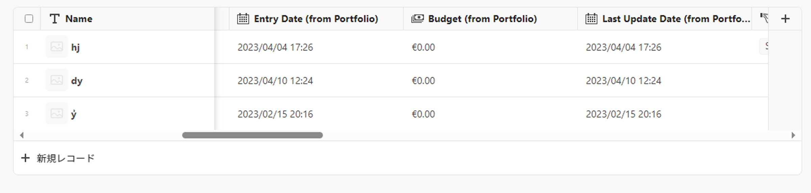
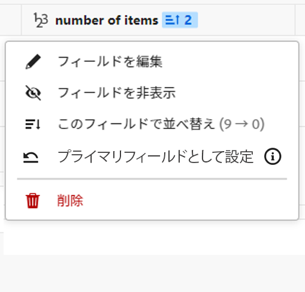
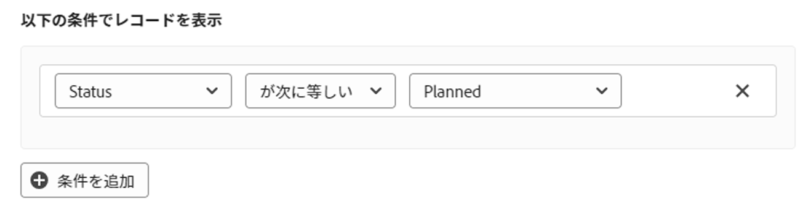
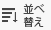

# テーブル表示の管理

<!--
title: Manage the table view
description: You can display records in a table view when using Adobe Maestro. 
hidefromtoc: yes
author: Alina
feature: Work Management
role: User
hide: yes
-->

<!--update the metadata with real information when making this available in TOC and in the left nav-->

{{maestro-important-intro}}

Maestro でレコードタイプページにアクセスする際に、テーブルビューでレコードとそのフィールドをAdobeで表示できます。

Maestro ビューとその管理方法については、 [レコードビューの管理](../views/manage-record-views.md).

## アクセス要件

この記事の手順を実行するには、次のアクセス権が必要です。

<table style="table-layout:auto">
 <col>
 </col>
 <col>
 </col>
 <tbody>
    <tr>
<tr>
<td>
   
 製品
 </td>
   <td>
   
 Adobe Workfront
 </td>
  </tr>  
 <td role="rowheader">
Adobe Workfront協定
</td>
   <td>

組織は、Maestro クローズ済みベータプログラムのAdobeに登録する必要があります。 この新しいオファーについては、アカウント担当者にお問い合わせください。 

   </td>
  </tr>
  <tr>
   <td role="rowheader">
Adobe Workfront プラン
</td>
   <td>

任意

   </td>
  </tr>
  <tr>
   <td role="rowheader">
Adobe Workfront ライセンス
</td>
   <td>
   
任意
 
  </td>
  </tr>

<tr>
   <td role="rowheader">アクセスレベルの設定</td>
   <td> 
Maestro のアクセスレベルコントロールはありません 
  
</td>
  </tr>

<tr>
   <td role="rowheader">
権限
</td>
   <td> 
ビューに対する権限の管理
  
</td>
  </tr>

<tr>
   <td role="rowheader">レイアウトテンプレート</td>
   <td> 
システム管理者は、レイアウトテンプレートに Maestro 領域を追加する必要があります。 詳しくは、 <a href="../access/access-overview.md">アクセスの概要</a>. 
  
</td>
  </tr>
 </tbody>
</table>

## テーブルビューの管理 {#manage-a-table-view}

<!--insert screen shot of table view-->

テーブルビューを作成すると、選択したタイプのすべてのレコードがテーブルに表示されます。 各行は一意のレコードで、各列はレコードフィールドです。 デフォルトでは、すべてのフィールドとすべてのレコードが表示されます。

テーブル・ビューを管理する手順は、次のとおりです。

1. 「 」を参照して、テーブルビューを作成します。 [レコードビューの管理](../views/manage-record-views.md).

   

1. 以下のサブセクションで説明するように、次のビュー要素を更新します。
   * [列（またはフィールド）](#add-columns-or-fields)
   * [行（またはレコード）](#add-rows-or-records)
   * [フィルター](#add-filters)
   * [グループ化](#add-groupings)
   * [並べ替え](#sort-information)

### 列（またはフィールド）を追加 {#add-columns}

Maestro テーブルビューの列ヘッダーには、ビュー内のレコードに関連付けられたフィールドが表示されます。 テーブルビューに表示されるのと同じフィールドは、Maestro レコードの [ 詳細 ] セクションにも表示されます。 詳しくは、 [レコードを編集](../records/edit-records.md).

<!--this is not available yet:You can display record fields (or columns) in both a table and a timeline view. However, the number of columns displayed in the table of the timeline view is limited and you cannot add columns in addition to those selected by default.-->

ビューに列を追加する操作は、レコードタイプにフィールドを追加する操作と同じです。

テーブルビューでは、最大 500 個のフィールド（または列）を追加できます。

1. レコードタイプのページに移動し、 **テーブル** ビューを選択します。
1. 記事の説明に従って、フィールド（または列）の追加を開始します。 [フィールドの作成](../fields/create-fields.md).

   追加した列は、レコードタイプにアクセスするすべてのユーザーに対して表示され、選択したレコードタイプのレコードの [ 詳細 ] ページに新しいフィールドとして追加されます。

1. テーブルの列を並べ替えるには、次のいずれかの操作を行います。

   * 列ヘッダーをつかんで、目的の位置にドラッグ&amp;ドロップします。 移動した列は、テーブルを調整するまで、青い背景で短く表示されます。

   * クリック **フィールド** テーブルのツールバーで、目的の順序でフィールドをドラッグ&amp;ドロップし、 **フィールドの表示と順序** ボックスを使用して閉じます。

     

     >[!TIP]
     >
     >* 「名前」フィールドは、デフォルトでは、常にテーブル表示の最初のフィールドです。 これは主フィールドと見なされます。
     >
     >* 別のフィールドを主フィールドとして指定しない限り、[ 名前 ] フィールドを別の位置に移動することはできません。 詳細については、手順 4 に進んでください。 <!--accurate?-->
     >
     >* 主フィールドの非表示や削除はできません。
     >
     >* 主フィールドがフリーズし、水平スクロールの一部ではありません。

   * 最初の列のフィールドを別のフィールドに置き換えるには、主フィールドを変更します。 詳細については、手順 4 に進んでください。 <!--accurate?-->

1. （オプション）テーブルの最初の列に表示されないフィールドの列見出しのフィールド名の上にマウスポインターを置き、フィールド名の右側にある下向き矢印をクリックして、 **プライマリフィールドとして設定**.

   

1. クリック **フィールドを設定** をクリックして確定します。

   フィールドは、テーブル表示の最初の列として表示されるプライマリフィールドになります。 前の主フィールドは、2 番目の列に移動します。

   >[!NOTE]
   >
   >   * 主フィールドとして指定できるのは、次のタイプのフィールドのみです。
   >
   >       * 1 行テキスト
   >       * 数値
   >       * 式
   >
   >   * 主フィールドは常にフリーズし、移動できません。 別の位置に移動する必要がある場合は、別のフィールドを選択してプライマリフィールドを置き換えることができます。
   >
   >   * テーブルビューの主フィールドを変更すると、その主フィールドを選択する他のすべてのユーザーのビューに影響します。
   >
   >   * テーブルビューの主フィールドを変更すると、すべてのテーブルビューに影響します。
   >
   >   * プライマリフィールドを削除したり、非表示にすることはできません。
   >
   >   * プライマリフィールドに表示される値は、レコードの詳細ページに常にハイパーリンクされます。

1. 列の分離線をクリックしてドラッグし、目的の場所にドロップして、列の幅を広げます。

   >[!TIP]
   >
   >列の幅と順序に対して行った変更は、永続的に適用され、レコードタイプにアクセスするすべてのユーザーに表示されます。

1. 列見出しの上にマウスポインターを置き、下向き矢印をクリックして、 **フィールドを非表示**

   または

   クリック **フィールド** をクリックし、非表示にするフィールド（または列）に関連付けられた切り替えを無効にします。 The **フィールドの表示と順序** ボックスが表示されます。

   >[!TIP]
   >
   >非表示のフィールドの数は、ツールバーのフィールドアイコンの左側に表示されます。

1. 次をクリック： **フィールド** アイコンをクリックし、テーブルの列に表示するフィールドに関連付けられた切り替えを有効にします。 デフォルトでは、すべてのフィールドが表示されます。

1. キーワードに一致するレコードをすばやく検索するには、次の手順を実行します。

   1. 次をクリック： **検索** アイコン  をクリックして、画面に表示されるレコードの任意のフィールドに関連付けられたキーワードの入力を開始します。 正しい一致の数が検索項目の横に表示され、正しい一致を持つフィールドがハイライト表示されます。

      

      画面に表示される任意の単語や特殊文字を使用できます。

      テーブル表示で非表示になっているフィールドに関連付けられたキーワードは使用できません。

   1. 押す **入力** キーボードで、次に見つかったフィールドに移動します。

   1. （オプション）複数の一致がある場合は、検索キーワードの右にある上下の矢印をクリックして、テーブル内のすべての一致を検索します。

   1. 次をクリック： **x** アイコンをクリックして、検索キーワードをクリアします。

### 行（またはレコード）を追加 {#add-rows}

Maestro テーブルビューの行には、選択したレコードタイプの個々のレコードが表示されます。

Maestro では、1 つのレコードタイプに対して最大 10,000 個のレコード（または行）を指定できます。

1. レコードタイプのページに移動し、 **テーブル** ビューを選択します。
1. 記事の説明に従って、レコード（または行）の追加を開始します。 [レコードを作成](../records/create-records.md).

   テーブル表示で追加したレコードは直ちに保存され、ワークスペースに対する表示権限以上を持つすべてのユーザーに表示されます。

1. （オプション）各レコードにサムネールを追加し、 **フィールド** テーブルの右上隅で、 **サムネール** 「 」フィールドを使用して、プライマリフィールドの左側に表示します。 デフォルトでは選択されていません。

   詳しくは、 [レコードにサムネールを追加](/help/quicksilver/maestro/records/add-thumbnails-to-records.md).

1. （オプション）1 つの行で 1 つ以上のレコードを選択し、 **取り扱い** アイコン  をレコード名の左側に追加して、行を並べ替えます。

   >[!NOTE]
   >
   >テーブルビューに少なくとも 1 つの並べ替えを適用すると、行の並べ替えを行うことはできません。

   <!-- this is not possible right now:

    1. To reorder the rows, click the row header, drag and drop it in the desired location. 

        The changes you make to the row order are permanent and visible to all users who access the record type
    -->

<!-- this section below links from the timeline view; consider splitting them if they become different-->

### フィルターを追加 {#add-filters}

フィルターを使用すると、画面に表示される情報の量を減らすことができます。

テーブルビューでフィルタを使用する際は、次の点に注意してください。
<!-- this list is almost identical to the one for the table view - update both-->

* 同じレコードタイプに適用された場合、テーブル表示用に作成したフィルタは、タイムライン表示のフィルタとは独立して機能します。

* フィルターは、選択したビューに固有です。 同じレコードタイプの 2 つのテーブルビューに、異なるフィルタを適用できます。 同じテーブル表示を見ている 2 人のユーザーには、現在適用されているのと同じフィルターが表示されます。

* 作成してテーブルビューに適用したフィルターに名前を付けることはできません。

* フィルターを削除すると、自分と同じレコードタイプにアクセスするすべてのユーザーからフィルターが削除され、使用したのと同じビューが使用されます。

* テーブル表示にフィルターを追加する方法は、タイムライン表示にフィルターを追加する方法と同じです。

テーブルビューにフィルターを追加するには、次の手順に従います。

1. 記事の説明に従って、レコードタイプのページのテーブルビューを作成します。 [レコードビューの管理](../views/manage-record-views.md).
1. テーブルビューを選択し、「 **フィルター** をクリックします。
1. クリック **条件を追加** 次の情報を追加します。

   * フィルターに使用するフィールドを選択します <!-- the tip below might change-->

   * オプション（またはフィルター修飾子）を選択して、フィールドが満たす必要のある条件の種類を定義します

     次の表に、フィールドの各タイプで使用可能な修飾子を示します。

     <table>
        <thead>
        <tr>
            <th><b>フィールドタイプ</b></th>
            <th><b>修飾子</b></th>
        </tr>
        </thead>
        <tbody>
        <tr>
            <td>1 行、段落、数式 </td>
            <td>
が次を含む

            
が次を含まない

            
が次に等しい

            
が次に等しくない

            
が空である

            
が空ではない
</td>
        </tr>
        <tr><td>単一選択</td>
            <td>
が次に等しい

            
が次に等しくない

            
が次のいずれかである

            
が次のいずれでもない

            
が空である

            
が空ではない
</td>
        </tr>
        <tr>
            <td>複数選択、担当者</td>
            <td>
が次のいずれかを含む

            
が次のすべてを含む

            
が次に完全に等しい

            
が次のいずれも含まない

            
が空である

            
が空ではない
</td>
        </tr>
        <tr>
            <td>数値、割合、通貨</td>
            <td>
=

            
≠

            
 &lt; 

            
&gt;

            
≤

            
≥

            
が空である

            
が空ではない
</td>
        </tr>
        <tr>
            <td>日付</td>
            <td>
が次に等しい

            
が次に等しくない

            
が次の後にある

            
が次の前にある

            
が次の範囲である

が次の範囲ではない

            
が空である

が空ではない
</td>
        </tr>

     <tr>
            <td>チェックボックス</td>
            <td>
が次に等しい

        </tr>
        </tbody>
        </table>

   * 選択したフィールドの値を選択します。

   

   追加できるフィルター条件の数に制限はありません。

1. （オプション）「 **条件を追加** 別のフィルターオプションを追加するには、上記の手順を繰り返します。 適用されたフィルターの数がフィルターアイコンの左側に表示されます。
1. 次の演算子をクリックして、フィルター条件の結合方法と適用方法を指定します。

   * **および**：指定したすべての条件を満たす必要があります。
   * **または**：指定した条件のいずれかを満たす必要があります。 これはデフォルトのオプションです。

   レコードのリストは自動的にフィルタリングされます。  <!--at this time, you can't name and save the filter - but will this change?!-->
   <!-- asked on the task for the simple filters whether there is a limitation for how many statements a filter can have?!-->

1. （オプション）「 **フィルター**」、「 **x** アイコンをクリックして、フィルターを削除します。 <!--right now you cannot "clear all" for filters, but this might come later-->

### グループを追加 {#add-groupings}

<!--this section exists in the timeline view too, but the display is slightly different, so I kept both steps; consider updating both sections if any updates to groupings are introduced-->

グループ化をビューに適用する際に、類似の情報でレコードをグループ化できます。

テーブル表示でのグループ化の追加方法は、タイムライン表示でのグループ化の追加方法と似ています。

次の点に注意してください。

* テーブルビューとタイムラインビューの両方でグループを適用できます。 テーブルビューのグループは、同じレコードタイプのタイムラインビューのグループとは独立しています。
* マエストロビューでは、3 つのレベルのグループ化を適用できます。 レコードは、選択したグループ化の順にグループ化されます。
&lt;!—* API を使用する場合は、最大 4 レベルのグループ化を適用できます。  — 今すぐ確認中 —>
* グループは、選択した表示に固有です。 同じレコードタイプの 2 つのテーブルビューに、異なるグループを適用することができます。 同じテーブル表示を見ている 2 人のユーザーには、現在適用されているのと同じグループが表示されます。
* テーブルビューに対して作成したグループに名前を付けることはできません。
* グループを削除すると、自分と同じレコードタイプにアクセスし、自分と同じビューを表示する人から、自分が削除されます。
* グループ化の下にリストされたレコードを編集できます。
<!--checking into this: * You can apply up to 4 levels of grouping when using the API. -->
<!-- checking also into this: * You cannot group by a Paragraph-type field.-->

グループを追加する手順は、次のとおりです。

1. 記事の説明に従って、レコードタイプのタイムラインビューを作成します。 [レコードビューの管理](../views/manage-record-views.md).
1. クリック **グループ化** をクリックします。

   

1. 推奨フィールドの 1 つをクリックするか、 **別のフィールドを選択**」で別のフィールドを検索し、リストに表示されたらクリックします。

   グループ化は、テーブルに自動的に適用され、グループ化分離ラインの下にレコードが表示されます。

1. （オプション）上記の手順を繰り返して、最大 3 つのグループを追加します。

   グループ化用に選択したフィールドの数がグループ化アイコンの横に表示されます。

   

1. （オプション） **次の項目でレコードをグループ化** ボックスで、 **x** グループ化を削除するために選択したフィールドの右側のアイコン

   または

   クリック **すべてクリア** をクリックして、すべてのフィールドを削除します。

1. の外側をクリック **次の項目でレコードをグループ化** ボックスを使用して閉じます。
1. （オプション）「 **+新規 &lt; レコードタイプ名 >** をクリックして新しいレコードを追加し、ページを更新して新しいレコードを適切なグループに追加します。 <!--this might need to be changed when they add the Refresh button on the toolbar of the table view-->

### 並べ替えの追加 {#sort-information}

並べ替えを適用すると、情報を指定された順序で整理できます。

次の情報を並べ替えることができます。

* テーブルビュー内のすべてのレコード。 <!--or timeline view. ***********verify this is the case for the timeline view*********************-->
  <!--* All groupings. - this is not available yet-->

テーブルビューでレコードを並べ替える際は、次の点に注意してください。

<!-- if this is available for the timeline view, update both when you update one-->

* 並べ替えは、選択したビューに固有です。 同じレコードタイプの 2 つのテーブルビューに異なる並べ替え基準を適用することができます。 同じテーブル表示を見ている 2 人のユーザーには、現在適用されているのと同じ並べ替えが表示されます。

* 作成してテーブルビューに適用した並べ替えに名前を付けることはできません。

* 作成した並べ替えは、移動しても保持されます。

* レコードタイプのテーブルビューに表示されている数だけフィールドを並べ替えることができます。

* 並べ替え基準を削除すると、自分と同じレコードタイプにアクセスするすべてのユーザーから削除され、使用したのと同じビューが使用されます。

並べ替えるには <!--ungrouped (add this when sorting for groupings will be available--> レコードを作成するには、以下の手順を実行します。

1. 「 」を参照して、テーブルビューを作成します。 [レコードビューの管理](../views/manage-record-views.md).
1. 次をクリック： **並べ替え** アイコン  テーブルの右上隅に

   または

   テーブル表示で列の名前の上にマウスポインターを置き、列ヘッダー名の右にある下向き矢印をクリックして、 **このフィールドで並べ替え**. このフィールドは、テーブル表示の右上隅にある並べ替えアイコンで並べ替え選択として追加されます。

1. Adobe Analytics の **レコードの並べ替え基準** ボックスをクリックするか、推奨フィールドの 1 つをクリックするか、 **別のフィールドを選択** 別のフィールドを検索し、リストに表示されたらクリックします。

   並べ替えはテーブルビューに自動的に適用され、選択した条件で並べ替えられたレコードが表示されます。

   <!-- add a step that you can rearrange the sorting fields here, when this will be possible-->

1. （オプション）上記の手順を繰り返して、追加のフィールドで並べ替えます。

   並べ替えるフィールドの数は、ツールバーの右上隅にある並べ替えアイコンの左側に表示されます。 選択できるフィールドは、テーブル表示の列に表示されるフィールドのみです。

1. （オプション） **レコードの並べ替え基準** ボックスで、 **x** 並べ替えを削除するための並べ替えフィールドの右側のアイコン

   または

   クリック **すべてクリア** をクリックして、並べ替えからすべてのフィールドを削除します。

1. の外側をクリック **レコードの並べ替え基準** ボックスを使用して閉じます。

   

   テーブルに表示される情報は、選択した条件に従って並べ替えられます。

   並べ替え用に選択されたフィールドには、並べ替えアイコンに続いて、並べ替えが適用される順序を示す数字が表示されます。

<!-- this is not available yet: 

To sort grouped records: 

1. Create a view, as described in [Create or edit record views](#create-or-edit-record-views). 
1. ************************* add steps here for sorting grouped records****************

-->
