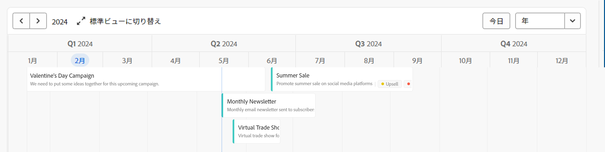
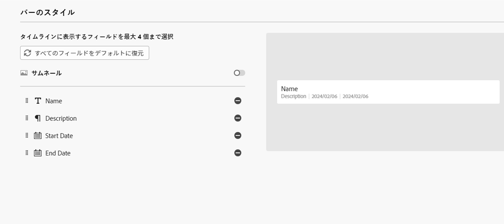
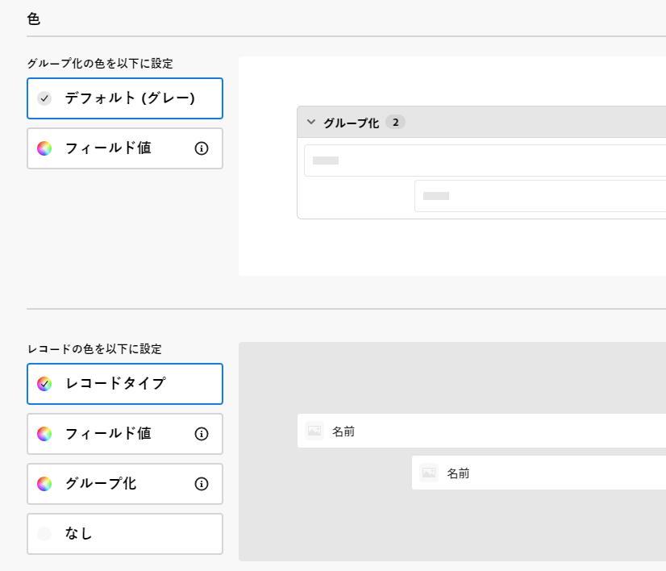
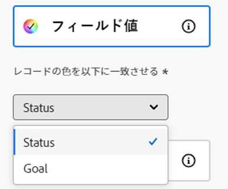

# タイムライン表示を管理

<!--
title: Manage the timeline view in Adobe Maestro
description: You can display records in a timeline view, when accessing the record type page in Adobe Maestro. 
hidefromtoc: yes
hide: yes
author: Alina
feature: Work Management
role: User
-->

<!--update the metadata with real information when making this available in TOC and in the left nav-->

>[!IMPORTANT]
>
>この記事の情報は、Adobe Workfrontからの新しいオファーであるAdobe・マエストロを指します。
>
>現在、Adobe・マエストロは、限られた数の顧客に対してオープンなベータプログラムの一部です。 Maestro 機能を使用するには、Workfrontのお客様である必要があります。
>
>Maestro のベータプログラムへの参加について詳しくは、アカウント担当者にお問い合わせください。
>
>詳しくは、 [Adobeマエストロの概要](/help/quicksilver/maestro/maestro-overview.md).

AdobeMaestro でレコードタイプのページにアクセスする際に、タイムラインビューにレコードを表示できます。

Maestro ビューについて詳しくは、 [レコードビューをAdobeMaestro で管理](../views/manage-record-views.md).

## アクセス要件

この記事の手順を実行するには、次のアクセス権が必要です。

<table style="table-layout:auto">
 <col>
 </col>
 <col>
 </col>
 <tbody>
    <tr>
<tr>
<td>
   
 製品
 </td>
   <td>
   
 Adobe Workfront
 </td>
  </tr>  
 <td role="rowheader">
Adobe Workfront協定
</td>
   <td>

組織は、Maestro クローズ済みベータプログラムのAdobeに登録する必要があります。 この新しいオファーについては、アカウント担当者にお問い合わせください。 

   </td>
  </tr>
  <tr>
   <td role="rowheader">
Adobe Workfrontプラン
</td>
   <td>

任意

   </td>
  </tr>
  <tr>
   <td role="rowheader">
Adobe Workfrontライセンス
</td>
   <td>
   
任意
 
  </td>
  </tr>

<tr>
   <td role="rowheader">アクセスレベルの設定</td>
   <td> 
Maestro のアクセスレベルコントロールはありません 
  
</td>
  </tr>

<tr>
   <td role="rowheader">
権限
</td>
   <td> 
ビューに対する権限の管理
  
</td>
  </tr>

<tr>
   <td role="rowheader">レイアウトテンプレート</td>
   <td> 
システム管理者は、レイアウトテンプレートに Maestro 領域を追加する必要があります。 詳しくは、 <a href="../access/access-overview.md">アクセスの概要</a>. 
  
</td>
  </tr>
 </tbody>
</table>

## タイムライン表示の管理 {#manage-a-timeline-view}

<!--insert screen shot of timeline view-->

タイムラインビューを作成すると、選択したレコードタイプのすべてのレコードが時系列で表示されます。

次の点に注意してください。

* タイムラインビューを作成できるのは、レコードタイプに関連付けられた日付フィールドが少なくとも 2 つある場合のみです。 1 つ以上の日付フィールドがレコードの種類に関連付けられている場合は、[ タイムライン表示 ] オプションは淡色表示になります。
* 次のシナリオでは、日付がレコードに関連付けられている場合に、一部のレコードがタイムラインビューに表示されないことがあります。

   * 開始日と終了日に値がない場合
   * 開始日または終了日に値がない場合
   * 開始日が終了日より後の場合

<!--these are NOT available now because there won't be a table for the timeline view for the near future, per Andy: 
* The records displayed in the timeline view also display in a view-only table to the left of the timeline. 
* Each row in the table and each bar on the timeline represent the same record. 
* Each column in the table is a record field. The columns of this table are preconfigured and cannot be customized. 
* Only a limited number of fields (or columns) display in the timeline view table. 
* You cannot do the following in a timeline view:
     * Add rows or records
     * Add columns or fields
     * Edit record information
-->

タイムラインビューを管理するには：

1. タイムラインを表示するレコードタイプページに移動します。
1. 記事の説明に従って、タイムラインビューを作成します。 [レコードビューの管理](../views/manage-record-views.md).

   

   選択したレコードタイプに関連付けられたレコードは、タイムラインにバーとして表示され、デフォルトでは、開始日の時系列で並べ替えられます。

   >[!TIP]
   >
   >    タイムラインのレコードの並べ替えは、コンパクト表示には表示されません。

1. タイムラインに移動するには、次のいずれかの操作を行います。

   * 左右のアイコンをクリックするか、水平スクロールを使用してタイムライン内を前後に移動します。
   * クリック **今日** をクリックして、今日の日付をタイムラインの中心に配置します。
   * 時間枠ドロップダウンメニューから次のいずれかのオプションを選択して、時間間隔を更新します。

      * 年
      * 四半期
      * 月
1. クリック **標準に切り替え** 別々の行にレコードを表示するビュー <!--check to see if they updated the name of the setting here-->

   または

   クリック **コンパクト表示に切り替え** 日付が同じ行で交差しないレコードを表示します。 <!--check to see if they updated the name of the setting here-->

   デフォルトでは、レコードはコンパクトビューに表示されます。

1. キーワードに一致するレコードをすばやく検索するには、次の手順を実行します。

   1. 次をクリック： **検索** アイコン  をクリックして、画面に表示されるレコードの任意のフィールドに関連付けられたキーワードの入力を開始します。 正しい一致の数が検索項目の横に表示され、正しい一致を持つレコードがハイライト表示されます。

      

      画面に表示される任意の単語や特殊文字を使用できます。

      タイムライン表示に表示されないフィールドに関連付けられたキーワードは使用できません。

   1. キーボードの Enter キーを押して、次に見つかったフィールドに移動します。
   1. （オプション）複数の一致がある場合は、検索キーワードの右にある上下の矢印をクリックして、テーブル内のすべての一致を検索します。
   1. 次をクリック： **x** アイコンをクリックして、検索キーワードをクリアします。

1. 以下のサブセクションで説明するように、次のビュー要素を更新します。
   * [フィルター](#add-filters)
   * [グループ化](#add-grouping)
   * [設定](#edit-the-timeline-view-settings)
     <!--* [Sort](#add-sort) not sure if this is present in timeline views?!; also check the anchor and make sure it's correct-->

### フィルターを追加

フィルターを使用すると、画面に表示される情報の量を減らすことができます。

タイムライン表示でフィルターを操作する際は、次の点に注意してください。

<!-- this list is almost identical to the one for the table view - update both-->

* タイムライン表示用に作成したフィルタは、同じレコードタイプに適用された場合、テーブル表示のフィルタとは独立して機能します。

* フィルターは、選択したビューに固有です。 同じレコードタイプの 2 つのタイムラインビューに、異なるフィルターを適用することができます。 同じタイムライン表示を見ている 2 人のユーザーには、現在適用されているのと同じフィルターが表示されます。

* タイムライン表示用に作成したフィルターには名前を付けられません。

* フィルターを削除すると、自分と同じレコードタイプにアクセスし、自分と同じビューを表示する人から、自分が削除されます。

* タイムラインビューでのフィルターの追加方法は、テーブルビューでのフィルターの追加方法と同じです。

  詳しくは、この記事の「フィルターの追加」の節を参照してください [テーブル表示の管理](../views/manage-the-table-view.md).

### グループ化を追加

<!-- groupings are almost identical between this view and table  but they display a little differently, so I kept the steps for both; update in both places if they make changes to groupings-->

グループ化をビューに適用する際に、類似の情報でレコードをグループ化できます。

タイムライン表示でグループ化を追加する操作は、テーブル表示でグループ化を追加する操作と似ています。

タイムライン表示でグループ化を操作する際は、次の点に注意してください。

* テーブルビューとタイムラインビューの両方でグループを適用できます。 テーブルビューのグループは、同じレコードタイプのタイムラインビューのグループとは独立しています。
* マエストロビューでは、3 つのレベルのグループ化を適用できます。 レコードは、選択したグループ化の順にグループ化されます。
* API を使用する場合、最大 4 レベルのグループ化を適用できます。
* グループは、選択した表示に固有です。 同じレコードタイプの 2 つのタイムライン表示で、異なるグループを適用することができます。 同じタイムライン表示を見ている 2 人のユーザーには、現在適用されているのと同じグループが表示されます。
* タイムライン表示用に作成したグループに名前を付けることはできません。
* グループを削除すると、自分と同じレコードタイプにアクセスし、自分と同じビューを表示する人から、自分が削除されます。

タイムライン表示でグループを追加するには：

1. 記事の説明に従って、レコードタイプのタイムラインビューを作成します。 [レコードビューの管理](../views/manage-record-views.md).
1. クリック **グループ化** をクリックします。

   

1. 推奨フィールドの 1 つをクリックするか、 **別のフィールドを選択**」で別のフィールドを検索し、リストに表示されたらクリックします。

   >[!TIP]
   >
   >リンクされたフィールドは選択できません。

   グループ化はタイムラインに自動的に適用され、レコードはグループ化ボックス内に表示されます。

   <!-- add a step that you can rearrange the groupings here, when this will be possible-->

1. （オプション）上記の手順を繰り返して、最大 3 つのグループを追加します。

   グループ化用に選択したフィールドの数がグループ化アイコンの横に表示されます。

   

1. （オプション） **次の項目でレコードをグループ化** ボックスで、 **x** グループ化を削除するために選択したフィールドの右側のアイコン

   または

   クリック **すべてクリア** をクリックして、すべてのフィールドを削除します。

1. の外側をクリック **次の項目でレコードをグループ化** ボックスを使用して閉じます。
1. （オプション）「 **設定**&#x200B;を、 **カラー** をカラーコードグループ化に変更します。 詳しくは、 [タイムライン表示設定の編集](#edit-the-timeline-view-settings) 」の節を参照してください。

<!-- 

### Add sort

this is not possible right now; if this is the same functionality as the table view, document it there and link from here. 

-->

### タイムライン表示設定の編集 {#edit-the-timeline-view-settings}

タイムライン表示設定を更新して、ビューのタイムラインセクションに情報が表示される内容と方法を指定します。

1. 記事の説明に従って、レコードタイプのタイムラインビューを作成します。 [レコードビューの管理](../views/manage-record-views.md).
1. クリック **設定**.
1. クリック **日時** 左のパネルで、 **開始日** および **終了日** をクリックしてタイムラインに表示します。 デフォルトの開始日と終了日を選択するか、使用可能な任意の日付フィールドを選択できます。 レコードの開始日を表すバーは、[ 開始日 ] に指定した日付に開始し、[ 終了日 ] に対応する日付に終了します。

   >[!NOTE]
   >
   >開始日または終了日の値がないレコード、または開始日が終了日より後のレコードは、タイムラインビューに表示されません。

1. クリック **バーのスタイル** 左のパネルで、レコードバーに表示するフィールドを指定します。

   「名前」フィールドはデフォルトで選択されています。 <!--adjust this when the primary field is released??-->

1. クリック **フィールドを追加** を使用して、レコードバーに最大 4 つのフィールドを追加できます。
1. 内側をクリック **検索フィールド** 」ボックスをクリックし、追加するフィールドをクリックします。

   >[!TIP]
   >
   >   * フィールドをレコードバーに追加する前に、フィールドを作成する必要があります。
   > 
   >   * 1 つ以上のフィールドを選択する必要があります。 **名前** はデフォルトで選択されています。

   タイムライン上のバーの外観のプレビューが右側に表示されます。

   

1. クリック **カラー** 左側のパネルで、タイムラインのレコードとグループの色をカスタマイズします。

   

1. （条件付きおよびオプション）タイムライン表示にグループを追加した場合、次のオプションから選択してグループの色を設定します。 **グループ化の色を設定** セクション：

   * **デフォルト（グレー）**：グループ化の色はグレーに設定されます。 これがデフォルトです。
   * **フィールド値**：グループの色は、グループ化するフィールドの色と一致します。
グループの色は、色分けされたオプションを含むフィールドにのみ一致させることができます。

   例えば、複数選択フィールドや単一選択フィールドには、色分けされたオプションを含めることができます。

   色分けされたオプションを使用せずにフィールドでグループ化した場合、グループ化の色はグレーのままになります。

   >[!TIP]
   >
   >タイムライン表示にグループを追加しなかった場合、このセクションは表示されません。

1. Adobe Analytics の **レコードの色を設定** 「 」セクションで、次のオプションから選択して、レコードの色を設定します。

   * **レコードタイプ**：レコードの色が、選択したレコードタイプの色と一致します。 これはデフォルトのオプションです。
   * **フィールド値**：レコードの色は、指定したフィールドの色と一致します。 手順 10 に進みます。 <!--ensure this stays accurate-->
   * **グループ化**：レコードの色は、グループ化で指定した色と一致します。 タイムライン表示にグループが適用されていない場合、このオプションは淡色表示になります。
   * **なし**：レコードは白いバーに表示されます。

1. （条件付き）選択した場合、 **フィールド値** レコードの色を設定するには、 **レコードの色を次と一致させる：** ドロップダウンメニュー。

   

   ドロップダウンメニューには、色分けされたオプションを持つフィールドのみが表示されます。

   例えば、複数選択フィールドや単一選択フィールドには、色分けされたオプションを含めることができます。

   選択したレコードの種類に対して色分けされたオプションを含むフィールドがない場合、このオプションは淡色表示になります。

1. 「**保存**」をクリックします。

   レコードは、選択した仕様と共にタイムライン表示に表示されます。
