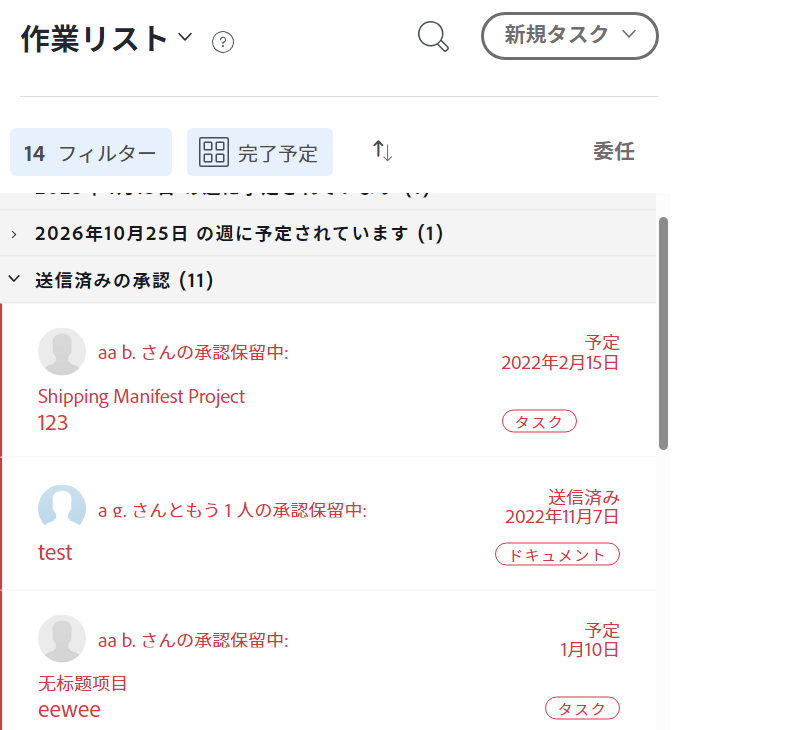

# タスクと問題の委任を管理

<!--
<NOTE: 
<you might need to change the tile to Delegate PTI, etc, when that functionality is added. Named it this so it will not conflict with the TOC article for Delegate section which was also "Delegate work"
I wrote thhis as a "Manage..." article and I did not add three separate articles, to match what we have for delegating approval requests)
-->

不在時に割り当てられた作業を一時的に委任できます。

タスクと問題の割り当てを委任したり、承認を委任したりできます。 この記事では、タスクと問題の割り当てを委任する方法について説明します。

作業の委任に関する一般情報については、 [作業の委任の概要](../../manage-work/delegate-work/delegate-work-overview.md).

## アクセス要件

>[!IMPORTANT]
>
>* 委任者として選択したユーザーは、タスクに対する権限と同じ権限を受け取り、委任した問題を発生します。
>* 権限は、アクセスレベル内で機能する必要があり、アクセスレベルが自分のアクセスレベルより低い場合もあります。

   >
   >   
   >   例えば、ユーザーがアクセスレベルでタスクに対する表示アクセス権のみを持ち、委任したタスクに対する管理権限を持っている場合、ユーザーは、委任したタスクに対する管理権限を受け取ります。 ただし、委任されたタスクに対してユーザーと同じアクションを実行することはできません。 不在時にタスクを更新できるよう、システム管理者にタスクへの編集アクセス権を要求する必要があります。
   >
   >   
   >   がアクセスレベルを変更する方法について詳しくは、 [カスタムアクセスレベルの作成または変更](../../administration-and-setup/add-users/configure-and-grant-access/create-modify-access-levels.md).
>
>* デリゲーションが既に開始した後に割り当てられた項目の場合、項目が割り当てられてから最大 1 時間かかる場合があります ( [!DNL Workfront] 新しく割り当てられた項目を委任者と共有する場合。

この記事の手順を実行するには、次のアクセス権が必要です。

<table style="table-layout:auto"> 
 <col> 
 <col> 
 <tbody> 
  <tr> 
   <td role="rowheader">[!DNL Adobe Workfront] 計画*</td> 
   <td> 
任意
 </td> 
  </tr> 
  <tr> 
   <td role="rowheader">[!DNL Adobe Workfront] ライセンス*</td> 
   <td> 
レビュー以上

>[!NOTE]
>
>リクエストライセンスを持っている場合は、作業に割り当てることができますが、他の人に作業を委任することはできません。 [!DNL Workfront] では、作業をレビューまたはユーザーのリクエストに割り当てることはお勧めしません。

</tr> 
  <tr> 
   <td role="rowheader">アクセスレベル設定*</td> 
   <td> 
タスクと問題へのアクセス権を編集まだアクセス権がない場合は、 [!DNL Workfront] 管理者（アクセスレベルに追加の制限を設定している場合） を参照してください。 [!DNL Workfront] 管理者はアクセスレベルを変更できます。詳しくは、 <a href="../../administration-and-setup/add-users/configure-and-grant-access/create-modify-access-levels.md" class="MCXref xref"> カスタムアクセスレベルの作成または変更</a>.
 </td> 
  </tr> 
  <tr> 
   <td role="rowheader">オブジェクト権限</td> 
   <td> 
割り当てられているタスクまたは問題に対する権限を表示または上限に設定します
 
    
追加のアクセス権のリクエストについて詳しくは、 <a href="../../workfront-basics/grant-and-request-access-to-objects/request-access.md" class="MCXref xref">オブジェクトへのアクセスのリクエスト </a>.
 </td> 
  </tr> 
 </tbody> 
</table>

*お持ちのプラン、ライセンスの種類、アクセス権を調べるには、 [!DNL Workfront] 管理者。

<!--note from the table for Object permissions:
     
Contribute or higher permissions to the projects where you are designated as the Project&nbsp;Owner (NOTE:&nbsp;you cannot delegate projects yet)

    -->

## 前提条件

この記事で説明するアクティビティを実行する前に、次の点を確認する必要があります。

* お使いの [!DNL Workfront] またはグループ管理者が有効 [!UICONTROL ログに記録された時間のタスクと問題の削除をユーザーに許可] 設定 [!UICONTROL 設定] 領域 [!DNL Workfront] インスタンス。

   詳しくは、 [システム全体のタスクと問題の環境設定を構成](../../administration-and-setup/set-up-workfront/configure-system-defaults/set-task-issue-preferences.md).

## タスクと問題を別のユーザーに委任

作業を他のユーザーに委任する前に、連絡を取り、作業項目の代理者に指定されるように通知することをお勧めします。 仕事を委任する前に、言葉による承認を求め、不在中に仕事を完了するのに必要な時間を確保します。

タスクと問題の委任に関する一般的な情報については、 [タスクと問題の委任の概要](delegate-work.md).

タスクと問題を他のユーザーに委任するには：

1. 次に移動： [!UICONTROL **ホーム**] 「 」領域で、「 [!UICONTROL **委任**] の最上部に [!UICONTROL **作業用リスト**].

   

1. 内 [!UICONTROL **タスクと問題の委任**] 「 」タブで、以下を更新します。

   * [!UICONTROL **タスクと問題を次に委任**]:タスクとタスクを委任するユーザーの名前を入力し、リストに表示されたら選択します。 選択できるユーザーは 1 つだけです。\

      委任者として選択したユーザーは、タスクに対する権限と同じ権限を受け取り、委任した問題を受け取ります。 詳しくは、 [タスクの委任と問題の概要](delegate-work-overview.md).

   * [!UICONTROL **開始日**]:作業項目の委任を開始する日付をカレンダーから選択します。

      >[!TIP]
      >
      >開始日を過去の日付にすることはできません。

   * [!UICONTROL **終了日がありません**]:委任の終了日を指定しない場合は、このオプションを選択します。

   * [!UICONTROL **終了日**]:委任を停止する日付をカレンダーから選択します。

      >[!TIP]
      >
      >「終了日」を選択しない場合は、現在の日付に対してのみデリゲーションが有効になります。

      

1. 「[!UICONTROL **保存**]」をクリックします。

   次のことが起こります。

   * 作業は指定したユーザーに委任されます。 選択した期間内に日付が設定された不完全なタスクまたは問題（デリゲーションが有効になった後に新しく割り当てられたタスクを含む）は、デリゲートされます。
   >[!TIP]
   >
   >   委任の期間内に日付が設定された完了した作業項目は委任されません。

   * 画面の右上隅に、別のユーザーへの作業の委任を有効にしたことを確認するメッセージが表示されます。 委任ユーザーの名前が確認メッセージに表示されます。

   * タスクと問題が他のユーザーに委任されたことを示す指標は、 [!DNL Workfront]. 代理オブジェクトの名前が含まれていない領域の詳細については、を参照してください。 [タスクの委任と問題の概要](delegate-work-overview.md).

   * この [!UICONTROL **委任**] ボタン [!UICONTROL ホーム] 領域の変更 [!UICONTROL **委任を編集**] をクリックして、デリゲーションが実行されていることを示します。

   <!--
   <MadCap:conditionalText data-mc-conditions="QuicksilverOrClassic.Draft mode">
   (NOTE: is this shot correct?&nbsp;See UI - this is a mock)
   </MadCap:conditionalText>
   -->

   

   * イベント通知と個人通知が有効になっている場合は、委任の確認メールも送信されます。

   * イベント通知が有効になっている場合、委任者として選択したユーザーは、委任に関する電子メールを受け取ります。

      個人の電子メール通知を有効にする方法について詳しくは、 [独自のイベント通知をアクティブ化または非アクティブ化する](../../workfront-basics/using-notifications/activate-or-deactivate-your-own-event-notifications.md).

## 委任を編集または停止

「終了日」を選択した場合は、デリゲーションの有効期限を切せることも、手動で停止することもできます。 また、デリゲーションの日付が変更された場合は、デリゲーションの期間を変更することもできます。

1. 次に移動： [!UICONTROL ホーム] 「 」領域で、「 [!UICONTROL 委任を編集] をクリックします。
1. 内 [!UICONTROL タスクと問題の委任] 「 」タブで、次のいずれかの操作をおこないます。
   * を変更します。 [!UICONTROL **開始日**] または [!UICONTROL **終了日**]
   * クリック [!UICONTROL **委任を停止**]

   >[!TIP]
   >
   >    デリゲーションが既に開始している場合は、デリゲーションの終了日のみを編集できます。

   

1. （条件付き）クリック [!UICONTROL **保存**] 新しいデリゲーション日を保存するには、以下を実行します。

   または

   クリック [!UICONTROL **委任を停止**] をクリックして、デリゲーションの停止を確認します。

   委任は日付を更新するか、または停止し、委任されたユーザーがタスクや問題から削除されました。 タスクおよび問題に対する権限は、そのまま残ります。

## 委任された作業の場所と情報の委任

<!--(if this was released, make sure that viewing delegated approvals has not changed, as documented here: /Content/Review and approve work/Manage Approvals/delegate-approval-requests.html) 
-->

タスクと問題を委任する場合、 [!DNL Workfront] 委任された作業や委任者を確認できる場所です。

* [「割り当て」ボックスで代理を探します。](#locate-delegates-in-the-assignments-box)
* [で委任作業を検索 [!UICONTROL ホーム]](#locate-delegated-work-in-home)

### で代理オブジェクトを検索する [!UICONTROL 割り当て] ボックス

システムまたはグループ管理者がシステムで作業の委任を有効にした場合、 [!UICONTROL 割り当て] ボックスには、アクセスできるすべての場所に次のタブが表示されます。

* [!UICONTROL **割り当て**]:タスクまたはイシューに割り当てられたユーザーがここに表示されます。
* [!UICONTROL **委任**]:タスクまたはイシューの担当者が委任者として指定したユーザーがここに表示されます。

次にアクセス： [!UICONTROL 割り当て] 」ボックスが次の領域に表示されます。

* タスクまたは発行ヘッダー

   

   この [!UICONTROL 割り当て] タスクまたは問題ヘッダーのフィールドが [!UICONTROL 割り当てと委任].

* この [!DNL Workload Balancer] タスクまたは問題を手動で割り当てる場合

   

>[!NOTE]
>
> 代理オブジェクトは [!UICONTROL 割り当て] タスクまたはイシューの [ 編集 ] ボックスのセクション

タスクまたはイシューが委任され、 [!UICONTROL 委任] サブタブが空の場合は、次のシナリオの 1 つが存在する可能性があります。

* タスクまたはタスクに割り当てられていません。
* タスクまたは発行日が委任期間外です。

>[!TIP]
>
>委任されたタスクとタスクの予定時間または実績時間は、リソース管理ツール ( [!DNL Workload Balancer] または [!DNL Resource Planner] 委任されたユーザーに対して。 時間は、割り当てられたユーザーにのみ関連付けられます。

### で委任作業を検索 [!UICONTROL ホーム]

1. 次に移動： [!UICONTROL **ホーム**] 「 」領域で、フィルタードロップダウンメニューをクリックし、次の 1 つまたは複数のオプションを選択します。
   * [!UICONTROL **委任済み**]:自分または自分に委任されたタスクと問題を表示する
   * [!UICONTROL **委任済み**]:別のユーザーが委任したタスクとタスクを表示する。
   * [!UICONTROL **委任者**]:自分が他のユーザーに委任したタスクと問題を表示する場合。

   

1. 次をクリック： [!UICONTROL 並べ替え] 次の条件でリストを並べ替えるドロップダウンメニュー：
   * [!UICONTROL 完了予定]. これはデフォルトの並べ替えオプションです。
   * [!UICONTROL 予定開始]
   * [!UICONTROL コミット日]
   * [!UICONTROL プロジェクト]
   * [!UICONTROL マイ優先度]
1. でグループを展開します。 [!UICONTROL **作業用リスト**] 委任された作業項目を表示します。 次のシナリオが存在します。
   * 他のユーザーに委任した項目の場合は、代理人の名前が [!UICONTROL **作業用リスト**] また [!UICONTROL **割り当てと委任**] フィールドの右側に表示されます。

   * 委任された項目の場合は、担当者の名前が [!UICONTROL **作業用リスト**] また **[!UICONTROL 割り当てと委任]** フィールドの右側に表示されます。
   >[!TIP]
   >
   >    委任が今日の日付以降の日付に開始するように設定されている場合は、委任の開始日も [!UICONTROL 作業用リスト]. 委任された項目は、選択したグループに表示されます [!UICONTROL 作業用リスト]（グループのタイプに従う） 例えば、 [!UICONTROL 計画完了日]を指定した場合、委任された項目は、計画された完了日と一致するグループに表示されます。
