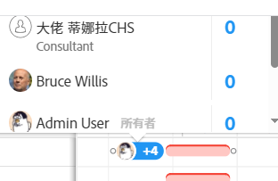
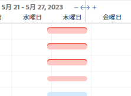
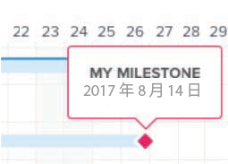
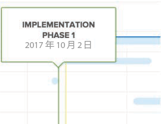
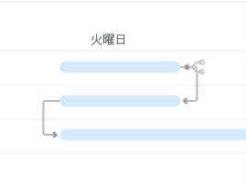
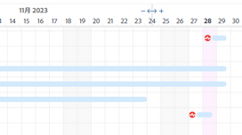
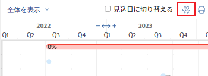

# 情報を [!UICONTROL ガントチャート]

タスクリストの両方に表示する情報を設定できます [!UICONTROL ガントチャート] プロジェクトリスト [!UICONTROL ガントチャート].

## アクセス要件

この記事の手順に従うには、次の手順を実行する必要があります。

<table style="table-layout:auto"> 
 <col> 
 <col> 
 <tbody> 
  <tr> 
   <td role="rowheader">[!DNL Adobe Workfront] 計画*</td> 
   <td> 
任意 
 </td> 
  </tr> 
  <tr> 
   <td role="rowheader">[!DNL Adobe Workfront] ライセンス*</td> 
   <td> 
[!UICONTROL Review] 以降
 </td> 
  </tr> 
  <tr> 
   <td role="rowheader">アクセスレベル設定*</td> 
   <td> 
[!UICONTROL 表示 ] 以降のプロジェクトおよびタスクへのアクセス
 
注意：まだアクセス権がない場合は、 [!DNL Workfront] 管理者（アクセスレベルに追加の制限を設定している場合） を参照してください。 [!DNL Workfront] 管理者はアクセスレベルを変更できます。詳しくは、 <a href="../../../administration-and-setup/add-users/configure-and-grant-access/create-modify-access-levels.md" class="MCXref xref">カスタムアクセスレベルの作成または変更</a>.
 </td> 
  </tr> 
  <tr> 
   <td role="rowheader">オブジェクト権限</td> 
   <td> 
プロジェクトへの [!UICONTROL 表示 ] 以降のアクセス権
 
追加のアクセス権のリクエストについて詳しくは、 <a href="../../../workfront-basics/grant-and-request-access-to-objects/request-access.md" class="MCXref xref">オブジェクトへのアクセスのリクエスト </a>.
 </td> 
  </tr> 
 </tbody> 
</table>

&#42;ご利用のプラン、ライセンスの種類、アクセス権を確認するには、 [!DNL Workfront] 管理者。

## 表示オプションについて

次の表に、 [!UICONTROL ガントチャート]:

<table style="table-layout:auto"> 
 <col> 
 <col> 
 <col> 
 <tbody> 
  <tr> 
   <td role="rowheader">[!UICONTROL 実際の日付 ]</td> 
   <td>  </td> 
   <td> 
[!UICONTROL 実際の開始日 ] と [!UICONTROL 実際の完了日 ] が三角形のアイコンと共に表示されます。 [!UICONTROL 実際の完了日 ] が null の場合は、[!UICONTROL 実際の開始日 ] のみが表示されます。
 
開始日と完了日について詳しくは、 <a href="../../../manage-work/projects/planning-a-project/project-actual-completion-date.md" class="MCXref xref">プロジェクト [!UICONTROL 実際の完了日 ] の概要 </a> および <a href="../../../manage-work/projects/planning-a-project/project-actual-start-date.md" class="MCXref xref">[!UICONTROL 実際の開始日 ] プロジェクトの概要 </a>.
 </td> 
  </tr> 
  <tr> 
   <td role="rowheader">[!UICONTROL 割り当て ]</td> 
   <td>  </td> 
   <td> 
タスクの担当者を表示します。 マウスを <strong>[!UICONTROL 詳細 ]</strong> タスクへの割り当て率など、担当者の名前の横に表示されるリンク。
 
[!UICONTROL ガントチャート ] をPDFにエクスポートすると、担当者は [!UICONTROL ガントチャート ] に表示されません。 [!UICONTROL ガントチャート ] をPDFにエクスポートすると、担当者はタスクリストにのみ表示されます。
 </td> 
  </tr> 
  <tr> 
   <td role="rowheader">[!UICONTROL ベースライン ]</td> 
   <td>  </td> 
   <td> 
最初のプロジェクト計画に含まれる、プロジェクトに関する主要なデータを表すプロジェクトスナップショット。 ベースラインは、プロジェクトの全期間を通じて取得できます。 [!UICONTROL ガントチャート ] にベースラインを表示できるようにする場合は、表示するベースラインを選択します。 [!UICONTROL ガントチャート ] では、一度に 1 つのベースラインのみ表示でき、グレーのバー形式で表示されます。
 
ベースラインの詳細については、 <a href="../../../manage-work/projects/create-projects/create-baselines.md" class="MCXref xref">プロジェクトの基準を作成</a>.
 </td> 
  </tr> 
  <tr> 
   <td role="rowheader">[!UICONTROL コミット日 ]</td> 
   <td>  </td> 
   <td> 
担当者がタスクの完了時期をコミットメントとして指定した日付が、[!UICONTROL ガントチャート ] にマーカー付きで表示されます。 
 
コミット日の詳細については、「 <a href="../../../manage-work/projects/updating-work-in-a-project/overview-of-commit-dates.md" class="MCXref xref">[!UICONTROL コミット日 ] の概要</a>.
 </td> 
  </tr> 
  <tr> 
   <td role="rowheader">[!UICONTROL %完了 ]</td> 
   <td>  </td> 
   <td>  タスクの完了率がタスクラインに表示されます。  </td> 
  </tr> 
  <tr> 
   <td role="rowheader">[!UICONTROL Critical Path]</td> 
   <td>  </td> 
   <td>プロジェクトのタイムラインに影響を与える可能性のあるタスクは、クリティカルパスの一部と見なされ、赤で明確にマークされます。 </td> 
  </tr> 
  <tr> 
   <td role="rowheader">[!UICONTROL Milestone] ダイヤモンド</td> 
   <td>  </td> 
   <td> 
マイルストーンに関連付けられたタスクの後にひし形のアイコンが表示されます。 マイルストーンの上にマウスポインターを置くと、マイルストーンの名前と日付が表示されます。 この [!DNL Workfront] 管理者が、各マイルストーンのひし形の色を決定します。
 
マイルストーンについて詳しくは、 <a href="../../../administration-and-setup/customize-workfront/configure-approval-milestone-processes/create-milestone-path.md" class="MCXref xref">マイルストーンパスを作成</a>.
 </td> 
  </tr> 
  <tr> 
   <td role="rowheader">[!UICONTROL マイルストーン ] 行</td> 
   <td>  </td> 
   <td> 
マイルストーンに関連付けられているタスクの後に線が表示されます。 マイルストーンの上にマウスポインターを置くと、マイルストーンの名前と日付が表示されます。 この [!DNL Workfront] 管理者が、各マイルストーン行の色を決定します。
 
 マイルストーンについて詳しくは、  <a href="../../../administration-and-setup/customize-workfront/configure-approval-milestone-processes/create-milestone-path.md" class="MCXref xref">マイルストーンパスを作成</a>
 </td> 
  </tr> 
  <tr> 
   <td role="rowheader">[!UICONTROL Predecessors]</td> 
   <td>  </td> 
   <td> 
2 つのタスク間の先行関係を示す、1 つのタスクから別のタスクへの行。 先行行を個別にハイライト表示するには、その行の上にマウスを移動します。 クリックすると、ハイライト表示されたままになります。 前者行は、一度に 1 行だけハイライト表示できます。
 
A <strong>[!UICONTROL 前任者 ]</strong> アイコンは、ガントチャート上の複数のページにまたがる先行タスク、またはプロジェクト間の先行タスクを持つタスクの横に表示されます。
 
次をクリック： <strong>[!UICONTROL 前任者 ]</strong> アイコン：すべての先行タスクと後続タスク、およびタスク名、先行タスクの種類、キーの日付など、各タスクの詳細を表示します。
 
注意：プロジェクトの一覧の [!UICONTROL ガントチャート ] には、プロジェクト間の先行タスクに関する情報が表示されます。 異なるプロジェクト間で先行タスク関係を作成する方法の詳細については、を参照してください。 <a href="../../../manage-work/tasks/use-prdcssrs/cross-project-predecessors.md" class="MCXref xref">プロジェクト間の先行タスクの作成</a>
 
先行タスクの詳細については、「 <a href="../../../manage-work/tasks/use-prdcssrs/enforced-predecessors.md" class="MCXref xref">先行タスクを適用</a>.
 </td> 
  </tr> 
  <tr> 
   <td role="rowheader">[!UICONTROL 進行状況ステータス ]</td> 
   <td> 
[!UICONTROL オンタイム ] 
 
[!UICONTROL Behind]    
 
[!UICONTROL At Risk]    
 
遅延        
 </td> 
   <td> 
 
 
特定のタスクの現在の進捗状況のステータスです。 
 
各 [!UICONTROL プログレスステータス ] タイプについて詳しくは、 <a href="../../../manage-work/tasks/task-information/task-progress-status.md" class="MCXref xref">タスク [!UICONTROL 進捗状況ステータス ] の概要</a>.
 </td> 
  </tr> 
  <tr> 
   <td role="rowheader">[!UICONTROL 予測日 ]</td> 
   <td>  </td> 
   <td> 
現在の完了作業に加えて残りの作業量に基づいて、[!UICONTROL 予測開始 ] および [!UICONTROL 完了日 ] を示す予測タイムライン。 
 
完了予定日について詳しくは、 <a href="../../../manage-work/projects/planning-a-project/project-projected-completion-date.md" class="MCXref xref">プロジェクト、タスクおよび問題に関する [!UICONTROL 予定完了日 ] の概要</a>.
 </td> 
  </tr> 
 </tbody> 
</table>

## 表示オプションを設定

1. タスクリストに移動 [!UICONTROL ガントチャート] またはプロジェクトリスト [!UICONTROL ガントチャート].\
   詳しくは、 [!UICONTROL ガントチャート] は、 [の基本を学ぶ [!UICONTROL ガントチャート]](../../../manage-work/gantt-chart/use-the-gantt-chart/get-started-with-gantt.md).

1. （オプション） **[!UICONTROL 予定日に切り替え]** タスクを表示する設定 [!UICONTROL 推定日]. デフォルトでは、タスクはタスクに表示されます [!UICONTROL 計画日] 内 [!UICONTROL ガントチャート].
1. オプションアイコンをクリックして、 **[!UICONTROL オプション]** ダイアログボックス\
   

1. に表示する設定オプションを選択します。 [!UICONTROL ガントチャート].

   >[!NOTE]
   > すべての構成オプションがプロジェクトリストで使用できるわけではありません [!UICONTROL ガントチャート].

1. 内の任意の場所をクリックします。 [!UICONTROL ガントチャート] 閉じる **[!UICONTROL オプション]** ダイアログボックス
